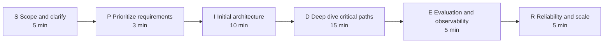
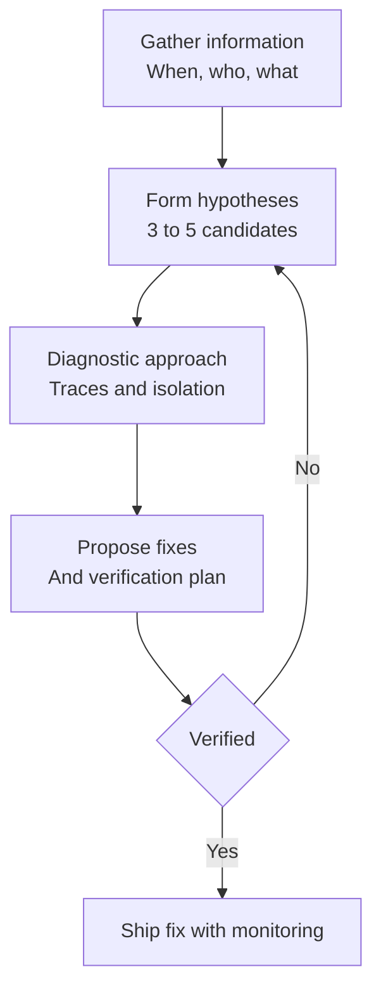

# 面向 AI 系统设计面试的回答框架

用于 AI System Design（AI 系统设计）面试的五套结构化框架：SPIDER 用于设计题，ETA 用于概念、取舍分析和调试，STAR-L 用于行为题。

优秀的面试回答会遵循一致的结构。本章提供了适用于不同题型的框架，并给出示例与反模式。将这些框架与 [题库](01-question-bank.md) 中的实战示例结合起来，并配合 [白板练习](04-whiteboard-exercises.md) 反复演练。

## 目录

- [系统设计框架（SPIDER）](#系统设计框架-spider)
- [实战示例：45 分钟环节中的 SPIDER](#实战示例-45-分钟环节中的-spider) ⭐ *NEW*
- [概念解释框架（ETA）](#概念解释框架-eta)
- [取舍分析框架](#取舍分析框架)
- [调试与故障排查框架](#调试与故障排查框架)
- [行为题框架（STAR-L）](#行为题框架-star-l)
- [处理未知主题](#处理未知主题)
- [常见错误与规避方式](#常见错误与规避方式)

---

## 系统设计框架（SPIDER）

该框架适用于任何包含 AI 组件的系统设计问题。以下是完整流程及各阶段的粗略时间分配：



### S - Scope（范围）与 Clarify（澄清）

**目的：** 缩小问题空间，并展示你会先思考再动手。

**建议提问：**
- 规模是多少？（用户数、请求量、数据量）
- 延迟要求是什么？
- 我们必须达到怎样的准确率或质量标准？
- 是否有合规或安全要求？
- 现有基础设施是什么？
- 预算约束是什么？

**示例：**
```
Interviewer: Design a customer support chatbot.

You: Before I dive in, I want to clarify a few things:
- What volume are we expecting? Thousands or millions of conversations per day?
- Is this customer-facing or internal support?
- What languages need to be supported?
- Do we need to integrate with existing ticketing systems?
- What is our accuracy target for resolved vs escalated?
```

**反模式：** 在不了解需求的情况下直接进入架构设计。

---

### P - Prioritize Requirements（优先级排序）

**目的：** 找出最重要的因素，并围绕它进行设计。

**建立优先级矩阵：**

| 需求 | 优先级 | 含义 |
|-------------|----------|-------------|
| 低延迟 | 高 | 可能限制模型规模 |
| 高准确率 | 高 | 需要良好的检索 + 评估 |
| 成本效率 | 中 | 通过缓存优化 |
| 多语言支持 | 中 | 影响 embedding 的选择 |

**明确说明你的优先级：**
```
"Given these requirements, I will prioritize latency and accuracy. 
Cost optimization will be a second-order concern once we have the basic system working."
```

---

### I - Initial Architecture（初始架构）

**目的：** 在深入细节前，先画出高层系统架构。

**AI 系统的标准组件：**
```
┌──────────┐     ┌──────────┐     ┌──────────┐     ┌──────────┐
│  Client  │────▶│  API GW  │────▶│ AI Layer │────▶│  LLM(s)  │
└──────────┘     └──────────┘     └──────────┘     └──────────┘
                                        │
                                        ▼
                                  ┌──────────┐
                                  │ Data/RAG │
                                  └──────────┘
```

**简要解释每个组件：**
- 它的作用是什么
- 为什么需要它
- 有哪些替代方案

---

### D - Deep Dive into Critical Paths（关键路径深挖）

**目的：** 在最重要的部分上体现深度。

**根据以下因素选择 2-3 个深挖点：**
- 面试官看起来最感兴趣的点
- 这个系统中最新颖或最复杂的部分
- 风险最大的地方

**示例深挖：**
- RAG（Retrieval-Augmented Generation，检索增强生成）流水线：chunking、embedding、retrieval、reranking
- Agent（智能体）循环：工具选择、错误处理、终止条件
- 数据流水线：ingestion、processing、indexing
- 安全性：隔离、权限、审计

**表明你的意图：**
```
"I will now go deeper on the RAG pipeline since retrieval quality is critical to this system."
```

---

### E - Evaluation and Observability（评估与可观测性）

**目的：** 展示你会考虑生产环境运维。

**覆盖内容：**
1. **指标（Metrics）：** 你要衡量什么？
2. **评估（Evaluation）：** 你如何判断它是否有效？
3. **监控（Monitoring）：** 你如何发现问题？
4. **告警（Alerting）：** 何时需要人工介入？

**AI 系统的标准指标：**
- 延迟（p50、p95、p99）
- Token 用量 / 成本
- 质量分数（离线和抽样线上）
- 按类型划分的错误率
- 缓存命中率

---

### R - Reliability and Scale（可靠性与扩展）

**目的：** 处理故障模式和增长问题。

**要讨论的故障模式：**
- LLM provider（大模型服务提供商）故障
- 限流（rate limiting）
- 模型输出不佳
- 数据流水线故障
- 缓存失效（cache invalidation）

**扩展性考虑：**
- 瓶颈在哪里？
- 哪些部分适合水平扩展，哪些适合垂直扩展？
- 哪些成本会随使用量增长？

---

## 实战示例：45 分钟环节中的 SPIDER

下面是一段压缩版逐字稿，展示该框架在真实面试中的呈现方式。题目是：“为一家拥有 10,000 名员工的公司设计一个文档问答系统。”方括号中的注释标记框架步骤和时间。

```
[0:00 - S: Scope]
You: "Before I draw anything, let me scope this. Roughly how many
documents, what types, and what freshness do answers need?"
Interviewer: "About 2 million documents, mostly PDFs and wikis.
Updated daily is fine."
You: "Two more: what accuracy bar are we targeting, and is this
internal-only or exposed to customers?"
Interviewer: "Internal. Wrong answers are embarrassing but not
catastrophic. p95 under 3 seconds."
You: "So: 2M mixed documents, daily freshness, internal users,
soft accuracy bar, p95 under 3s. I'll design for 10K employees
with maybe 5% daily active. That's roughly 500-2,000 queries/hour
at peak. Sound right?"
Interviewer: "Works."

[0:05 - P: Plan the architecture out loud]
You: "I'll draw the full pipeline first, then deep dive where you
want. Ingestion on the left: connectors, parsing, chunking,
embedding, vector store. Serving on the right: query, hybrid
retrieval, rerank, generation with citations, response. Eval and
monitoring underneath as a cross-cutting layer."

[0:08 - I: Identify components, draw and narrate]
You: "Ingestion: connectors pull from SharePoint and Confluence
nightly. Parsing handles PDFs with a document-AI tier first and a
vision-LLM fallback for complex layouts. Chunking is structure-
aware, 300-500 tokens with headers prepended. Embeddings go into
a vector DB with metadata: source, team, date, access tags."
Interviewer: "Why hybrid retrieval instead of pure vector?"
You: "Internal corpora are full of project codenames and
acronyms. Embeddings miss exact-match tokens; BM25 catches them.
RRF to fuse, cross-encoder rerank on the top 50. That combination
is the difference between 70% and 90%+ retrieval hit rate here."

[0:18 - D: Deep dive where the interviewer steers]
Interviewer: "Go deeper on access control."
You: "Permissions evaluated at retrieval time, not index time.
Every chunk carries ACL tags from the source system. The retrieval
query filters on the caller's groups before similarity scoring, so
a result the user can't read never enters the candidate set. Index-
time filtering breaks the moment permissions change; retrieval-time
filtering follows the source of truth. Cache keys include the
permission set so a cached answer never leaks across groups."

[0:30 - E: Evaluate your own design]
You: "Weaknesses I'd flag in my own design: nightly sync means up
to 24h staleness, fine per requirements but I'd add webhook-based
invalidation for the wikis later. The reranker adds ~150ms at p95,
worth it for quality. Failure modes: provider outage falls back to
a second model with provider-specific prompts; retrieval returning
nothing returns 'not found in our docs' rather than letting the
model improvise."

[0:38 - R: Requirements check and evaluation story]
You: "Back to the requirements: 3s p95 gives me a budget of
~400ms retrieval, ~150ms rerank, ~2s generation, with streaming so
perceived latency is under a second. For quality, I'd stand up a
200-case golden set from real employee questions, score
faithfulness and citation accuracy with an LLM judge calibrated
monthly against human review, and sample 2% of production traffic.
Anything else you'd like me to go deeper on?"
```

**这段逐字稿展示了：**
- 范围界定在前五分钟完成，并产出了整套设计都会引用的数值。
- 候选人在画图时同步讲解，并在每个阶段邀请面试官引导方向。
- 深挖回答遵循“先给决策，再给原因，然后给失败模式”的顺序。
- 候选人先于面试官主动审视了自己的设计。
- 评估是设计的一部分，而不是事后补充。

---

## 概念解释框架（ETA）

适用于“解释 RAG（Retrieval-Augmented Generation，检索增强生成）”或“什么是 speculative decoding（推测解码）？”这类概念题。

### E - Explain Simply（简明解释）

先给出一句任何人都能理解的定义。

**KV Cache（键值缓存）示例：**
```
"KV cache stores intermediate computations during LLM generation so we 
do not have to redo work for previous tokens when generating each new token."
```

---

### T - Technical Details（技术细节）

根据面试官水平补充合适的技术深度。

**KV Cache（键值缓存）示例：**
```
"Specifically, for each layer in the transformer, we cache the Key and 
Value tensors for all positions. On each new token, we only compute K 
and V for the new position and concatenate with the cache. 

The memory scales as: 2 × layers × heads × head_dim × sequence_length × batch_size

For a 70B model with 8K context, that is roughly 10GB per request."
```

---

### A - Applications and Tradeoffs（应用与取舍）

将概念联系到实际使用场景，并讨论取舍。

**KV Cache（键值缓存）示例：**
```
"This is critical for production serving. Without it, generation would be 
quadratic in sequence length.

The tradeoff is memory usage. This is why techniques like PagedAttention 
and Grouped Query Attention exist: to reduce KV cache memory while 
preserving the benefits.

Context caching features from OpenAI and Anthropic are essentially 
server-side KV cache persistence for shared prefixes."
```

---

## 取舍分析框架

当被要求比较选项或为某个决策辩护时，使用以下结构。

### 第 1 步：清楚地陈述选项

```
"For embedding models, we have three main options:
1. OpenAI text-embedding-3-large: Highest quality, API cost
2. Cohere embed-v3: Good quality, better pricing
3. Self-hosted BGE: Full control, operational overhead"
```

### 第 2 步：定义评估标准

选择与这项决策直接相关的标准：

| 标准 | 权重 | 理由 |
|----------|--------|-----------|
| 质量 | 高 | 搜索准确性是核心特性 |
| 大规模成本 | 高 | 每月 1 亿次 embedding |
| 延迟 | 中 | 批量索引，而非实时 |
| 运维开销 | 中 | 团队规模较小 |

### 第 3 步：分析每个选项

创建对比矩阵：

| 方案 | 质量 | 成本 | 延迟 | 运维 | 总分 |
|--------|---------|------|---------|-----|-------|
| OpenAI | ★★★★★ | ★★ | ★★★★ | ★★★★★ | 4.2 |
| Cohere | ★★★★ | ★★★★ | ★★★★ | ★★★★★ | 4.2 |
| BGE | ★★★★ | ★★★★★ | ★★★ | ★★ | 3.6 |

### 第 4 步：给出带有理由的建议

```
"I would recommend Cohere for this use case because:
1. Quality is close to OpenAI based on MTEB scores
2. Better pricing at our volume (100M embeddings/month)
3. No operational overhead vs self-hosting
4. We can switch to self-hosted later if costs become prohibitive

The risk is vendor dependency, which we mitigate by 
abstracting the embedding interface."
```

---

## 调试与故障排查框架

当被问到“你会如何调试 X？”或“系统出现 Y 问题时，你会如何修复？”时，采用以下四步诊断流程：



### 第 1 步：收集信息

```
"First, I would ask:
- When did this start? What changed?
- Is it all requests or a subset?
- What does the error look like exactly?
- Are there patterns (time of day, user segment, query type)?"
```

### 第 2 步：提出假设

```
"Based on the symptoms, my top hypotheses are:
1. Retrieval quality degraded (recent data changes?)
2. Model output quality dropped (prompt changed? different model?)
3. Context length exceeded (longer documents?)
4. Rate limiting causing timeouts"
```

### 第 3 步：描述诊断方法

```
"To isolate the cause:
1. Check traces for failing requests to see where they diverge
2. Compare retrieval results to a known-good baseline
3. Check model version and prompt version in deployment
4. Review metrics for any correlated changes"
```

### 第 4 步：提出修复与验证

```
"If it is retrieval quality, I would:
1. Re-index with verified chunking
2. Validate on test set before deploying
3. Roll out gradually with A/B comparison
4. Set up alerts on retrieval quality metrics to catch future issues"
```

---

## 行为题框架（STAR-L）

针对 AI 岗位的行为题，使用 STAR-L（STAR + Learnings，经验教训）。

### S - Situation（情境）

简要交代背景。

```
"We had just launched our RAG-powered search feature and were getting 
complaints about incorrect answers for technical queries."
```

### T - Task（任务）

你的具体职责是什么？

```
"As the tech lead, I needed to diagnose the issue and ship a fix quickly 
while maintaining user trust."
```

### A - Action（行动）

你做了什么？使用 “I”（我），不要用 “we”（我们）。

```
"I first instrumented detailed tracing to understand where failures occurred.
I found that our chunking strategy was splitting code blocks mid-function.
I designed a code-aware chunking approach that preserved semantic units.
I also added a confidence score display so users could calibrate trust."
```

### R - Result（结果）

尽量量化说明。

```
"Answer quality on technical queries improved from 65% to 89% in our 
evaluation suite. User complaints dropped 70% within two weeks."
```

### L - Learnings（经验教训）

如果重来一次，你会怎么做不同？

```
"I learned that chunking strategies need to be content-aware from the start.
Now I always test chunking with the actual document distribution before 
launching. I also build evaluation suites earlier in the process."
```

---

## 处理未知主题

并不要求你知道所有内容。专业地处理未知问题即可。

### 如果你完全不知道

```
"I am not familiar with [X]. Based on the name, I would guess it is related 
to [Y]. Can you tell me more about what it does, and I can discuss how 
I would approach the problem it solves?"
```

### 如果你只知道一部分

```
"I have read about [X] but have not used it in production. My understanding 
is that it [description]. In practice, I would need to read the documentation 
and likely prototype before making architectural decisions."
```

### 如果你知道概念但不知道细节

```
"I understand the general approach of [X] - [brief explanation]. I do not 
have the specific parameters or benchmarks memorized, but I know where to 
find them and what questions to ask when evaluating it."
```

---

## 常见错误与规避方式

### 错误 1：直接跳到解决方案

**错误：**
```
Interviewer: "How would you design a document Q&A system?"
You: "I would use LangChain with Pinecone and GPT-5.5."
```

**正确：**
```
"Before defining the solution, I want to understand the requirements.
What types of documents? What volume? What accuracy is needed?"
```

---

### 错误 2：忽视成本

**错误:**
```
"I would always use the biggest frontier model for the best quality."
```

**正确:**
```
"Model selection depends on the quality bar and volume. For high-volume, 
lower-stakes queries, I might use Claude Haiku 4.5, GPT-5.5-mini, or 
DeepSeek V4 Flash and reserve Claude Sonnet 4.6 or GPT-5.5 for complex 
cases. At 1M queries/day, this could save $50K/month without meaningful 
quality loss."
```

---

### 错误 3：未讨论失败模式

**错误:**
```
"The system retrieves documents, sends them to the LLM, and returns the answer."
```

**正确:**
```
"The happy path is straightforward. But let me discuss failure modes:
- What if retrieval returns no relevant documents?
- What if the LLM hallucinates despite good context?  
- What if the provider is rate-limited or down?

For each, we need detection and fallback strategies."
```

---

### 错误 4：过度复杂化

**错误:**
```
"We need a separate service for chunking, another for embedding, 
a message queue between them, a stream processor for real-time, 
three different vector databases for redundancy..."
```

**正确:**
```
"Let me start with the simplest architecture that could work, 
then add complexity only where justified by requirements.

For this scale, a single service with async processing might be sufficient.
If we need higher throughput, we can add message queues at that point."
```

---

### 错误 5：未征求反馈

**错误:**
```
*Talks for 10 minutes without checking in*
```

**正确:**
```
"I have covered the high-level architecture. Would you like me to dive 
deeper into any specific component, or should I move on to evaluation?"
```

---

## 快速参考：高质量回答的信号

| 信号 | 示例 |
|--------|---------|
| 追问澄清问题 | “这个延迟要求是多少？” |
| 使用具体数字 | “这会增加约 50ms 延迟” |
| 讨论权衡 | “我们得到 X，但失去 Y” |
| 提及失败模式 | “如果这失败了，我们需要……” |
| 参考真实系统 | “类似 Notion 的做法……” |
| 承认不确定性 | “我需要对这个做基准测试” |
| 与面试官对齐 | “我需要在这里展开讲吗？” |
| 结合经验 | “以我在 X 上的经验……” |

---

## 应避免的反模式

| 反模式 | 更好的做法 |
|--------------|-----------------|
| 堆砌流行术语 | 解释你的意思 |
| 只提名词而没有深度 | 只提你能深入讨论的内容 |
| 只说“视情况而定”却不展开 | 说明它取决于什么 |
| 绝对化表述 | 在合适时使用保留语气 |
| 贬低有效选项 | 承认权衡 |
| 不知道何时收束 | 读取面试官的提示信号 |

---

## 核心要点

- 框架是脚手架，不是脚本；面试官能看出候选人是在背诵还是在思考，所以先内化结构，再用对话式表达。
- SPIDER 适用于任何 45 分钟的系统设计流程；如果面试官打断你，你仍然已经覆盖了最高信号的阶段。
- “视情况而定” 只有在后面接着“它取决于 X、Y、Z，以及每个因素如何改变答案”时才成立；否则会显得在搪塞。
- 任何深入分析都应以一句关于可观测性（observability）的收尾和一句关于失败模式（failure modes）的收尾结束；这是高级回答与 Staff 级回答之间最大的差距。
- 没有量化结果（STAR-L 的 R）的行为题回答会被视为轶事；即使是近似值，也要带上数字。

---

*另见： [题库](01-question-bank.md) | [常见陷阱](03-common-pitfalls.md) | [白板练习](04-whiteboard-exercises.md)*
