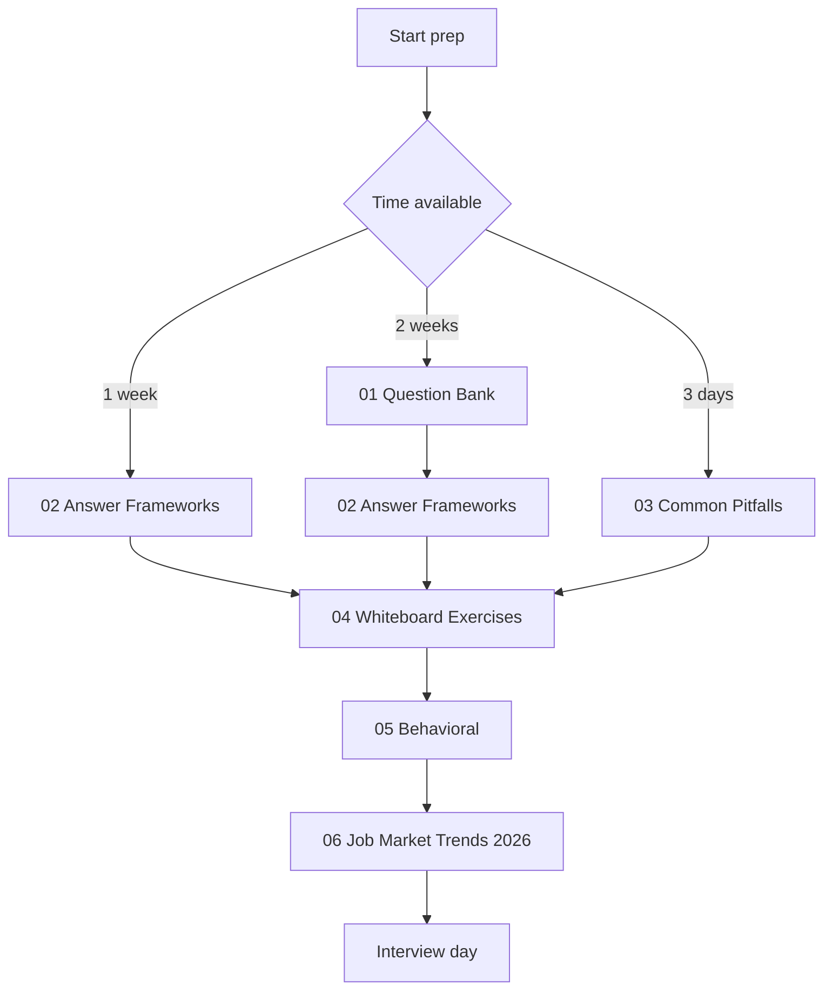
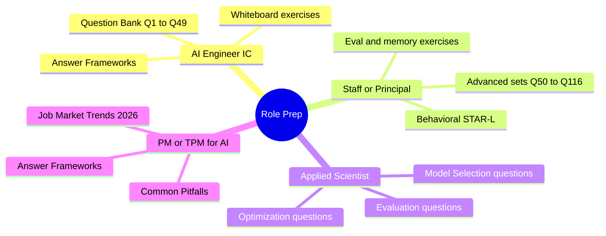

# AI 系统设计面试准备

适用于高级工程师（senior）与资深工程师（staff）AI 工程岗位的面试准备：116 道系统设计题、可执行的答题框架及一段完整的模拟面试逐字稿、常见陷阱、九道白板练习、行为面准备、速答 FAQ，以及 2026 年 6 月的招聘趋势。

> **新增内容（2026 年 6 月）：** 题库新增了 Tooling 和 Lifecycle（工具链与生命周期）版块，并增加了 6 道 2026 年 6 月题目（Fable 5 tier routing（分层路由）、agentic context engineering（代理式上下文工程）、computer-use reliability（计算机操作可靠性）、Agent Skills（Agent 能力）、eval gaming（评测投机/游戏化）、cost-aware multi-provider routing（按成本感知的多供应商路由）），目前持续编号至 Q1-Q116。白板题集新增了两道练习（evaluation pipeline design（评估流水线设计）、agent memory and state（代理记忆与状态））。答题框架新增了一段完整的 45 分钟 SPIDER 模拟面试逐字稿。行为面新增了两道更高难度的 STAR-L 示例、一个薪酬问题集合，以及一份大声练习指南。

## 开始前准备

本文件夹假设你已经能够编写生产代码，并且熟悉 LLM（大语言模型）基础知识（tokens（令牌）、context windows（上下文窗口）、embeddings（嵌入向量）、RAG（检索增强生成）是什么）。如果这些基础不牢，建议先花一周学习 [01-foundations](../01-foundations/) 与 [Courses guide](../COURSES.md)；在缺少基础的前提下进行面试准备，往往会产出“听起来很流畅但实际上错误”的答案，这是高级轮次中最糟糕的结果。

本文件夹中的内容建议按顺序阅读。每一部分都建立在前一部分之上：题库覆盖表层范围，框架指导如何组织答案，常见陷阱说明什么会毁掉 offer，白板练习用于反复演练，行为面覆盖 staff 级信号，岗位趋势说明当前招聘格局。

## 阅读顺序

## 角色化备考路径

## 本文件夹中的文件

| 文件 | 用途 |
|------|------|
| [01-question-bank.md](01-question-bank.md) | 116 道真实面试题（Q1-Q116，连续编号），按主题分组，含标准答案与追问（更新至 2026 年 6 月）。 |
| [02-answer-frameworks.md](02-answer-frameworks.md) | 五种结构化答题框架（SPIDER、ETA、tradeoff（权衡）、debugging（调试）、STAR-L）以及一段完整的 45 分钟 SPIDER 模拟面试逐字稿。 |
| [03-common-pitfalls.md](03-common-pitfalls.md) | 会导致 staff 级 offer 落空的典型模式：在 tradeoff（权衡）上泛泛而谈、缺少 observability（可观测性）、忽略 failure modes（失败模式）。 |
| [04-whiteboard-exercises.md](04-whiteboard-exercises.md) | 九道系统设计白板题及参考解法，包含 evaluation pipeline design（评估流水线设计）和 agent memory（代理记忆）练习。最接近真实面试流程的模拟。 |
| [05-behavioral-for-ai-roles.md](05-behavioral-for-ai-roles.md) | 针对 AI 场景的行为面准备，含六个 STAR-L 实战示例、薪酬与职级问题，以及大声练习指南。 |
| [06-job-market-trends-2026.md](06-job-market-trends-2026.md) | 角色分类、薪酬区间、面试流程模式，以及新兴职级（FDE、AI Eval Engineer、AI Reliability Engineer、MCP Engineer）。 |
| [07-faq.md](07-faq.md) | 针对 AI 工程、RAG（检索增强生成）、agents（智能体）、模型、评估、推理（inference）、记忆（memory）、安全问题的高频简短问答，适合快速查阅与新手入门。 |

## 配套资源

- [Role Transition Guide](../TRANSITION_GUIDE.md)（角色转换指南）：为从后端、前端、QA、PM 或 EM 转向 AI 面试做准备。
- [Recommended Courses](../COURSES.md)（推荐课程）：用于在开始面试准备前补齐基础。
- [Glossary](../GLOSSARY.md)（术语表）：备考期间快速查阅术语定义。
- [Case Studies](../16-case-studies/)：可直接对应白板题目的生产级架构案例。

## 核心要点

- 文件按顺序阅读；若只做题目而不先学习答题框架，答案结构会不完整。
- 白板练习（04 号文件）是最接近真实面试的模拟，正式面试前至少做三题。
- 行为面（05 号文件）是 staff 与 senior 的分水岭，不可跳过。
- 2026 年 6 月岗位趋势（06 号文件）是关键优势：了解招聘格局能帮助你提更好的问题并更好地定制经历叙述。
- 建议每月回顾本文件夹；随着招聘趋势变化，题库将持续新增题组。
