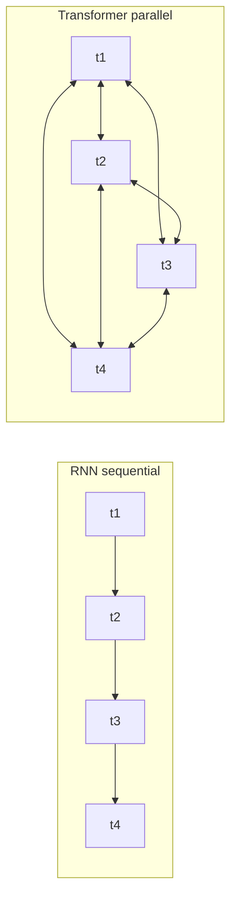
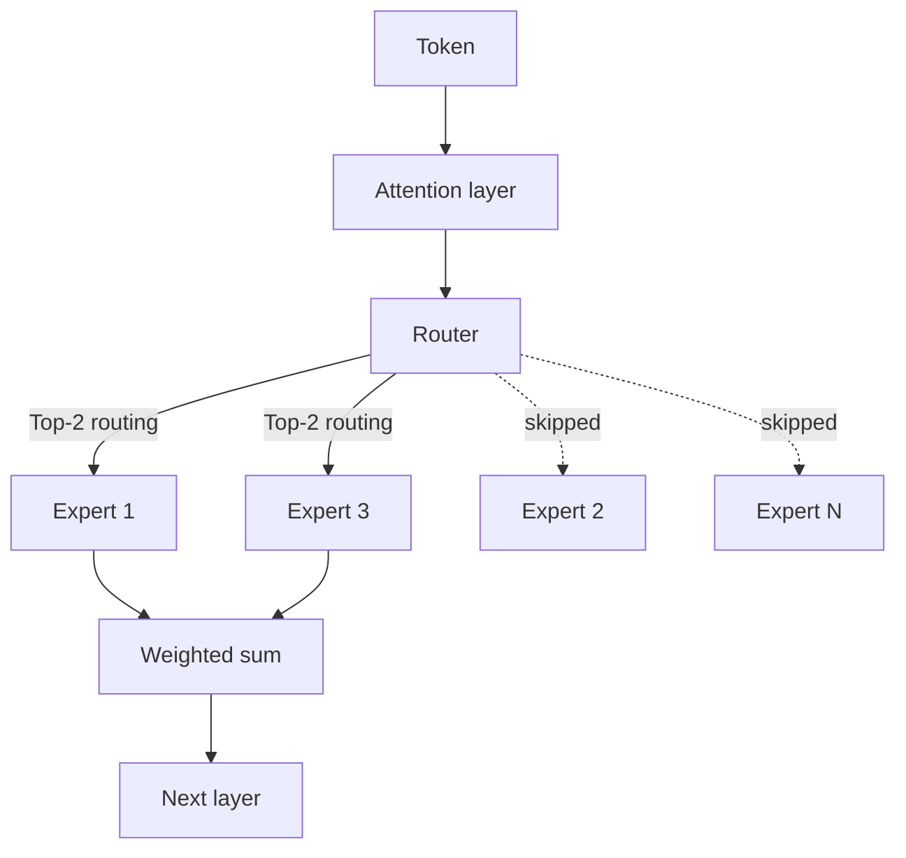

# LLM 内部原理

现代 LLM（大语言模型）的架构核心：Transformer、MoE（混合专家模型, Mixture of Experts）、注意力数学（attention math）、RoPE（旋转位置编码, Rotary Position Embedding）、GQA（分组查询注意力, Grouped Query Attention）、KV cache（键值缓存），以及推动 2026 年模型设计转向推理最优扩展的规模化趋势。

本章涵盖大语言模型背后的核心概念。理解这些内部机制，对于为 AI 系统做出明智的架构决策至关重要。关于这些架构选择的实际影响，请参见 [Inference Optimization](../04-inference-optimization/)（KV cache、PagedAttention）、[Model Taxonomy](../02-model-landscape/01-model-taxonomy.md)（生产中的 MoE 模型），以及 [Glossary](../GLOSSARY.md) 中对 MoE、RoPE、ALiBi、GQA、MLA 的定义。

## 目录

- [Transformer 革命](#transformer-革命)
- [架构变体](#架构变体)
- [混合专家（MoE）](#混合专家-moe)
- [扩展规律：训练最优 vs 推理最优](#扩展规律-训练最优-vs-推理最优)
- [原生多模态](#原生多模态)
- [自注意力机制](#自注意力机制)
- [多头注意力](#多头注意力)
- [位置编码](#位置编码)
- [前馈网络](#前馈网络)
- [层归一化](#层归一化)
- [综合起来](#组合在一起)
- [关键数字](#需要掌握的关键数字)
- [面试题](#面试题)
- [参考文献](#参考资料)

---

## Transformer 革命

在 2017 年之前，序列建模依赖循环架构（RNN、LSTM），它们按顺序逐个处理 token。这带来了两个问题：

1. **训练速度慢**：顺序处理阻碍了并行化
2. **长程依赖难以建模**：信息必须经过多个隐藏状态传递

Transformer 架构在《Attention Is All You Need》（Vaswani 等，2017）中提出，通过用自注意力替代递归，解决了这两个问题。

**给分布式系统工程师的心智模型：**
把递归想成一个单线程请求流水线，每一步都依赖上一步。自注意力则像一个全连接图，每个节点都可以并行查询其他任意节点。



---

## 架构变体

根据原始 Transformer 使用了哪些部分，主要出现了三种变体：

| 架构 | 注意力类型 | 示例 | 最适合 |
|--------------|---------------|----------|----------|
| 仅编码器 | 双向 | BERT, RoBERTa | 分类、NER、embedding |
| 仅解码器 | 因果式（从左到右） | GPT-4, Claude, Llama | 文本生成、聊天 |
| 编码器-解码器 | 交叉注意力 | T5, BART | 翻译、摘要 |

### 仅解码器（当今大多数 LLM）

```
┌─────────────────────────────────────────────────────┐
│                 Decoder Block (×N)                  │
│  ┌───────────────────────────────────────────────┐  │
│  │           Masked Self-Attention               │  │
│  │   (Each token attends only to previous)       │  │
│  └───────────────────────────────────────────────┘  │
│                         │                           │
│                    Add & Norm                       │
│                         │                           │
│  ┌───────────────────────────────────────────────┐  │
│  │              Feed-Forward Network             │  │
│  └───────────────────────────────────────────────┘  │
│                         │                           │
│                    Add & Norm                       │
└─────────────────────────────────────────────────────┘
                          │
                          ▼
                   Output Probabilities
```

**为何仅解码器占主导：**
- 架构最简单
- 预训练目标（预测下一个 token）与生成任务天然对齐
- 在算力扩展上表现良好

### 仅编码器（BERT 风格）

使用双向注意力。每个 token 都能看到其他所有 token。它不能自回归生成文本，但在理解类任务上表现出色。

**实际意义：**
- 适合分类微调（意图识别、情感分析）
- 是 embedding 模型的骨干
- 面向特定任务时更小、更快

### 编码器-解码器（编码器的回归）

虽然仅解码器多年占据主导地位，但在一些专门的**推理**与**验证**任务中，编码器-解码器架构出现了部分回归（例如 o 系列和 Claude 推理模型中的内部 verifier）。

---

## 混合专家（MoE）

**前沿模型中最重要的架构转变之一（GPT-5.5、Claude Opus 4.7、Gemini 3.1 Pro、DeepSeek V4、Llama 4 Maverick、Mixtral）。**

MoE 用多个“专家（expert）”和一个“路由器（router）”替代稠密前馈网络（FFN, Feed-Forward Network），由路由器决定某个 token 交给哪些专家处理。

```
┌─────────────────────────────────────────────────────┐
│                 MoE Layer (Decoder)                 │
│  ┌───────────────────────────────────────────────┐  │
│  │               Attention Layer                 │  │
│  └───────────────────────────────────────────────┘  │
│                         │                           │
│                 ┌───────▼───────┐                   │
│                 │     Router    │                   │
│                 └─┬───┬───┬───┬─┘                   │
│          ┌────────┘   │   │   └────────┐            │
│          ▼            ▼   ▼            ▼            │
│   ┌──────────┐ ┌──────────┐ ┌──────────┐ ┌──────────┐│
│   │ Expert 1 │ │ Expert 2 │ │ Expert 3 │ │ Expert N ││
│   └────┬─────┘ └────┬─────┘ └────┬─────┘ └────┬─────┘│
│        └────────────┴───┬───┴────────────┘        │
└─────────────────────────▼───────────────────────────┘
```

### 系统设计中的 MoE 关键细节：
1. **总参数 vs 活跃参数**：一个 1.6T 参数的 MoE 模型（如 DeepSeek V4 Pro）每个 token 可能只使用 49B 参数。Llama 4 Maverick 在 128 个专家中活跃参数为 17B。Kimi K2.6 是 1T 总参数 / 32B 活跃参数。
    - **内存约束**：你必须存储全部 1.2T 参数（高 VRAM 占用）。
    - **算力约束**：你只需为 100B 参数规模的 FLOPs 付费（更低延迟）。
2. **路由坍缩**：如果路由器只选择一个专家，其他专家就学不到东西。现代模型使用**负载均衡损失**和**辅助损失**来确保所有专家都被利用。
3. **DeepSeek-V3 的改进**：引入了**多头潜在注意力（MLA, Multi-head Latent Attention）**和**无辅助损失的负载均衡**，它们已成为 MoE 效率的事实标准。DeepSeek V4（2026 年 4 月）将这两种技术扩展到 100 万 token 的上下文窗口。

每个 token 的路由决策如下图所示：



---

## 扩展规律：训练最优 vs 推理最优

最初的 Chinchilla 定律（2022）关注的是**训练最优（Training-Optimal）**：在给定训练预算下找到最佳模型规模。

如今行业已经转向**推理最优（Inference-Optimal）**扩展：
- **过度训练**：在海量数据（15T+ token）上训练更小的模型（例如 Llama 3 8B），远远超过 Chinchilla 点。
- **为什么？**：面向数百万用户的推理成本，远高于一次性的训练成本。一个训练时长是 10 倍的 7B 模型，部署成本通常低于在 Chinchilla 点训练的 70B 模型。

---

## 原生多模态

早期模型使用 **Vision Adapters**（视觉适配器，把冻结的 CLIP 风格视觉编码器连接到 LLM）。前沿模型（GPT-5.2、Gemini 3）则是**原生多模态**。

- **共享词表**：视觉 token 和文本 token 存在于同一潜在空间中。
- **统一 Transformer**：同一组模块同时处理像素和文本。
- **收益**：相比基于适配器的方法，空间推理和“世界模型”理解能力要强得多。

---

## 自注意力机制

自注意力是核心创新。它允许每个 token 去“关注（attend to）”序列中的所有其他 token，并从中聚合信息。

### 直觉

考虑句子：“The animal didn't cross the street because it was too tired.”

“it” 指代什么？要理解这一点，需要把 “it” 关联到 “animal”。自注意力通过计算所有 token 对之间的相关性分数来学习这些联系。

### 数学

对于长度为 n、维度为 d 的输入序列 X：

```
Q = XW_Q   (Query: What am I looking for?)
K = XW_K   (Key: What do I contain?)
V = XW_V   (Value: What do I contribute?)

Attention(Q, K, V) = softmax(QK^T / √d_k) × V
```

**逐步理解：**
1. **QK^T**：点积衡量 query 和 key 之间的相似度（n × n 矩阵）
2. **/ √d_k**：缩放，防止高维时 softmax 饱和
3. **softmax**：转成概率（每一行和为 1）
4. **× V**：基于注意力权重对 value 做加权求和

### 为什么要除以 √d_k？

**面试高频题**：这是经常被问到的问题，因为它能体现你是否理解数值稳定性。

如果不做缩放，随着维度 d 增大，点积也会按比例增大。过大的点积会把 softmax 推入饱和区，导致梯度消失。

```python
# Without scaling (problematic for large d)
d = 512
q = np.random.randn(d)
k = np.random.randn(d)
dot = np.dot(q, k)  # Expected magnitude: ~√d ≈ 22.6

# With scaling
scaled_dot = dot / np.sqrt(d)  # Expected magnitude: ~1
```

### 注意力复杂度

| 操作 | 时间复杂度 | 空间复杂度 |
|-----------|-----------------|------------------|
| QK^T 计算 | O(n²d) | O(n²) |
| Softmax | O(n²) | O(n²) |
| 与 V 的加权求和 | O(n²d) | O(nd) |

O(n²) 的复杂度限制了上下文长度。100K 上下文窗口意味着每层有 100 亿次注意力计算。

---

## 多头注意力

现代 Transformer 不再使用单个注意力，而是使用多个“头（head）”并行关注不同方面。

```
┌─────────────────────────────────────────────────────────────┐
│                    Multi-Head Attention                      │
│                                                              │
│   ┌─────────┐  ┌─────────┐  ┌─────────┐       ┌─────────┐   │
│   │ Head 1  │  │ Head 2  │  │ Head 3  │  ...  │ Head h  │   │
│   │ d_k=64  │  │ d_k=64  │  │ d_k=64  │       │ d_k=64  │   │
│   └────┬────┘  └────┬────┘  └────┬────┘       └────┬────┘   │
│        │            │            │                  │        │
│        └────────────┴────────────┴──────────────────┘        │
│                              │                               │
│                         Concatenate                          │
│                              │                               │
│                         W_O (project)                        │
└─────────────────────────────────────────────────────────────┘
```

**为什么要用多头？**
- 不同的 head 会学习不同模式（语法、语义、指代消解）
- 类似集成方法：多个视角能提升鲁棒性
- 使各个 head 之间可以并行处理

**典型配置：**
- GPT-3 175B：96 个 head × 128 维 = 12,288 总维度
- Llama 2 70B：64 个 head × 128 维 = 8,192 总维度

### 分组查询注意力（GQA）

**生产系统中的关键点**：标准多头注意力要求在 KV cache 中为每个 head 分别存储 K 和 V。GQA 在一组 head 之间共享 K 和 V。

| 注意力类型 | 每个 Query 的 K,V 比例 | KV Cache 降低幅度 | 示例 |
|----------------|---------------|-------------------|----------|
| 多头注意力（MHA） | 1:1 | 基线 | GPT-3 |
| 分组查询注意力（GQA） | 通常 8:1 | 约 8 倍 | Llama 2, Mistral |
| 多查询注意力（MQA） | 全部:1 | 约 n_heads 倍 | PaLM, Falcon |

**实际影响：**
对于 Llama 2 70B 在 8K 上下文中：
- MHA KV cache：每个请求约 10 GB
- GQA KV cache：每个请求约 1.3 GB

这会直接影响 batch size，从而影响吞吐量。

---

## 位置编码

自注意力对排列不敏感。如果没有位置信息，“dog bites man”和“man bites dog”会变得一模一样。位置编码用于注入序列顺序。

### 正弦位置编码（原始 Transformer）

使用不同频率的正弦和余弦函数：

```
PE(pos, 2i) = sin(pos / 10000^(2i/d))
PE(pos, 2i+1) = cos(pos / 10000^(2i/d))
```

**特性：**
- 确定性，无需学习参数
- 理论上可以外推到更长序列
- 但在实践中，外推效果并不好

### 学习式绝对位置编码

为每个位置学习单独的 embedding：

```python
position_embeddings = nn.Embedding(max_length, d_model)
```

**特性：**
- 简单有效
- 无法外推到训练长度之外
- 早期模型常用（GPT-2、BERT）

### 旋转位置编码（RoPE）

通过旋转 query 和 key 向量来编码位置：

```
RoPE(x, pos) = x × cos(pos × θ) + rotate(x) × sin(pos × θ)
```

**特性：**
- 相对式：注意力取决于 (pos_q - pos_k)
- 比绝对位置编码更容易外推
- 用于：Llama、Mistral、PaLM

### ALiBi（Attention with Linear Biases，带线性偏置的注意力）

直接把位置相关偏置加到注意力分数上：

```
Attention = softmax(QK^T / √d_k - m × distance)
```

其中 m 是每个 head 特定的斜率，distance 为 |pos_q - pos_k|。

**特性：**
- 不需要修改 embedding
- 外推效果极佳
- 用于：BLOOM、MPT

### 位置编码对比

| 方法 | 外推能力 | 计算开销 | 现代使用情况 |
|--------|---------------|------------------|--------------|
| 正弦位置编码 | 差 | 无 | 很少使用 |
| 学习式绝对位置编码 | 无 | 极低 | 传统方案 |
| RoPE | 好 | 约 5% | 大多数 LLM |
| ALiBi | 极佳 | 约 2% | 部分 LLM |

---

## 前馈网络

每个 Transformer 层都有一个前馈网络（FFN），它对每个位置独立地进行处理：

```python
def feed_forward(x):
    hidden = activation(x @ W1 + b1)  # Expand: d → 4d
    output = hidden @ W2 + b2         # Contract: 4d → d
    return output
```

**关键特性：**
- 逐位置（position-wise）：同一组权重应用于每个位置
- 扩展倍率通常为 4 倍（例如 4096 → 16384 → 4096）
- 参数主要集中在 FFN 中，约占该层参数的 2/3

### 激活函数

| 激活函数 | 公式 | 特性 | 用途 |
|------------|---------|------------|-------|
| ReLU | max(0, x) | 简单、稀疏 | 原始方案 |
| GELU | x × Φ(x) | 平滑、用于 BERT | GPT-2, BERT |
| SwiGLU | Swish(xW) × xV | 当前最先进（state of the art） | Llama, PaLM |

SwiGLU 引入了门控机制（gating mechanism），以增加性能，代价是 FFN 参数量增加约 50%。

### GLU 变体

```python
# Standard FFN
hidden = gelu(x @ W1)
output = hidden @ W2

# SwiGLU FFN
gate = silu(x @ W_gate)
hidden = x @ W_up
output = (gate * hidden) @ W_down
```

---

## 层归一化

层归一化通过对激活值进行归一化来稳定训练：

```python
def layer_norm(x, gamma, beta):
    mean = x.mean(dim=-1, keepdim=True)
    var = x.var(dim=-1, keepdim=True)
    normalized = (x - mean) / sqrt(var + eps)
    return gamma * normalized + beta
```

### Pre-LN vs Post-LN

**Post-LN（原始 Transformer）：**
```
x = x + Attention(LayerNorm(x))  # Wrong - this is Pre-LN
x = LayerNorm(x + Attention(x))  # Post-LN: normalize after residual
```

**Pre-LN（现代 LLM）：**
```
x = x + Attention(LayerNorm(x))  # Pre-LN: normalize before sublayer
```

| 变体 | 训练稳定性 | 最终性能 | 使用情况 |
|---------|-------------------|-------------------|-------|
| Post-LN | 更难训练 | 略好 | 原始论文 |
| Pre-LN | 容易得多 | 良好 | 大多数现代 LLM |

Pre-LN 已成为标准，因为它允许在不需要精细调整学习率的情况下训练更深的模型。

### RMSNorm

一种简化版，跳过均值中心化：

```python
def rms_norm(x, gamma):
    rms = sqrt(mean(x^2) + eps)
    return gamma * (x / rms)
```

与 LayerNorm 相比，性能相近，但速度快约 10–15%。用于 Llama、Mistral。

---

## 组合在一起

一个完整的 Transformer 层：

```python
class TransformerLayer:
    def __init__(self, d_model, n_heads, d_ff):
        self.attn_norm = RMSNorm(d_model)
        self.attn = MultiHeadAttention(d_model, n_heads)
        self.ff_norm = RMSNorm(d_model)
        self.ff = SwiGLU_FFN(d_model, d_ff)
    
    def forward(self, x, mask=None):
        # Pre-norm attention with residual
        h = x + self.attn(self.attn_norm(x), mask)
        # Pre-norm FFN with residual
        out = h + self.ff(self.ff_norm(h))
        return out
```

**完整模型：**
```
Token IDs → Embedding → [Transformer Layer × N] → Output Norm → LM Head → Logits
```

---

## 需要掌握的关键数字

### 模型规模

| 模型 | 参数量 | 层数 | 头数 | 维度 | FFN 维度 |
|-------|------------|--------|-------|-----------|---------|
| GPT-3 | 175B | 96 | 96 | 12,288 | 49,152 |
| Llama 2 70B | 70B | 80 | 64 | 8,192 | 28,672 |
| Llama 2 7B | 7B | 32 | 32 | 4,096 | 11,008 |
| Mistral 7B | 7B | 32 | 32 | 4,096 | 14,336 |

### 显存需求

```
Model weights (FP16) ≈ 2 bytes × parameters
- 70B model: ~140 GB
- 7B model: ~14 GB

KV Cache per token (FP16):
= 2 × layers × heads × head_dim × 2 bytes
- Llama 70B: 2 × 80 × 64 × 128 × 2 = 2.6 MB per token
- At 8K context: 21 GB per request
```

### 计算需求

```
FLOPs per token forward pass ≈ 2 × parameters
- 70B model: ~140 TFLOPs per token
- Generate 100 tokens: 14 PFLOPs

H100 at 990 TFLOPS (FP16):
- Single token: 140ms theoretical (actual: ~20-50ms with batching)
```

---

## 关键要点

- 从 RNN 转向 Transformer 的关键在于并行化，而不只是质量提升；这也是 GPU 扩展规律得以成立的原因。
- MoE 将总参数量（显存成本）与激活参数量（计算成本）分离：一个 1.2T 的 MoE 模型可以以 100B 稠密模型的延迟水平提供服务。
- 推理最优扩展在生产中优于 Chinchilla：在模型的整个生命周期内，应当对小模型进行过度训练，因为推理成本通常主导训练成本。
- GQA 是当前模型中对 KV 缓存优化影响最大的单项优化；在讨论服务成本之前，先理解 N:G 比率。
- Pre-LN 配合 RMSNorm 是现代默认配置；如果你在面试回答里看到 Post-LN，这通常是在引用 2018 年的论文。

---

## 面试题

### 问：解释为什么 Transformer attention 是 O(n²)，以及有哪些替代方案。

**优秀答案：**
Attention 会计算所有 token 之间的两两相似度。对于长度为 n 的序列：
- QK^T 是 [n, d] × [d, n]，每个头需要 n² 次乘法
- 注意力权重的存储：n² 个 float

替代方案：
- 稀疏注意力（Longformer）：通过局部 + 全局模式实现 O(n)
- 线性注意力（Performer）：使用随机特征近似实现 O(n)
- Flash Attention：计算仍是 O(n²)，但通过 kernel fusion 将内存降到 O(n)
- 状态空间模型（Mamba）：完全线性 O(n)

权衡在于：n² 是实现完整长程依赖所必需的，但大多数任务并不需要所有两两交互。

### 问：什么是 KV 缓存，它为什么对服务很重要？

**优秀答案：**
在自回归生成中，我们一次生成一个 token。如果不做缓存，每一步都要重新计算所有历史 token 的 K 和 V。

KV 缓存会保存前面位置的 K 和 V。每生成一个新 token 时：
1. 只计算新位置的 Q、K、V
2. 将新的 K、V 连接到缓存的 K、V 后面
3. 使用完整的 K、V 计算注意力

这将每个 token 的 K 和 V 计算复杂度从 O(n) 降为 O(1)。

**代价：** 显存占用会随序列长度线性增长。以 Llama 70B 在 8K 上下文为例，KV 缓存每个请求约为 21 GB。这限制了 batch size，并需要 PagedAttention 之类的技术。

### 问：为什么现代 LLM 使用 Pre-LN 而不是 Post-LN？

**优秀答案：**
Pre-LN 将归一化放在每个子层之前，而不是之后。这样会让梯度通过残差连接的路径更直接。

在 Post-LN 中，梯度必须经过归一化层，这会在训练初期造成不稳定。Post-LN 需要学习率 warmup 和更谨慎的初始化。

Pre-LN 可以在不使用特殊初始化的情况下训练非常深的模型（100+ 层）。代价是最终性能可能略低，但在实践中，训练稳定性更值得。

### 问：MHA、MQA 和 GQA 有什么区别？

**优秀答案：**
这三者都是多头注意力变体，区别在于 K 和 V 头的共享方式：

- **MHA（Multi-Head Attention）**：每个 query head 都有自己独立的 K 和 V 头。N:N 比率。
- **MQA（Multi-Query Attention）**：所有 query 头共享一个 K 和 V 头。N:1 比率。
- **GQA（Grouped-Query Attention）**：一组 query 头共享 K 和 V 头。N:G 比率（典型 G=8）。

KV 缓存的内存影响：
- MHA：完整大小
- MQA：1/N 大小（但质量会下降）
- GQA：1/G 大小（折中最好）

Llama 2 70B 使用带有 8 个 KV 头的 GQA，对应 64 个 query 头，将 KV 缓存减少 8 倍，同时质量损失极小。

---

## 参考资料

- Vaswani et al. "Attention Is All You Need" (2017)
- Su et al. "RoFormer: Enhanced Transformer with Rotary Position Embedding" (2021)
- Press et al. "Train Short, Test Long: Attention with Linear Biases" (ALiBi, 2022)
- Shazeer "GLU Variants Improve Transformer" (2020)
- Ainslie et al. "GQA: Training Generalized Multi-Query Transformer Models" (2023)
- [图解 Transformer](https://jalammar.github.io/illustrated-transformer/)
- [带注释的 Transformer](https://nlp.seas.harvard.edu/2018/04/03/attention.html)

---

*下一篇：[Tokenization 深入解析](02-tokenization-deep-dive.md)*
