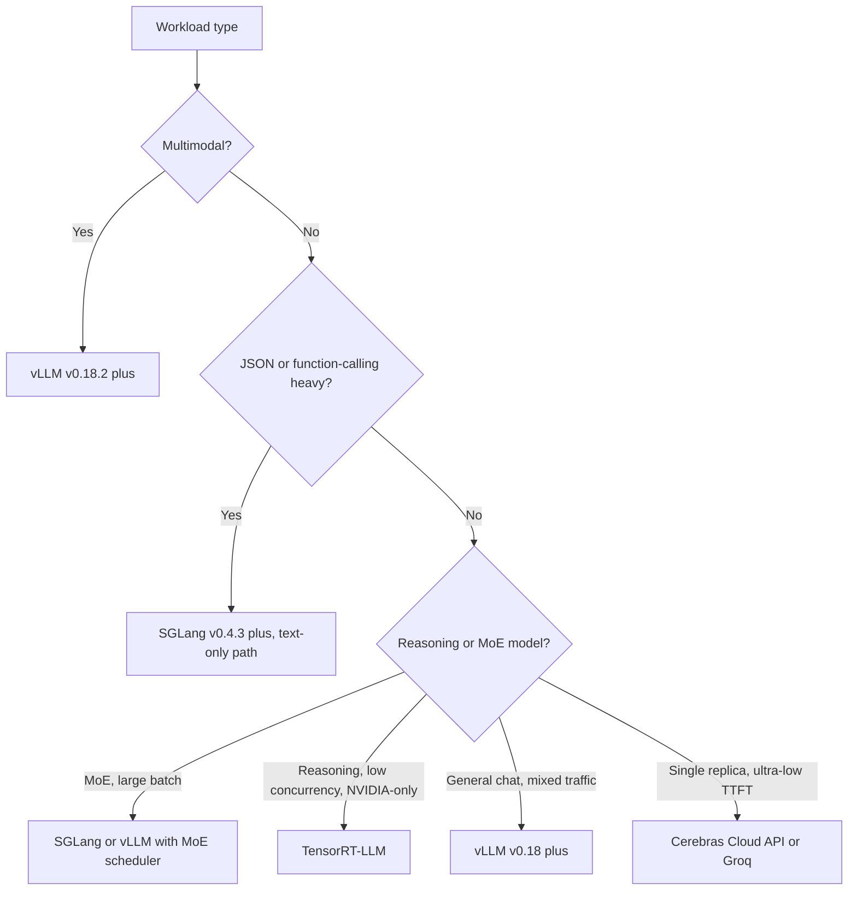

# Serving Infrastructure（Serving Infrastructure，服务基础设施）

大规模部署 LLM（Large Language Model，大语言模型）需要一个可靠的基础设施层，用于处理负载均衡（load balancing）、模型并行（model parallelism）和多租户隔离（multi-tenant isolation）。关注点已从“服务一个模型”转向“编排一个推理集群（inference fleet）”。

## 目录（Table of Contents）

- [推理网关（The Inference Gateway）](#推理网关-the-inference-gateway)
- [模型并行（Model Parallelism）](#模型并行-model-parallelism)
- [多 GPU 编排（Multi-GPU Orchestration）](#多-gpu-编排-multi-gpu-orchestration)
- [流式与长连接（Streaming and Long-Lived Connections）](#流式与长连接-streaming-and-long-lived-connections)
- [2026 年 5 月推理引擎格局（May 2026 Inference Engine Landscape）](#_2026-年-5-月推理引擎格局-may-2026-inference-engine-landscape)
- [面试题（Interview Questions）](#面试题-interview-questions)
- [参考资料（References）](#参考资料-references)

---

## 推理网关（The Inference Gateway）

该网关是 AI 任务的“流量调度员”。

| 组件 | 职责 |
|-----------|---------------------------|
| **身份认证与限流（Auth & Rate Limiting）** | 基于 Token 的配额管理与租户隔离。 |
| **模型路由（Model Router）** | 将请求路由到特定模型版本（Canary/A-B）。 |
| **上下文跟踪（Context Tracker）** | 确保用户的 prompt 缓存发送到同一 GPU 节点（Sticky sessions，粘性会话）。 |
| **输出过滤（Output Filter）** | 对流式响应进行实时安全过滤与 PII（Personally Identifiable Information，个人可识别信息）清洗。 |

---

## 模型并行（Model Parallelism）

对于放不下单张 GPU 的模型（例如 Llama 4 405B 需要约 800GB 显存），我们必须进行拆分。

### 1. 张量并行（Tensor Parallelism，TP）
将单个层/张量拆分到多张 GPU 上。
- **延迟（Latency）**：低（最快）。
- **通信（Communication）**：高（需要 NVLink）。
- **标准用法**：在单节点（8x GPUs）内用于 90% 的生产级服务。

### 2. 流水线并行（Pipeline Parallelism，PP）
将不同层拆分（例如 GPU 1 上为第 1-40 层，GPU 2 上为第 41-80 层）。
- **延迟（Latency）**：高（微批处理开销）。
- **效率（Efficiency）**：利用率较低（气泡时间，Bubble time）。
- **标准用法**：仅用于跨多个节点的超大规模模型。

---

## 多 GPU 编排（Multi-GPU Orchestration）

Kubernetes operators（如 **Kube-Ray** 或 **Gloo**）在生产环境中管理“GPU 池（GPU Pools）”。

- **异构集群（Heterogeneous Clusters）**：在同一集群中混用 H100 处理 frontier models（前沿模型）与 L4 处理小模型。
- **自动扩缩容（Autoscaling）**：基于 **KV Cache 利用率** 而非 CPU 或标准内存使用率进行扩缩容。
- **冷启动（Cold Booting）**：使用 **Un-quantized Base Images（未量化基础镜像）**，并从高性能 Lustre/mount 加载权重，将启动时间从数分钟降至 15-20 秒。

---

## 流式与长连接（Streaming and Long-Lived Connections）

LLM 几乎总是通过 **Server-Sent Events（SSE）** 或 **WebSockets** 提供服务。

**基础设施挑战**：标准负载均衡器（第 4 层，Layer 4）难以处理长连接 AI 流量。  
- **解决方案**：使用支持“End of Sequence” token 并可在用户回合间（而非仅连接级）重平衡流量的 **第 7 层负载均衡器（Layer 7 Load Balancers）**（如 Envoy/Istio）。

---

## 2026 年 5 月推理引擎格局（May 2026 Inference Engine Landscape）

到 2026 年 5 月，选择推理引擎已不再是“哪个最快”的问题。各主流引擎在特定工作负载上各有优势，正确做法是按工作负载选引擎，而不是坚持单一“家族引擎”。下图是团队实际使用的实用地图。

### vLLM v0.18+：默认开源引擎（Default Open Engine）

[vLLM](https://docs.vllm.ai/) 已在 2026 年 Q1 达到 **v0.18**，并在 5 月持续发布点版本。新增内容：

- 在 tree 中支持 **Blackwell Ultra（B300）**，包括 FP4 与动态稀疏（dynamic sparsity）支持（[vLLM v0.18 release notes](https://github.com/vllm-project/vllm/releases)）。
- **PagedAttention v3** 引入 NUMA 感知分配；在多路 CPU 插槽主机上带来明显尾延迟（tail-latency）提升。
- 通过配置开关支持解耦式 prefill / decode，主要用于超长上下文负载。
- 为 Llama 4 Maverick、DeepSeek V4 Pro、Mixtral 8x22B 提供 MoE 调度器，支持 expert-residency-aware batching（专家驻留感知批处理）。

**重要安全说明**：vLLM 修复了一个高危 **多模态 RCE（remote code execution，远程代码执行）**（[GHSA 2026 年 2 月发布](https://github.com/vllm-project/vllm/security/advisories)），该问题影响 v0.18.2 之前版本中的 multimodal preprocessor（多模态预处理器）。**所有多模态 vLLM 部署必须运行 v0.18.2 或更高版本。** 修复本身是单行补丁，但该 CVE 真实可被构造图像输入利用，必须升级。

当工作负载为“Llama / Mistral / Qwen / DeepSeek 在 continuous batching（持续批处理）下”，vLLM 仍是默认开源引擎。它不一定总是最快，但最易运维、测试最完善，且更可能在同周内修复新漏洞。

### SGLang v0.4.3+：吞吐领先，但注意事项关键

[SGLang](https://github.com/sgl-project/sglang) v0.4.3（2026 年 4 月）在若干负载上是吞吐领导者：

- 在结构化输出（structured-output）/函数调用（function-calling）基准中，较 vLLM 有约 **29% 吞吐优势**（[SGLang blog, 2026 年 4 月](https://lmsys.org/blog/2024-12-04-sglang-v0-4/)）。该优势来自于 **异步约束解码（async constrained decoding）**，即约束编译与 LLM 前向传播并行进行。
- 为对话类负载提供业界顶级 **RadixAttention** 前缀缓存复用。
- 一流的 **MoE serving（专家混合模型服务）**，支持专家路由感知批处理。

**2026 年 5 月关键安全警示**：SGLang 的 multimodal（多模态）与 disaggregated-prefill（解耦式预填充）代码路径存在 **未修复 RCE**（[SGLang security advisory, 2026 年 3 月](https://github.com/sgl-project/sglang/security/advisories)）。文字路径是安全的，也是公开基准测试的默认路径。多模态路径在补丁落地前应视为**不适合生产**。多个大规模部署已将多模态流量从 SGLang 回切到 vLLM v0.18.2，并保留 SGLang 用于纯文本函数调用场景。

2026 年 5 月的正确策略是：在吞吐有明显优势、且为**纯文本函数调用与结构化输出负载**时使用 SGLang；在 CVE 修复前，不要将 **多模态**或**解耦式 prefill** 生产流量放在 SGLang 上。

### TensorRT-LLM：峰值 NVIDIA 吞吐与运维成本

[TensorRT-LLM](https://github.com/NVIDIA/TensorRT-LLM) 在纯 NVIDIA 硬件上仍是吞吐领先者：

- 在 H200、B200、B300 上对手工调优模型，具有**最高的峰值 tokens/sec/$**。
- 与 **NVIDIA Triton**（服务）和 **NVIDIA NIM**（托管部署）深度集成。
- 支持 **FP4 / FP8 on Blackwell Ultra** 的自定义内核，通常领先开源引擎数月。

其代价是运维成本：

- 每个新模型都需要一次 **引擎构建（engine build）**，这是一个多小时、依赖具体模型与 GPU 的编译步骤。
- 必须绑定特定 TensorRT 与 CUDA 版本；升级通常较痛苦。
- **仅限 NVIDIA**。脱离 CUDA 需要全面重平台化（re-platform）。

决策非常明确：如果未来两年你将长期使用 NVIDIA 且只有一到两个旗舰模型且每 token/sec 都要榨干，那么 TensorRT-LLM 值得投入。若你需要引擎灵活性、厂商无关性或快速模型迭代，则 vLLM 或 SGLang 更合适。

### MoE-Aware Serving（面向 MoE 的服务策略，Llama 4 Maverick、DeepSeek V4 Pro）

MoE（Mixture of Experts，专家混合模型）打破了“服务成本随 batch size 平滑变化”的假设。2026 年 5 月下，影响 MoE 服务引擎的关键特征：

- **专家权重驻留（Expert weight residency）**：一个 400B 参数、每 token 激活 17B 的 MoE，如果不将未使用专家下线，会大量浪费显存。引擎必须感知 expert-to-token routing（专家到 token 路由），要么固定热点专家（pin hot experts），要么对冷门专家进行流式处理（stream cold ones）。
- **专家路由延迟（Expert routing latency）**：路由决策按 **每 token** 进行并带来可度量成本，当前引擎会在 batch 维度上聚合路由决策。
- **非单调批处理特性**：增加请求数反而可能**降低吞吐**，若触发更冷的专家集合被激活。最优 batch 大小取决于 batch 内部路由模式分布，而不仅仅是请求数量。
- **流水线感知调度（Pipeline-aware scheduling）**：最佳引擎会把新请求加入与当前飞行中的 batch 共享专家激活的批次中。

| 引擎 | Llama 4 Maverick（2026 年 5 月） | DeepSeek V4 Pro（2026 年 5 月） |
|--------|-----------------------------|-----------------------------|
| vLLM v0.18+ | 稳定，MoE scheduler（MoE 调度器）已内置 | 稳定 |
| SGLang v0.4.3+ | 稳定，在 batch >32 场景下吞吐领先 | 稳定 |
| TensorRT-LLM | 稳定，在低并发下吞吐领先 | 稳定 |

面试中可直接讲的认知：**MoE serving 不再是“更大参数版本的 vLLM”**。它是一个全新的调度问题，过去 12 个月内各引擎都已构建了专用 MoE 路径。

### 决策框架：按工作负载选引擎（Decision Framework: Engine per Workload）

更贴近团队真实部署的显式映射：

| 工作负载 | 引擎选择（2026 年 5 月） | 原因 |
|----------|---------------------------|-----|
| 公共聊天机器人（混合流量，必须快速修补） | **vLLM v0.18.2+** | 最易运维，安全修复节奏最快 |
| JSON 函数调用后端 | **SGLang v0.4.3+**（纯文本路径） | 结构化输出上约 29% 吞吐优势 |
| 单模型低延迟（单一模型、单团队） | **TensorRT-LLM** on B300 | 峰值 NVIDIA 吞吐，单模型下值得支付运维成本 |
| 多模态（图像/音频/视频输入） | **vLLM v0.18.2+** | SGLang 的多模态路径尚未修复 |
| 推理模型（长 CoT，低并发） | **TensorRT-LLM** 或带解耦式 prefill 的 **vLLM** | 解码受限（decode-bound），受益于自定义内核 |
| MoE 模型（Llama 4 Maverick、DeepSeek V4 Pro） | **vLLM v0.18+** 或 **SGLang v0.4.3+**（带 MoE scheduler） | 两者目前均具备一流 MoE 路径 |
| 单副本，TTFT 低于 50ms | **Cerebras Cloud API** 或 **Groq LPU** | 在 70B+ 模型上，GPU 往往难以达到 |

### 2026 年 5 月的运维姿势（Operational Posture）

- **始终使用已修补版本。** 推理引擎的 CVE 出现节奏已接近 Web 服务器。多模态 RCE 并非理论问题。
- **在第二引擎上保留金丝雀（canary）实例。** 在 vLLM 上线主流量，同时在 SGLang 或 TensorRT-LLM 上以 1-5% 做 canary，监控质量或延迟偏差，这有助于发现引擎特定缺陷并加速迁移。
- **把引擎视作部署清单的一部分。** 一个模型不是“Llama 4 Maverick”，而是“Llama 4 Maverick on vLLM v0.18.3 with this batch config on this hardware”。这四要素都要锁定。
- **关注安全通告（security advisory feeds）**，而不仅仅是发布说明（release notes）：[vLLM advisories](https://github.com/vllm-project/vllm/security/advisories)、[SGLang advisories](https://github.com/sgl-project/sglang/security/advisories)、[TensorRT-LLM CVE list](https://nvd.nist.gov/vuln/search/results?form_type=Basic&search_type=all&query=tensorrt-llm)。

---

## 面试题（Interview Questions）

### 问：为什么低延迟服务中更偏好张量并行（Tensor Parallelism）而非流水线并行（Pipeline Parallelism）？

**强回答：**
Tensor Parallelism（TP）在单层内把矩阵乘法同时分摊到多张 GPU 上执行，因此该层延迟可按 GPU 数量近似降低。相反，Pipeline Parallelism（PP）按不同层顺序处理；当 GPU 2 在处理第 40-80 层时，若没有足够深的请求流水，GPU 1 会处于空闲。对单个用户请求而言，PP 会叠加所有 GPU 的延迟，而 TP 则将延迟分摊到多张 GPU。

### 问：你如何处理多租户 LLM 集群中的“噪声邻居”（Noisy Neighbors）问题？

**强回答：**
我们通过**分层迭代级调度（Tiered Iteration-Level Scheduling）**处理该问题。每个租户分配一定比例的总 GPU 周期（share）。在持续批处理循环中，调度器确保单一租户不会占满 100% 的 KV cache 插槽（slots）。若租户 A 压力过大，调度器会优先处理租户 B 和 C 的“Prefill”步骤，或每个周期仅处理租户 A 解码（decode）迭代的一部分。此策略在网关通过 token 桶（token-bucket）限流执行，也通过服务引擎内的具体调度策略执行。

---

## 参考资料（References）
- Narayanan 等. “Efficient Large-Scale Language Model Training on GPU Clusters Using Pipedream” (2019/2021)
- NVIDIA. “Megatron-LM: Training Multi-Billion Parameter Models on GPU Clusters” (2021)

---

*Next: [Cost Optimization Playbook（成本优化手册）](07-cost-optimization-playbook.md)*
