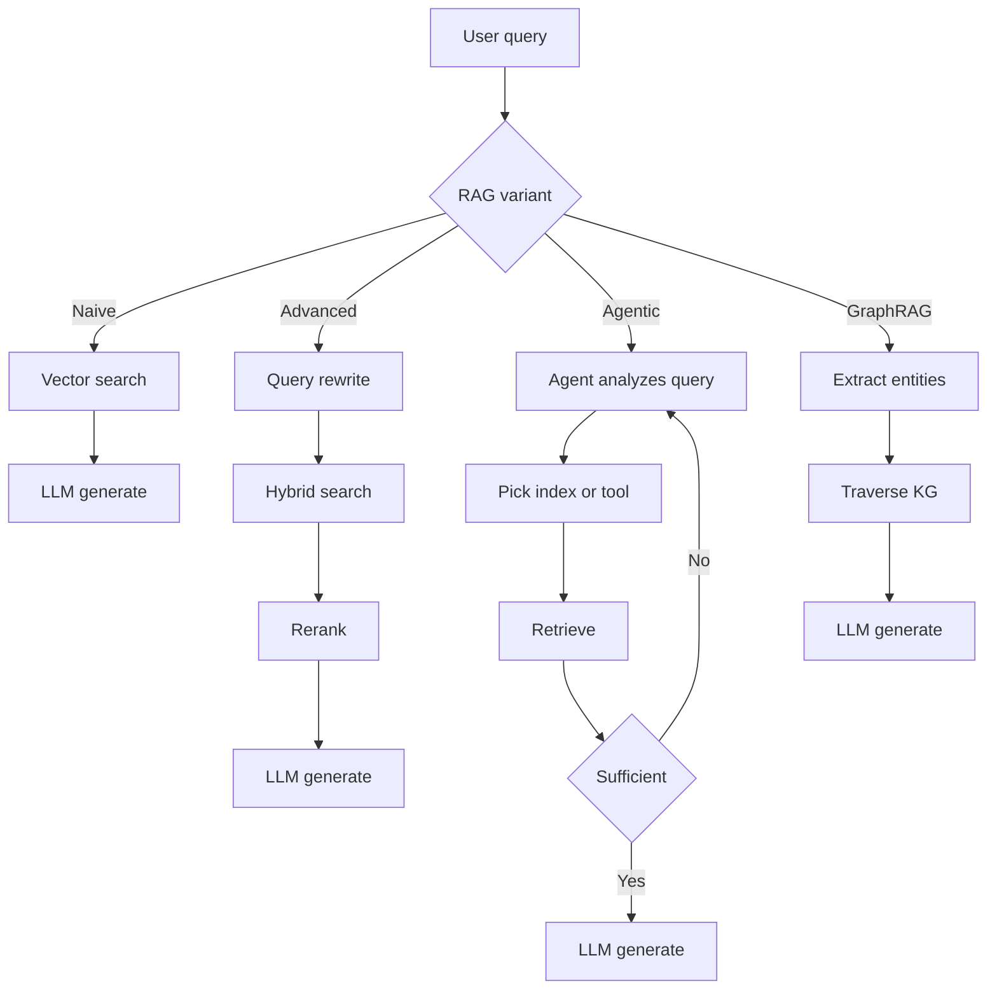
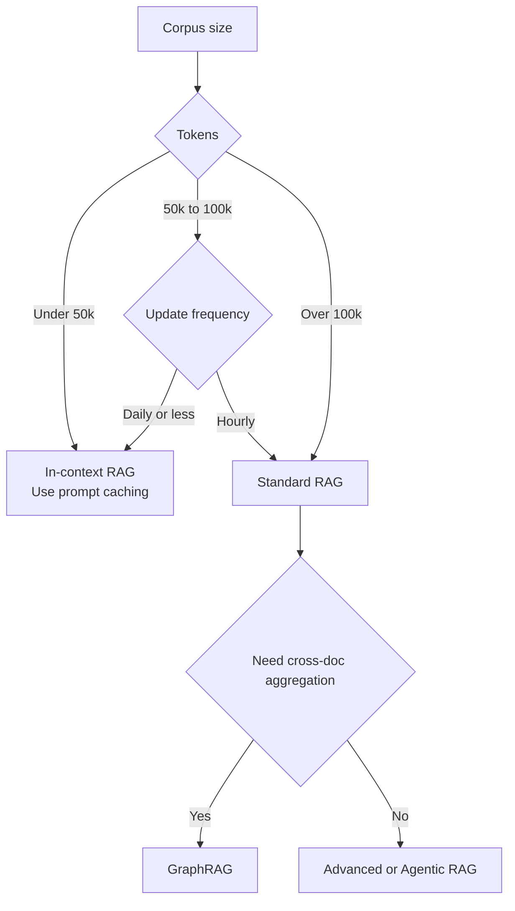

# RAG 基础知识

RAG 如何从朴素向量搜索演进为 agentic（智能体式）和基于图的检索。何时选择 RAG 而不是长上下文，以及导致生产故障的三大检索缺口。

检索增强生成（Retrieval-Augmented Generation，RAG）是为 LLM（大语言模型）提供外部、可验证上下文（verifiable context），以使其回答有事实依据的一种架构模式。它已从“简单向量搜索”演进为多阶段推理流水线：混合检索（hybrid retrieval）、重排序（reranking）、上下文化切块（contextual chunking）和 agentic 循环（agentic loops）如今已是生产系统的标配。更深入的内容见 [Chunking Strategies](02-chunking-strategies.md)、[Vector Databases](04-vector-databases.md)、[Reranking](06-reranking-strategies.md)、[Contextual Retrieval](10-contextual-retrieval.md)、[ColBERT Late Interaction](11-late-interaction-colbert.md) 和 [GraphRAG reframe](07-graph-rag.md)。

## 目录

- [核心理念：Grounding 与 Training](#核心理念-grounding-与-training)
- [RAG 分类体系](#rag-分类体系)
- [RAG vs. 2M Context（混合时代）](#rag-vs-2m-context-混合时代)
- [检索质量缺口](#检索质量缺口)
- [面试问题](#面试问题)
- [参考资料](#参考资料)

---

## 核心理念：Grounding 与 Training

| 维度 | Fine-Tuning | RAG |
|--------|-------------|-----|
| **知识类型** | 内化（Weights） | 外化（Context） |
| **更新周期** | 高成本（重训） | 零成本（更新数据库） |
| **可归因性** | 无（黑盒） | 显式（Citations） |
| **隐私** | 难以“遗忘” | 易于过滤/删除 |

**经验法则**：Fine-Tuning 用于**形式**（风格、语气、语法）；RAG 用于**事实**（知识、数据、grounding）。

---

## RAG 分类体系

生产级 RAG 系统按其“Agentic Depth（智能体深度）”分类：

### 1. Naive RAG（朴素 RAG，Retrieve-then-Generate）
- **流程**：User Query -> Vector Search -> Top-K -> LLM。
- **状态**：由于“检索缺口”（Retrieval Gap）和较低精度，已不适合生产环境。

### 2. Advanced RAG（高级 RAG）
- **流程**：Query Transformation -> Hybrid Search -> Reranking -> LLM。
- **关键细节**：使用 **RRF（Reciprocal Rank Fusion，倒数排名融合）** 将关键词结果与语义结果合并。

### 3. Agentic RAG（循环式 RAG）
- **流程**：Agent analyzes query -> 决定搜索哪些工具/索引 -> 评估结果 -> 如果信息不足则重新检索。
- **技术**：Self-RAG、Corrective RAG（CRAG，纠正式 RAG）。

### 4. GraphRAG（结构化上下文）
- **流程**：抽取实体/关系 -> 构建 Knowledge Graph（知识图谱）-> 遍历图以找到“关联知识”。
- **优势**：解决“聚合类问题”（Aggregative Questions），例如“总结 50 份文档中的所有法律风险”。

按 agentic depth 划分的四种变体：

---

## RAG vs. 2M Context（“混合时代”）

随着 Gemini 1.5 Pro（2M+）和 Claude Sonnet 4.6（1M+）等上下文窗口的出现，RAG 正在变化。

- **In-Context RAG（ICR）**：对于小于 50k token 的数据集，我们跳过向量数据库，直接把所有内容放进 prompt。
- **Prompt Caching**：通过缓存“Background Knowledge（背景知识）”，可以让长上下文 RAG 的成本降低 90%。

**架构决策**：
- 如果你的 corpus 大于 100k token 且是动态变化的：使用 **Standard RAG**。
- 如果你的 corpus 小于 100k token：使用 **In-Context RAG**。

选择 standard RAG 与 in-context RAG 的决策树：

---

## 检索质量缺口

“检索缺口”（Retrieval Gap）是 RAG 失败的首要原因。
- **缺口 1：语义不匹配（Semantic Mismatch）**：查询说的是“fast cars”，数据库里是“Porsche 911”。可通过 **Embedding Rerankers** 解决。
- **缺口 2：缺少上下文（Missing Context）**：相关信息存在于数据库中，但 Retriever 没有检索到。可通过 **Hybrid Search** 解决。
- **缺口 3：Lost-in-the-Middle**：信息在 prompt 里，但 LLM 没有注意到。可通过 **Context Compression** 解决。

---

## 面试问题

### Q: 如果前沿模型已经提供 1M-2M token 的上下文窗口，为什么还要用 RAG？

**优秀回答：**
有三个层面的原因：
1. **成本和延迟**：即使有 prompt caching，每次新用户查询都重新读取 2M token 的成本仍然显著更高，且 TTFT（Time to First Token，首 token 时间）也高于仅检索 5 个相关 chunk（约 2k token）。
2. **新鲜度**：RAG 可以接入实时 API（Stock prices、News），这些内容无法静态嵌入上下文窗口。
3. **规模**：企业数据集（SharePoint、TB 级日志）会超过 2M token。RAG 作为“过滤器”，用于找出那 0.01% 应进入高价值上下文窗口的数据。

### Q: 什么是 “Agentic RAG”，它与 “Advanced RAG” 有何不同？

**优秀回答：**
Advanced RAG 是一种**确定性流水线**（Linear: Rewrite -> Search -> Rerank）。Agentic RAG 是一种**随机循环**（stochastic loop）。在 Agentic RAG 中，模型被赋予工具，以决定*如何*检索。例如，如果 agent 发现检索到的文档不相关，它可以改为“Search Google”或“Query the SQL database”。它本质上是在检索前后各增加一个“Reasoning step（推理步骤）”，以确保上下文足以回答 prompt。

---

## 核心要点

- Naive RAG（向量搜索 + top-K + LLM）已不适合生产环境；应以 Advanced RAG（混合检索 + RRF + rerank）作为新的基础方案。
- 长上下文窗口不会消灭 RAG：成本、延迟、新鲜度和语料规模都会把你重新推回检索，即使在 2M 上下文下也是如此。
- 按 corpus 规模选择：低于 50k token 使用带 prompt caching 的 in-context；高于 100k 使用 standard RAG；聚合类问题使用 GraphRAG。
- 大多数 RAG 失败来自检索失败，而不是生成失败；在调 prompt 之前先诊断三类缺口（语义不匹配、缺少上下文、lost-in-the-middle）。
- Agentic RAG 与 Advanced RAG 的区别，是随机循环与确定性流水线的选择；只有在查询模式过于多样、固定流水线难以覆盖时才采用 agentic。

---

## 参考资料
- Gao et al. "Retrieval-Augmented Generation for LLMs: A Survey"（2024 更新）
- Microsoft. "From RAG to GraphRAG"（2024）
- Google. "Long-context LLMs as Retrievers"（2025）
- [Anthropic. "Introducing Contextual Retrieval" (Sep 2024)](https://www.anthropic.com/news/contextual-retrieval)

---

*下一步: [Chunking Strategies](02-chunking-strategies.md)*
