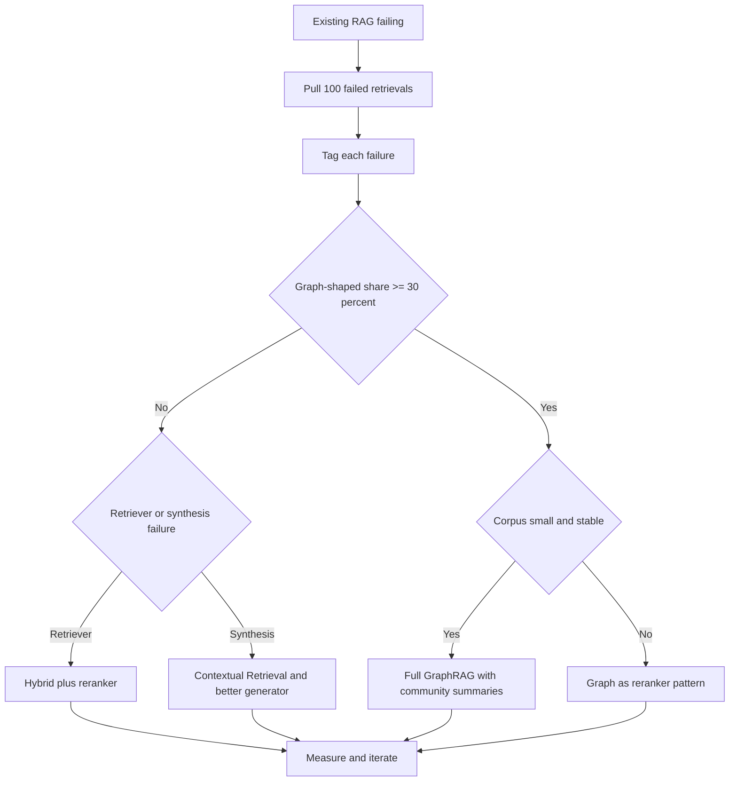
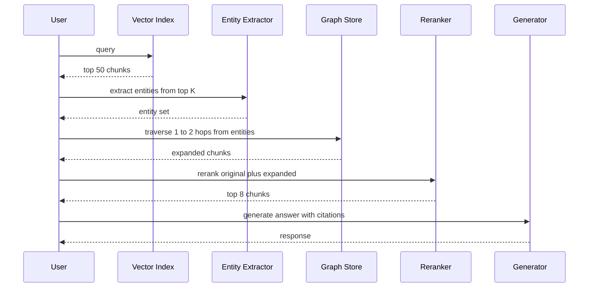

# GraphRAG

GraphRAG 是 **知识图谱（Knowledge Graph, KG）** 与 **检索增强生成（Retrieval-Augmented Generation, RAG）** 的结合。向量 RAG 擅长“找到某个具体片段”，而 GraphRAG 旨在对整个数据集进行 **全局推理（Global Reasoning）**。

## 目录

- [GraphRAG 何时真正占优（以及何时不占优）](#graphrag-何时真正占优-以及何时不占优)
- [图作为重排序器模式（May 2026）](#图作为重排序器模式-may-2026)
- [向量 RAG 的局限性](#向量-rag-的局限性)
- [GraphRAG 架构（提取-构建-查询）](#graphrag-架构)
- [社区摘要（微软模式）](#社区摘要)
- [实体-关系检索](#实体-关系检索)
- [何时使用 GraphRAG](#何时使用-graphrag)
- [面试题](#面试题)
- [参考资料](#参考资料)

---

## GraphRAG 何时真正占优（以及何时不占优）

GraphRAG 是针对图状问题的专用工具，不是向量 RAG 的默认升级。对于大约 80% 的生产检索工作负载，先用 BM25 加稠密检索（dense retriever）的混合方案，再接一个交叉编码器重排序器（cross-encoder reranker），通常构建更便宜、运维更便宜，而且答案质量也有竞争力。只有当问题确实需要跨多个跳点（multi-hop）遍历，而向量相似度无法恢复这些关系时，图才值得构建。

决策应当由数据驱动，而不是由审美驱动。请从你现有的 RAG 系统中抽取 100 个检索失败样本，把每个失败标注到下面三类之一，然后让分布来决定：

1. **词法或分块失败（Lexical or chunking failures）**：答案在语料中，但检索器没有把它召回。修复检索器即可（更好的 embedding、混合打分、更大的 top-k、重排序器，或上下文检索 Contextual Retrieval）。
2. **综合失败（Synthesis failures）**：检索器召回了正确的片段，但生成器把它们组合得不好。修复提示词、重排序器或模型。
3. **图状失败（Graph-shaped failures）**：答案需要沿着跨文档的关系链条推理，而这些文档之间没有表面文本重合。这就是 GraphRAG 的适用场景。

如果第三类少于 30% 的失败，就不要建图。构建和维护成本不会回本。如果它达到 30% 或更高，GraphRAG（或者下面会讲到的图作为重排序器的混合模式）就是下一步正确投资。

### GraphRAG 适用的工作负载

这些场景的共同点是：问题需要把不会出现在同一个片段中的实体连接起来，而且关系本身携带的语义权重是表面 embedding 捕捉不到的。

- **药物发现与生物医学研究**：跨基因、蛋白质、化合物和疾病追踪路径。像 GraLC-RAG 这类基于 UMLS 的变体就是为这个领域调优的。
- **金融欺诈团伙**：连接账户、设备、地点和交易，即使这些信息分散在互不提及的文档中。
- **法律判例链条**：沿着多个司法层级追踪案例引用，因为每个案例只引用它的直接上游判例。
- **企业组织架构与政策归属**：诸如“谁批准区域 Y 中政策 X 的例外”这类问题，需要沿着汇报链路和政策归属边遍历。
- **仓库级代码智能**：调用图（call graph）、类型层级和依赖关系本质上都是图状的；对源代码片段做向量相似度检索会丢掉让答案可被找到的结构。

### 决策流程

### 维护尾部成本

GraphRAG 的隐性成本不是提取，而是维护。语料会漂移：新文档会进来，实体会改名，关系会被重写。1 月构建的图到 4 月就会明显错误。应当预留一个季度级刷新流程，对变更文档重新执行提取，并在差异上协调实体身份。要么提前把 LLM 成本和工程时间预算进去，要么就不要建图。跳过这一步的团队最后会得到一个“自信但错误”的图，这比没有图还糟。

---

## 图作为重排序器模式（May 2026）

在 2026 中占主导地位的生产模式不是完整 GraphRAG，而是图作为重排序器（graph-as-reranker）模式。它以远低于完整构建成本的代价，提供了大部分多跳收益。其直觉是：你不需要覆盖整个语料库的图索引；你只需要一个覆盖 top-k 向量结果中出现的实体的图，并按需扩展到足以找到连通证据的程度。

流程如下：

1. 向量检索使用你已有的任何混合打分，返回用户查询的前 50 个片段。
2. 一个实体抽取器（小型微调模型，或结构化输出的 LLM 调用）从这 50 个片段中提取命名实体。
3. 从这些实体出发进行一到两跳深的图遍历，返回连通实体以及它们出现的片段。
4. 扩展后的候选集（原始 50 个片段加上图扩展后的片段）进入交叉编码器重排序器。
5. 排序后的前 k 个片段送入生成器。

你只构建查询实际触达的那一小部分图，而不是一个全局图索引。构建成本会下降一个数量级。维护尾部也会变小，因为你不需要为未触及区域重新索引。经验上，团队报告称能以大约 70-80% 的前期成本，获得完整 GraphRAG 大约 20% 的质量提升。

### 模式流程

### 近期变体（2024 到 2026）

简要了解一下值得关注的变体：

- **HippoRAG 和 HippoRAG 2**（普林斯顿，2024 与 2025）：把检索视为记忆图上的个性化 PageRank（Personalized PageRank）问题，在多跳基准上表现强，同时索引成本低于微软 GraphRAG。
- **LightRAG**（香港大学，2024）：以更简单的索引流水线做实体中心检索；在全局问题上的召回会有一定牺牲，但构建和更新快得多。
- **GraLC-RAG**（2026 年 3 月）：将图感知的 late chunking 与 UMLS grounding 结合，面向生物医学场景，在多跳生物医学问答上有很强的已发表结果。
- **微软 GraphRAG 索引流水线 v2**（2025）：原始的社区摘要方法，重构为可增量更新且抽取成本显著更低；如果你确实需要全局摘要而不是局部多跳，这就是该用的方案。

这四个变体的总体方向是一致的：减少单体式索引，增加增量式与懒加载式图构建，并更清楚地区分“全局摘要”工作负载（微软风格的社区摘要仍然占优）和“局部多跳”工作负载（HippoRAG 风格的遍历更便宜且具竞争力）。

**来源：**
- [Microsoft GraphRAG](https://microsoft.github.io/graphrag)
- [HippoRAG：受神经生物学启发的长期记忆](https://arxiv.org/abs/2405.14831)
- [Edge 等，《从局部到全局：GraphRAG 方法》](https://arxiv.org/abs/2404.16130)
- [图感知的 late chunking（arXiv 2603.22633）](https://arxiv.org/html/2603.22633v1)
- [Anthropic 上下文检索（Contextual Retrieval，2024 年 9 月）](https://www.anthropic.com/news/contextual-retrieval)

---

## 向量 RAG 的局限性

向量 RAG 处理的是空间中的“点”。这在下面这类问题上会失效：
- *“所有 500 条员工评价中的主要主题是什么？”*
- *“展示 Project Alpha 与 Q3 预算削减之间的所有关联。”*

**问题在于**：向量检索找到的是“相似文本”，但它不理解“相连的实体”。

---

## GraphRAG 架构

现代 GraphRAG 流水线由三个阶段组成：

1. **提取（VLB）**：LLM 扫描文本并抽取 **实体（Entities）**（人、项目、日期）和 **关系（Relationships）**（例如，“Person A *works on* Project B”）。
2. **图构建**：这些实体作为节点、这些关系作为边，存入图数据库（Neo4j、Memgraph）。
3. **查询**：
   - **局部搜索**：找到一个节点及其邻居。
   - **全局搜索**：使用 **社区摘要（Community Summaries）** 回答高层问题。

---

## 社区摘要

 这一技术由微软推广，其过程包括：
1. 使用图算法（例如 Leiden）识别相关节点的聚类（社区）。
2. 为*每个*社区生成自然语言摘要。
3. 在查询时，检索 **摘要** 而不是原始片段。

**优势**：这使模型无需读取 1M 个 token 就能回答“大局”问题。

---

## 实体-关系检索

生产栈通常使用 **混合图-向量检索（Hybrid Graph-Vector Search）**。
- **稠密通道（Dense Pass）**：通过 embedding 找到最相似的节点。
- **图通道（Graph Pass）**：遍历这些节点的边，找到与查询在语义上未必相似、但在逻辑上相关的“支撑”信息。

---

## 何时使用 GraphRAG

| 特性 | 向量 RAG | GraphRAG |
|---------|------------|----------|
| **数据类型** | 非结构化文本 | 高度互联的数据 |
| **查询类型**| “找出 X” | “解释 X 和 Y 之间的关系” |
| **规模** | PB 级 | 数百万实体 |
| **成本** | 低 | 高（提取成本昂贵） |

**2025 建议**：将 GraphRAG 用于 **内部知识库**（Wiki、代码库、法律仓库），因为这些文档之间的连接和内容本身一样重要。

---

## 面试题

### 问：为什么“提取”阶段是 GraphRAG 的瓶颈？

**强回答：**
知识图谱提取极其消耗 token。要构建高质量的图，你必须用“Frontier”模型处理每一份文档，以确保不会漏掉细微的实体连接。对于一个 10,000 页的数据集，这可能会在 LLM API 调用上花费数千美元。标准缓解方式是先用 **基于 SLM 的提取（Small Language Models，小语言模型）** 进行初次处理，再把巨型模型留给重叠实体之间的“冲突解决”。微软的 LazyGraphRAG 进一步把社区摘要的成本延后到查询时再承担。

### 问：GraphRAG 如何解决聚合问题中的“上下文窗口”限制？

**强回答：**
对于聚合问题（例如，“总结 1,000 份文档的情感”），标准 RAG 系统必须把 1,000 个片段塞进上下文窗口，这要么不可能，要么成本高得离谱。GraphRAG 通过 **预摘要（Pre-Summarization）** 解决这个问题。它会对图中的信息簇（社区）进行分层摘要。当用户提出全局问题时，系统只检索高层级的社区摘要。这些摘要既紧凑又信息密度高，使模型能够通过一个压缩后的视角“看到”整个数据集。

---

## 参考资料
- Edge 等人，《From Local to Global: A GraphRAG Approach》（微软研究院，2024）
- Neo4j.《生成式 AI 与图数据库》（2025）
- WhyHow AI.《使用知识图谱的确定性 RAG》（2024）

---

*下一篇：[Agentic RAG](08-agentic-rag.md)*
