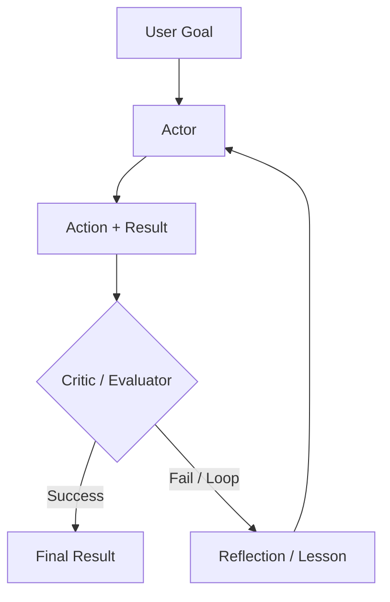

# 推理循环：ReAct 及其他模式

Reasoning Loops（推理循环）定义了 agent 的控制流。虽然 **ReAct** 曾是 2023 年的基线，但当前系统在推理原生模型之上使用了更复杂的模式，如 **Plan-and-Solve**、**Self-Reflexion** 和 **Inference-Time Scaling**。

## 目录

- [循环的演进](#循环的演进)
- [ReAct：经典模式](#react-推理-行动)
- [Self-Reflexion 循环](#self-reflexion-循环)
- [Plan-and-Solve（Soto）](#plan-and-solve)
- [Flow Engineering（LangGraph 模式）](#flow-engineering-langgraph-模式)
- [面试题](#面试题)
- [参考资料](#参考资料)

---

## 循环的演进

| 时代 | 模式 | 核心理念 |
|-----|---------|-----------------|
| **2023** | ReAct | 交替进行思考和行动。 |
| **2024** | Reflexion | 评估错误并重试。 |
| **今天** | System 2 Loops | 使用隐藏的 CoT（Chain of Thought，思维链）实现更稳健的多步逻辑。 |

---

## ReAct：推理 + 行动

90% 的 agent 的基础循环：
1. **Thought（思考）**: "I need to find X."
2. **Action（行动）**: `search_engine("X")`
3. **Observation（观察）**: "X is at Y."
4. **Repeat（重复）**.

**Critique（批评）**: ReAct 很脆弱。如果搜索返回 "No results"，一个简单的 ReAct agent 往往会再次执行同样的搜索。现代循环会注入 **"Negative Constraints（负向约束）"**（例如，"Don't try search results we've already seen"）。

---

## Self-Reflexion 循环

Reflexion 为循环增加了一个 **"Critic（评估者）"** 步骤。

**Benefit（优势）**: 通过将这些 "Reflections（反思）" 存入短期记忆，agent 在当前会话中建立起一个 "Mental Map（心智地图）"，表示哪些操作行不通。

---

## Plan-and-Solve

与其逐步决策（贪心策略），agent 先生成一个 **Static Plan（静态计划）**，再执行它。

1. **Planner（规划器）**: "I will do A, then B, then C."
2. **Executor（执行器）**: 执行各个步骤。
3. **Re-planner（重规划器）**: 如果步骤 B 失败，则触发完整重规划，而不是局部修复。

**Why?**: 规划可以减少 "Stochastic Errors（随机性错误）"。当模型提交一条路径后，不太容易被嘈杂的工具结果分散注意力。

---

## Flow Engineering（LangGraph 模式）

现代 agentic 系统已从 "Chat interfaces（聊天界面）" 迁移到 **"State Machines（状态机）"**。

- **Cyclic Graphs（循环图）**: 不再是线性序列，而是定义一个图，让模型可多次回到 "Cleaning（清理）" 节点或 "Validation（校验）" 节点。
- **Micro-Agents（微代理）**: 图中的每个节点都是一个专门化的 "Prompt（提示）" 或 "Tool（工具）"。

**Key Nuance（关键细节）**: "Agent（代理）" 不再只是 LLM；agent 是 **Graph Execution Engine（图执行引擎）**。

---

## 面试题

### Q: 你会在什么场景下使用 "Reasoning Loop（推理循环）"（ReAct）而不是 "Plan-and-Solve（规划-执行）" 架构？

**Strong answer（优秀答案）:**
我会在 **Exploratory（探索性）** 任务中选择 **ReAct**，例如你还不知道 URL 结构的新网站浏览场景（环境不可预测）。这类任务中，agent 需要对每次观察作出反应。我会在 **Predictable（可预测）** 但复杂的工作流中选择 **Plan-and-Solve**，例如从 5 个已知 API 生成财务报告。规划能避免模型“胡乱游走”（meandering），并支持不互相依赖步骤的更好并行化。

### Q: 什么是 "Inference-Time Scaling（推理时扩展）"，它与 Agentic Loops（代理循环）有什么关系？

**Strong answer（优秀答案）:**
Inference-Time Scaling（推理时扩展）（通常与 OpenAI 的 o1 相关）指的是在响应生成过程中投入更多计算，而不仅仅是在训练阶段投入。在 agentic 场景下，这意味着模型不会只输出第一个看起来可行的行动，而是在提交前内部使用 **Search Tree（搜索树）**（如 Monte Carlo Tree Search）模拟多条行动路径。这会减少需要的 "Real World（真实世界）" 工具调用数量，节省外部 API 成本并降低失败率。

---

## 参考资料
- Yao 等人. "ReAct: Synergizing Reasoning and Acting" (2022/2025 update)
- Shinn 等人. "Reflexion: Language Agents with Iterative Homeostatic Learning" (2024)
- Wang 等人. "Plan-and-Solve Prompting" (2023)

---

*下一篇：[Tool Use and the Model Context Protocol (MCP)](03-tool-use-and-mcp.md)*
