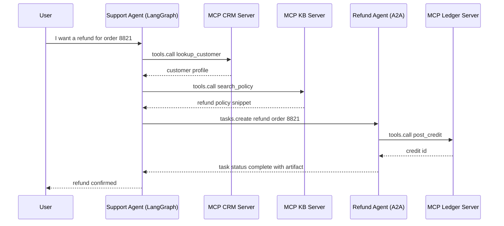
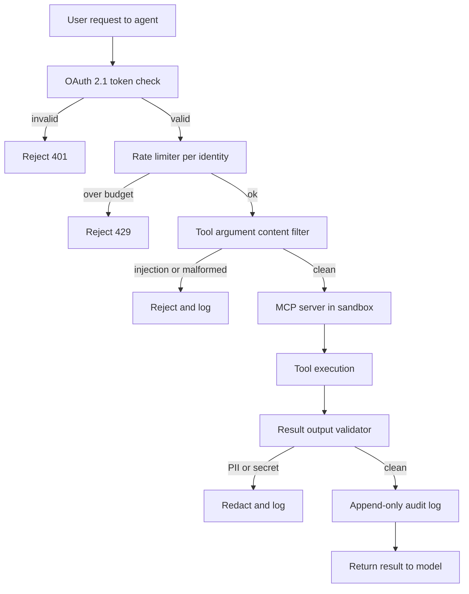

# 工具使用与 MCP

工具是智能体的“手脚”。业界已经标准化采用 **模型上下文协议（Model Context Protocol，MCP）**，它以统一、优先本地的通信层取代了碎片化的自定义工具定义。MCP 发展迅速：可流式 HTTP 传输、OAuth 2.1 认证，以及原生计算机使用工具都已登陆 MCP 2.0（于 2026 月获批）。与此同时，**Agent-to-Agent（A2A，智能体到智能体）** 以及其他互操作协议也已出现，用于在 MCP 的工具访问层之上补充智能体协同能力。

## 目录

- [工具使用机制](#工具使用机制)
- [模型上下文协议（MCP）](#模型上下文协议-mcp)
- [MCP 2.0：可流式 HTTP 与认证](#定义高精度工具)
- [MCP 路线图与生态系统](#mcp-与-openai-函数调用)
- [Agent-to-Agent 协议（A2A）](#流式工具调用)
- [协议格局：MCP + A2A + ACP](#mcp-2-0-可流式-http-与认证)
- [计算机使用工具（Anthropic）](#mcp-路线图与生态系统)
- [定义高精度工具](#agent-to-agent-协议-a2a)
- [MCP 与 OpenAI 函数调用](#协议格局-mcp-a2a-acp)
- [Context7：实时文档 MCP](#a2a-v1-0-正式版与-2026-年-5-月的-mcp-生产故事)
- [流式工具调用](#计算机使用工具-anthropic)
- [面试题](#面试题)
- [参考资料](#参考资料)

---

## 工具使用机制

工具使用发生在一个 3 步循环中：
1. **Schema 呈现**：向模型提供工具的 JSON schema。
2. **意图与抽取**：模型输出一个“调用”（例如 `{"tool": "get_weather", "args": {"city": "Tokyo"}}`）。
3. **执行与上下文化**：系统运行该函数，并将结果回传到提示词中。

**细微差别**：生产级栈不再把工具定义“硬编码”进系统提示词；它们使用 **动态清单（Dynamic Manifests）**，仅根据用户意图拉取必要的工具。

---

## 模型上下文协议（MCP）

由 Anthropic 开发（于 2024 月发布），如今已成为 Anthropic、OpenAI、Google、Microsoft 和 AWS 之间通用的工具集成标准。MCP 允许模型与数据和工具交互，而不受它们部署位置的限制。治理权已于 2025 月移交给 Linux Foundation 的 Agentic AI Foundation。

- **MCP 客户端**：AI 应用（例如你的智能体代码）。
- **MCP 服务器**：一个独立进程，暴露工具（Functions，函数）、资源（Resources，数据）和提示词（Prompts，模板）。
- **通信**：通过 stdio 或 HTTP 上的 JSON-RPC。

### 为什么选择 MCP？
- **安全性**：工具运行在自己的进程中，而不是模型逻辑内部。
- **可移植性**：一次编写 “Postgres 工具”，即可在 Claude、GPT 或 Llama 中使用。
- **可发现性**：标准化的 `list_tools` 和 `get_resource` 命令。

---

## 定义高精度工具

生产质量的工具必须包含：

1. **严格类型校验**：使用 Pydantic 或 Zod，在模型看到调用之前就强制执行 schema。
2. **详细文档字符串**：说明 *何时不要* 使用该工具。
3. **置信度阈值**：要求模型为工具调用输出一个 `confidence` 分数。

```python
# MCP Server Example (Conceptual)
@server.tool()
class ExecuteSQL(PydanticModel):
    """Executes a Read-Only SQL query. DO NOT use for DROP/DELETE."""
    query: str = Field(..., description="The SELECT query to run.")

    async def run(self):
        # Implementation here...
        pass
```

---

## MCP 与 OpenAI 函数调用

| 特性 | OpenAI 原生 | MCP |
|---------|---------------|-----|
| **耦合** | 高（OpenAI 特定） | 低（无关框架） |
| **传输** | API 请求体中的 JSON | JSON-RPC（本地/远程） |
| **数据访问**| 无原生数据“资源” | 原生 `Resources` 支持 |
| **最适合** | 原型开发 | 企业编排 |

---

## 流式工具调用

前沿模型支持 **部分工具推测（Partial Tool Speculation）**。系统不会等完整 JSON 生成完再行动，而是在工具名称和关键 ID 出现在流中时，就开始“预取”工具结果。这样可将感知延迟降低 **400-800ms**。

---

## MCP 2.0：可流式 HTTP 与认证

MCP 2.0 规范（于 2026 月获批）引入了两项重大变化：

### 1. 可流式 HTTP 传输
之前的 MCP 使用 `stdio` 或带 SSE 的基础 HTTP。MCP 2.0 增加了 **可流式 HTTP** - 一个单一的长连接 HTTP 连接，支持双向流式传输：

```
[MCP Client] ←── Streamable HTTP POST /mcp ──→ [MCP Server]
                  (with SSE response stream)
```

- 支持部署为云微服务的 MCP 服务器（不只是本地进程）
- 允许通过一条连接同时进行多个工具调用
- 与 stdio 传输向后兼容

### 2. OAuth 2.1 授权
远程 MCP 服务器现在可以要求合适的认证：

```json
{
  "type": "oauth2",
  "grant_type": "client_credentials",
  "scopes": ["tools:read", "resources:documents"]
}
```

这使得企业级 MCP 服务器能够针对每个租户实施细粒度访问控制。

---

## MCP 路线图与生态系统

截至 2026 月，已有超过 2,300 个公开 MCP 服务器，主要 AI 工具（Claude、Cursor、Windsurf）都原生支持它。MCP 已经从开发者工具跨入消费级硬件（例如，Elgato Stream Deck 7.4 于 2026 月发售时已支持 MCP）。Microsoft 也已将 MCP 采纳为 Windows AI Foundry 和 Microsoft 365 Copilot 的主要集成标准。

MCP 路线图聚焦以下支柱：

1. **传输可扩展性**：将可流式 HTTP 演进为一个在普通 HTTP 基础设施上可水平扩展的 **无状态核心**，并在负载均衡器和代理后保持正确行为。**MCP Server Cards** 提供一个 `.well-known` URL，用于结构化服务器元数据发现。
2. **MCP Apps（服务器渲染 UI）**：一种扩展，允许 MCP 服务器连同工具一起提供交互式 UI，从而使工具结果可以作为组件渲染在客户端中，而不是纯文本。这是 OpenAI 以 [Apps SDK](../09-frameworks-and-tools/07-autogen-crewai.md) 形式推出的模式的规范级标准化。它将 MCP 服务器从无头工具端点变成了交互式界面。
3. **Tasks 扩展（长时间运行工作）**：一种标准方式，用于建模无法在单次请求/响应中完成的工作，使客户端能够启动长任务、轮询或订阅进度，并在稍后收集结果。这使 MCP 适用于耗时数分钟或数小时而非数秒的智能体工作负载。
4. **智能体通信**：在 MCP 现有工具层之上支持智能体到智能体模式。
5. **企业认证（2026 年第二季度）**：面向基于浏览器的智能体的带 PKCE 的 OAuth 2.1，以及与企业身份提供商集成的 SAML/OIDC，解锁受监管行业部署。
6. **MCP Registry（2026 年第四季度）**：一个经过筛选与验证的服务器目录，包含安全审计、使用统计和 SLA 承诺。

**治理**：MCP 治理工作组引入了贡献者阶梯（Contributor Ladder）和委托模型，允许特定领域的工作组在无需完整核心维护者审查的情况下接受 SEP（Specification Enhancement Proposals，规范增强提案）。

> *已于 2026 月验证。来源：modelcontextprotocol.io/development/roadmap*

---

## Agent-to-Agent 协议（A2A）

Google 于 2025 月推出了 **Agent2Agent（A2A）** 协议，用于解决 MCP 不涉及的一个问题：**来自不同厂商的智能体** 如何相互通信（而不仅仅是与工具通信）？

### A2A 解决了什么

MCP 定义的是智能体如何连接到 **工具和数据**。A2A 定义的是一个 **编排智能体如何将任务委派给来自不同厂商或框架的专门智能体**，即便它们不共享内存、工具或上下文。

### 技术基础

- 基于 **HTTP、SSE 和 JSON-RPC** 构建（与 MCP 采用相同基础，便于集成）
- 支持企业级认证，并与 OpenAPI 的认证方案保持一致
- **Agent Cards**：描述智能体能力、技能和端点的 JSON 元数据文档 - 类似于 MCP Server Cards，但对象是智能体

### A2A 任务生命周期

```
[Client Agent] ── POST /tasks ──→ [Remote Agent]
                                     │
                  ← SSE stream ──────┘  (status updates, artifacts)
                                     │
                  ← Task Complete ───┘  (final result)
```

A2A 任务支持带流式状态更新的长时间运行操作，因此适合持续数分钟或数小时的企业工作流。

### 行业采用

- 获得包括 Atlassian、Salesforce、SAP、LangChain 和 PayPal 在内的 50+ 家技术合作伙伴支持
- 于 2025 年 6 月捐赠给 **Linux Foundation**，作为一个开放治理项目
- **版本 0.3**（截至 2026 年 5 月的最新版本）新增了 gRPC 支持、签名安全卡以及扩展的 Python SDK 支持
- NIST 于 2026 年 2 月启动了 “AI Agent Standards Initiative”，部分原因是对 A2A/MCP 发展势头的回应

> *已于 2026 月验证。来源：developers.googleblog.com、a2a-protocol.org*

---

## 协议格局：MCP + A2A + ACP

在生产级企业系统中，多个协议会同时在不同层上运行：

| 协议 | 层 | 目的 | 治理方 |
|----------|-------|---------|-------------|
| **MCP** | 智能体到工具 | 通用工具与数据访问 | Anthropic（开放规范） |
| **A2A** | 智能体到智能体 | 跨厂商智能体委派 | Linux Foundation |
| **ACP** | 智能体通信 | 轻量级异步智能体消息传递（REST） | IBM / Linux Foundation |

### 它们如何相互补充

```
┌──────────────────────────────────────────┐
│            Enterprise System             │
│                                          │
│  ┌─────────┐  A2A   ┌─────────┐         │
│  │ Agent A  │◄──────►│ Agent B │         │
│  │(Vendor X)│        │(Vendor Y)│        │
│  └────┬─────┘        └────┬─────┘        │
│       │ MCP                │ MCP          │
│  ┌────▼─────┐        ┌────▼─────┐        │
│  │ DB Tool  │        │ API Tool │        │
│  │ Server   │        │ Server   │        │
│  └──────────┘        └──────────┘        │
└──────────────────────────────────────────┘
```

**关键洞见**：MCP 和 A2A 是互补关系，而不是竞争关系。MCP 处理智能体到工具的连接；A2A 处理智能体之间的协同。生产系统会同时使用二者。

**ACP 说明**：IBM 起源的 Agent Communication Protocol（ACP）团队于 2025 年 9 月与 Google A2A 团队合并，共同推进统一的智能体通信标准。新项目应将 A2A 作为主要的智能体到智能体协议。

---

## A2A v1.0 正式版与 2026 年 5 月的 MCP 生产故事

A2A v1.0 于 Google Cloud Next 2026（4 月）达到正式可用，获得了来自 150+ 家组织的公开承诺，包括 AWS、Microsoft、Salesforce、SAP、ServiceNow、Workday 和 IBM。该项目已移交给 Linux Foundation 的 Agentic AI Foundation 管理，而该基金会如今在合并后的 ACP 工作之外，也负责治理 A2A。一次点版本发布（v1.2）增加了密码学签名的 Agent Cards：这些卡片是绑定到智能体运营者公钥的 JWS 签名文档，因此客户端智能体在发起任务前，可以验证位于 `https://refunds.acme.com/.well-known/agent.json` 的远程智能体确实隶属于 ACME。原生 A2A 客户端/服务器支持已在 Google ADK 1.0、LangGraph、CrewAI、LlamaIndex、Semantic Kernel 和 AutoGen 中发布。

### 组合模式：支持智能体委派退款

一个 LangGraph 客服智能体拥有对话状态以及一组 MCP 工具（CRM、工单搜索、知识库）。当用户申请退款时，这项工作属于另一团队的财务退款智能体，该智能体位于一个 A2A 端点之后，并执行自己的政策、审计日志和 SOX 控制。客服智能体不会直接调用退款数据库；它会发起一个 A2A 任务，然后让财务智能体自行决定。



支持智能体从不看到总账。退款智能体通过自己的 MCP 服务器拥有总账访问权限，并执行不同的策略。A2A 任务是异步的：支持智能体可以先向用户返回一条等待消息，待退款处理完成后再重新接入，并接收产物。

### MCP 2026 路线图要点

MCP 在 2026 剩余时间里的路线图集中在两个方面。**传输可扩展性**面向多实例和负载均衡部署：可流式 HTTP（Streamable HTTP）增加会话恢复和粘性会话提示，使 MCP 服务器可以作为水平扩展的 Kubernetes Deployment 运行，而不会破坏长时间运行的工具会话。**企业托管认证**将 OAuth Resource Server（资源服务器）姿态正式化：MCP 服务器现在根据 RFC 8707 被归类为 Resource Server，这意味着令牌受众绑定到特定服务器 URI，不能跨服务器重放。

### MCP 生产加固（May 2026 之后）

May 2026 暴露出 MCP STDIO 传输中的一类漏洞：STDIO MCP 服务器原本隐式假设进程边界就是信任边界，但来自上游模型的精心构造的工具参数可能诱使编写不严谨的 STDIO 服务器在宿主用户权限下调用宿主命令。架构修复分两步：

1. **尽可能将 STDIO MCP 服务器迁移到带 TLS 的 HTTP 传输。** HTTP 传输强制引入明确的信任边界（网络），并启用 OAuth 2.1 Resource Server 强制校验，而 STDIO 无法提供这一点。  
2. **对于无法迁移的 STDIO 服务器，**将每个服务器运行在独立容器中，不挂载宿主文件系统，不对外发网络，设置严格的 CPU 和内存预算，并使用只读镜像。把容器视为信任边界；被攻破时的影响范围就是该容器。

**面向生产 MCP 的纵深防御检查清单：**

- 所有远程 MCP 服务器都运行在带有 OAuth 2.1、PKCE 和受众绑定令牌（RFC 8707）的后面。
- STDIO 服务器运行在容器内，`network: none`、根文件系统只读、无宿主卷挂载，并限制 `nproc` 和 `memory`。
- 每次工具调用都会记录用户身份、绑定的令牌受众、工具名称、参数哈希和结果哈希。日志发送到仅追加存储。
- 在每个 MCP 服务器前放置速率限制器，并按用户身份划分范围。对可写工具，突发预算要很紧。
- 工具参数在到达服务器之前先经过内容过滤：对字符串字段进行基于模式的提示注入检测，对结构化字段进行模式校验，对不需要 shell 元字符的工具直接硬拒绝。
- 工具结果在回传给模型之前先经过输出验证器：PII 检测、密钥检测、大小上限、针对已知外泄标记的内容过滤。
- 高危工具（文件写入、shell 执行、外发 HTTP）需要人工批准步骤或签名能力令牌，而不是依赖模型安全地调用它们。

包含所有防御层的请求流：



该流水线是刻意保守的。每一层都可以拒绝；只有穿过全部五道关口的结果才会到达模型。

**本节来源：**
- [Google Cloud A2A v1.0 GA at Cloud Next 2026](https://cloud.google.com/blog/products/ai-machine-learning/agent2agent-protocol-is-getting-an-upgrade)
- [MCP 2026 路线图（The New Stack）](https://thenewstack.io/model-context-protocol-roadmap-2026/)
- [RFC 8707：OAuth 2.0 的资源标识符](https://www.rfc-editor.org/rfc/rfc8707)
- [Adversa AI：May 2026 的顶级 MCP 安全资源](https://adversa.ai/blog/top-mcp-security-resources-may-2026/)
- [Anthropic 宪法分类器](https://www.anthropic.com/research/constitutional-classifiers)

---

## 计算机使用工具（Anthropic）

Claude 3.5+ 引入了原生 **计算机使用** 工具 - 模型可以直接控制桌面或网页浏览器。这些能力可通过 Anthropic API 使用：

| 工具 | 能力 | 说明 |
|------|------|------|
| `bash` | 运行 shell 命令 | 跨轮次保持会话 |
| `text_editor` | 读取/写入/编辑文件 | 支持 `view`、`create`、`str_replace` 命令 |
| `computer` | 鼠标、键盘、截图 | 完整桌面 GUI 控制 |

```python
import anthropic

client = anthropic.Anthropic()

response = client.beta.messages.create(
    model="claude-3-7-sonnet-20250219",
    max_tokens=4096,
    tools=[
        {"type": "bash_20250124", "name": "bash"},
        {"type": "text_editor_20250124", "name": "str_replace_based_edit_tool"},
        {"type": "computer_20251022", "name": "computer",
         "display_width_px": 1280, "display_height_px": 800}
    ],
    messages=[{"role": "user", "content": "Open Firefox, go to GitHub, and clone my repo."}],
    betas=["computer-use-2024-10-22", "interleaved-thinking-2025-05-14"]
)
```

**计算机使用的生产安全规则：**
1. 始终在沙箱化 VM 中运行（Docker + VNC，或 E2B 云）
2. 在执行破坏性操作前先用截图验证关键状态
3. 对不可逆操作（文件删除、表单提交）使用 HITL（Human-in-the-Loop，人类在环）
4. 设置 `ANTHROPIC_MAX_COMPUTER_TOKENS` 以限制失控循环

---

## Context7：实时文档 MCP

2026 中最实用的 MCP 服务器之一是 **Context7** - 它解决了代码代理中的“训练数据过时”问题：

```
# Without Context7:
Agent: "I'll use langchain's `create_openai_tools_agent` function..."
(This function was deprecated 6 months ago)

# With Context7 MCP:
Agent → MCP: list_resources("langchain")
MCP → Agent: Returns current v0.3.x docs
Agent: "I'll use the new `create_react_agent` interface..."
```

**在 Claude Desktop / Claude Code 中的设置：**
```json
{
  "mcpServers": {
    "context7": {
      "command": "npx",
      "args": ["-y", "@upstash/context7-mcp"]
    }
  }
}
```

Claude 会在编写使用该库的代码之前自动调用 `resolve-library-id` 和 `get-library-docs`。

---

## 面试题

### 问：MCP 如何解决“工具过多”问题（模式过载）？

**强回答：**
在 2023 中，如果给模型 50 个工具，性能会下降，因为提示词会变得过长。MCP 通过 **动态资源发现** 解决这个问题。代理不会把 50 个工具模式加载到提示词里，而是向 MCP 服务器发送 `list_resources` 调用。然后它只“挂载”与当前 `Resource` 上下文相关的特定工具。这样可以让提示词保持精简，让上下文窗口专注于推理，而不是解析未使用的模式。

### 问：为什么通过 MCP 服务器把“工具逻辑”与“代理应用”分离很重要？

**强回答：**
这是关注点分离。如果工具逻辑（例如 Python 抓取器）放在单独的 MCP 服务器里，我就可以独立扩展抓取基础设施，而不必绑定 LLM 编排器。更重要的是，它提供了一个 **安全沙箱**。如果模型试图通过工具参数进行注入，它只会影响 MCP 服务器进程，而该进程可以容器化，并且对核心代理状态没有网络访问权限。

### 问：在生产多代理系统中，MCP 和 A2A 如何协同工作？

**强回答：**
它们解决的是**不同的通信层**。MCP 是代理到工具协议 - 它让任何代理都能通过 MCP 服务器以标准化方式访问数据库、API 和文件。A2A 是代理到代理协议 - 它让编排器代理（来自厂商 X）无需共享记忆或上下文，就能把任务委派给专门代理（来自厂商 Y）。在生产环境中，我会对每个工具连接使用 MCP，在需要跨厂商代理协同的时候使用 A2A。例如，一个基于 LangGraph 构建的采购编排器会用 MCP 查询库存数据库，然后用 A2A 把合规性检查委派给托管在另一支团队中的专门代理。关键设计原则是：在代理自己的工具栈内用 MCP，在组织边界或厂商边界之间用 A2A。

---

## 参考资料
- Anthropic. “模型上下文协议规范”（2025）
- Google. “Agent2Agent 协议规范 v0.3”（2026）
- Linux Foundation. “Agent2Agent 协议项目”（2025）
- NIST. “AI 智能体标准倡议”（Feb 2026）
- JSON-RPC 2.0 规范。
- Pydantic v3.0 文档。

---

*下一篇：[多智能体编排](04-multi-agent-orchestration.md)*
