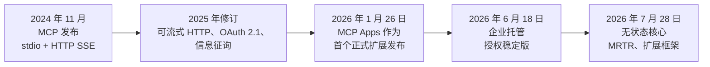
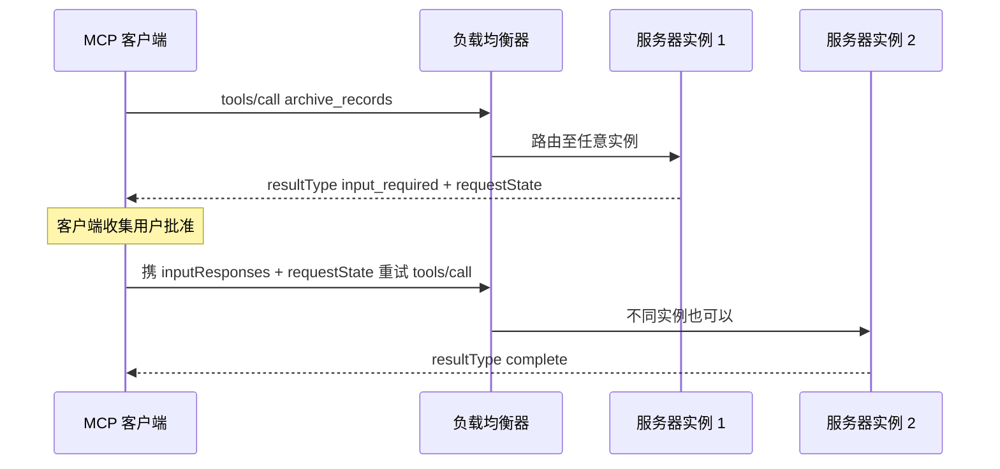
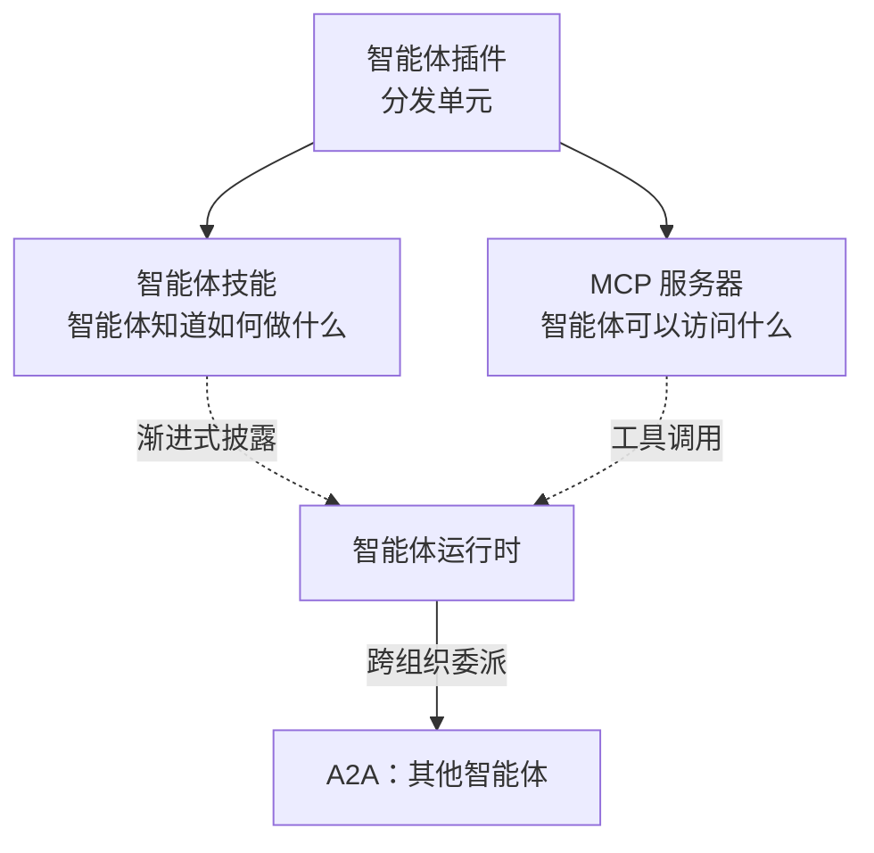
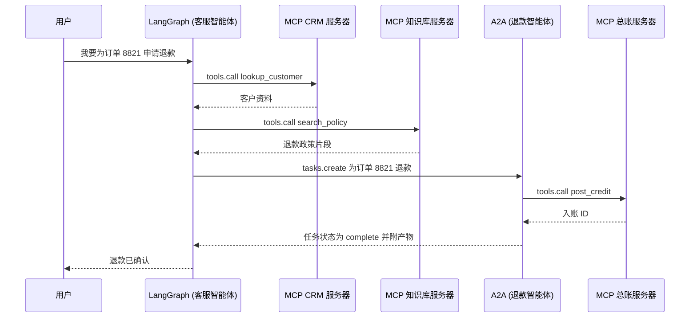
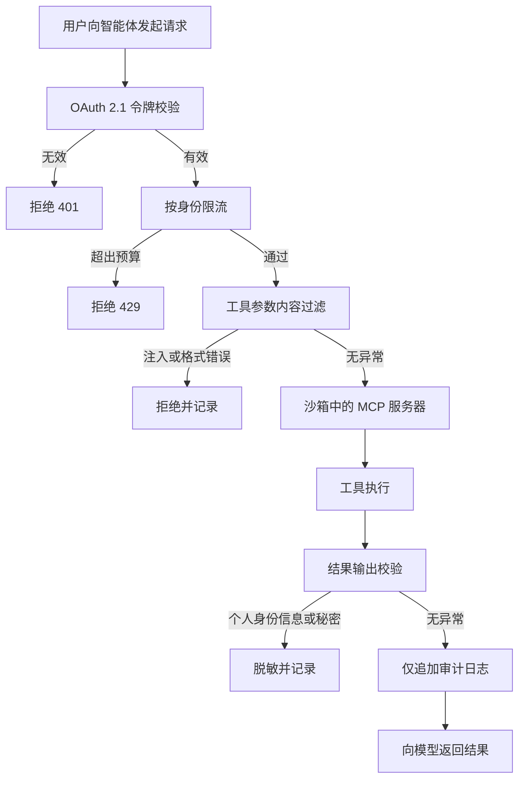

# 工具使用与 MCP

工具是智能体的“手脚”。业界已经标准化采用 **模型上下文协议（Model Context Protocol，MCP）**，它以统一、优先本地的通信层取代了碎片化的自定义工具定义。可流式 HTTP、OAuth 2.1 认证和原生计算机使用工具是在 2025 年各次规范修订中落地的（生态中常笼统称为 MCP 2.0）；**2026-07-28 修订**又将协议核心重构为无状态，这是 MCP 发布以来最大一次改造（见下文[无状态化改造](#mcp-2026-07-28-无状态化改造)）。与此同时，**Agent-to-Agent（A2A，智能体到智能体）** 以及其他互操作协议也已出现，用于在 MCP 的工具访问层之上补充智能体协同能力。

## 目录

- [工具使用机制](#工具使用机制)
- [模型上下文协议（MCP）](#模型上下文协议-mcp)
- [MCP 2.0：可流式 HTTP 与认证](#mcp-2-0-可流式-http-与认证)
- [MCP 2026-07-28：无状态化改造](#mcp-2026-07-28-无状态化改造)
- [MCP 扩展与生态系统（2026 年 8 月）](#mcp-扩展与生态系统-2026-年-8-月)
- [Agent Plugins（智能体插件）](#agent-plugins-智能体插件)
- [Agent-to-Agent 协议（A2A）](#agent-to-agent-协议-a2a)
- [协议格局：MCP + A2A + ACP](#协议格局-mcp-a2a-acp)
- [计算机使用工具（Anthropic）](#计算机使用工具-anthropic)
- [定义高精度工具](#定义高精度工具)
- [MCP 与 OpenAI 函数调用](#mcp-与-openai-函数调用)
- [Context7：实时文档 MCP](#context7-实时文档-mcp)
- [流式工具调用](#流式工具调用)
- [面试题](#面试题)
- [参考资料](#参考资料)

---

## 工具使用机制

工具使用发生在一个 3 步循环中：
1. **Schema 呈现**：向模型提供工具的 JSON schema。
2. **意图与抽取**：模型输出一个“调用”（例如 `{"tool": "get_weather", "args": {"city": "Tokyo"}}`）。
3. **执行与上下文化**：系统运行该函数，并将结果回传到提示词中。

**细微差别**：生产级栈不再把工具定义“硬编码”进系统提示词；它们使用 **动态清单（Dynamic Manifests）**，仅根据用户意图拉取必要的工具。

---

## 模型上下文协议（MCP）

由 Anthropic 开发（于 2024 月发布），如今已成为 Anthropic、OpenAI、Google、Microsoft 和 AWS 之间通用的工具集成标准。MCP 允许模型与数据和工具交互，而不受它们部署位置的限制。治理权已于 2025 月移交给 Linux Foundation 的 Agentic AI Foundation。

- **MCP 客户端**：AI 应用（例如你的智能体代码）。
- **MCP 服务器**：一个独立进程，暴露工具（Functions，函数）、资源（Resources，数据）和提示词（Prompts，模板）。
- **通信**：通过 stdio 或 HTTP 上的 JSON-RPC。

### 为什么选择 MCP？
- **安全性**：工具运行在自己的进程中，而不是模型逻辑内部。
- **可移植性**：一次编写 “Postgres 工具”，即可在 Claude、GPT 或 Llama 中使用。
- **可发现性**：标准化的 `list_tools` 和 `get_resource` 命令。

---

## 定义高精度工具

生产质量的工具必须包含：

1. **严格类型校验**：使用 Pydantic 或 Zod，在模型看到调用之前就强制执行 schema。
2. **详细文档字符串**：说明 *何时不要* 使用该工具。
3. **置信度阈值**：要求模型为工具调用输出一个 `confidence` 分数。

```python
# MCP Server Example (Conceptual)
@server.tool()
class ExecuteSQL(PydanticModel):
    """Executes a Read-Only SQL query. DO NOT use for DROP/DELETE."""
    query: str = Field(..., description="The SELECT query to run.")

    async def run(self):
        # Implementation here...
        pass
```

---

## MCP 与 OpenAI 函数调用

| 特性 | OpenAI 原生 | MCP |
|---------|---------------|-----|
| **耦合** | 高（OpenAI 特定） | 低（无关框架） |
| **传输** | API 请求体中的 JSON | JSON-RPC（本地/远程） |
| **数据访问**| 无原生数据“资源” | 原生 `Resources` 支持 |
| **最适合** | 原型开发 | 企业编排 |

---

## 流式工具调用

前沿模型支持 **部分工具推测（Partial Tool Speculation）**。系统不会等完整 JSON 生成完再行动，而是在工具名称和关键 ID 出现在流中时，就开始“预取”工具结果。这样可将感知延迟降低 **400-800ms**。

---

## MCP 2.0：可流式 HTTP 与认证

MCP 2.0 规范（于 2026 年 3 月获批）引入了两项重大变化：

### 1. 可流式 HTTP 传输
之前的 MCP 使用 `stdio` 或带 SSE 的基础 HTTP。MCP 2.0 增加了 **可流式 HTTP** - 一个单一的长连接 HTTP 连接，支持双向流式传输：

```
[MCP Client] ←── Streamable HTTP POST /mcp ──→ [MCP Server]
                  (with SSE response stream)
```

- 支持部署为云微服务的 MCP 服务器（不只是本地进程）
- 允许通过一条连接同时进行多个工具调用
- 与 stdio 传输向后兼容

### 2. OAuth 2.1 授权
远程 MCP 服务器现在可以要求合适的认证：

```json
{
  "type": "oauth2",
  "grant_type": "client_credentials",
  "scopes": ["tools:read", "resources:documents"]
}
```

这使得企业级 MCP 服务器能够针对每个租户实施细粒度访问控制。

---

## MCP 2026-07-28：无状态化改造

2026年7月28日，MCP 在十周发布候选冻结后定稿规范修订 **2026-07-28**。核心现已**无状态**：移除 `initialize` 握手和 `Mcp-Session-Id`，每个请求在 `_meta` 中携带协议版本与客户端能力，服务器在结果 `_meta` 中标识自己；跨调用状态改为服务器签发、作为普通工具参数传递的显式句柄。因此远程 MCP 可置于普通轮询负载均衡器后水平扩展，无需粘性会话或共享会话存储。

### MCP 的演进历程


```mermaid
flowchart LR
    A[2024 年 11 月<br>MCP 发布<br>stdio + HTTP SSE] --> B[2025 年修订<br>可流式 HTTP、OAuth 2.1、<br>信息征询]
    B --> C[2026 年 1 月 26 日<br>MCP Apps 作为<br>首个正式扩展发布]
    C --> D[2026 年 6 月 18 日<br>企业托管<br>授权稳定版]
    D --> E[2026 年 7 月 28 日<br>无状态核心<br>MRTR、扩展框架]
```

### MCP 的三代对比

| 维度 | 初始发布（2024 年11月） | 可流式 HTTP 时代（2025 修订） | 2026-07-28 修订 |
|---|---|---|---|
| 会话 | 有状态 `initialize` | 有状态 `Mcp-Session-Id` | 无状态；每个请求在 `_meta` 携带版本和能力 |
| 传输 | stdio、HTTP+SSE | 新增可流式 HTTP | 可流式 HTTP 强制 `Mcp-Method` / `Mcp-Name` 路由头；HTTP+SSE 正式弃用 |
| 服务端发起请求 | Sampling、Roots | 新增 elicitation | 移除，改为多轮往返请求（MRTR） |
| 中途用户输入 | 无 | `elicitation/create` 推送 | `input_required` 结果，客户端携状态重试 |
| 长时间运行工作 | 无 | 实验性 | Tasks 正式扩展（基于轮询的句柄） |
| 服务器渲染 UI | 无 | MCP Apps 作为扩展发布（2026年1月） | MCP Apps 纳入正式扩展框架 |
| 认证 | 无标准 | OAuth 2.1 + PKCE、动态客户端注册 | OAuth 加固：RFC 9207 `iss` 校验、issuer-bound credentials、CIMD 替代 DCR；EMA 面向企业 IdP |
| 列表缓存 | 无 | 无 | 列表和读取结果必须给出 `ttlMs` + `cacheScope`；确定性工具排序用于 prompt-cache 命中 |
| 流恢复 | 无 | SSE `Last-Event-ID` 可恢复 | 已移除；客户端重新发起请求，持久工作使用 Tasks |
| 水平扩展 | 单进程 | 负载均衡器后的粘性会话 | 任意实例服务任意请求；无需共享状态 |

### 多轮往返请求（MRTR）

`elicitation/create`、`sampling/createMessage` 和 `roots/list` 已移除。服务端需要中途输入时，返回 `resultType: "input_required"`、`inputRequests` 与不透明 `requestState`；客户端收集输入，并以 `inputResponses` 和原状态重试。状态随重试携带，因此任意负载均衡后实例都能恢复调用，且人工审批门仍可水平扩展。结果必须包含 `resultType`（`complete` 或 `input_required`；Tasks 等扩展可增加值），旧服务器缺失该字段时按 `complete` 处理。


```mermaid
sequenceDiagram
    participant C as MCP 客户端
    participant LB as 负载均衡器
    participant S1 as 服务器实例 1
    participant S2 as 服务器实例 2

    C->>LB: tools/call archive_records
    LB->>S1: 路由至任意实例
    S1-->>C: resultType input_required + requestState
    Note over C: 客户端收集用户批准
    C->>LB: 携 inputResponses + requestState 重试 tools/call
    LB->>S2: 不同实例也可以
    S2-->>C: resultType complete
```

### 已弃用或移除的功能

该修订还采用了正式的功能生命周期（Active、Deprecated、Removed），最短弃用窗口为十二个月，并提供公开的已弃用功能登记表。对于本次修订中新弃用的功能（Roots、Sampling、Logging、DCR），最早移除日期为2027年7月28日；HTTP+SSE 自2025年3月起已弃用，适用更早的时钟。

| 功能 | 在 2026-07-28 的状态 | 迁移目标 |
|---------|----------------------|------------|
| `initialize` 握手、`Mcp-Session-Id` | 已移除 | 每个请求在 `_meta` 中携带版本和能力；使用 `server/discover` RPC 探测 |
| `elicitation/create`、`sampling/createMessage`、`roots/list` | 已移除 | 多轮往返请求 |
| SSE 流恢复（`Last-Event-ID`） | 已移除 | 重新发起请求；将持久工作交给 Tasks 扩展 |
| Roots | 已弃用 | 通过工具参数、资源 URI 或服务器配置传递目录 |
| Sampling | 已弃用 | 直接调用 LLM 提供商 API |
| Logging | 已弃用 | stderr（stdio）或 OpenTelemetry |
| HTTP+SSE 传输 | 正式弃用 | 可流式 HTTP |
| 动态客户端注册（RFC 7591） | 已弃用 | Client ID Metadata Documents（client ID 是托管客户端元数据的 URL） |

`elicitation/create`、`sampling/createMessage` 与 `roots/list` 这些 RPC 机制已从核心协议移除，而它们服务的功能本身仍处于带迁移路径的弃用期，因此上表同时包含两类条目。

还有两项虽小但影响设计的传输变更：可流式 HTTP POST 现在强制使用 `Mcp-Method` 和 `Mcp-Name` HTTP 头，使负载均衡器、网关和 WAF 无需解析 JSON-RPC 就能路由与过滤 MCP 流量；列表结果（`tools/list`、`prompts/list`、`resources/list`）必须声明 `ttlMs` 与 `cacheScope`，让客户端能有依据地缓存工具目录。

### 扩展框架

核心现在刻意保持精简；其余功能都是**扩展**，以反向 DNS ID 标识、独立于核心规范进行版本化，并通过 SEP 流程中的 Extensions Track 治理。正式扩展包括：

| 扩展 | 状态 | 功能 |
|-----------|--------|--------------|
| **Tasks**（`io.modelcontextprotocol/tasks`） | 正式；由 AWS 贡献、改为基于轮询的生命周期 | 工具调用可以返回任务句柄；客户端轮询 `tasks/get`，通过 `tasks/update` 推送中途输入，并以 `tasks/cancel` 取消。这是处理超出单次请求生命周期工作的标准方式。 |
| **MCP Apps** | 自2026年1月26日起正式 | 工具声明 `ui://` 模板；宿主在 sandboxed iframe 中渲染（无 DOM 访问、默认拒绝 CSP），UI 到宿主的通信通过 postMessage 承载 JSON-RPC，UI 触发的动作仍经过同一工具调用同意路径。Claude、ChatGPT、VS Code、Goose 和 Microsoft 365 Copilot 等均可渲染。 |
| **企业托管授权（EMA）** | 自2026年6月18日起稳定 | 组织通过 IdP 集中配置 MCP 服务器访问：OIDC 或 SAML 断言经 RFC 8693 交换为 ID-JAG，再由 RFC 7523 JWT bearer grant 换取 MCP access token，无需逐用户同意屏幕。Okta 是首个支持的 IdP；Claude 和 VS Code 在发布时即支持。 |

### 迁移清单

- 移除 `initialize` / session-ID 逻辑；在 `_meta` 中发送版本和能力，并实现 `server/discover` RPC（现为 MUST）。
- 将 elicitation 和 sampling 流程改为 MRTR：返回携带 `requestState` 的 `input_required`，并接受携带 `inputResponses` 的重试。
- 将任何跨调用状态移入作为工具参数传递的显式句柄，或采用 Tasks 扩展。
- 发出 `Mcp-Method` / `Mcp-Name` 头，在列表结果上声明 `ttlMs` / `cacheScope`，并以确定顺序返回工具。
- 规划从 DCR 到 Client ID Metadata Documents 的认证迁移；按 RFC 9207 校验 `iss`，且绝不跨 issuer 重用客户端凭据。
- 为真实工作预留成本：维护者本身警告自定义实现会显著增加工作量。

> *已于2026年8月15日验证。来源：modelcontextprotocol.io/specification/2026-07-28/changelog、blog.modelcontextprotocol.io*

---

## MCP 扩展与生态系统（2026 年 8 月）

本章截至5月跟踪的路线图条目大多已经交付。截至2026年8月，状态如下：

| 路线图条目（2026年5月表述） | 状态（2026年8月） |
|---------------------------------|--------------------|
| 传输可扩展性 / 无状态核心 | 已在2026-07-28修订中**交付**（见[无状态化改造](#mcp-2026-07-28-无状态化改造)） |
| MCP Apps（服务器渲染 UI） | 2026年1月26日作为首个正式扩展**交付**；Claude、ChatGPT、VS Code、Goose 和 Microsoft 365 Copilot 等可渲染，早期应用合作伙伴包括 Figma、monday.com 和 Adobe Express |
| Tasks 扩展（长时间运行工作） | **已交付。** 2026-07-28 修订将 Tasks 从实验性核心移入 `io.modelcontextprotocol/tasks` 扩展，并改为基于轮询的任务句柄。参考仓库仍标记为 experimental，因此应把接口视为正在稳定，而非已经稳定。自2026年2月起活跃、章程仍待确定的 Agents Working Group 负责孵化它 |
| 企业认证 | 2026年6月18日以企业托管授权扩展形式**交付**（Okta 为首个 IdP；Claude 和 VS Code 发布时支持） |
| MCP Server Cards（`.well-known` 发现） | 仍为草案，作为实验性扩展（SEP-2127）开发；不同于新的核心 `server/discover` RPC，后者是协议内能力查询 |
| MCP Registry | 仍处于预览（`registry.modelcontextprotocol.io`）；GA 时间尚未公布。v1.8.1 修复了 GitHub Pages 组织命名空间接管问题 |

**现在值得区分的两层发现机制：** 连接前的 HTTP 发现使用 `.well-known` server cards（实验性，服务于 registry 和 crawler），协议内发现使用 `server/discover` RPC（自2026-07-28起为强制核心，用于版本协商）。

**生态规模（2026年8月）：** SDK 每月下载量达到数亿。协议自身7月28日发布文章称 Tier 1 SDK 月下载接近5亿；Anthropic 另称月下载量为4亿、年内增至4倍，因此应将汇总值视为数量级，而非精确数字，引用前需检查指标定义。仅一个 connector 目录就列出了**超过 950 个 MCP server**。7月28日正式发布时，AWS、Cloudflare、Google Cloud、Microsoft 和 Netlify 宣布首发支持。

**但向无状态修订版的迁移仍处于早期。** 截至8月14日的30天内，v1 TypeScript SDK（`@modelcontextprotocol/sdk`）获得约2亿次 npm 下载。v2 不再集中于单个包，而是拆分为多个包：`@modelcontextprotocol/server` 约530万、`@modelcontextprotocol/core` 约390万、`@modelcontextprotocol/client` 约290万。因此在逐包比较中，GA 数周后的 v2 仅占 v1 流量的低个位数百分比。应为长期双版本期做准备：C# SDK v2.2.0（8月13日）新增 `HttpServerSessionMode`，让一个端点同时服务 2025-11-25 有状态客户端与 2026-07-28 无状态客户端；如果你运营包含混合客户端的服务器群，应复制这一模式。SDK 成熟度也在快速提高：Rust SDK 升至 3.1.x 并加入无状态校验，Ruby SDK 达到 1.0 并晋升 Tier 2，conformance suite（0.2.0-alpha.11）开始为该修订发布冻结的需求集。Microsoft 推出可由 Microsoft 365 管理中心管理的 MCP 联邦 Copilot Connectors，Apple 让 Xcode 成为外部编码智能体的 MCP host，Bloomberg 也发布了把 MCP 作为内部智能体—工具层的生产案例。

**治理：** MCP 由 Linux Foundation 的 Agentic AI Foundation 治理。治理工作组运行 Contributor Ladder 和委派模型，让特定领域工作组无需完整核心维护者审查即可接纳 SEP；2026-07-28修订增加了正式 Extensions Track。

> *已于2026年8月15日验证。来源：modelcontextprotocol.io、blog.modelcontextprotocol.io*

---

## Agent Plugins（智能体插件）

MCP 标准化了智能体如何访问工具。**Agent Plugins** 于2026年8月6日达到 1.0.0，标准化了如何向智能体*交付*一组打包能力。它是一种厂商中立的打包格式，由技术指导委员会治理；首批维护方包括 Amazon、Cursor、Microsoft、OpenAI 和 Vercel，Google 在发布当天加入。GitHub 于8月12日使其在 VS Code、Copilot CLI、Copilot SDK 与 Copilot app 中全面可用。

插件是一个目录：

```
my-plugin/
├── plugin.json          # required manifest
├── skills/              # optional: Agent Skills (SKILL.md files)
│   └── code-review/
│       └── SKILL.md
├── mcp.json             # optional: MCP server declarations
└── com.example.client/  # optional: client-specific extras, namespaced
```

`mcp.json` schema 支持三种 server 形态：带 command、args 和 env 的 stdio、Streamable HTTP，以及 SSE；还保留两个由客户端加载时注入的环境变量 `PLUGIN_ROOT` 与 `PLUGIN_DATA`。

值得研究的设计决策是规范**拒绝**标准化什么。只有两种组件类型可移植：Skill 和 MCP server。command、hook、subagent、rule 与 LSP server 均保持客户端专属，除非放在命名空间目录中。这使可移植表面足够小，插件才能真正随处运行；同时把快速变化的客户端专属部分推入命名空间，避免破坏互操作性。

### 三层如何协作


```mermaid
flowchart TD
    P[智能体插件<br>分发单元] --> S[智能体技能<br>智能体知道如何做什么]
    P --> M[MCP 服务器<br>智能体可以访问什么]
    S -.渐进式披露.-> A[智能体运行时]
    M -.工具调用.-> A
    A -->|跨组织委派| A2[A2A：其他智能体]
```

| 层 | 标准化内容 | 单元 | 治理方 |
|-------|--------------|------|------------|
| **Agent Skills**（`SKILL.md`） | 智能体应用的流程与领域知识 | 带 frontmatter 及可选脚本与资产的目录 | agentskills.io |
| **MCP** | 对工具、数据和资源的访问 | 通过 stdio 或 Streamable HTTP 使用 JSON-RPC 的服务器 | Linux Foundation、Agentic AI Foundation |
| **Agent Plugins** | 对上述两者的分发与安装 | 带 `plugin.json` 的目录 | Agent Plugins TSC |
| **A2A** | 跨厂商或组织的智能体委派 | 带签名 Agent Card 的智能体端点 | Linux Foundation |

对平台团队而言，实际结果是企业管理如今拥有一个控制点。GitHub 复用现有 `managed-settings.json`，因此插件安装、marketplace 访问和 MCP server 白名单都通过同一文件管理。如果要建立内部智能体平台，应审查、签名和分发的单元是插件，而非单个 server。

**随之而来的安全警示：** 插件将指令（Skill）与能力（MCP server）捆绑，因此安装插件更像安装 package，而非添加书签。Skill 静态分析存在难以突破的检出上限：公开结果显示，数据外传检出率为 93%，自然语言提示词注入仅 42%，宿主破坏则为 **0%**，因为破坏性 Skill 使用的普通 shell 命令与合法命令外观完全相同。应像审查依赖一样审查插件：固定版本、优先使用签名来源，而且绝不能允许插件扩大加载它的智能体的动作面。

---

## Agent-to-Agent 协议（A2A）

Google 于 2025 月推出了 **Agent2Agent（A2A）** 协议，用于解决 MCP 不涉及的一个问题：**来自不同厂商的智能体** 如何相互通信（而不仅仅是与工具通信）？

### A2A 解决了什么

MCP 定义的是智能体如何连接到 **工具和数据**。A2A 定义的是一个 **编排智能体如何将任务委派给来自不同厂商或框架的专门智能体**，即便它们不共享内存、工具或上下文。

### 技术基础

- 基于 **HTTP、SSE 和 JSON-RPC** 构建（与 MCP 采用相同基础，便于集成）
- 支持企业级认证，并与 OpenAPI 的认证方案保持一致
- **Agent Cards**：描述智能体能力、技能和端点的 JSON 元数据文档 - 类似于 MCP Server Cards，但对象是智能体

### A2A 任务生命周期

```
[Client Agent] ── POST /tasks ──→ [Remote Agent]
                                     │
                  ← SSE stream ──────┘  (status updates, artifacts)
                                     │
                  ← Task Complete ───┘  (final result)
```

A2A 任务支持带流式状态更新的长时间运行操作，因此适合持续数分钟或数小时的企业工作流。

### 行业采用

- 获得包括 Atlassian、Salesforce、SAP、LangChain 和 PayPal 在内的 50+ 家技术合作伙伴支持
- 于 2025 年 6 月捐赠给 **Linux Foundation**，作为一个开放治理项目
- **版本 0.3** 新增了 gRPC 支持、签名安全卡以及扩展的 Python SDK 支持。截至2026年8月，最新的 A2A **规范**版本是 **v1.0.1**（2026年5月28日）；生态中流传的更高版本号指的是语言 SDK，例如 `a2a-java` v1.2.0，而不是协议版本
- NIST 于 2026 年 2 月启动了 “AI Agent Standards Initiative”，部分原因是对 A2A/MCP 发展势头的回应

> *已于 2026 年 5 月验证。来源：developers.googleblog.com、a2a-protocol.org*

---

## 协议格局：MCP + A2A + ACP

在生产级企业系统中，多个协议会同时在不同层上运行：

| 协议 | 层 | 目的 | 治理方 |
|----------|-------|---------|-------------|
| **MCP** | 智能体到工具 | 通用工具与数据访问 | Linux Foundation（Agentic AI Foundation） |
| **A2A** | 智能体到智能体 | 跨厂商智能体委派 | Linux Foundation |
| **ACP** | 智能体通信 | 轻量级异步智能体消息传递（REST） | IBM / Linux Foundation |

### 它们如何相互补充

```
┌──────────────────────────────────────────┐
│            Enterprise System             │
│                                          │
│  ┌─────────┐  A2A   ┌─────────┐         │
│  │ Agent A  │◄──────►│ Agent B │         │
│  │(Vendor X)│        │(Vendor Y)│        │
│  └────┬─────┘        └────┬─────┘        │
│       │ MCP                │ MCP          │
│  ┌────▼─────┐        ┌────▼─────┐        │
│  │ DB Tool  │        │ API Tool │        │
│  │ Server   │        │ Server   │        │
│  └──────────┘        └──────────┘        │
└──────────────────────────────────────────┘
```

**关键洞见**：MCP 和 A2A 是互补关系，而不是竞争关系。MCP 处理智能体到工具的连接；A2A 处理智能体之间的协同。生产系统会同时使用二者。

**ACP 说明**：IBM 起源的 Agent Communication Protocol（ACP）团队于 2025 年 9 月与 Google A2A 团队合并，共同推进统一的智能体通信标准。新项目应将 A2A 作为主要的智能体到智能体协议。

---

## A2A v1.0 正式版与 2026 年 5 月的 MCP 生产故事

A2A v1.0 于 Google Cloud Next 2026（4 月）达到正式可用，获得了来自 150+ 家组织的公开承诺，包括 AWS、Microsoft、Salesforce、SAP、ServiceNow、Workday 和 IBM。该项目已移交给 Linux Foundation 的 Agentic AI Foundation 管理，而该基金会如今在合并后的 ACP 工作之外，也负责治理 A2A。一次点版本发布（v1.2）增加了密码学签名的 Agent Cards：这些卡片是绑定到智能体运营者公钥的 JWS 签名文档，因此客户端智能体在发起任务前，可以验证位于 `https://refunds.acme.com/.well-known/agent.json` 的远程智能体确实隶属于 ACME。原生 A2A 客户端/服务器支持已在 Google ADK 1.0、LangGraph、CrewAI、LlamaIndex、Semantic Kernel 和 AutoGen 中发布。

### 组合模式：支持智能体委派退款

一个 LangGraph 客服智能体拥有对话状态以及一组 MCP 工具（CRM、工单搜索、知识库）。当用户申请退款时，这项工作属于另一团队的财务退款智能体，该智能体位于一个 A2A 端点之后，并执行自己的政策、审计日志和 SOX 控制。客服智能体不会直接调用退款数据库；它会发起一个 A2A 任务，然后让财务智能体自行决定。


```mermaid
sequenceDiagram
    participant User as 用户
    participant Support as LangGraph (客服智能体)
    participant CRM as MCP CRM 服务器
    participant KB as MCP 知识库服务器
    participant Refund as A2A (退款智能体)
    participant Ledger as MCP 总账服务器

    User->>Support: 我要为订单 8821 申请退款
    Support->>CRM: tools.call lookup_customer
    CRM-->>Support: 客户资料
    Support->>KB: tools.call search_policy
    KB-->>Support: 退款政策片段
    Support->>Refund: tasks.create 为订单 8821 退款
    Refund->>Ledger: tools.call post_credit
    Ledger-->>Refund: 入账 ID
    Refund-->>Support: 任务状态为 complete 并附产物
    Support-->>User: 退款已确认
```

支持智能体从不看到总账。退款智能体通过自己的 MCP 服务器拥有总账访问权限，并执行不同的策略。A2A 任务是异步的：支持智能体可以先向用户返回一条等待消息，待退款处理完成后再重新接入，并接收产物。

### MCP 2026 路线图要点：均已交付

本节在2026年中期跟踪的两个路线图条目——传输可扩展性与企业托管认证——都已落地。传输可扩展性并非以会话恢复实现，而是采用了相反设计：2026-07-28 修订将 session 从协议核心完全移除（见[无状态化改造](#mcp-2026-07-28-无状态化改造)）。企业托管认证于2026年6月以 Enterprise-Managed Authorization 扩展交付。RFC 8707 姿态仍然成立，并得到进一步加固：MCP server 是 OAuth Resource Server，token 的 audience 绑定到特定 server URI，不能跨服务器重放。

### MCP 生产加固（May 2026 之后）

May 2026 暴露出 MCP STDIO 传输中的一类漏洞：STDIO MCP 服务器原本隐式假设进程边界就是信任边界，但来自上游模型的精心构造的工具参数可能诱使编写不严谨的 STDIO 服务器在宿主用户权限下调用宿主命令。架构修复分两步：

1. **尽可能将 STDIO MCP 服务器迁移到带 TLS 的 HTTP 传输。** HTTP 传输强制引入明确的信任边界（网络），并启用 OAuth 2.1 Resource Server 强制校验，而 STDIO 无法提供这一点。  
2. **对于无法迁移的 STDIO 服务器，**将每个服务器运行在独立容器中，不挂载宿主文件系统，不对外发网络，设置严格的 CPU 和内存预算，并使用只读镜像。把容器视为信任边界；被攻破时的影响范围就是该容器。

### 状态 Handle 劫持：无状态核心的新攻击面

2026-07-28 无状态化改造移除了协议级 session，因此需要跨请求状态的服务器现在会签发一个显式 handle（例如 cart ID、workflow ID），并将其作为普通工具参数返回。修订后的安全最佳实践文档将由此产生的攻击命名为**状态 handle 劫持**：未获授权的一方获取或猜中 handle，并用它读取或修改另一用户的状态。

由此可直接推导出以下要求。它们值得牢记，因为该失败模式不会显式报错：

- 实施授权的服务器**必须验证每个入站请求**，而且**不得把持有状态 handle 视为身份认证**。handle 是名称，不是凭证。
- handle **应当是非确定性的**，由安全随机数生成器生成。
- handle **应在服务器端绑定到已认证用户**，例如以 `<user_id>:<handle>` 为键保存状态，其中 user ID 从已验证 token 推导，而不是来自客户端发送的任何内容。

这比表面上更重要：在有状态时代，session 本身携带身份，因此草率实现的服务器也会意外获得一些隔离。无状态之后，没有任何隔离是免费得到的。每个请求都必须重新确认请求者身份，handle 才有意义。

**当前行业现状有多糟？** 首次针对面向互联网 MCP server 的大规模动态审计（arXiv 2608.00150，2026年7月31日）发现了超过21,000个公开可达实例，确认其中640个属于生产环境，并动态测试了414个。结果显示，**91.8% 完全没有 OAuth 身份认证**，另有687个工具实例暴露了不受控的 shell 执行。任何可从公网访问的 MCP server，都应先接受授权审查，再考虑功能开发。

**面向生产 MCP 的纵深防御检查清单：**

- 所有远程 MCP 服务器都运行在带有 OAuth 2.1、PKCE 和受众绑定令牌（RFC 8707）的后面。
- STDIO 服务器运行在容器内，`network: none`、根文件系统只读、无宿主卷挂载，并限制 `nproc` 和 `memory`。
- 每次工具调用都会记录用户身份、绑定的令牌受众、工具名称、参数哈希和结果哈希。日志发送到仅追加存储。
- 在每个 MCP 服务器前放置速率限制器，并按用户身份划分范围。对可写工具，突发预算要很紧。
- 工具参数在到达服务器之前先经过内容过滤：对字符串字段进行基于模式的提示注入检测，对结构化字段进行模式校验，对不需要 shell 元字符的工具直接硬拒绝。
- 工具结果在回传给模型之前先经过输出验证器：PII 检测、密钥检测、大小上限、针对已知外泄标记的内容过滤。
- 高危工具（文件写入、shell 执行、外发 HTTP）需要人工批准步骤或签名能力令牌，而不是依赖模型安全地调用它们。

包含所有防御层的请求流：


```mermaid
flowchart TD
    A[用户向智能体发起请求] --> B[OAuth 2.1 令牌校验]
    B -->|无效| X[拒绝 401]
    B -->|有效| C[按身份限流]
    C -->|超出预算| Y[拒绝 429]
    C -->|通过| D[工具参数内容过滤]
    D -->|注入或格式错误| Z[拒绝并记录]
    D -->|无异常| E[沙箱中的 MCP 服务器]
    E --> F[工具执行]
    F --> G[结果输出校验]
    G -->|个人身份信息或秘密| W[脱敏并记录]
    G -->|无异常| H[仅追加审计日志]
    H --> I[向模型返回结果]
```

该流水线是刻意保守的。每一层都可以拒绝；只有穿过全部五道关口的结果才会到达模型。

**本节来源：**
- [Google Cloud A2A v1.0 GA at Cloud Next 2026](https://cloud.google.com/blog/products/ai-machine-learning/agent2agent-protocol-is-getting-an-upgrade)
- [MCP 2026 路线图（The New Stack）](https://thenewstack.io/model-context-protocol-roadmap-2026/)
- [RFC 8707：OAuth 2.0 的资源标识符](https://www.rfc-editor.org/rfc/rfc8707)
- [Adversa AI：May 2026 的顶级 MCP 安全资源](https://adversa.ai/blog/top-mcp-security-resources-may-2026/)
- [Anthropic 宪法分类器](https://www.anthropic.com/research/constitutional-classifiers)

---

## 计算机使用工具（Anthropic）

Claude 3.5+ 引入了原生 **计算机使用** 工具 - 模型可以直接控制桌面或网页浏览器。这些能力可通过 Anthropic API 使用：

| 工具 | 能力 | 说明 |
|------|------|------|
| `bash` | 运行 shell 命令 | 跨轮次保持会话 |
| `text_editor` | 读取/写入/编辑文件 | 支持 `view`、`create`、`str_replace` 命令 |
| `computer` | 鼠标、键盘、截图 | 完整桌面 GUI 控制 |

```python
import anthropic

client = anthropic.Anthropic()

response = client.beta.messages.create(
    model="claude-3-7-sonnet-20250219",
    max_tokens=4096,
    tools=[
        {"type": "bash_20250124", "name": "bash"},
        {"type": "text_editor_20250124", "name": "str_replace_based_edit_tool"},
        {"type": "computer_20251022", "name": "computer",
         "display_width_px": 1280, "display_height_px": 800}
    ],
    messages=[{"role": "user", "content": "Open Firefox, go to GitHub, and clone my repo."}],
    betas=["computer-use-2024-10-22", "interleaved-thinking-2025-05-14"]
)
```

**计算机使用的生产安全规则：**
1. 始终在沙箱化 VM 中运行（Docker + VNC，或 E2B 云）
2. 在执行破坏性操作前先用截图验证关键状态
3. 对不可逆操作（文件删除、表单提交）使用 HITL（Human-in-the-Loop，人类在环）
4. 设置 `ANTHROPIC_MAX_COMPUTER_TOKENS` 以限制失控循环

---

## Context7：实时文档 MCP

2026 中最实用的 MCP 服务器之一是 **Context7** - 它解决了代码代理中的“训练数据过时”问题：

```
# Without Context7:
Agent: "I'll use langchain's `create_openai_tools_agent` function..."
(This function was deprecated 6 months ago)

# With Context7 MCP:
Agent → MCP: list_resources("langchain")
MCP → Agent: Returns current v0.3.x docs
Agent: "I'll use the new `create_react_agent` interface..."
```

**在 Claude Desktop / Claude Code 中的设置：**
```json
{
  "mcpServers": {
    "context7": {
      "command": "npx",
      "args": ["-y", "@upstash/context7-mcp"]
    }
  }
}
```

Claude 会在编写使用该库的代码之前自动调用 `resolve-library-id` 和 `get-library-docs`。

---

## 面试题

### 问：MCP 如何解决“工具过多”问题（模式过载）？

**强回答：**
在 2023 中，如果给模型 50 个工具，性能会下降，因为提示词会变得过长。MCP 通过 **动态资源发现** 解决这个问题。代理不会把 50 个工具模式加载到提示词里，而是向 MCP 服务器发送 `list_resources` 调用。然后它只“挂载”与当前 `Resource` 上下文相关的特定工具。这样可以让提示词保持精简，让上下文窗口专注于推理，而不是解析未使用的模式。

### 问：为什么通过 MCP 服务器把“工具逻辑”与“代理应用”分离很重要？

**强回答：**
这是关注点分离。如果工具逻辑（例如 Python 抓取器）放在单独的 MCP 服务器里，我就可以独立扩展抓取基础设施，而不必绑定 LLM 编排器。更重要的是，它提供了一个 **安全沙箱**。如果模型试图通过工具参数进行注入，它只会影响 MCP 服务器进程，而该进程可以容器化，并且对核心代理状态没有网络访问权限。

### 问：在生产多代理系统中，MCP 和 A2A 如何协同工作？

**强回答：**
它们解决的是**不同的通信层**。MCP 是代理到工具协议 - 它让任何代理都能通过 MCP 服务器以标准化方式访问数据库、API 和文件。A2A 是代理到代理协议 - 它让编排器代理（来自厂商 X）无需共享记忆或上下文，就能把任务委派给专门代理（来自厂商 Y）。在生产环境中，我会对每个工具连接使用 MCP，在需要跨厂商代理协同的时候使用 A2A。例如，一个基于 LangGraph 构建的采购编排器会用 MCP 查询库存数据库，然后用 A2A 把合规性检查委派给托管在另一支团队中的专门代理。关键设计原则是：在代理自己的工具栈内用 MCP，在组织边界或厂商边界之间用 A2A。

---

## 参考资料
- Model Context Protocol. “规范修订版 2026-07-28：变更日志”（2026 年 7 月）。https://modelcontextprotocol.io/specification/2026-07-28/changelog
- Model Context Protocol 博客。“企业托管授权”（2026 年 6 月）。https://blog.modelcontextprotocol.io/posts/enterprise-managed-auth/
- Anthropic. “模型上下文协议规范”（2025）
- Google. “Agent2Agent 协议规范 v0.3”（2026）
- Linux Foundation. “Agent2Agent 协议项目”（2025）
- NIST. “AI 智能体标准倡议”（Feb 2026）
- JSON-RPC 2.0 规范。
- Pydantic v3.0 文档。

---

*下一篇：[多智能体编排](04-multi-agent-orchestration.md)*
