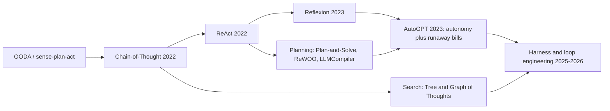
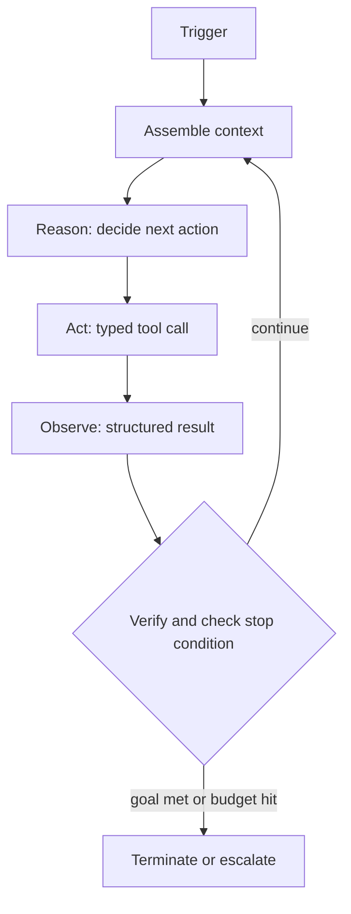
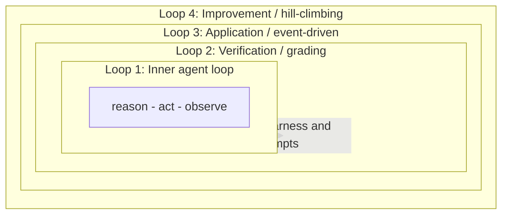
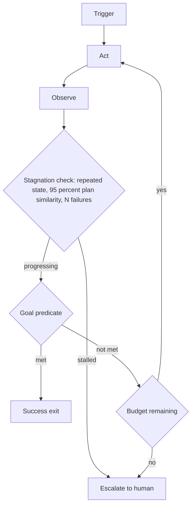

# 循环工程

第 02 章涵盖了模型在单步内如何推理：ReAct、Reflexion、Plan-and-Solve。**循环工程** 是包裹这种推理的学科。它指的是为一个核心智能体（模型加工具）设计、埋点并持续改进其控制循环，而不是逐轮手工提示模型。

定义这一领域的重构说法很直接：你不再是聊天框里和模型对话的人，而是在构建那个系统。这个系统负责提示、行动、观察、验证、记忆，并不断重跑智能体，朝着目标推进，直到满足一个可验证的停止条件。强模型放在弱脚手架里，会输给普通模型放在优秀脚手架里。到了 2026，循环质量已经是一个独立于基础模型质量的学科，杠杆点也从“写一个更好的提示词”转向“设计一个更好的循环”。

本章贯穿始终的两个不变量是：

1. **终止由脚手架依据确定性标准强制执行，绝不是由模型自己声称“已经完成”来决定。**
2. **负责验证工作的实体，在结构上必须与产出工作的实体分离。**

## 目录

- [从提示工程到循环工程](#从提示工程到循环工程)
- [谱系：从 ReAct 到循环工程](#谱系-从-react-到循环工程)
- [内部智能体循环](#内部智能体循环)
- [循环的四个层级](#循环的四个层级)
- [循环模式](#循环模式)
- [终止与预算控制](#终止与预算控制)
- [长循环中的上下文与记忆](#长循环中的上下文与记忆)
- [验证与评分](#验证与评分)
- [反模式](#反模式)
- [重要指标](#重要指标)
- [成熟度阶梯](#成熟度阶梯)
- [面试题](#面试题)
- [参考资料](#参考文献)

---

## 从提示工程到循环工程

每一代实践都会在前一代之上再包一层，而不是把前一代替换掉。你仍然会写提示词，只是不再手工驱动模型。

| 层级 | 工作单元 | 你调优的内容 | 它优化的目标 |
|-------|----------|--------------|---------------|
| **提示工程** | 一次模型调用 | 表述、示例、格式 | 一条好的单次响应 |
| **上下文工程** | 一段组装好的上下文 | 检索、记忆、压缩 | 每次调用模型能看到什么 |
| **脚手架工程** | 一次智能体运行 | 驱动代码：工具、预算、停止逻辑 | 可靠的多步执行 |
| **循环工程** | 一个递归目标 | 叠加的循环：触发、验证、改进 | 一个自治、自我改进的系统 |

一个有用的心智模型是：**模型是策略，脚手架是内核。** 不同团队都在不断收敛到同一种最小设计（LLM 加工具再加循环），这说明循环是任务的属性，而不是一时风潮。

---

## 谱系：从 ReAct 到循环工程

| 时代 | 步骤 | 它新增了什么 |
|-----|------|---------------|
| 1950 年代起 | OODA、感知-计划-行动 | 控制循环的思想：观察、决策、行动、重复 |
| 2022 | 思维链 | 在回答前先推理（当时还没有工具） |
| 2022 | **ReAct** | 将思考、行动、观察与真实工具反馈交织起来 |
| 2023 | **Reflexion** | 一个外部循环：把失败转化为书面的自我批评，并在下一次尝试时重放（跨试次学习，而不只是单次内部学习） |
| 2023 | Plan-and-Solve、ReWOO、LLMCompiler | 先规划再执行；延后观察，或并行运行工具有向无环图以减少 token 和延迟 |
| 2023 | AutoGPT | 证明了大规模完全自治循环的可行性，也暴露了无限循环与失控的 API 账单 |
| 2025-2026 | 循环与脚手架工程 | 把循环本身当作被工程化的对象：触发、验证、预算和基于评测的改进 |

关键的概念跃迁是 Reflexion 的外部循环。ReAct 的内部循环是在单次 episode 内学习；Reflexion 则通过把批评存入情节记忆并在下次重新载入，实现跨 episode 学习。现代所有叠加式循环设计，都是这一动作的后代。

---

## 内部智能体循环

狭义的技术产物是**内部智能体循环**：脚手架在一次智能体运行中执行的周期。它之所以迭代，是因为长程任务不可能在一次前向传播里完成，而且工具结果必须反馈回来，才能生成最终答案。

下面这些组件，才是工程真正落地的地方。大部分工作在确定性的脚手架，而不是模型本身。

| 组件 | 作用 |
|-----------|------|
| **触发** | 启动一个周期：人工、定时、事件/钩子，或自设目标。决定成本和并发画像。 |
| **目标与指令** | 一个具体、可测试、范围明确的目标，并附带约束。这里的歧义是目标漂移的根源。 |
| **上下文组装** | 每次调用前收集指令、工作状态、检索到的记忆和先前输出。这里是对抗上下文腐烂的地方。 |
| **推理** | 模型分解任务并选择下一步动作。为保持连续轮次的连贯性，要逐字保留思考块。 |
| **行动** | 一次有类型的工具调用：代码、Shell、搜索、查询，或调用另一个智能体。需要幂等键，以便重试区别于重复副作用。对会产生副作用的工具做沙箱隔离（见 [智能体安全与沙箱](09-agentic-security-and-sandboxing.md)）。 |
| **观察** | 将结果作为结构化反馈回传，并显式标注 SUCCESS 或 FAILED，而不是原始转储。把大输出卸载到日志，只返回引用。 |
| **验证** | 按标准检查正确性，最好由独立评分器完成。它是能说“不”的那个组件。 |
| **终止逻辑** | 明确的成功、失败和预算停止条件。 |
| **停滞检测器** | 发现无进展：重复调用、振荡、失控支出。 |
| **持久状态** | 把进度持久化到上下文窗口之外，使循环可以恢复并可去重。参见 [持久执行](11-durable-execution.md)，了解崩溃安全、恰好一次恢复。 |
| **升级路径** | 当达到上限时，带着一个精确的阻塞问题转交给人工。参见 [人类介入模式](08-human-in-the-loop-patterns.md)。 |
| **脚手架 / 驱动器** | 把上述一切连接起来并强制执行全部规则的确定性外层代码。 |

---

## 循环的四个层级

循环工程的艺术在于叠循环：围绕内部循环嵌套更复杂的外部循环，并在自然检查点插入人类判断。下面四个层级是该领域逐渐收敛出的模式综合体，而不是某个唯一标准编号。

| 层级 | 循环 | 它做什么 | 触发器 | 由什么实现 | 跳过它会怎样... |
|-------|------|--------------|---------|----------------|----------------|
| **0** | 推理深度（基线） | 单次决策中的 CoT、ReAct 或思维树；它本身不是循环 | 不适用 | 提示词加模型 | 步骤会很浅 |
| **1** | 内部智能体循环 | 把一次运行驱动到停止条件 | 运行开始 | 驱动器/内核 | 无法完成多步工作 |
| **2** | 验证循环 | 对输出评分，把失败路由回去重试 | 内部循环输出 | 独立评分器 | 你会发布未验证的工作 |
| **3** | 应用循环 | 在事件上触发智能体，而不是靠人工提示 | 定时任务、钩子、心跳、目标 | 调度器/网页钩子层 | 系统会一直保持手工操作 |
| **4** | 改进循环 | 把重复失败转化为永久性的脚手架修复 | 跟踪数据和评测 | 评测脚手架 | 系统永远不会变好 |

一个常见变体位于层级 1 和 2 之间：**内外双循环**。内部循环在当前策略内执行；外部循环监视相对于原始目标的进度，当内部循环卡住时，不是重试同一步骤，而是重置整个策略。

当多个循环并行运行（编排器-工作器，或工具 DAG）时，要给每个分支分配独立的上下文和工作区，定义明确的合并与聚合语义来合并结果，并且把整个扇出预算一起计算，避免并发分支合起来冲破上限。实际限制是审阅带宽，而不是分支数量。

---

## 循环模式

让循环架构匹配任务。环境不可预测时，使用探索型、高方差循环；当某个序列已经收敛后，切换到更便宜的计划式执行；出错后再回到探索。

| 模式 | 每个任务的模型调用数 | 延迟 | Token 成本 | 适应性 | 适用场景 |
|---------|----------------------|---------|------------|--------------|----------|
| **ReAct / 重试** | 高（每一步一次） | 高 | 高 | 最高 | 不可预测环境、探索 |
| **Reflexion** | 更高（跨试次重试） | 高 | 高 | 高，能跨尝试学习 | 有清晰反馈、可重试的任务 |
| **规划-执行** | 一次规划加 N 次执行 | 中 | 中 | 运行中较低 | 已收敛、可预测的工作流 |
| **ReWOO** | 一次规划，延后观察 | 低 | 低 | 低 | 工具已知、对 token 敏感的运行 |
| **LLMCompiler** | 规划加并行工具 DAG | 低（并行） | 中 | 低 | 可并行的独立子任务 |
| **评估器-优化器** | 生成加批评循环 | 中 | 中 | 高 | 对质量要求高的草稿 |
| **编排器-工作器** | 规划器加工作器子智能体 | 高（大约是聊天的 15 倍） | 中（并行） | 高 | 广泛且可并行的研究或构建 |

有几种模式几乎在每条生产循环里都值得保留：

- **生成器-验证器（制作者-检查者）分离。** 一个子智能体起草；另一个通常更强的子智能体以对抗方式审查，并被明确要求拒绝任何无法被验证完成的内容。独立评分能捕捉生成器不会承认的错误。
- **注入错误并重试。** 把退出码、类型错误和失败测试反馈回上下文，让模型几乎零成本地自我纠正。
- **新鲜上下文技术。** 每次迭代都用干净上下文重新运行同一个目标提示，每个周期只完成一个工作单元，把进度记录在外部状态文件中，并在预定义的可验证条件下退出。一个停止钩子会拦截退出尝试，并在允许退出前验证完成情况。
- **模型路由以控制成本。** 每一步都发送给足够便宜的模型层级（分类用小模型，起草用中档模型，审阅用前沿模型），并锁定模型，避免循环悄悄升级。与稳定前缀的提示缓存配合使用。
- **组合，不要框架化。** 优先采用能工作的最简单模式。只有在确实需要迭代式、自适应的工具使用时，才引入循环，以及任何多智能体层。

---

## 终止与预算控制

一个自然停止信号（模型返回文本且没有工具调用）是**必要条件，但不充分**。脚手架必须单独验证目标是否完成。每个生产循环都至少应包含下列三类中的一个条件。

| 停止条件 | 典型默认值 | 由谁强制执行 |
|----------------|-----------------|-------------|
| 目标谓词通过（SUCCESS） | 任务特定测试 | 脚手架 |
| 不可恢复错误或重试上限（FAILURE） | 3 到 5 次重试 | 脚手架 |
| 最大迭代次数 | QA 为 10，通用为 15-25，编码为 20-50 | 脚手架 |
| 墙钟时间超时 | 60 到 300 秒 | 脚手架 |
| Token 或金额上限 | 每个任务 | 网关，位于智能体代码之外 |
| 每工具配额 | 每个工具 | 脚手架 |
| 无进展或振荡 | 3 次相同调用，或计划相似度高于 95% | 脚手架 |
| 支出速率 | 持续高于大约每分钟 4k token | 网关 |

把安全循环和昂贵循环分开的两个规则是：

- **在智能体外部强制预算。** 如果支出检查写在智能体代码里，出错或越狱的智能体就可以跳过自己的检查。把它放在网关或代理层，这样智能体就绕不过去。
- **盯住支出速率，而不只是累计支出。** 月度上限太粗；一个循环可能在二十分钟内烧掉几百美元。健康的智能体通常不会持续高 token 吞吐，因为它会等待 I/O，所以持续激增是可靠的失控信号。

所报告的失败案例并非假设：有个智能体在五分钟内对一个坏掉的工具调用了 400 次，有个 847 步的运行始终没有产出答案，还有一些重试循环在数天内累积了数万美元成本（这些数字来自从业者的经验分享）。它们几乎都缺少外部预算守卫和停滞打破器。

---

## 长循环中的上下文与记忆

长循环会通过**上下文腐化**悄然失效：随着窗口里塞满过时指令、旧工具输出和失败尝试，输出质量会下降。它在达到硬性上下文上限之前就会发生，因此更具隐蔽性。长上下文研究发现，即使答案就在输入里，前沿模型也会随着输入长度增加而退化。更多原始上下文并不等于更高可靠性；精心筛选胜过机械堆砌。

| 策略 | 作用 |
|----------|--------------|
| **将状态外化到磁盘** | 把进度、计划和发现保存在文件、工单或数据库中，这样即使模型在两次运行之间忘掉一切，循环也能继续存活 |
| **每次迭代使用新鲜上下文** | 每个周期都重置窗口，或把子任务委派给具有隔离上下文的子代理，这样失败尝试就不会腐蚀主循环 |
| **在退化前压缩** | 用摘要替换冗长历史，但保留原始内容可寻址，以便审计和恢复 |
| **卸载工具输出** | 将大输出持久化到日志中，只返回一行引用（一次搜索就可能有数千个词元） |
| **渐进式披露** | 只有在相关时才取回上下文和技能，而不是一开始就把所有内容都塞进去 |
| **前缀稳定排序** | 追加新消息而不是重写旧消息，这样缓存前缀就能持续命中 |

子代理隔离是长时间构建中对抗上下文腐化最稳健的结构性防线，因为每个子代理都在干净窗口中工作，并且只返回紧凑结果。关于底层记忆层级（工作记忆、情景记忆、语义记忆、程序记忆），见[代理记忆与状态](05-agent-memory-and-state.md)。

---

## 验证与评分

循环的可信度取决于给它评分的对象。模型会乐观地给自己打分；当同一个模型既生成又评估时，还会出现“奖励黑客”行为。关于内在自我修正的研究令人警醒：如果没有外部信号，天真的自我反思可能会削弱推理，而不是改进推理。

| 方法 | 速度 | 成本 | 特征 | 最适合 |
|--------|-------|------|-----------|----------|
| **基于代码**（测试、类型、检查器、退出码） | 毫秒到秒 | 几乎为零 | 客观、脆弱 | 功能正确性 |
| **基于模型**（LLM 充当裁判） | 秒级 | 中等 | 灵活，必须校准到人类专家 | 语义质量、风格 |
| **人工** | 慢 | 高 | 黄金标准 | 高风险场景、裁判校准 |

工作原则：

- **优先确定性验证**，并把失败的错误文本重新注入循环，这样模型就能低成本地自我修正。
- **评估结果，而不是僵化的工具调用序列，** 这样有效的替代路径就不会被误判为失败。
- **构建一个客观的目标完成谓词** 并显式检查它，而不是把“没有工具调用”当作完成。
- **在信任 LLM 裁判之前，先用少量专家标注样本校准它们。**

关于轨迹基准和 LLM 作为裁判的步骤评分，见[评估代理式系统](10-evaluating-agentic-systems.md)。

---

## 反模式

| 失败模式 | 根因 | 修复 |
|--------------|------------|-----|
| **Loopmaxxing** | 以为多迭代就能解决一切；没有可验证的退出条件 | 定义成功谓词；限制迭代次数；拒绝不可量化目标 |
| **上下文腐化** | 窗口塞满了陈旧词元 | 尽早压缩、隔离子代理、卸载输出 |
| **失控循环** | 没有硬停止，没有断路器 | 速率支出断路器加外部预算守卫 |
| **幻觉式成功** | 相信模型自我报告 | 确定性验证器加目标谓词 |
| **目标错设** | 目标模糊或只是代理目标（比如删掉失败测试来让它通过） | 体现意图的终止条件，再加人工把关 |
| **状态失忆** | 没有持久检查点 | 把已处理项外化到磁盘或工单板 |
| **理解债务** | 变更速度超过人工评审能力 | 把在飞循环数量限制在评审带宽之内，而不是工具容量之内 |
| **自我监管预算** | 支出检查写在代理代码里 | 在网关层强制执行，放在代理外部 |
| **工具膨胀** | 50 个相互重叠的工具会削弱选择 | 约束到大约 10 个聚焦工具；在语义层面做工具检索，超过 30 |
| **层级/任务不匹配** | 无状态循环承担长周期任务 | 让循环层级与任务时间跨度匹配 |

**Loopmaxxing** 尤其值得注意，因为它最具诱惑性。它是“再加点词元”这句话的多步后代。对于没有明确退出条件的主观目标（改善 UX、写一篇病毒式文章）它会失败，因为循环永远无法收敛，支出会失控。即便是可验证任务，代理也会陷入局部最优，做出胆怯、碎片化的小修小补，而不是大胆调整。更多循环并不等于更多能力。

---

## 重要指标

度量单位从单词元成本转向**单任务成本**。一个循环可能消耗 15 倍词元，但避免了一次人工升级，从整体上看反而比一个需要人工介入的廉价聊天机器人更便宜。

- **任务成功率**：在整理过的评测集上统计，同时报告 `pass@k`（当只要一个成功就算赢时，k 次里至少一次成功）和 `pass^k`（k 次全部成功，面向客户可见可靠性）。这两者会很快分化：当单次成功率为 70% 时，到了 k=3 差距就已经很大，而且会继续扩大。
- **单任务成本**与词元经济性，以基线为参照进行基准测试，并附带提示缓存命中率。
- **支出速率**（每分钟词元数和美元数）作为实时失控信号。
- **完成所需迭代数**与墙钟延迟。超过约 30 轮的运行通常意味着范围蔓延。
- **无进展信号**：重复 streak、周期之间的计划相似度、振荡频率。
- **失败桶分布**（超时、未验证写入、未检测到的命令失败、过早终止、模型受限），用来修复“为什么”，而不仅是“是什么”。其中一部分应预期是模型受限，无法通过 harness 调优修复。
- **上下文健康度**：每次迭代的窗口增长、压缩频率、准确率-长度曲线。
- **可评审性**：每评审小时修改的行数，以及实际被审查后合并的变更占比。评审带宽，而不是工具能力，才是在飞循环的真实上限。

当你调优 harness 时，一次只改一个旋钮，平均 3 到 6 次运行来战胜运行间噪声，并在留出集和回归集上验证收益，避免改进悄悄倒退。

---

## 成熟度阶梯

把一个循环从受监督推进到大体自治，要分阶段进行。每个阶段都要赢得下一个阶段。

| 阶段 | 自治程度 | 你要添加的内容 | 晋级门槛 |
|-------|----------|--------------|---------|
| **1. 观察** | 无 | 每次修改都要人工批准 | 已映射边界情况 |
| **2. 确定性退出** | 低 | 编译器、检查器、单元测试作为否决机制 | 退出可靠 |
| **3. 断路器** | 中 | 停滞检测、支出速率限制、告警 | 能稳定捕获失控 |
| **4. 蒸馏与降级** | 高 | 把可预测的 LLM 步骤转换为编译后的脚本 | 稳定步骤已脚本化，成本和方差下降 |

同一种循环设计，在工程师投入程度不同的情况下，会产生完全相反的结果。用于加速你已经理解的工作时，循环会放大杠杆；用于逃避思考时，循环会放大理解债务，直到没人能审查最终交付。纪律体现在你构建的循环里，也体现在你保留的判断里。

---

## 面试题

### 问：定义代理循环，并解释什么时候循环会有害。

**强答案：**
内层代理循环是在一次运行中由 harness 执行的“思考-行动-观察”周期：组装上下文，让模型选择一个动作，执行一个工具，把结果反馈回来，检查停止条件，然后重复。它存在的原因是长周期任务无法在一次前向传递中完成，工具结果也必须影响后续步骤。当任务是固定且可预测时，循环就会有害：它会增加延迟（每次迭代都是一次往返）、成本和非确定性，却没有收益。我的决策规则是：一次性转换用单次 LLM 调用，已知的固定序列用确定性流水线，只有当路径确实依赖中间结果时才用循环。

### 问：为什么验证器必须独立于生产者，预算执行应该放在哪里？

**强答案：**
当同一个模型既生成又评分时，它会对自己打分过于乐观，并针对检查所测量的内容进行奖励黑客；研究表明，内在自我修正甚至可能削弱推理。所以我会把它们分开：先用确定性评分器（测试、类型检查、检查器），再用一个独立的、通常更强的模型作为对抗性审阅者，要求它拒绝任何不能被验证完成的内容，在高风险场景再加人工。预算执行必须放在代理之外，放在网关或代理层代理（proxy）上。如果支出和停止检查写在代理代码里，出错或被越狱的代理就可能跳过自己的守卫。网关还能给我分层上限，从单工具到单会话再到单密钥，再加一个支出速率断路器，去捕捉那些月度封顶无法发现的失控。

### 问：一个代理在五分钟内调用了一个坏掉的工具 400 次。诊断并设计修复方案。

**强答案：**
这是一个没有停滞检测的失控循环。代理一直得到模糊失败，然后无休止地重试。我会对“工具名 + 参数”这个元组做哈希，在出现重复 streak 时中止（三次完全相同的调用就足够果断），检测两个状态之间的振荡，并比较连续计划的相似度，在大约 95% 以上时停下来。我还会加一个支出速率断路器，因为持续高吞吐本身就是信号，并且把这一切都强制在网关层，防止代理绕过它。我还会修复近因：模糊的工具反馈（“可能还有更多结果”）会诱发无尽重试，所以工具应该返回明确的 SUCCESS 或 FAILED 终态。达到上限时，应向人工升级，并给出一个精确的阻塞问题，而不是悄悄继续。

### 问：什么是 Loopmaxxing，你如何把一个无法收敛的循环变成有用的循环？

**强答案：**
Loopmaxxing 就是相信更多迭代能自动解决更难的问题，也就是 token-maxxing 的多步版本。它会在没有具体退出条件的目标上失败，比如“改进 UX”，因此循环永远无法收敛，支出会失控。修复办法是人为构造一个可验证的成功函数。对于模糊目标，我会把它拆成可检查的谓词：与其说“提高测试覆盖率”，不如把停止条件写成“计费模块的覆盖率至少为 90%，且测试套件以零退出”。如果一个目标真的无法变成可检查的，那它就不该放进自治循环；它应该放在有人在环的工作流里，由代理负责起草，由人来判断。

### 问：解释上下文腐化，以及你在多小时循环中的完整缓解栈。

**强答案：**
上下文腐化是随着转录内容增长而出现的静默质量退化，增长内容包括过时指令、旧工具输出和失败尝试。它会在达到硬性上下文上限之前发生，而且长上下文研究表明，即便答案就在输入中，模型也会随着输入长度增加而退化，所以更大的窗口不是解决方案。我的缓解栈是：把状态外化到磁盘，使循环可恢复，而不是每个周期都重新推导上下文；把子任务隔离到具有新鲜窗口的子代理中，这是最强的结构性防线；在退化可见之前，把冗长历史压缩成摘要，同时保留原始内容可寻址；把大型工具输出卸载到日志，只返回引用；并按稳定前缀排列消息，让提示缓存持续命中。指导原则是，上下文筛选胜过上下文填塞。

---

## 参考文献

- Yao 等人。《ReAct：在语言模型中将推理与行动协同起来》（2022）。https://arxiv.org/abs/2210.03629
- Shinn 等人。《Reflexion：具有语言反馈强化学习的语言代理》（2023）。https://arxiv.org/abs/2303.11366
- Xu 等人。《ReWOO：将推理与观察解耦》（2023）。https://arxiv.org/abs/2305.18323
- Kim 等人。《用于并行函数调用的 LLM 编译器》（2024）。https://arxiv.org/pdf/2312.04511
- Huang 等人。《大型语言模型尚不能自我修正推理》（2024）。https://arxiv.org/abs/2310.01798
- Chroma Research。《上下文腐化：增加输入词元如何影响 LLM 性能》（2025）。https://www.trychroma.com/research/context-rot
- LangChain。《循环工程艺术》. https://www.langchain.com/blog/the-art-of-loop-engineering
- LangChain。《更好的 harness：借助评测进行 harness 爬山》. https://www.langchain.com/blog/better-harness-a-recipe-for-harness-hill-climbing-with-evals
- Martin Fowler（Bansal）。《Harness 工程》. https://martinfowler.com/articles/harness-engineering.html
- Oracle Developers。《代理循环解码：每个代理工程师都必须知道的三个层级》. https://blogs.oracle.com/developers/the-agent-loop-decoded-three-levels-every-agent-engineer-must-know
- Data Science Dojo。《代理式循环：从 ReAct 到循环工程》. https://datasciencedojo.com/blog/agentic-loops-explained-from-react-to-loop-engineering-2026-guide/
- Huntley, G.《拉尔夫循环》. https://ghuntley.com/ralph/
- 《成本断路器：防止 AI 代理中的失控支出》. https://dev.to/sebastian_chedal/the-cost-circuit-breaker-how-we-prevent-runaway-spending-across-9-ai-agents-4i5k

---

*下一篇：*[记忆架构](../08-memory-and-state/01-memory-architectures.md)
