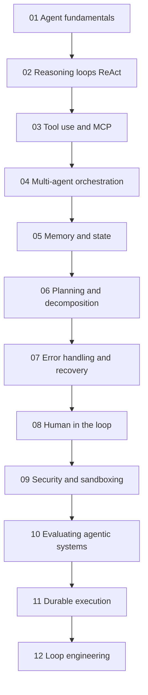
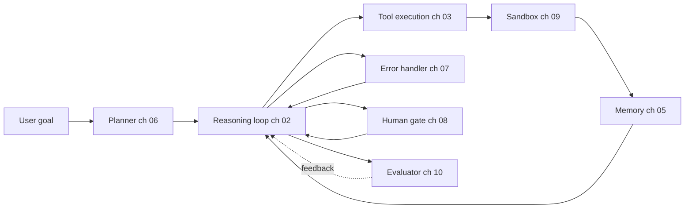

# Agentic Systems（智能体系统）

在 2026 年构建生产级 AI Agent（人工智能智能体）：推理循环（reasoning loop）、MCP 工具使用、多智能体编排（multi-agent orchestration）、记忆（memory）、规划（planning）、错误恢复（error recovery）、人类在环（human-in-the-loop）和评估（evaluation）。

智能体并不是单一技术。它们由推理循环（reasoning loop）、工具层（tool layer）、记忆（memory）、规划器（planner）、错误处理器（error handler）和评估器（evaluator）组合而成。该文件夹中的 12 章按层级深入展开，前面的章节会先建立后续章节所使用的术语。

## 章节顺序

## 参考架构

每一章的概念都映射到已部署智能体的一个组件。下图展示了各章内容在生产系统中的位置：

## 本文件夹中的文件

| 文件 | 覆盖内容 |
|------|----------------|
| [01-agent-fundamentals.md](01-agent-fundamentals.md) | 什么样的系统才算“agent（智能体）”；agent 与 workflow 的区别；何时选择各自方案。 |
| [02-reasoning-loops-react-and-beyond.md](02-reasoning-loops-react-and-beyond.md) | ReAct、Plan-and-Execute、Reflexion、Tree-of-Thought；循环设计模式。 |
| [03-tool-use-and-mcp.md](03-tool-use-and-mcp.md) | Function calling（函数调用）、Model Context Protocol（MCP）、A2A v1.0、MCP 生产级加固。 |
| [04-multi-agent-orchestration.md](04-multi-agent-orchestration.md) | 多智能体何时有帮助、何时会适得其反；orchestration（编排）与 choreography（协同编排）。 |
| [05-agent-memory-and-state.md](05-agent-memory-and-state.md) | L1-L4 记忆层级（工作记忆、情节记忆、语义记忆、程序记忆）及其取舍。 |
| [06-planning-and-decomposition.md](06-planning-and-decomposition.md) | 任务分解、计划修订、长程规划。 |
| [07-error-handling-and-recovery.md](07-error-handling-and-recovery.md) | 工具失败、重试、循环护栏、“第 100 次工具调用”问题。 |
| [08-human-in-the-loop-patterns.md](08-human-in-the-loop-patterns.md) | 确认门控、升级处理、受监督的自治。 |
| [09-agentic-security-and-sandboxing.md](09-agentic-security-and-sandboxing.md) | 代码执行沙箱、能力门控、智能体中的 prompt 注入。 |
| [10-evaluating-agentic-systems.md](10-evaluating-agentic-systems.md) | 轨迹评估（trajectory evals）、Agent-as-judge、过程奖励模型（Process Reward Models）、智能体基准。 |
| [11-durable-execution.md](11-durable-execution.md) | 长运行智能体如何在崩溃中存活：事件历史、重放、exactly-once 副作用、Temporal。 |
| [12-loop-engineering.md](12-loop-engineering.md) | 围绕智能体工程化循环：四种循环层级、终止与预算控制、上下文腐化（context rot）、验证、loopmaxxing 等反模式，以及成熟度阶梯。 |

## 配套章节

- [Tool Use and Computer Agents](../17-tool-use-and-computer-agents/) 在本节基础上扩展了 OpenClaw、Computer Use 和工具-智能体版图。
- [LangGraph Orchestration](../09-frameworks-and-tools/02-langgraph-orchestration.md) 是本节模式最常见的实现框架。
- [Agentic RAG](../06-retrieval-systems/08-agentic-rag.md) 交叉了智能体与检索。
- [Reliability and Safety](../13-reliability-and-safety/) 将智能体安全扩展到第 09 章沙箱之外。

## 关键要点

- 智能体不是单一技术；它们由推理循环（reasoning loop）、工具层（tool layer）、记忆（memory）、规划器（planner）和评估器（evaluator）组合而成。先读第 01 章。
- MCP 是 2026 年的标准工具互操作协议；除非有强有力的理由，否则不要自建工具协议。
- 多智能体编排（ch 04）经常被过度使用；对大多数用例来说，带好工具的单智能体优于多智能体。
- 记忆（ch 05）和错误恢复（ch 07）是生产级智能体最常出问题的地方；评估投入应优先放在这里。
- 人类在环（ch 08）不是兜底方案；对于高风险操作，应有意设计门控。
- 循环工程（ch 12）如今已是一门独立学科：弱外壳（harness）中的强模型，会输给强外壳中的中等模型。要在外壳中强制终止和预算控制，并让 verifier（验证器）与 producer（生产者）分离。
