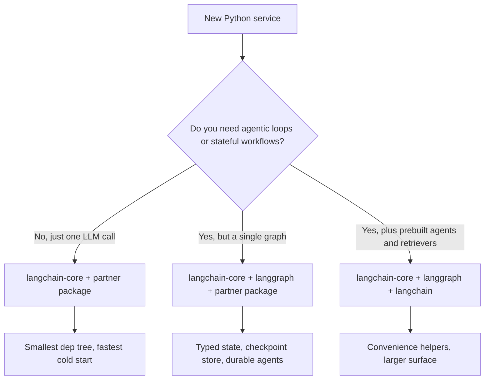

# LangChain 深入解析

LangChain 早已不再只是一个“提示库（prompting library）”。它已经发展为一个用于构建生产级 LLM 应用的**模块化生态系统**。LangGraph（它在 2025 年底升级到 v1.0，并且是所有 LangChain agent 的默认运行时）负责有状态编排。**LCEL（LangChain Expression Language，LangChain 表达式语言）** 仍然是构建可组合链路最快的方式。

## 目录

- [LangChain 技术栈](#langchain-技术栈)
- [LCEL：用管道编程](#lcel-用管道编程)
- [标准抽象（核心）](#标准抽象)
- [管理复杂度（社区包与合作伙伴包）](#管理复杂度)
- [LangChain 模块化推进](#langchain-模块化推进)
- [面试题](#面试题)
- [参考资料](#参考资料)

---

## LangChain 技术栈

如今这个生态被拆分为三个不同层次：
1. **LangChain Core**：用于 Prompt、输出解析器和 Runnable 的最小抽象。（依赖占用很低）。
2. **LangChain Community/Partner**：针对 500+ 数据库、模型和工具的集成。
3. **LangGraph**：有状态编排层（下一章会讲）。

---

## LCEL：用管道编程

LangChain Expression Language（LCEL）使用 `|` 运算符创建一个执行的**有向无环图（Directed Acyclic Graph，DAG）**。

```python
# Standard RAG chain
chain = (
    {"context": retriever, "question": RunnablePassthrough()}
    | prompt
    | model.with_structured_output(Schema) 
)
```

**为什么选择 LCEL？**
- **默认异步**：每条链都支持 `.ainvoke()` 和 `.astream()`。
- **并行性**：多个分支会自动并行运行。
- **可观测性**：自动与 **LangSmith** 集成，支持完整调用链可视化。

---

## 标准抽象

### 1. Runnables
LangChain 里所有内容的“基类”。Runnables 提供了统一接口：`.invoke`、`.batch` 和 `.stream`。

### 2. 工具与工具调用
LangChain 对 **MCP（Model Context Protocol，模型上下文协议）** 提供一等支持。
- 你可以把任意 MCP 服务器转换成 LangChain `BaseTool`。

### 3. 输出解析器
早期系统使用正则表达式，而现代代码使用 `.with_structured_output()`，它利用模型原生的 JSON 能力（OpenAI `.json_mode` 或 Anthropic `tools`）。

---

## 管理复杂度

> [!TIP]
> **生产最佳实践**：在关键路径中避免使用 `langchain-community`。使用 **合作伙伴包（Partner Packages）**（例如 `langchain-openai`、`langchain-pinecone`）来减少依赖地狱并提升稳定性。

---

## LangChain 模块化推进

到 2026 年 5 月，整个生态已经完成了从单体 `langchain` 导入到分层结构的长期迁移，并建立了清晰的依赖边界。这样拆分的目的是让团队只选择自己需要的表面能力，而不会被 500+ 集成拖累。

### 已发布的包分层

| 包 | 作用 | 直接依赖 |
|---------|---------|---------------------|
| `langchain-core` | Runnables、prompt、输出解析器、工具抽象 | Pydantic、`tenacity`，几乎没有别的 |
| `langchain` | 参考链、检索器、纯 Python 的 agent | `langchain-core` |
| `langgraph` | 有状态图编排、检查点、时间回溯 | `langchain-core` |
| `langchain-openai`、`langchain-anthropic`、`langchain-google-vertexai` 等 | 提供方合作伙伴包 | `langchain-core` + 提供方 SDK |
| `langchain-community` | 长尾集成（仍保留可用，但不再推荐用于生产路径） | 很多 |
| `langchain-classic` | 旧版 v0 链，保留用于迁移 | `langchain-core` |

`langchain-core` 是唯一随稳定表面和向后兼容保证一起发布的包，这一点在 v1 发布说明中已有明确表述（[LangChain 博客，使用 LangChain 构建 1.0](https://blog.langchain.com/langchain-1-0/)）。

### 各校验库统一使用的 JSON Schema

对应用代码来说，最大的变化是：`with_structured_output()`、`bind_tools()` 和 `@tool` 现在都接受任何兼容 [JSON Schema](https://json-schema.org/) 的对象。这包括：

- **Pydantic v2**（历史默认选择）
- **[Zod 4](https://zod.dev/v4)**，通过 `zod-to-json-schema`，用于 JavaScript / TypeScript 版 LangChain
- **[Valibot](https://valibot.dev/)**（函数式、可树摇的 TS 校验库）
- **[ArkType](https://arktype.io/)**（把 TypeScript 类型作为运行时 schema）
- Python 里的普通 dict / TypedDict
- 手写的 JSON Schema 文档

这在 [LangChain v1 结构化输出指南](https://docs.langchain.com/oss/python/langchain/structured-output) 和 [JS 结构化输出指南](https://js.langchain.com/docs/how_to/structured_output) 中都有说明。实际影响是：框架选择不再决定校验器选择，而那些在 HTTP 层已经标准化使用 Valibot 或 ArkType 的团队，可以直接把这些 schema 复用为 LangChain 工具定义。

```python
# Python: TypedDict tool schema, no Pydantic in the path
from typing import TypedDict, Annotated
from langchain_anthropic import ChatAnthropic

class CreateInvoice(TypedDict):
    """Create an invoice for a customer."""
    customer_id: Annotated[str, ..., "Stripe customer id"]
    amount_cents: Annotated[int, ..., "Amount in cents, > 0"]

llm = ChatAnthropic(model="claude-opus-4-7")
structured = llm.with_structured_output(CreateInvoice)
```

```typescript
// TypeScript: Valibot schema reused for both HTTP and tool calling
import * as v from "valibot";
import { ChatAnthropic } from "@langchain/anthropic";
import { toJsonSchema } from "@valibot/to-json-schema";

const CreateInvoice = v.object({
  customer_id: v.pipe(v.string(), v.description("Stripe customer id")),
  amount_cents: v.pipe(v.number(), v.minValue(1)),
});

const llm = new ChatAnthropic({ model: "claude-opus-4-7" });
const structured = llm.withStructuredOutput(toJsonSchema(CreateInvoice));
```

### 何时只用 `langchain-core`，何时使用完整 LangChain



截至 2026 年 5 月，推荐姿态是：

- **库 / SDK 代码**：只依赖 `langchain-core`。可复用基础构件（向量库、分块器、自定义工具）的提供者，绝不应把 `langchain` 或合作伙伴包作为直接依赖拉进来。[LangChain 集成指南](https://docs.langchain.com/oss/python/integrations/providers) 将这视为 `langchain-community` 贡献者的一条硬规则。
- **应用服务**：`langchain-core` + 你实际调用的合作伙伴包 + 如果有多步骤工作流则再加 `langgraph`。除非你明确在使用内置检索器或旧链，否则跳过 `langchain`（这个包，不是品牌）。
- **笔记本和原型**：为了方便，`langchain` 可以用。

版本钉死很重要。`langchain-core >= 1.0` 是新代码支持的最低版本；0.3.x 这一行仍会收到关键补丁，但根据 [LangChain v1 发布公告](https://blog.langchain.com/langchain-1-0/) 将在 2026 年第三季度结束支持（EOL）。

### 现有代码的迁移说明

- `LLMChain`、`RetrievalQA`、`ConversationalRetrievalChain` 和 `AgentExecutor` 位于 `langchain-classic` 中，已经冻结。替代方案是 LCEL 管道，或者更常见的 `langgraph` 图（[LangChain 迁移指南](https://python.langchain.com/docs/versions/v0_3/)）。
- 工具装饰器应从 `langchain_core.tools` 导入，而不是 `langchain.tools`。
- 依赖 Pydantic v1 的输出解析器必须迁移。`langchain-core` v1.0 已移除了 v1 兼容层（[发布说明](https://github.com/langchain-ai/langchain/releases/tag/langchain-core%3D%3D1.0.0)）。

---

## 面试题

### 问：LCEL 相比传统 Python “Chains”（函数调用序列）的主要优势是什么？

**强答案：**
LCEL 提供了**自动流式输出和并行化**。在传统 Python chain 中，我必须手动处理并行步骤的 `asyncio.gather`，以及流式输出用的自定义生成器。LCEL 的 `Runnable` 架构在底层处理了这些事情。如果我定义一个 `RunnableParallel` 块，LangChain 会同时执行它们。更重要的是，LCEL 通过 `RunnableBranch` 提供了**动态路由**，让复杂逻辑可以轻松构建，而不需要深度嵌套的 if/else 语句。

### 问：LangChain 经常被批评“太臃肿”。你会如何用它设计一个轻量的生产系统？

**强答案：**
关键是**只导入 Core**。我会用 `langchain-core` 提供抽象，再配合具体的**合作伙伴包**（比如 `langchain-anthropic`）来接模型。我会避免使用 `langchain-community` 和遗留的 `Chain` 类（比如 `LLMChain` 或 `RetrievalQA`），因为它们实际上已经弃用。我会用 **Runnable** 原语来构建逻辑，这样能保持依赖树更小、执行路径更透明。

---

## 参考资料
- LangChain. "LangChain Expression Language 规范" (2025)
- Anthropic. "LangChain 合作伙伴集成指南" (2025)
- Harrison Chase. "AI 编排的未来" (2024 播客/文章)

---

*下一篇：[LangGraph 编排](02-langgraph-orchestration.md)*
