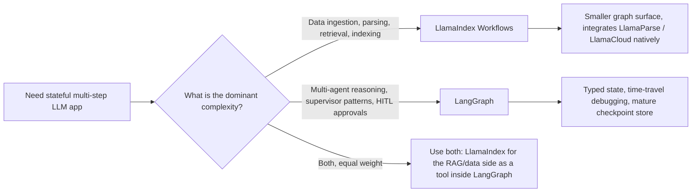

# LlamaIndex

当 LangChain 专注于「Orchestration（编排）」时，**LlamaIndex** 则是 **Data-Centric AI（数据中心化 AI）** 的代表。它已经从一个 RAG 库演进为一个面向 **Workflows（工作流）** 和 **Agentic Data Manipulation（智能体式数据操作）** 的框架。

## 目录

- [数据框架理念](#数据框架理念)
- [LlamaIndex Workflows（工作流）](#llamaindex-workflows-工作流)
- [高级索引：超越向量搜索](#高级索引)
- [LlamaCloud 与托管式摄入（Managed Ingestion）](#llamacloud-与托管式摄入)
- [智能体作为工具](#智能体作为工具)
- [LlamaIndex Workflows：事件驱动应用框架](#llamaindex-workflows-事件驱动应用框架)
- [面试题](#面试题)
- [参考资料](#参考资料)

---

## 数据框架理念

LlamaIndex 的构建信念是：**数据比模型更重要**。
- **The Node（节点）**：每个数据片段都是一个带有丰富元数据的 “Node”（关系、摘要，以及父子链接）。
- **The Retriever（检索器）**：LlamaIndex 提供了最丰富多样的检索器集合（Summary、Knowledge Graph、Tree 和 Keyword）。

---

## LlamaIndex Workflows（工作流）

2024 年末，LlamaIndex 推出了 **Workflows**，作为对 LangGraph 的回应。
- **事件驱动架构（Event-Driven Architecture）**：节点通过发出 `Events` 进行通信。
- **并发（Concurrency）**：Workflows 原生支持异步，在大规模并行数据处理中比线性链更出色。

```python
# Conceptual Workflow
class RAGWorkflow(Workflow):
    @step
    async def ingest(self, ev: StartEvent) -> RetrievalEvent:
        # Custom logic...
        return RetrievalEvent(results=nodes)
```

---

## 高级索引

1. **属性图（Property Graphs）**：将向量分块链接到图节点，用于 RAG。
2. **上下文感知分割器（Context-Aware Splitters）**：按“意义”（Meaning）而不是“Token 数量”对文本分组（使用更小的 LLM 来寻找最佳断点）。
3. **动态路径选择（Dynamic Pathing）**：检索器根据问题的复杂度决定要查询哪个索引。

---

## LlamaCloud 与托管式摄入

面向企业级规模，LlamaIndex 重点放在 **LlamaCloud** 上。
- **托管式摄入（Managed Ingestion）**：将 PDF 解析、OCR 和表格提取作为服务来处理。
- **将解析视为模型（Parsing as a Model）**：使用 Vision-LLMs（Gemini 3.1 Pro、Claude Opus 4.7、GPT-5.5）去“理解”布局，而不是使用基于规则的解析器。

---

## 智能体作为工具

LlamaIndex 将智能体视为 **高阶检索器（high-level retrievers）**。
- 你可以把一个复杂的 LlamaIndex 查询引擎“封装”（wrap）成一个工具，并交给 LangGraph 智能体。
- **收益（Benefit）**：智能体获得“智能数据访问（Smart Data Access）”，而无需了解向量数据库或图模式（Graph schema）的技术细节。

---

## LlamaIndex Workflows：事件驱动应用框架

2024 年的说法是“Workflows 就是我们的 LangGraph。”如今的说法不同了：Workflows 是一个适用于任何 AI 应用的通用事件驱动框架，RAG 只是其中一种用途。如今 `llama-index-core` 将 Workflows 作为主要应用入口发布，而索引（index）/检索器（retriever）类已经移动到其周边的集成包中（[LlamaIndex workflows docs](https://developers.llamaindex.ai/python/framework/understanding/workflows/)）。一个值得澄清的命名细节是：**Workflows** 包在 2025 年年中到达 1.0 版本，如今作为独立包已经进入 2.x 版本线，而核心 `llama-index` 框架本身仍停留在 0.x 版本线（到 2026 年年中大约为 0.14.x）。关于这类版本 churn 如何破坏教程以及如何应对，可参见 [Navigating Framework Churn](12-navigating-framework-churn.md)。

### 架构上发生了什么变化

| 维度 | Workflows 之前的 LlamaIndex | 以 Workflows 为中心的 LlamaIndex |
|-----------|--------------------------|-----------------------------------|
| 主要抽象 | Query engine，chat engine | 带有 `@step` 方法的 `Workflow` 类 |
| 控制流 | 线性；嵌套查询引擎 | 步骤消费 / 发出类型化的 `Event` 子类 |
| 状态 | 隐式存在于引擎实例中 | 显式 `Context`，带可序列化状态 |
| 并发 | 通过异步查询引擎进行协作 | 一等公民：发出多个事件、fan out、join |
| 持久化 | 无 | Context 可 `pickle`，或存为 JSON 以便恢复 |
| 流式传输 | 按引擎 | 任意步骤中的 `ctx.write_event_to_stream()` |
| 人在环（HITL） | 手动 | `InputRequiredEvent` / `HumanResponseEvent` 模式 |

### 事件驱动心智模型

```python
from llama_index.core.workflow import (
    Workflow, step, Event, StartEvent, StopEvent, Context
)

class RetrievedEvent(Event):
    nodes: list

class JudgedEvent(Event):
    nodes: list
    keep: bool

class GraphRAG(Workflow):
    @step
    async def plan(self, ctx: Context, ev: StartEvent) -> RetrievedEvent:
        await ctx.set("query", ev.query)
        nodes = await self.retriever.aretrieve(ev.query)
        return RetrievedEvent(nodes=nodes)

    @step
    async def judge(self, ctx: Context, ev: RetrievedEvent) -> JudgedEvent:
        keep = await self.relevance_judge(ev.nodes, await ctx.get("query"))
        return JudgedEvent(nodes=ev.nodes, keep=keep)

    @step
    async def answer(self, ctx: Context, ev: JudgedEvent) -> StopEvent:
        if not ev.keep:
            return StopEvent(result="No good evidence found.")
        return StopEvent(result=await self.llm.acomplete(...))
```

这一设计带来两个性质：

1. 引擎完全按 **事件类型** 分发，因此新增一个分支只需要新增一个 `Event` 子类，以及一个消费该事件的步骤。不需要修改中心路由器。
2. **并发是数据驱动的**：一个步骤发出三个 `RetrievedEvent`，会自动 fan out 出三个下游 `judge` 调用，而汇合步骤会通过 `ctx.collect_events` 将它们收集起来。

### Workflows 与 LangGraph 对比



| 维度 | LlamaIndex Workflows（1.x） | LangGraph（1.x） |
|-----------|----------------------------|-----------------|
| 控制流原语 | 事件分发 | 图节点与边，以及类型化 reducer 状态 |
| 状态模型 | 自由形式的 `Context`（类 dict） | 带 reducers 的 Pydantic / TypedDict 状态 |
| 恢复 / 时间旅行 | 可 pickle 的 context，基础恢复 | 一等公民检查点，可从任意节点分支（[LangGraph persistence docs](https://docs.langchain.com/oss/python/langgraph/persistence)） |
| 原生集成 | LlamaParse、LlamaCloud、全部 LlamaHub 加载器 | LangSmith eval、全部 LangChain 集成 |
| 最适合的复杂度 | 数据形态：解析、嵌入、检索、精炼 | 逻辑形态：规划、行动、反思、委派 |
| 多智能体助手 | `AgentWorkflow`、function-calling 智能体（[LlamaIndex AgentWorkflow](https://developers.llamaindex.ai/python/framework/understanding/agent/multi_agent/)） | `create_supervisor`、`create_react_agent`、swarm patterns |
| 流式 UI | `ctx.write_event_to_stream` + AG-UI 协议 | `astream_events` v2，AG-UI 协议 |

什么时候应该优先选择 LlamaIndex Workflows 而不是 LangGraph：

- 难点在于 **数据摄入（data ingestion）**，而不是推理。LlamaCloud、LlamaParse 和属性图栈都是原生能力，而不是通过适配器桥接出来的（[LlamaCloud overview](https://www.llamaindex.ai/llamacloud)）。
- 你需要的是 **文档驱动的并行处理（document-driven parallelism）**：解析 1000 份 PDF，为每个 chunk 分发一个 embedding 步骤，然后汇聚成一次索引更新。
- 你正在 `llama-index-ts` 的 **TypeScript** 生态中开发，并希望与 Python 核心保持特性一致。

什么时候 LangGraph 更占优：

- 难点在于 **智能体控制循环（agent control loop）** 本身：多个智能体、监督者模式、持久化中断、重放。
- 你需要开箱即用的 **时间旅行调试（time-travel debugging）**。LlamaIndex 的恢复能力适合崩溃恢复，但不像 LangGraph checkpoints 那样支持从任意历史状态分支。
- 你已经在 LangSmith eval 栈上，希望无需桥接就能获得 trace 级集成。

### 真实世界中的定位

很多成熟架构会同时使用两者：LlamaIndex Workflows 负责数据平面（摄入、索引、混合检索、重排）并作为工具封装起来，而 LangGraph 则负责上层的智能体控制平面。这一模式在 [AIMultiple framework comparison](https://research.aimultiple.com/agentic-ai-frameworks/) 和 LlamaIndex 自己的 [hybrid integration cookbook](https://developers.llamaindex.ai/python/framework/understanding/workflows/) 中都有提到。

如果你只为一个新的 greenfield app 选择一个框架，问题可以简化为：**你的团队会把更多时间花在数据管道（data plumbing）上，还是智能体编排（agent orchestration）上？** 这个答案决定框架。

---

## 面试题

### 问：LangChain 和 LlamaIndex 现在都有 “Graph/Workflow” 特性。你如何选择？

**标准答案：**
对于主要复杂度在摄入、多模态解析和复杂检索上的 **Data-Intensive** 任务，我会选择 **LlamaIndex Workflows**。它的事件驱动架构在大规模并行数据处理中性能更好。对于复杂度集中在“推理（Reasoning）”和“Human-in-the-loop（人在环）”逻辑上的 **Logic-Intensive** 多智能体系统，我会选择 **LangGraph**。在许多高级架构中，我们会同时使用 **Both（两者）**：LlamaIndex 作为 RAG 引擎，LangGraph 作为整体智能体监督者（agentic supervisor）。

### 问：LlamaIndex 中的“属性图（Property Graph）”是什么？为什么它优于基础的 Vector RAG？

**标准答案：**
属性图将向量的 **语义灵活性（Semantic flexibility）** 与数据库的 **结构精确性（Structural precision）** 结合起来。在基础 RAG 中，你可能会找到一段关于“Project Alpha”的内容，但不知道它的所有者是谁。而在属性图中，这个向量分块是一个与 `User` 节点和 `Timeline` 节点相连的节点。这使得可以进行 **Global Reasoning（全局推理）**，例如“找出上个月由 Tom 撰写的所有关于 Project Alpha 的文档”。基础 RAG 很可能会漏掉许多相关节点，因为它们不包含精确的关键词“Alpha”。

---

## 参考资料
- LlamaIndex. "The Workflows Framework: Event-Driven Agents" (2025)
- Jerry Liu. "Data-Centric AI in the LLM Era" (2024/2025)
- LlamaHub. "The Repository of 1000+ Data Loaders" (2025)

---

*下一篇：[DSPy：编程语言模型](05-dspy.md)*
