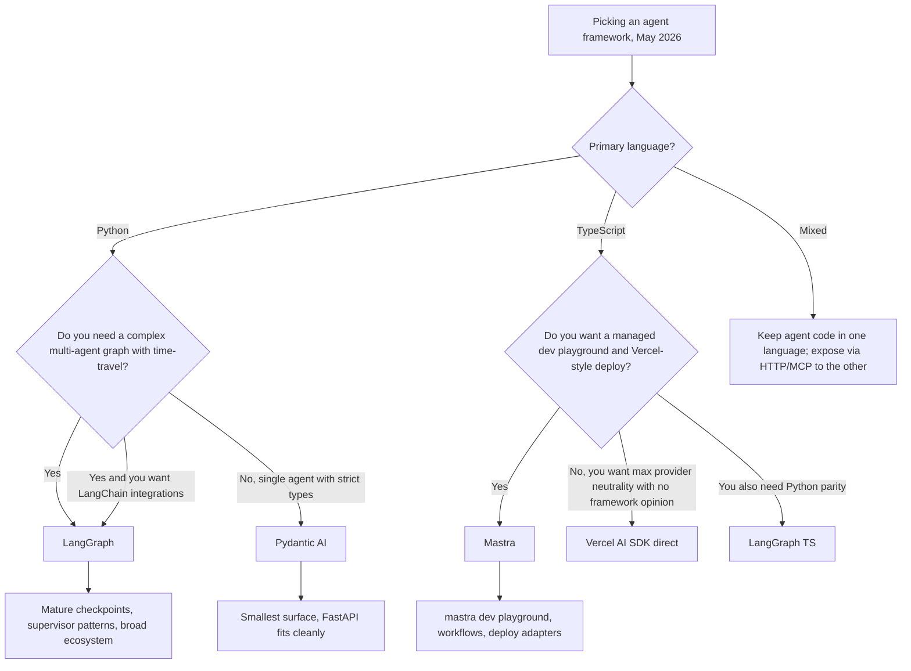

# Pydantic AI 与 Mastra：类型化 Agent 框架（2026）

到 2026 年 5 月，Agent 框架之争已经不再是“LangGraph 还是 LlamaIndex”。对于优先考虑类型安全而非生态广度的团队来说，两个较新的进入者现在已经占据了有意义的生产份额：Python 世界中的 **Pydantic AI** 和 TypeScript 世界中的 **Mastra**。两者都拒绝旧框架所接受的“字符串输入，字符串输出”表面接口，并且都押注于：一个完全类型化的 Agent，比一个聪明但无类型的 Agent 更容易测试、评估和运维。

## 目录

- [这些框架是什么](#这些框架是什么)
- [Pydantic AI：Python 中的类型化 Agent](#pydantic-ai-python-中的类型化-agent)
- [Mastra：TypeScript 优先的 Agent](#mastra-typescript-优先的-agent)
- [与 LangGraph 的比较](#与-langgraph-的比较)
- [选择框架](#选择框架)
- [生产参考](#生产参考)
- [面试题](#面试题)
- [参考资料](#参考资料)

---

## 这些框架是什么

Pydantic AI 和 Mastra 都源于对框架锁定和无类型提示词拼接的不满。它们关注同一组理念：

- Agent 循环由**代码定义**，而不是由 YAML / JSON 图定义。
- 工具调用、结构化输出和人在回路检查点都在**函数签名处类型化**。
- Provider portability（提供商可移植性）是硬性要求：通过修改一行代码，就可以把 Anthropic 换成 OpenAI 或 Google。
- Evals（评估）、tracing（追踪）和部署是一等能力，而不是事后附加。

差异主要由技术栈决定：一个面向已经使用 Pydantic 做 HTTP 校验的 Python 服务；另一个面向希望获得 Vercel 式开发者体验的 Next.js / Node 团队。

---

## Pydantic AI：Python 中的类型化 Agent

### 当前状态

[Pydantic AI](https://ai.pydantic.dev/) 于 2025 年 9 月发布 v1.0，在 2026 年 4 月将 1.x 系列稳定在 **v1.85.1**，并于 **2026 年 5 月 21 日进入 v2.0 beta 周期**（[PyPI 发布历史](https://pypi.org/project/pydantic-ai/#history)）。该库由 Pydantic 背后的团队构建，该团队也运营 [Pydantic Logfire](https://pydantic.dev/logfire)。它以 MIT 许可证开源。

关键表面积：

- `Agent` 类，由输出类型和类型化工具列表参数化。
- Anthropic、OpenAI、Google、Mistral、Groq、Cohere、Ollama 以及任何 OpenAI 兼容端点的 Provider adapter（提供商适配器）。
- 原生 OpenTelemetry tracing（追踪），可导出到 Logfire 或任何 OTLP collector（收集器）。
- `pydantic_evals`，用于带有 LLM-judge（大语言模型裁判）和代码评分器的声明式 eval suite（评估套件）。
- 当简单的 `Agent` 循环不够用时，可使用 `Graph` API 来构建显式状态机。

### 团队为什么选择它

```python
from pydantic import BaseModel, Field
from pydantic_ai import Agent, RunContext

class RefundDecision(BaseModel):
    approved: bool
    amount_cents: int = Field(ge=0)
    reason: str

agent = Agent(
    "anthropic:claude-opus-4-7",
    output_type=RefundDecision,
    system_prompt="You are a refund analyst. Approve only if policy allows.",
)

@agent.tool
async def lookup_order(ctx: RunContext, order_id: str) -> dict:
    """Look up an order by id."""
    return await ctx.deps.orders.get(order_id)

result = await agent.run("Refund order 1234", deps=DepContainer(orders=db))
assert isinstance(result.output, RefundDecision)
```

三个特性让它在生产环境中有吸引力：

1. **返回类型会被强制执行。** `result.output` 要么是一个 `RefundDecision`，要么调用失败。不会出现静默的字符串漂移。
2. **工具是函数，而不是 dict。** 注册时会根据 Python 签名和 docstring 生成 schema（模式），因此你不会意外地让面向 LLM 的 schema 偏离实现。
3. **依赖注入是显式的。** `ctx.deps` 是一个类型化容器，这使得 Agent 可以很容易地用 mock 进行单元测试。

[Pydantic AI evals 文档](https://ai.pydantic.dev/evals/)描述了一种典型循环：生产 schema 使用的同一个 Pydantic model（模型），也会同时用于 LLM 输出类型和 eval scorer（评估评分器）的 `expected_output`。

### 什么时候 Pydantic AI 是正确选择

- 服务是 **Python**，并且已经使用 Pydantic 做 HTTP 校验（FastAPI 是典型场景）。
- 你希望从头到尾使用**严格 schema**：HTTP 边界、LLM 工具调用、LLM 输出、数据库行。
- 你希望获得**提供商可移植性**，而不必编写自己的适配层。
- 你愿意将 Agent 循环写成命令式 Python，而不是图定义。

### 什么时候不适合

- 你想要一个用于多 Agent 协调、带有 supervisor（监督者）模式的**声明式图**。`Graph` API 存在，但比 LangGraph 更基础。
- 你想要带有“从任意节点分支”语义的**时间旅行调试**。
- 你需要 LangChain 集成生态的广度（向量存储、文档加载器等）。

---

## Mastra：TypeScript 优先的 Agent

### 当前状态

[Mastra](https://mastra.ai/) 由 Gatsby 背后的团队创立（YC W25 毕业），在 2025 年 10 月宣布由 Lightspeed 领投的 **13M 美元种子轮融资**（[TechCrunch 报道](https://techcrunch.com/2025/10/16/mastra-typescript-agent-framework-seed/)），并在 **2026 年 1 月发布 v1.0**。到 2026 年 5 月，GitHub 仓库已经超过 **22.3K stars（星标）**，并拥有 **300K+ 每周 npm 下载量**（[mastra-ai/mastra](https://github.com/mastra-ai/mastra)）。Mastra 以 Elastic License v2 开源。

关键表面积：

- `Agent`、`Workflow` 和 `Tool` 原语，全部以 TypeScript 定义，并具备完整类型推断。
- 内置**本地开发服务器**（`mastra dev`），包含 playground UI（演练场界面）、eval runner（评估运行器）和 trace viewer（追踪查看器）。
- 与 Vercel 的 **AI SDK** 紧密集成，用于 streaming（流式传输）、多步工具调用和 provider switching（提供商切换）。
- 开箱即用的 memory（记忆）和 RAG（检索增强生成），并带有 `libsql` / `pgvector` adapter（适配器）。
- 一条命令部署到 **Mastra Cloud**、Vercel、Cloudflare Workers 或 Node server（Node 服务器）。

### 团队为什么选择它

```typescript
import { Agent } from "@mastra/core/agent";
import { createTool } from "@mastra/core/tools";
import { anthropic } from "@ai-sdk/anthropic";
import { z } from "zod";

const lookupOrder = createTool({
  id: "lookup-order",
  description: "Look up an order by id",
  inputSchema: z.object({ orderId: z.string() }),
  outputSchema: z.object({ status: z.string(), totalCents: z.number() }),
  execute: async ({ context }) => ordersDb.get(context.orderId),
});

export const refundAgent = new Agent({
  name: "refund-agent",
  model: anthropic("claude-opus-4-7"),
  instructions: "You are a refund analyst. Approve only if policy allows.",
  tools: { lookupOrder },
});
```

三个特性让它有吸引力：

1. **端到端推断类型。** Zod schemas（模式）驱动工具的运行时校验、面向 LLM 的 JSON Schema，以及 `execute` 内部 `context` 的 TypeScript 类型。单一事实来源。
2. **`mastra dev` 是杀手级功能。** 它会启动一个本地 UI，让你无需编写前端即可调用任何 Agent、重放任何 trace（追踪）、运行任何 eval（评估），并检查任何工具输入/输出。
3. **一等 workflow（工作流）。** `createWorkflow` 定义由步骤组成的类型化图（每个步骤都是一个 Mastra 工具或 Agent），支持 branching（分支）、suspend / resume（挂起 / 恢复）和人在回路，并且全部经过类型检查。

[Generative.inc Mastra 指南](https://generative.inc/blog/mastra-typescript-agent-framework)介绍了当团队的其余技术栈已经是 TypeScript 时，如何用 Mastra 完全替代 Python 编排。

### 什么时候 Mastra 是正确选择

- 团队以 **TypeScript 优先**，应用的其余部分是 Next.js / Node / Bun / Cloudflare Workers。
- 你想要 **Vercel 风格的 DX（开发者体验）**：单一 CLI、本地 playground（演练场）、有明确主张的部署方式。
- 流式 UI 很重要，并且你想依赖 AI SDK 的 `useChat` 和 `streamText` primitives（基础原语）。
- 你想要默认接入人工审批步骤的 **suspend / resume workflows（暂停 / 恢复工作流）**。

### 什么时候不适合

- 你需要一个**大型预构建代理库**或社区集成。与 LangChain 相比，其生态系统较小。
- 你的团队以及大多数 AI 工具链是 **Python**。通过 HTTP 层把 TS 桥接到 Python 服务是可行的，但会增加延迟。
- 你需要**学术风格**的自定义推理行为（自定义解码等）。请继续使用 Python。

---

## 与 LangGraph 的比较

| 维度 | Pydantic AI v1.85 | Mastra（5 月 2026） | LangGraph 1.x |
|-----------|-------------------|---------------------|----------------|
| 语言 | Python | TypeScript | Python 和 TypeScript |
| 许可证 | MIT | Elastic License v2 | MIT |
| 主要单元 | 带 `output_type` 的类型化 `Agent` | 类型化 `Agent` 和 `Workflow` | 基于类型化状态的节点图 |
| Schema 来源 | Pydantic v2 | Zod | JSON Schema（Pydantic、Zod、Valibot、ArkType） |
| Provider neutrality（提供商中立性） | 内置适配器 | 通过 Vercel AI SDK | 通过 LangChain 合作伙伴包 |
| 多代理 | 手动或 `Graph` API | `Workflow` + 作为工具的代理 | `create_supervisor`、swarm、自定义图 |
| 状态持久化 | 手动或 `pydantic_graph` checkpoint（检查点） | 工作流快照 + 存储适配器 | 一等 checkpoint store（Postgres、Redis、SQLite、内存） |
| Time-travel debugging（时间旅行调试） | 否 | 在本地 playground 中重放 | 是，可从任意 checkpoint 分支 |
| Eval framework（评估框架） | `pydantic_evals` | Mastra evals（内置） | LangSmith 或外部工具 |
| Tracing（追踪） | OTLP / Logfire | OTLP / Mastra Cloud | LangSmith 或 OTLP |
| 耦合度 | 不依赖 LangChain | 不依赖 LangChain | 与 LangChain 生态紧密耦合 |
| 生态规模 | 小但在增长 | 小但在增长 | 大（LangChain 集成） |



---

## 选择框架

三个决策驱动因素，按权重排序：

1. **现有服务的语言。** Python 服务使用 Pydantic AI 和 LangGraph（Python）。TypeScript 服务使用 Mastra 和 LangGraph TS。跨越边界几乎总是比选择正确的一侧更差的取舍。
2. **复杂性的形态。** 如果代理本质上是“LLM + 少量工具 + 严格输出类型”，Pydantic AI 或 Mastra 就足够，且运维成本更低。如果你有许多协作代理，并包含分支、重试和审批，LangGraph 的图 + checkpoint 模型会更有优势。
3. **生态耦合。** LangGraph 带来 LangChain 集成、LangSmith eval，以及其余相关能力面。Pydantic AI 和 Mastra 带来更清晰的类型保证和更快的冷启动路径，但你需要自行接入集成。

一个有用的启发式判断：如果页面上最长的是工具列表，选择 Pydantic AI 或 Mastra。如果页面上最长的是状态机，选择 LangGraph。

---

## 生产参考

以下是截至 5 月 2026 各框架被严肃使用的公开参考：

- **Pydantic AI**
  - [Pydantic Logfire dashboards](https://pydantic.dev/logfire) 本身使用 Pydantic AI 作为其内部分诊代理。
  - [Sourcegraph Cody](https://sourcegraph.com/cody) 团队曾[撰文介绍使用 Pydantic AI](https://ai.pydantic.dev/) 在其服务端工作流中构建类型化代码操作代理。
  - 许多 FastAPI 团队采用它，因为同一个 Pydantic 模型可以同时服务于 HTTP 边界和 LLM 输出类型。
- **Mastra**
  - [Stripe](https://stripe.com/) 的开发者体验原型（[mastra.ai](https://mastra.ai/)）。
  - [Resend](https://resend.com/)、[Liveblocks](https://liveblocks.io/) 和 [Vercel](https://vercel.com/) 的演示应用。
  - 种子轮公告（[TechCrunch](https://techcrunch.com/2025/10/16/mastra-typescript-agent-framework-seed/)）列出了 fintech（金融科技）和开发者工具领域的生产用户。
- **LangGraph**（供参考）
  - [LinkedIn 的 SQL Bot](https://www.linkedin.com/blog/engineering/ai/practical-text-to-sql-for-data-analytics)、[Uber 的编码助手](https://www.uber.com/en-IN/blog/genie-uber-genai-on-call-copilot/)、[Klarna](https://www.klarna.com/)、[Elastic](https://www.elastic.co/) AI Assistant、[Replit](https://replit.com/)，以及 [LangChain customer page](https://www.langchain.com/built-with-langgraph) 上的更多案例。

---

## 面试题

### 问：对于 Python 服务，什么时候会选择 Pydantic AI 而不是 LangGraph？

**优秀回答：**
当代理本质上是一个带类型化输出和少量工具的 LLM，并且服务的其余部分已经是 Pydantic 形态（FastAPI、SQLModel 等）时，我会选择 Pydantic AI。收益在于同一个 Pydantic 模型定义了 HTTP 响应、LLM 输出和 eval scorer（评估打分器）的预期形状，因此不会发生 schema drift（模式漂移）。当我需要真正的多代理图、基于 checkpoint 的时间旅行、supervisor 模式，或 LangChain 集成生态时，LangGraph 更重的能力面才值得采用。我会问的决定性问题是：设计中最复杂的部分是工具列表还是状态机。工具列表复杂，选 Pydantic AI。状态机复杂，选 LangGraph。

### 问：Mastra 是 Vercel AI SDK 的替代品吗？

**优秀回答：**
不是。Mastra 构建在 Vercel AI SDK 之上，用于实际的提供商调用和流式输出。Mastra 增加的是 **agent abstraction（代理抽象）**、**workflow engine（工作流引擎）**、**memory（记忆）**、**RAG（检索增强生成）**、**evals（评估）**，以及 **`mastra dev` playground（演练场）**。如果你只需要在 Next.js 应用中以流式方式调用 LLM 并进行工具调用，单独使用 AI SDK 就足够了。如果你想要带工作流、暂停 / 恢复、记忆和本地 playground 的类型化代理，Mastra 就是在不强迫你自己编写这些能力的情况下添加这些能力的一层。

### 问：“类型化代理框架”在生产中到底带来什么？

**优秀回答：**
三件事。第一，**更少的坏输入会泄漏下去**。面向 LLM 的 schema 来自同一个用于验证运行时 payload（载荷）的 Pydantic / Zod 定义，因此如果 LLM 幻觉出一个字段，parse（解析）步骤会在任何下游代码运行前拒绝它。第二，**干净的单元测试**。类型化工具只是一个带 Pydantic / Zod 边界的函数，因此我可以在不把任何 LLM 放入循环的情况下测试它。第三，**schema-aware evals（感知 schema 的评估）**。评估框架可以逐字段比较两个类型化对象，而不是对字符串做 diff（差异比较），这能捕获细微回归，例如某个字段变成可选，或某个 enum（枚举）增加了新值。

---

## 参考资料

- Pydantic AI v1.85 发布说明：https://github.com/pydantic/pydantic-ai/releases
- Pydantic AI 文档：https://ai.pydantic.dev/
- Pydantic AI evals（评估）：https://ai.pydantic.dev/evals/
- Mastra 仓库：https://github.com/mastra-ai/mastra
- Mastra 文档：https://mastra.ai/
- TechCrunch，《Mastra 为 TypeScript agent framework（智能体框架）获得 13M seed（种子轮融资）》（2025 月）：https://techcrunch.com/2025/10/16/mastra-typescript-agent-framework-seed/
- Generative.inc Mastra 指南：https://generative.inc/blog/mastra-typescript-agent-framework
- LangGraph 1.x 文档：https://docs.langchain.com/oss/python/langgraph/
- LangChain“Built with LangGraph（使用 LangGraph 构建）”客户列表：https://www.langchain.com/built-with-langgraph
- Vercel AI SDK（AI 软件开发工具包）：https://ai-sdk.dev/
- AIMultiple《Agentic AI frameworks compared（智能体 AI 框架对比）》（2026）：https://research.aimultiple.com/agentic-ai-frameworks/

---

*下一篇：参见[框架选择指南](08-framework-selection-guide.md)，了解跨框架选择标准。*
