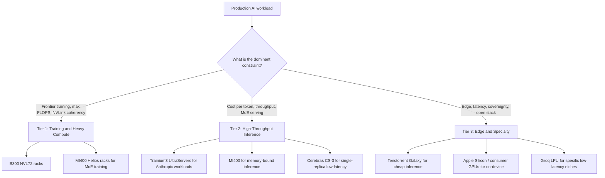

# LLM 基础设施

构建生产级 LLM（大语言模型）系统需要理解部署选项、扩展模式和运维关注点。本章涵盖基础设施层。

## 目录

- [部署选项](#部署选项)
- [服务架构](#服务架构)
- [扩展模式](#扩展模式)
- [成本管理](#成本管理)
- [监控与告警](#监控与告警)
- [灾难恢复](#灾难恢复)
- [5月 2026 AI 加速器格局](#五月-2026-ai-加速器格局)
- [面试题](#面试题)
- [参考资料](#参考资料)

---

## 部署选项

### API 与自托管（Self-Hosted， 自行部署）

| 因素 | API 提供商 | 自托管 |
|--------|---------------|-------------|
| 设置时间 | 几分钟 | 几天到几周 |
| 运维负担 | 无 | 显著 |
| 低吞吐量下的成本 | 更低 | 更高（固定成本） |
| 高吞吐量下的成本 | 更高 | 更低（规模经济） |
| 延迟控制 | 有限 | 完全可控 |
| 数据隐私 | 数据会离开你的基础设施 | 数据保留在本地 |
| 模型选择 | 提供商的模型 | 任何开源模型 |
| 定制化 | 通过 API 微调 | 完全可控 |

### 何时使用 API 提供商

```python
# Decision framework
def should_use_api(requirements: dict) -> bool:
    # Strong signals for API
    if requirements["time_to_market"] == "urgent":
        return True
    if requirements["query_volume"] < 100_000_per_month:
        return True
    if requirements["team_ml_expertise"] == "low":
        return True
    
    # Strong signals for self-hosted
    if requirements["data_residency"] == "strict":
        return False
    if requirements["latency_p99_ms"] < 100:
        return False
    if requirements["query_volume"] > 10_000_000_per_month:
        return False
    
    # Default to API for simplicity
    return True
```

### 自托管选项

| 选项 | 复杂度 | 性能 | 使用场景 |
|--------|------------|-------------|----------|
| vLLM | 中等 | 极佳 | 生产服务 |
| TGI（HuggingFace） | 中等 | 很好 | HuggingFace 生态 |
| TensorRT-LLM | 高 | 最佳（NVIDIA） | 极致性能 |
| Ollama | 低 | 良好 | 开发、小规模 |
| llama.cpp | 低 | 良好 | CPU 推理、边缘端 |

---

## 服务架构

### 单模型服务

```
┌─────────────┐     ┌─────────────┐     ┌─────────────┐
│   Client    │────▶│   Gateway   │────▶│  LLM Server │
└─────────────┘     └─────────────┘     └─────────────┘
                           │
                           ▼
                    ┌─────────────┐
                    │    Cache    │
                    └─────────────┘
```

### 多模型服务

```
                    ┌─────────────────────────────── │
                    │         Load Balancer          │
                    └───────────────┬────────────────┘
                                    │
            ┌───────────────────────┼───────────────────────┐
            │                       │                       │
            ▼                       ▼                       ▼
    ┌───────────────┐       ┌───────────────┐       ┌───────────────┐
    │  GPT-4 Pool   │       │  Claude Pool  │       │ Llama 70B Pool│
    │  (API calls)  │       │  (API calls)  │       │ (self-hosted) │
    └───────────────┘       └───────────────┘       └───────────────┘
```

### 模型路由模式

```python
class ModelRouter:
    def __init__(self):
        self.models = {
            "simple": GPT4oMini(),
            "complex": Claude35Sonnet(),
            "code": Claude35Sonnet(),
            "long_context": Gemini15Pro(),
            "vision": GPT4o()
        }
        self.classifier = QueryClassifier()
    
    async def route(self, request: Request) -> Response:
        # Classify request type
        request_type = self.classifier.classify(request)
        
        # Route to appropriate model
        model = self.models[request_type]
        
        # Execute with fallback
        try:
            return await model.generate(request)
        except RateLimitError:
            return await self.fallback(request, request_type)
    
    async def fallback(self, request: Request, original_type: str) -> Response:
        # Define fallback order
        fallbacks = {
            "simple": ["complex", "long_context"],
            "complex": ["simple"],
            "code": ["complex"]
        }
        
        for fallback_type in fallbacks.get(original_type, []):
            try:
                return await self.models[fallback_type].generate(request)
            except Exception:
                continue
        
        raise ServiceUnavailableError("All models unavailable")
```

---

## 扩展模式

### 水平扩展

```python
# Kubernetes HPA config for LLM service
hpa_config = """
apiVersion: autoscaling/v2
kind: HorizontalPodAutoscaler
metadata:
  name: llm-service-hpa
spec:
  scaleTargetRef:
    apiVersion: apps/v1
    kind: Deployment
    name: llm-service
  minReplicas: 2
  maxReplicas: 20
  metrics:
  - type: Resource
    resource:
      name: cpu
      target:
        type: Utilization
        averageUtilization: 70
  - type: Pods
    pods:
      metric:
        name: requests_per_second
      target:
        type: AverageValue
        averageValue: 100
"""
```

### 自托管的 GPU 扩展

| 规模 | GPU 数量 | 推荐配置 |
|-------|------|-----------------|
| 开发/测试 | 1 | 单块 A10G 或 L4 |
| 小型生产 | 2-4 | 2x A100，使用张量并行 |
| 中型生产 | 4-8 | 4x H100，使用张量并行 |
| 大型生产 | 8+ | 多节点，使用流水线并行 |

### 基于队列的架构

适用于高吞吐量异步（async，异步）工作负载：

```
┌─────────────┐     ┌─────────────┐     ┌─────────────┐
│  Producers  │────▶│    Queue    │────▶│  Consumers  │
└─────────────┘     │  (Redis/    │     │  (LLM       │
                    │   SQS)      │     │   Workers)  │
                    └─────────────┘     └─────────────┘
                                               │
                                               ▼
                                        ┌─────────────┐
                                        │  Results    │
                                        │  Store      │
                                        └─────────────┘
```

```python
class AsyncLLMProcessor:
    def __init__(self):
        self.queue = RedisQueue("llm_requests")
        self.results = RedisResults("llm_results")
    
    async def submit(self, request: Request) -> str:
        request_id = generate_id()
        await self.queue.enqueue({
            "id": request_id,
            "request": request.to_dict()
        })
        return request_id
    
    async def get_result(self, request_id: str, timeout: int = 300) -> Response:
        return await self.results.wait_for(request_id, timeout)
    
    # Worker process
    async def worker_loop(self):
        while True:
            job = await self.queue.dequeue()
            try:
                result = await self.llm.generate(job["request"])
                await self.results.store(job["id"], result)
            except Exception as e:
                await self.results.store_error(job["id"], str(e))
```

---

## 成本管理

### 成本跟踪

```python
class CostTracker:
    # Pricing as of December 2025 (verify current rates)
    PRICING = {
        "gpt-4o": {"input": 2.50, "output": 10.00},  # per 1M tokens
        "gpt-4o-mini": {"input": 0.15, "output": 0.60},
        "claude-3.5-sonnet": {"input": 3.00, "output": 15.00},
        "claude-3.5-haiku": {"input": 0.25, "output": 1.25},
    }
    
    def calculate_cost(
        self,
        model: str,
        input_tokens: int,
        output_tokens: int
    ) -> float:
        pricing = self.PRICING[model]
        input_cost = (input_tokens / 1_000_000) * pricing["input"]
        output_cost = (output_tokens / 1_000_000) * pricing["output"]
        return input_cost + output_cost
    
    def track(self, request_id: str, model: str, tokens: dict):
        cost = self.calculate_cost(
            model,
            tokens["input"],
            tokens["output"]
        )
        
        self.metrics.record(
            "llm_cost",
            cost,
            tags={"model": model, "request_id": request_id}
        )
        
        return cost
```

### 成本优化策略

| 策略 | 节省 | 实现方式 |
|----------|---------|----------------|
| 模型路由 | 50-80% | 将简单查询路由到廉价模型 |
| 缓存 | 30-70% | 缓存高频查询 |
| 提示词优化 | 10-30% | 更短的提示词，结构化输出 |
| Batch API（批处理 API） | 50% | 为异步工作使用批量端点 |
| 自托管 | 可变 | 在规模化后，成本可能更低 |

### 预算告警

```python
class BudgetManager:
    def __init__(self, daily_budget: float, alert_threshold: float = 0.8):
        self.daily_budget = daily_budget
        self.alert_threshold = alert_threshold
    
    async def check_and_alert(self):
        today_cost = await self.get_today_cost()
        utilization = today_cost / self.daily_budget
        
        if utilization >= 1.0:
            await self.alert("CRITICAL: Daily budget exceeded", today_cost)
            # Consider enabling cost controls
            await self.enable_rate_limiting()
        elif utilization >= self.alert_threshold:
            await self.alert("WARNING: Approaching daily budget", today_cost)
    
    async def enable_rate_limiting(self):
        # Reduce throughput to stay within budget
        self.rate_limiter.set_rate(
            requests_per_minute=self.calculate_safe_rate()
        )
```

---

## 监控与告警

### 关键指标

```python
LLM_METRICS = {
    # Latency
    "ttft_seconds": "Time to first token",
    "total_latency_seconds": "Total request time",
    
    # Throughput
    "requests_per_second": "Request rate",
    "tokens_per_second": "Token generation rate",
    
    # Resources
    "gpu_utilization": "GPU compute usage",
    "gpu_memory_utilization": "GPU memory usage",
    "kv_cache_utilization": "KV cache usage",
    
    # Quality (sampled)
    "quality_score": "LLM-as-judge score",
    "faithfulness_score": "RAG faithfulness",
    
    # Errors
    "error_rate": "Failed requests percentage",
    "rate_limit_hits": "Rate limit rejections",
    
    # Cost
    "cost_per_request": "Average cost per request",
    "daily_cost": "Total daily spend"
}
```

### 告警配置

```yaml
alerts:
  - name: high_error_rate
    condition: error_rate > 0.05
    for: 5m
    severity: critical
    
  - name: high_latency
    condition: p99_latency > 10s
    for: 5m
    severity: warning
    
  - name: cost_spike
    condition: hourly_cost > 2 * avg_hourly_cost
    for: 1h
    severity: warning
    
  - name: quality_degradation
    condition: avg_quality_score < 3.5
    for: 30m
    severity: warning
    
  - name: gpu_memory_pressure
    condition: gpu_memory_utilization > 0.95
    for: 5m
    severity: warning
```

---

## 灾难恢复

### 多提供商故障切换

```python
class MultiProviderClient:
    def __init__(self):
        self.providers = [
            OpenAIClient(),
            AnthropicClient(),
            GoogleClient()
        ]
        self.primary = 0
    
    async def generate(self, request: Request) -> Response:
        # Try primary provider first
        try:
            return await self.providers[self.primary].generate(request)
        except (RateLimitError, ServiceError) as e:
            return await self.failover(request, e)
    
    async def failover(self, request: Request, original_error: Exception) -> Response:
        for i, provider in enumerate(self.providers):
            if i == self.primary:
                continue
            try:
                response = await provider.generate(request)
                # Log failover for monitoring
                self.log_failover(self.primary, i, original_error)
                return response
            except Exception:
                continue
        
        raise AllProvidersUnavailable("All LLM providers failed")
```

### 优雅降级

```python
class GracefulDegradation:
    def __init__(self):
        self.cache = ResponseCache()
        self.fallback_responses = FallbackResponses()
    
    async def handle_outage(self, request: Request) -> Response:
        # Level 1: Try cache
        cached = await self.cache.get_similar(request.query)
        if cached and cached.similarity > 0.9:
            return Response(
                content=cached.response,
                metadata={"source": "cache", "degraded": True}
            )
        
        # Level 2: Try fallback responses
        fallback = self.fallback_responses.get(request.intent)
        if fallback:
            return Response(
                content=fallback,
                metadata={"source": "fallback", "degraded": True}
            )
        
        # Level 3: Graceful error
        return Response(
            content="I am currently experiencing issues. Please try again later or contact support.",
            metadata={"source": "error", "degraded": True}
        )
```

---

## 五月 2026 AI 加速器格局

从一月到五月 2026，硬件格局变化的速度比 AI 构建浪潮中的任何时候都更快。产能公告合计超过了**一万亿美元的已承诺云支出**，供应链也不再是单一供应商。对于一位资深架构师来说，这一节就是在五月 2026 进行产能规划讨论时应当带上的快照。

### NVIDIA Blackwell Ultra（B300 / GB300 NVL72）

旗舰产品是 **B300**（“Blackwell Ultra”），自一月 2026 起已开始大批量出货（[NVIDIA newsroom 公告](https://nvidianews.nvidia.com/news/nvidia-blackwell-ultra-ai-factory-platform-paves-way-for-age-of-ai-reasoning)）。

| 规格 | B300 / GB300 NVL72 |
|------|---------------------|
| 每 GPU 的 HBM3e | 288 GB |
| 峰值 FP4（稀疏） | ~15 PFLOPS |
| 外形规格 | NVL72 机架：72 个 Blackwell Ultra GPU + 36 个 Grace CPU |
| NVL72 内聚合 NVLink 带宽 | ~130 TB/s |
| 每个 NVL72 的总 HBM | ~20 TB |
| 2026 年预计出货机架数 | ~60,000（Jensen Huang，GTC 2026 主题演讲） |

其战略主张是“AI 工厂”：NVL72 被作为一个一致的、NVLink 域推理 / 训练单元中的最小单位来销售，而不是单独的卡。对于前沿模型训练（Anthropic、OpenAI、Google 的外部工作）以及规模最大的推理模型工作负载，这在五月 2026 仍然是默认选择。

权衡始终没有变：绝对性能最高，绝对价格最高，软件锁定最深。CUDA、NCCL 和 TensorRT-LLM 都以 NVIDIA 为前提。如果你围绕它们进行架构设计，就已经做出承诺了。

### AMD MI400 与 Helios 机架

[AMD 的 MI400](https://ir.amd.com/news-events/press-releases/detail/1252/amd-introduces-fifth-generation-instinct-mi400-series)（2025 年第四季度发布，2026 年第一季度采样，2026 年年中 GA）是可信的第二来源。

| 规格 | MI400 |
|------|-------|
| 内存 | HBM4，每 GPU **432 GB** |
| 内存带宽 | ~20 TB/s |
| 峰值 FP4 | ~13 PFLOPS |
| 机架方案 | **Helios**：EPYC Venice CPU、MI400 GPU、Pensando Vulcano 800Gb NIC |
| 软件 | ROCm 7.x，原生支持 PyTorch / vLLM / SGLang |

每 GPU 432 GB 的容量是头条卖点：它比 B300 的 50% GB 高出超过 288。对于 MoE 服务（瓶颈是让专家权重常驻）以及 KV-cache 密集型长上下文工作负载，每 GPU 内存优势是真实存在的。AMD 也已经补上了大部分软件差距；ROCm 7.x 不再像 2023 年那样是一票否决项。开源服务框架通常会同时在两者上进行测试。

问题在于：**生产部署成熟度**。NVIDIA 已经连续两代向每家超大规模云厂商实现了规模化出货；AMD 仍在供应链的产能侧爬坡。超大规模云厂商（Meta、Microsoft、Oracle Cloud，以及尤其是用于非 Trainium 工作负载的 AWS Trainium 机队）正在运行混合机队。

### AWS Trainium3 与 Anthropic 的 $100B+ 协议

在 2025 年 11 月，Anthropic 和 AWS 宣布将通过 Trainium 芯片扩展至**最多 5 吉瓦**的算力容量，期限到 2026 年，并将其描述为一项 **“$100B+ 协议”**（[AWS 新闻稿](https://press.aboutamazon.com/2025/11/anthropic-and-aws-announce-100-billion-strategic-partnership-investment-to-expand-trainium-compute-and-collaborate-on-ai-frontier-research)）。

关键数字：

| 规格 | Trainium3 |
|------|-----------|
| 制程节点 | 3nm |
| 配置 | **Trn3 UltraServer**，每套系统 **144 颗芯片** |
| 相较 T2 的峰值性能 | 在目标工作负载上 **~4.4x** |
| 内存 | HBM3e |
| 网络 | UltraServer 内部使用 NeuronLink；集群内使用 EFA |

其战略含义在于：AWS 现在拥有了一个可信的垂直整合 AI 基础设施（Trainium 硅片 + Annapurna 网络 + EC2 + Bedrock）。对于 Anthropic 模型上的推理密集型工作负载，其性价比可与 H200 级硬件上的 NVIDIA 相竞争，并正朝着 2026 年底与 B300 持平的方向改进。

约束在于：Trainium 运行的是 **AWS Neuron SDK**，不是 CUDA。移植技术栈意味着要重建内核、重新测试数值结果并重新调优批处理。规模大时值得，规模小时则很痛苦。

### Cerebras IPO（五月 2026）

Cerebras 在 **14 年 5 月 2026 日** 定价 IPO，发行价为 **$185/股**，募集约 **$5.55B**，开盘价高于 $190，并在首日收盘时接近 **~$100B** 的估值（[CNBC 报道](https://www.cnbc.com/2026/05/14/cerebras-ipo-priced.html)；[The Register](https://www.theregister.com/2026/05/15/cerebras_ipo/)）。

它对市场的改变在于：

- **AWS 与 Cerebras 建立了合作**，用于高吞吐推理（[AWS / Cerebras 博客文章](https://aws.amazon.com/blogs/machine-learning/cerebras-on-aws/)）。其主张是：Trainium3 用于托管 Anthropic 和其他内部工作负载，Cerebras 用于超低延迟的 Llama / OSS 工作负载。
- CS-3 晶圆级引擎仍然是**对一个 70B+ 模型进行单芯片、单副本推理**且 TTFT 低于 50ms 的唯一可信选择。
- 对于主力栈基于 GPU、又希望在不移植的情况下获得延迟优势的团队，Cerebras Cloud API 已被用作快速的第二来源。

这次 IPO 在结构上很重要，因为它改变了融资逻辑：现在已经存在非 NVIDIA 推理供应商的公开市场路径，这使下一批进入者更容易融资。

### Tenstorrent Galaxy Blackhole

[Tenstorrent 的 Galaxy](https://tenstorrent.com/hardware/galaxy) 在 **28 年 4 月 2026 日** 达到正式可用状态（[The Register](https://www.theregister.com/2026/04/28/tenstorrent_galaxy_ga/)；[EE Times](https://www.eetimes.com/tenstorrent-launches-blackhole-galaxy/)）。

| 规格 | Galaxy Blackhole |
|------|------------------|
| 每服务器 | **32 颗 Blackhole 芯片** |
| 每芯片 | RISC-V 核、Tensix tile、无外部内存层次结构 |
| 峰值 BlockFP8 | 每服务器 **~23 PFLOPS** |
| 内存 | LPDDR4X（芯片直连）+ 片上 SRAM |
| 标价 | 每台 110,000 芯片服务器约 **~$32** |
| 架构 | 完全开放的 RISC-V 控制平面、开放固件、开放编译器 |

开源 RISC-V 故事对两类受众很重要：

- **超大规模云厂商和主权云**，他们希望拥有非 CUDA 技术栈，并且能够完全看到固件与工具链。
- **构建自定义内核的研究实验室**，他们在 CUDA 的闭源部分上遇到障碍。

按每台服务器 $110K 计，Galaxy 在某些工作负载下大约比可比的 NVIDIA 推理机架便宜一个数量级。它不是前沿训练竞争者。它是推理与小规模微调的竞争者，在这些场景中，按美元计的优势极其压倒性。

### Stargate 与云承诺的规模

产能故事不再只是关于芯片；它还关乎芯片周围的建筑。

- **Stargate**（OpenAI / Oracle / SoftBank 合资企业）在整个项目周期内已承诺约 **1.4 万亿美元的云支出总额**（[OpenAI 公告页面](https://openai.com/index/stargate-update/)）。
- 截至 2026 年第一季度，**德克萨斯州阿比林** 的旗舰站点已以 **1.2 GW** 功率上线；横跨 **七个已宣布站点** 的多吉瓦扩建正在建设中，规划总容量约 **7 GW**。
- 根据公开备案和公告，已经有超过 **$400B** 投入或签约用于这一版图（Oracle FY26 Q3 财报， [SoftBank 投资者材料](https://group.softbank/en/ir)）。

对资深工程师的架构含义是：前沿模型提供商的推理边际成本下降速度，比公开 API 定价所暗示的更快。现货容量、非高峰推理批处理以及多区域故障切换，在 2026 年都更容易实现，因为底层建筑已经存在。

### 三层机队策略



| 层级 | 承载内容 | 默认硬件 | 原因 |
|------|----------|----------|------|
| **第 1 层：训练与重计算** | 前沿模型训练、重推理、多万亿参数 MoE | **B300 NVL72**、**MI400 Helios** | 需要 NVLink 级一致性，以及可用的最大 HBM 池 |
| **第 2 层：高吞吐推理** | API 产品、RAG 后端、Agent 平台 | **Trainium3**、**MI400**、**Cerebras CS-3**、**B300** | 针对每 token 成本和可预测的 P99 进行优化，通常要考虑 MoE |
| **第 3 层：边缘与专项** | 延迟关键、主权、要求开放源固件、总支出较低 | **Tenstorrent Galaxy**、**Apple Silicon**、消费级 GPU、**Groq LPU** | $/性能、开放栈、法规就近性 |

在 2026 年，真正重要的表述是：**没有哪位资深架构师再围绕单一供应商来设计严肃的 AI 产品了**。产能争夺太激烈，价格变动太快，而且单一供应商技术栈内的失效模式相关性太高。多供应商已成为新的默认选择。

### 产能规划要点

- 规划时要把**每个加速器的内存**与 FLOPS 同等对待。MoE 服务的瓶颈在于专家驻留。
- 将 **CUDA 锁定**视为真实成本。ROCm 7.x 对大多数生产级服务来说已经足够好。Neuron 对 Anthropic 以及任何愿意承担移植工作的团队来说已经足够好。开放 RISC-V 对成本敏感型推理来说已经足够好。
- 现在，超大规模云厂商的选择会像反过来那样驱动芯片选择。AWS = Trainium + Cerebras + 一部分 NVIDIA。Microsoft = NVIDIA + Maia。Google = TPU + 一部分 NVIDIA。Oracle = 大规模 NVIDIA。
- 从 2025 和 2026 起，**$/token** 大致每年下降 3-5x（[a16z State of AI Compute](https://a16z.com/state-of-ai-compute-2026/)）。如今，按 2024 价格签订的长期合同通常比现货更差。

---

## 面试题

### 问：如果你要设计每天 1M 次 LLM 查询的基础设施，你会怎么做？

**优秀答案：**

“在每天 1M 次查询的规模下，平均每秒大约是 12 次查询，而峰值可能高出 3-5 倍。我的方法是：

**架构：**
- 负载均衡器在多个 API 端点之间分发流量
- 用于成本优化的模型路由器（把简单查询路由到更便宜的模型）
- 用于高频查询的 Redis 缓存
- 用于异步工作负载的基于队列的处理

**在这个规模下，成本优化至关重要：**
- 把 60-70% 的简单查询路由到 GPT-4o-mini 或 Claude Haiku
- 实施语义缓存（目标命中率 30%+）
- 对非紧急请求使用批处理 API（50% 折扣）
- 在这个量级下，自托管会变得具有成本竞争力

**可靠性：**
- 多供应商配置，自动故障切换
- 按用户限流以防滥用
- 用队列式架构处理峰值
- 在供应商不可用时优雅降级

**监控：**
- 带预算告警的实时成本跟踪
- 延迟分位数（p50、p95、p99）
- 持续采样的质量指标
- 错误率和限流命中跟踪

在每天 1M 次查询、平均每次 2K 个 token 的情况下，使用 GPT-4o 的成本大约是每天 $25K。通过路由和缓存，我可以把它降到每天 $5-8K。”

### 问：你会在什么情况下选择自建服务，而不是使用 API 提供商？

**强有力的回答：**

“我的决策框架会考虑几个因素：

**在以下情况下使用 API 提供商：**
- 规模低于 1M 次查询/月（成本交叉点）
- 上线时间至关重要
- 团队缺乏 GPU 基础设施经验
- 你希望立即使用最新模型
- 工作负载波动大且难以预测

**在以下情况下自建：**
- 数据不能离开你的基础设施（合规、安全）
- 规模超过 10M 次查询/月（可显著节省成本）
- 你需要低于 100ms 的 P99 延迟
- 你需要自定义模型权重或微调
- 你希望完全控制模型行为

**混合方案通常效果最好：**
- 对高吞吐、可预测的工作负载自建
- 对峰值流量和专用模型使用 API
- 将 API 作为自建故障时的兜底方案

自建的隐性成本包括：GPU 采购/租赁、运维工程时间、模型更新、监控基础设施。基础设施至少要投入 1-2 名专职工程师。”

---

## 参考资料

- vLLM: https://docs.vllm.ai/
- TensorRT-LLM: https://github.com/NVIDIA/TensorRT-LLM
- Text Generation Inference（文本生成推理）: https://huggingface.co/docs/text-generation-inference
- OpenAI 定价: https://openai.com/pricing
- Anthropic 定价: https://www.anthropic.com/pricing

---

*下一篇: [LLM 应用的 CI/CD](02-cicd.md)*
