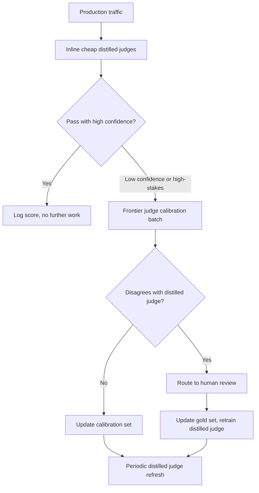

# LLM 评估

评估 LLM 系统与传统机器学习有本质不同。本章介绍在生产环境中衡量质量的指标、方法论和实用做法。这是关于评估**你的**系统；至于如何阅读 MMLU、SWE-bench 和 Arena Elo 等公开模型基准，请参见 [基准与排行榜](03-benchmarks-and-leaderboards.md)。

## 目录

- [为什么 LLM 评估很难](#为什么-llm-评估很难)
- [评估维度](#评估维度)
- [自动化评估方法](#自动化评估方法)
- [LLM-as-Judge（LLM 作为裁判）](#llm-as-judge)
- [人工评估](#人工评估)
- [RAG（检索增强生成）专项评估](#rag-专项评估)
- [构建评估流水线](#构建评估流水线)
- [生产监控](#生产监控)
- [2026 评估演进：超越 LLM-as-Judge](#examples)
- [面试题](#面试问题)
- [参考资料](#参考文献)

---

## 为什么 LLM 评估很难

### 根本挑战

传统机器学习有明确指标（accuracy，准确率；F1；AUC）。LLM 输出是开放式文本，“正确”具有主观性。

| 传统机器学习 | LLM 系统 |
|----------------|-------------|
| 单一正确答案 | 多种有效回答 |
| 客观指标 | 主观质量 |
| 易于自动化 | 需要判断 |
| 静态测试集 | 需要多样化场景 |

### 质量的多个维度

一个回答可能是：
- 正确但写得很差
- 写得很好但不完整
- 完整但不相关
- 相关但不安全

你需要独立衡量多个维度。

---

## 评估维度

### 核心维度

| 维度 | 衡量什么 | 如何评估 |
|-----------|------------------|-----------------|
| **正确性** | 事实是否准确？ | 真实答案，LLM 裁判 |
| **相关性** | 是否回答了问题？ | LLM 裁判，人工 |
| **完整性** | 是否覆盖了所有方面？ | 清单，LLM 裁判 |
| **连贯性** | 是否结构清晰、逻辑合理？ | LLM 裁判，人工 |
| **简洁性** | 是否简明适当？ | Token 数，LLM 裁判 |
| **安全性** | 是否没有有害内容？ | 分类器，LLM 裁判 |
| **有用性** | 是否真的有帮助？ | 人类反馈 |

### 任务特定维度

**对于 RAG（检索增强生成）：**
- Faithfulness（忠实性）：是否基于检索到的上下文？
- Attribution（归因）：是否有正确引用？
- No hallucination（无幻觉）：是否没有编造内容？

**对于代码生成：**
- Executability（可执行性）：是否能运行？
- Correctness（正确性）：是否通过测试？
- Style（风格）：是否遵循约定？

**对于摘要：**
- Coverage（覆盖度）：是否包含关键点？
- Factual consistency（事实一致性）：是否没有引入错误？
- Compression（压缩率）：长度缩减是否合适？

---

## 自动化评估方法

### 精确匹配

最简单的方法，单独使用时很少足够：

```python
def exact_match(prediction: str, reference: str) -> float:
    return float(prediction.strip().lower() == reference.strip().lower())
```

**适用场景：** 单选、多分类、实体抽取

### 包含关键词

```python
def keyword_match(prediction: str, required_keywords: list[str]) -> float:
    prediction_lower = prediction.lower()
    matches = sum(1 for kw in required_keywords if kw.lower() in prediction_lower)
    return matches / len(required_keywords)
```

**适用场景：** 检查是否提到了特定事实

### 语义相似度

```python
def semantic_similarity(prediction: str, reference: str) -> float:
    pred_embedding = embed(prediction)
    ref_embedding = embed(reference)
    return cosine_similarity(pred_embedding, ref_embedding)
```

**适用场景：** 改写检测、一般相似性
**局限：** 高相似度不代表正确

### ROUGE（摘要评估）

衡量 n-gram 重叠：

```python
from rouge_score import rouge_scorer

scorer = rouge_scorer.RougeScorer(['rouge1', 'rouge2', 'rougeL'])

def evaluate_summary(prediction: str, reference: str) -> dict:
    scores = scorer.score(reference, prediction)
    return {
        "rouge1": scores["rouge1"].fmeasure,
        "rouge2": scores["rouge2"].fmeasure,
        "rougeL": scores["rougeL"].fmeasure
    }
```

**局限：** 衡量重叠，不衡量质量

### 代码执行

对于代码生成，执行结果就是事实标准：

```python
def evaluate_code(prediction: str, test_cases: list[dict]) -> dict:
    try:
        exec(prediction, globals())
    except SyntaxError as e:
        return {"syntax_valid": False, "error": str(e)}
    
    passed = 0
    for test in test_cases:
        try:
            result = eval(test["call"])
            if result == test["expected"]:
                passed += 1
        except Exception:
            pass
    
    return {
        "syntax_valid": True,
        "tests_passed": passed,
        "tests_total": len(test_cases),
        "pass_rate": passed / len(test_cases)
    }
```

---

## LLM-as-Judge

使用一个 LLM 来评估另一个 LLM 的输出。

### 基本裁判提示词

```python
JUDGE_PROMPT = """
Evaluate the following response to the user's question.

Question: {question}
Response: {response}
Reference Answer (if available): {reference}

Rate the response on these criteria (1-5 scale):

1. Correctness: Is the information accurate?
2. Relevance: Does it address the question?
3. Completeness: Are all aspects covered?
4. Clarity: Is it well-written and clear?

For each criterion, provide:
- Score (1-5)
- Brief justification

Output as JSON:
{
    "correctness": {"score": X, "reason": "..."},
    "relevance": {"score": X, "reason": "..."},
    "completeness": {"score": X, "reason": "..."},
    "clarity": {"score": X, "reason": "..."},
    "overall": X
}
"""

def llm_judge(question: str, response: str, reference: str = None) -> dict:
    prompt = JUDGE_PROMPT.format(
        question=question,
        response=response,
        reference=reference or "Not provided"
    )
    
    result = judge_model.generate(prompt)
    return json.loads(result)
```

### 成对比较

直接比较两个回答：

```python
PAIRWISE_PROMPT = """
Compare these two responses to the question and determine which is better.

Question: {question}

Response A:
{response_a}

Response B:
{response_b}

Which response is better? Consider:
- Correctness
- Helpfulness
- Clarity
- Completeness

Output your choice (A or B) and explain why.

Choice:
"""

def pairwise_judge(question: str, response_a: str, response_b: str) -> dict:
    prompt = PAIRWISE_PROMPT.format(
        question=question,
        response_a=response_a,
        response_b=response_b
    )
    
    result = judge_model.generate(prompt)
    choice = "A" if "A" in result[:10] else "B"
    
    return {"winner": choice, "explanation": result}
```

### 裁判校准

LLM 裁判存在偏差：

| 偏差 | 描述 | 缓解方式 |
|------|-------------|------------|
| 位置偏差 | 更偏好第一个或最后一个选项 | 随机化顺序 |
| 长度偏差 | 更偏好更长的回答 | 指示忽略长度 |
| 自偏好 | 更偏好自己模型的输出 | 使用不同的裁判模型 |
| 格式偏差 | 更偏好某些格式 | 多样化训练示例 |

```python
def calibrated_pairwise_judge(question: str, response_a: str, response_b: str) -> dict:
    # Run twice with swapped positions
    result1 = pairwise_judge(question, response_a, response_b)
    result2 = pairwise_judge(question, response_b, response_a)
    
    # Check consistency
    result2_adjusted = "A" if result2["winner"] == "B" else "B"
    
    if result1["winner"] == result2_adjusted:
        return {"winner": result1["winner"], "confidence": "high"}
    else:
        return {"winner": "tie", "confidence": "low"}
```

---

## 人工评估

### 何时使用人工评估

| 用例 | 自动化？ | 人工？ |
|----------|-----------|--------|
| 快速迭代 | 是 | 抽样检查 |
| 最终质量评估 | 辅助 | 是 |
| 主观质量 | 否 | 是 |
| 安全评估 | 分类器 | 审核 |
| 边缘案例 | 否 | 是 |

### 标注指南

```markdown
# Response Quality Annotation Guide

## Task
Rate the AI response quality on a 1-5 scale.

## Scale
5 - Excellent: Fully correct, helpful, well-written
4 - Good: Mostly correct, helpful, minor issues
3 - Acceptable: Correct but could be better
2 - Poor: Significant issues, partially helpful
1 - Unacceptable: Wrong, unhelpful, or harmful

## Instructions
1. Read the user question carefully
2. Read the AI response
3. Check for factual accuracy (if verifiable)
4. Assess helpfulness for the user's goal
5. Note any issues (inaccuracies, missing info, unclear)
6. Assign a score

## Examples
[Include 3-5 annotated examples at each score level]
```

### 标注者一致性

```python
from sklearn.metrics import cohen_kappa_score

def calculate_agreement(annotator1: list, annotator2: list) -> dict:
    kappa = cohen_kappa_score(annotator1, annotator2)
    
    exact_agreement = sum(a == b for a, b in zip(annotator1, annotator2))
    exact_pct = exact_agreement / len(annotator1)
    
    return {
        "cohens_kappa": kappa,
        "exact_agreement": exact_pct,
        "interpretation": interpret_kappa(kappa)
    }

def interpret_kappa(kappa: float) -> str:
    if kappa < 0.2: return "Poor"
    if kappa < 0.4: return "Fair"
    if kappa < 0.6: return "Moderate"
    if kappa < 0.8: return "Substantial"
    return "Almost perfect"
```

---

## RAG 专项评估

### RAGAS 指标

RAGAS 提供标准的 RAG 评估指标：

```python
from ragas import evaluate
from ragas.metrics import (
    faithfulness,
    answer_relevancy,
    context_precision,
    context_recall
)

def evaluate_rag(
    questions: list[str],
    contexts: list[list[str]],
    answers: list[str],
    ground_truths: list[str]
) -> dict:
    dataset = Dataset.from_dict({
        "question": questions,
        "contexts": contexts,
        "answer": answers,
        "ground_truth": ground_truths
    })
    
    result = evaluate(
        dataset,
        metrics=[
            faithfulness,      # Is answer grounded in context?
            answer_relevancy,  # Does answer address question?
            context_precision, # Are retrieved contexts relevant?
            context_recall     # Did we retrieve all needed context?
        ]
    )
    
    return result
```

### 忠实性评估

检查回答是否基于上下文：

```python
FAITHFULNESS_PROMPT = """
Given the context and the response, determine if every claim in the 
response is supported by the context.

Context:
{context}

Response:
{response}

For each sentence in the response:
1. Extract the factual claims
2. Check if each claim is supported by the context
3. Mark as SUPPORTED or UNSUPPORTED

Output:
- Total claims: X
- Supported claims: Y
- Faithfulness score: Y/X
- Unsupported claims: [list]
"""

def evaluate_faithfulness(context: str, response: str) -> dict:
    prompt = FAITHFULNESS_PROMPT.format(context=context, response=response)
    result = judge_model.generate(prompt)
    return parse_faithfulness_result(result)
```

### 上下文相关性

评估检索上下文的质量：

```python
def evaluate_context_relevance(query: str, contexts: list[str]) -> dict:
    scores = []
    
    for context in contexts:
        prompt = f"""
        Query: {query}
        Context: {context}
        
        Is this context relevant to answering the query?
        Rate from 1-5 and explain.
        """
        
        result = judge_model.generate(prompt)
        score = extract_score(result)
        scores.append(score)
    
    return {
        "individual_scores": scores,
        "mean_relevance": sum(scores) / len(scores),
        "contexts_above_threshold": sum(1 for s in scores if s >= 3)
    }
```

---

## 构建评估流水线

### 评估数据集结构

```python
@dataclass
class EvalSample:
    id: str
    input: str
    expected_output: str  # Optional ground truth
    context: list[str]    # For RAG
    metadata: dict        # Category, difficulty, etc.

eval_dataset = [
    EvalSample(
        id="q001",
        input="What is the capital of France?",
        expected_output="Paris",
        context=[],
        metadata={"category": "factual", "difficulty": "easy"}
    ),
    # ... more samples
]
```

### 自动化评估流水线

```python
class EvaluationPipeline:
    def __init__(
        self,
        system_under_test,
        evaluators: list[Evaluator],
        dataset: list[EvalSample]
    ):
        self.sut = system_under_test
        self.evaluators = evaluators
        self.dataset = dataset
    
    def run(self) -> EvalReport:
        results = []
        
        for sample in self.dataset:
            # Get prediction
            prediction = self.sut.generate(sample.input)
            
            # Run all evaluators
            scores = {}
            for evaluator in self.evaluators:
                score = evaluator.evaluate(
                    input=sample.input,
                    prediction=prediction,
                    reference=sample.expected_output,
                    context=sample.context
                )
                scores[evaluator.name] = score
            
            results.append({
                "id": sample.id,
                "input": sample.input,
                "prediction": prediction,
                "scores": scores,
                "metadata": sample.metadata
            })
        
        return self.compile_report(results)
    
    def compile_report(self, results: list) -> EvalReport:
        # Aggregate by category, compute statistics
        report = EvalReport()
        
        for metric in self.evaluators:
            scores = [r["scores"][metric.name] for r in results]
            report.add_metric(metric.name, {
                "mean": statistics.mean(scores),
                "std": statistics.stdev(scores),
                "min": min(scores),
                "max": max(scores)
            })
        
        # Breakdown by category
        for category in set(r["metadata"]["category"] for r in results):
            category_results = [r for r in results if r["metadata"]["category"] == category]
            report.add_breakdown(category, self.aggregate(category_results))
        
        return report
```

---

## 生产监控

### 要跟踪的关键指标

```python
PRODUCTION_METRICS = {
    # Quality metrics (sample-based)
    "llm_judge_score": "Mean LLM judge score on sampled responses",
    "faithfulness": "RAG faithfulness on sampled responses",
    
    # User signals
    "thumbs_up_rate": "Positive feedback / total feedback",
    "regeneration_rate": "How often users regenerate",
    "copy_rate": "How often users copy responses",
    
    # Operational
    "error_rate": "Failed generations / total",
    "latency_p50": "Median response time",
    "latency_p99": "99th percentile response time",
    "tokens_per_response": "Average output length",
    
    # Cost
    "cost_per_request": "Average cost per request",
    "daily_cost": "Total daily API spend"
}
```

### 在线评估

```python
class OnlineEvaluator:
    def __init__(self, sample_rate: float = 0.1):
        self.sample_rate = sample_rate
    
    def maybe_evaluate(self, request: dict, response: str) -> None:
        if random.random() > self.sample_rate:
            return
        
        # Async evaluation
        asyncio.create_task(self.evaluate_async(request, response))
    
    async def evaluate_async(self, request: dict, response: str):
        scores = await self.llm_judge(request["query"], response)
        
        # Log to monitoring system
        self.log_metrics({
            "correctness": scores["correctness"],
            "relevance": scores["relevance"],
            "timestamp": datetime.now()
        })
        
        # Alert on low scores
        if scores["overall"] < 3:
            self.alert_low_quality(request, response, scores)
```

### 漂移检测

```python
def detect_quality_drift(
    current_scores: list[float],
    baseline_scores: list[float],
    threshold: float = 0.1
) -> dict:
    current_mean = statistics.mean(current_scores)
    baseline_mean = statistics.mean(baseline_scores)
    
    drift = abs(current_mean - baseline_mean)
    is_significant = drift > threshold
    
    # Statistical test
    stat, p_value = stats.ttest_ind(current_scores, baseline_scores)
    
    return {
        "current_mean": current_mean,
        "baseline_mean": baseline_mean,
        "drift": drift,
        "is_significant": is_significant,
        "p_value": p_value
    }
```

---

## 2026 评估演进：超越 LLM-as-Judge

2023-2024 方案（“把 GPT-4 用作裁判”）对于 v1 系统来说已经足够好，但在三种压力下开始失效：规模化成本、无法被字符串评分器检查的智能体轨迹，以及把检索、记忆和推理混为一谈的基准。到 2026 月，生产环境中的评估栈已经分裂为四个协同工作的层。

### 分层裁判架构



成本计算强迫这种结构：在每条生产轨迹上都运行前沿裁判（Claude Opus 4.7、GPT-5、Gemini Ultra 3）在超过约 100K 次请求/天后就负担不起。蒸馏裁判高频运行，前沿裁判负责校准，人工设定真实标准。

### Galileo Luna-2：大规模蒸馏裁判

[Galileo 的 Luna-2 系列](https://www.galileo.ai/luna-2)（于 2026 年 2 月发布）是一组小型、针对任务的裁判模型，训练数据来自数百万条前沿裁判标签和人工标注。Galileo 公布的数字：

| 指标 | Luna-2 相对于前沿裁判 |
|--------|--------------------------|
| 每次评估成本 | 约低 97% 倍 |
| 延迟 P50 | 约低 10 倍（短响应低于 100ms） |
| 与前沿裁判一致性 | 在已公开基准上达到 88-92% |
| 与人工金标一致性 | 比前沿裁判低 2-3 个点以内 |

问题出在不一致的**形状**上。Luna-2 训练在一套固定的失败模式分类上（是否有依据、是否遵循指令、毒性、PII、偏题、拒答）。超出该分类的内容会退化为默认分数。因此，在生产中站得住脚的模式是：

- **在所有轨迹上内联使用 Luna-2（或等价的 Luna）**，只覆盖它训练中涉及的分类。
- **对采样出的 1-5% 比例轨迹使用前沿裁判**，检测蒸馏裁判与更大模型之间的漂移。
- **当蒸馏裁判返回低置信度时自动回退到前沿裁判**（Luna-2 会输出置信度分数，而不只是标签）。
- **对于训练分布中未出现过的新型失败模式，绝不要只相信蒸馏裁判**：比如新发布的攻击向量、新的用户意图类别，或特定领域的事实性检查。

Galileo 的[公开技术报告](https://www.galileo.ai/research/luna-2)讲解了蒸馏方案，以及 Luna-2 仍然弱于前沿裁判的地方（长时程多步推理、低资源语言）。

其他可对比的已上线蒸馏裁判：

- [Patronus AI Lynx](https://www.patronus.ai/lynx) 用于 groundedness（有依据性），成本曲线相近。
- [Vectara HHEM-2](https://www.vectara.com/blog/hhem) 用于幻觉检测。
- [Arize Phoenix Evals](https://arize.com/docs/phoenix/) 提供开源蒸馏裁判和校准支架。

### Sierra tau2-bench 及其变体

[Sierra 的 tau-bench](https://github.com/sierra-research/tau-bench)（2024）是第一个在模拟业务环境中度量工具使用成功率的真实智能体基准。2026 后续版本将这个思路推广开来。

[tau2-bench](https://github.com/sierra-research/tau-bench)（于 2026 年第一季度发布）是一次重大更新：

- **更多领域**：零售、航空、金融、医疗、通信。
- **Pass^k 指标**：衡量智能体在同一任务的 **全部** k 次重复试验上成功的概率。Pass^1 是传统成功率。Pass^4 才能告诉你智能体是否可靠。
- **基于验证器的评分**：使用确定性的后置条件（订单已取消、退款已存在、座位已改签），而不是由 LLM 评分的对话文本打分。

姐妹基准：

- **[tau-Voice](https://sierra.ai/blog/tau-voice)**：语音到语音变体，智能体在语音通道上操作。它能捕捉一类文本基准完全漏掉的失败（时序、打断处理、从 ASR 错误中恢复）。
- **[tau-Knowledge](https://sierra.ai/blog/tau-knowledge)**：在仿真中加入智能体必须检索的内部知识库。把“智能体是否检索到”与“智能体是否采取行动”解耦。

在实践中，pass^k 指标最有可操作性。Pass^1 为 70%、Pass^4 为 12% 说明“智能体在简单路径上能工作，但无法从任何小扰动中恢复”。这正是生产团队在规模化上线智能体之前最需要的信号。

### 作为裁判的智能体：轨迹评分

LLM-as-judge 评分的是最终答案。Agent-as-judge 评分的是**轨迹**：智能体经历的工具调用序列、中间状态、重试以及推理步骤。

这是必要的，因为长时程智能体会以最终答案无法揭示的方式失败：

- **答案正确，推理错误**：智能体在一次糟糕的计算后猜对了数字。
- **答案正确，但路径危险**：智能体先尝试了四次破坏性工具调用，直到第五次（安全的）调用才碰巧成功。
- **答案正确，但成本失控**：智能体做了 47 次检索调用，而 2 次就已经足够。

生产中的模式：

- **过程奖励模型（PRM，Process Reward Models）** 独立为轨迹中的每一步打分。PRM 最初是为数学训练的（OpenAI 的 [Let's Verify Step by Step](https://arxiv.org/abs/2305.20050)），后来已经泛化：到 2026 年，已经有针对代码、工具使用轨迹和多轮对话的 PRM。
- **辅助的“审计员”智能体**（通常与被评分模型不同）会重放轨迹，在每个节点上问“这一步是否有正当理由？”，并输出带分级的转录。这就是 [DeepMind agent-as-judge 论文](https://arxiv.org/abs/2410.10934)（2024 年 10 月，经过 2026 进一步完善）所形式化的内容。
- **这类评分中出现的轨迹失败模式**：
  - **推理-行动不匹配**：智能体的思维链说的是一回事，工具调用做的是另一回事。
  - **过度检索**：检索调用比需要的更多。
  - **工具乱试**：用略有变化的参数反复尝试同一个工具，直到某次奏效。
  - **过早定论**：证据还没到齐就写出答案。
  - **自我越狱**：智能体自己的中间推理绕过了自己的安全策略。

[Anthropic Constitutional Classifiers 论文](https://www.anthropic.com/research/constitutional-classifiers)（2025 年 1 月）及后续工作表明，用 constitutional classifier 评判轨迹，能捕捉到相当一部分最终答案评分完全漏掉的安全失败。

### HaluMem：操作级幻觉基准

[HaluMem](https://arxiv.org/abs/2511.03506)（2025 年 11 月）是第一个把幻觉评估拆解到**操作**层面的基准，这些操作会产生或使用记忆，而不只是看最终答案：

| 阶段 | 测量内容 | 典型失败 |
|-------|------------------|-----------------|
| 抽取 | 写入记忆的事实与来源一致 | 智能体存成了“用户对花生过敏”，而来源说的是“用户不喜欢花生” |
| 更新 | 相对于先前状态，记忆更新是否正确 | 新记忆与旧记忆冲突，却没有解决冲突 |
| 问答 | 答案是否基于存储的记忆 | 智能体其实在用参数知识回答，却假装引用了记忆 |

HaluMem 论文最重要的洞见是：一个系统即便在标准幻觉基准上的问答准确率很高，也可能在抽取阶段犯下灾难性的错误。聚合指标掩盖了错误真正产生的阶段，而只有那个阶段才是你真正能修的。

实用方案：

- 用**按操作评估**来为记忆层埋点：每次写入、更新和读取都有单独评估。
- 针对每种操作类型使用蒸馏裁判（Luna-2 或类似模型）。
- 持续跟踪每个阶段的错误率；5% 级别的抽取错误会在数千次操作后累积成一个完全不可靠的智能体。

### 五月份的生产评估栈 2026

面向客户的 Agent 产品，一个可辩护的评估栈大致如下：

```mermaid
flowchart LR
    A[User turn] --> B[Agent runs]
    B --> C[Trajectory logged]
    C --> D[Distilled judges run inline on each tool call and the final answer]
    D --> E[Per-step PRM trajectory score]
    E --> F[Auditor agent on 1-5 percent sample]
    F --> G[Frontier judge on flagged or high-stakes traces]
    G --> H[Human review on disagreements]
    H --> I[Gold set update]
    I --> J[Distilled judge retraining quarterly]
```



这并不免费，但它比对每条轨迹都运行前沿判官要便宜得多，而且它还能捕捉到纯最终答案评分看不到的失败类别（过程错误、记忆错误、轨迹错误）。

### 面试要点

- “LLM-as-judge（将大语言模型作为判官）”现在是最坏情况下的兜底，而不是默认方案。
- 严肃的团队会把 **蒸馏判官内联 + 前沿判官用于校准 + 人工审查用于真实值** 组合起来。
- 对于 Agent，**评判轨迹，而不只是答案**。Pass^k、PRM 和 agent-auditor（Agent 审计员）就是这样做的。
- 对于具备记忆的系统，**要分别衡量提取、更新和质量保证**；汇总准确率会掩盖故障位置。

---

## 面试问题

### 问：你会如何评估一个 RAG（检索增强生成）系统？

**强答案：**
我会在多个层面进行评估：

**1. 检索质量：**
- Precision@K（前 K 命中率）：检索到的文档是否相关？
- Recall@K（前 K 召回率）：我们是否找到了所有相关文档？
- MRR（平均倒数排名）：最佳文档的排名是否足够靠前？

**2. 生成质量：**
- Faithfulness（忠实性）：回答是否以上下文为依据？
- Relevance（相关性）：它是否回答了问题？
- Completeness（完整性）：是否覆盖了所有方面？

**3. 端到端：**
- 与真实答案相比的回答正确性
- 用户满意度（点赞/点踩）

**工具：**
- RAGAS 用于自动化指标
- LLM-as-judge 用于主观质量评估
- 人工评估作为金标准

**流程：**
1. 创建评估数据集（100+ 个样本）
2. 每次变更都运行自动化指标
3. 用 LLM 判官做更深入的分析
4. 用人工审查做最终验证
5. 在生产环境中持续监控

### 问：LLM-as-judge 的局限性是什么？

**强答案：**
有几类已知偏差和局限：

**偏差：**
- 位置偏差：在比较中更偏爱第一个选项
- 长度偏差：更偏爱更长的回答
- 自我偏好：可能更偏爱自身模型的风格
- 格式偏差：会受到格式影响

**缓解方法：**
- 交换位置并检查一致性
- 使用不同的模型作为判官
- 用人工标注做校准
- 使用多个判官提示词

**何时不可靠：**
- 高度领域特定的内容
- 微妙的事实错误
- 文化/上下文细微差异
- 安全边界案例

**最佳实践：**
- 用于快速迭代
- 与人工判断进行校准
- 不要只依赖 LLM 判官
- 高风险决策要人工审查

---

## 参考文献

- Es 等人，《RAGAS：检索增强生成的自动化评估》(2023)
- Zheng 等人，《用 MT-Bench 和 Chatbot Arena 评判 LLM-as-a-Judge》(2023)
- RAGAS：https://docs.ragas.io/
- OpenAI Evals：https://github.com/openai/evals

---

*下一篇：[可观测性](02-observability.md)*
