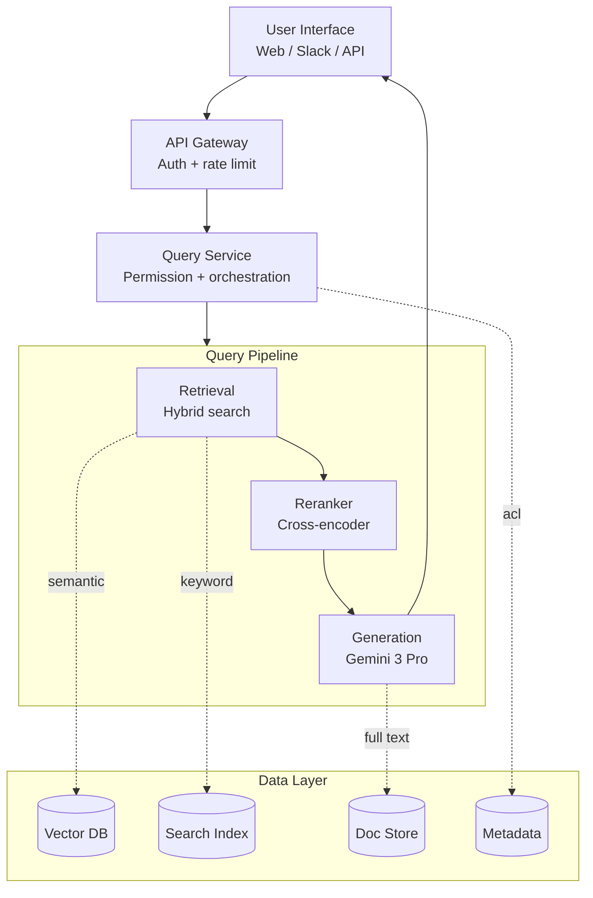
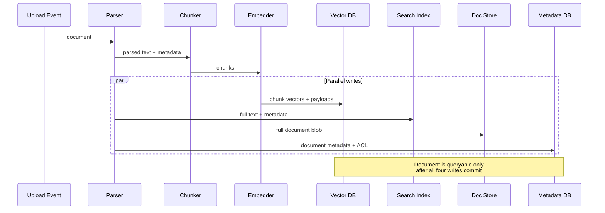
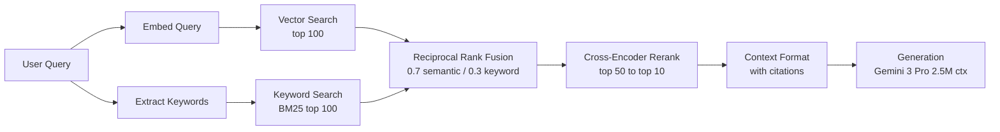

# 案例研究：企业 RAG（Retrieval-Augmented Generation，检索增强生成）系统

本案例研究将演示如何为企业文档搜索设计一个生产级 RAG 系统。内容涵盖需求收集、架构决策和实现细节。

## 目录

- [问题陈述](#问题陈述)
- [需求分析](#需求分析)
- [系统架构](#系统架构)
- [组件深入剖析](#组件深入剖析)
- [扩展性考虑](#扩展性考量)
- [成本分析](#成本分析)
- [经验总结](#经验总结)
- [面试讲解](#面试讲解流程)

---

## 问题陈述

### 场景

一家金融服务公司希望为其内部文档构建一个 AI 驱动的搜索系统：
- 500,000 份文档（政策、流程、研究报告）
- 5,000 名员工，分布于多个部门
- 文档每日更新
- 严格的合规与审计要求
- 需要回答带有来源引用的问题

### 当前痛点

- 员工每天花费 2 小时以上搜索信息
- 关键词搜索返回过多无关结果
- 知识分散在各个部门之间
- 新员工需要数月才能变得高效

---

## 需求分析

### 功能需求

| 需求 | 优先级 | 说明 |
|-------------|----------|-------|
| 自然语言问答（Natural language Q&A） | P0 | 核心功能 |
| 来源引用（Source citations） | P0 | 合规要求 |
| 多文档推理（Multi-document reasoning） | P1 | 连接不同文档中的信息 |
| 追问（Follow-up questions） | P1 | 对话上下文 |
| 文档摘要（Document summarization） | P2 | 长文档快速概览 |

### 非功能性需求

| 需求 | 目标 | 理由 |
|-------------|--------|-----------|
| 延迟（P95） | < 5 seconds | 用户体验 |
| 准确率 | > 90% | 信任与采用 |
| 可用性 | 99.9% | 关键业务 |
| 并发用户数 | 500 | 峰值使用 |
| 文档新鲜度 | < 1 hour | 政策更新 |

### 安全需求

- 基于角色的访问控制（RBAC）
- 所有查询的审计日志
- 数据不得离开公司网络
- PII（Personally Identifiable Information，个人身份信息）检测与处理

---

## 系统架构

### 高层架构

```
┌─────────────────────────────────────────────────────────────────────────┐
│                           User Interface                                │
│  (Web App, Slack Bot, API)                                             │
└─────────────────────────────┬───────────────────────────────────────────┘
                              │
                              ▼
┌─────────────────────────────────────────────────────────────────────────┐
│                          API Gateway                                    │
│  • Authentication    • Rate Limiting    • Request Routing              │
└─────────────────────────────┬───────────────────────────────────────────┘
                              │
                              ▼
┌─────────────────────────────────────────────────────────────────────────┐
│                        Query Service                                    │
│  • Query understanding   • Permission check   • Orchestration          │
└─────────────────────────────┬───────────────────────────────────────────┘
                              │
        ┌─────────────────────┼─────────────────────┐
        │                     │                     │
        ▼                     ▼                     ▼
┌───────────────┐   ┌───────────────┐   ┌───────────────┐
│   Retrieval   │   │   Reranking   │   │  Generation   │
│   Service     │   │   Service     │   │   Service     │
│               │   │               │   │               │
│ • Hybrid      │   │ • Cross-      │   │ • LLM         │
│   search      │   │   encoder     │   │ • Prompt      │
│ • Filtering   │   │ • Scoring     │   │   building    │
└───────┬───────┘   └───────────────┘   └───────────────┘
        │
        ▼
┌─────────────────────────────────────────────────────────────────────────┐
│                        Data Layer                                       │
│                                                                         │
│  ┌─────────────┐  ┌─────────────┐  ┌─────────────┐  ┌─────────────┐   │
│  │  Vector DB  │  │ Search Index│  │  Doc Store  │  │  Metadata   │   │
│  │  (Qdrant)   │  │ (Elastic)   │  │   (S3)      │  │  (Postgres) │   │
│  └─────────────┘  └─────────────┘  └─────────────┘  └─────────────┘   │
│                                                                         │
└─────────────────────────────────────────────────────────────────────────┘

┌─────────────────────────────────────────────────────────────────────────┐
│                      Ingestion Pipeline                                 │
│  Document Upload → Parse → Chunk → Embed → Index → Store Metadata      │
└─────────────────────────────────────────────────────────────────────────┘
```

渲染为流程图（分层系统在查询流水线中展开，并在数据层收敛）：



### 技术选型（Dec 2025 Update）

| 组件 | 选择 | 理由 |
|-----------|--------|-----------|
| **Primary LLM** | Gemini 3.0 Pro | **2.5M context** 可原生处理 100+ 文档，而不会碎片化 |
| **Agentic LLM** | GPT-5.2 | 面向复杂跨文档分析的业界领先工具使用准确率 |
| **Retriever** | Gemini 3 Flash | 面向超大上下文窗口的低成本检索 |
| **Embeddings** | text-embedding-3-large | 质量成熟且成本高效 |
| **Vector DB** | Qdrant（Self-hosted，自托管） | 性能、过滤能力，以及本地部署合规 |
| **Reranker** | BGE-Reranker-v2-X | 开源 SoTA（State-of-the-Art，最先进）且适合本地隔离环境 |

> [!NOTE]
> **转变：** 生产团队已经从 "Small Chunk RAG" 转向 **"Balanced Context RAG"**。随着每个主流前沿模型都具备 1M-2M token 的上下文窗口，我们不再需要寻找“完美的 512-token 分块”。我们改为检索整段文档片段（10k-50k token），让模型的原生注意力机制去处理关键内容。

---

## 组件深入剖析

### 文档摄取流水线（Document Ingestion Pipeline）

```python
class IngestionPipeline:
    def __init__(self):
        self.parser = DocumentParser()
        self.chunker = SemanticChunker(
            chunk_size=512,
            chunk_overlap=50
        )
        self.embedder = OpenAIEmbedder(model="text-embedding-3-large")
        self.vector_db = QdrantClient()
        self.metadata_db = PostgresClient()
    
    async def ingest(self, document: Document, user_context: UserContext):
        # 1. Parse document
        parsed = self.parser.parse(document)
        
        # 2. Extract metadata
        metadata = self.extract_metadata(parsed, document)
        
        # 3. Chunk
        chunks = self.chunker.chunk(parsed.text)
        
        # 4. Generate embeddings (batch)
        embeddings = await self.embedder.embed_batch([c.text for c in chunks])
        
        # 5. Store in vector DB with metadata
        points = [
            {
                "id": f"{document.id}_{i}",
                "vector": embedding,
                "payload": {
                    "document_id": document.id,
                    "chunk_index": i,
                    "text": chunk.text,
                    "department": metadata.department,
                    "access_level": metadata.access_level,
                    "created_at": metadata.created_at.isoformat()
                }
            }
            for i, (chunk, embedding) in enumerate(zip(chunks, embeddings))
        ]
        
        await self.vector_db.upsert(collection="documents", points=points)
        
        # 6. Store full document
        await self.doc_store.put(document.id, parsed.text)
        
        # 7. Store metadata
        await self.metadata_db.insert_document(document.id, metadata)
        
        # 8. Index in Elasticsearch for keyword search
        await self.es_client.index(
            index="documents",
            id=document.id,
            body={"text": parsed.text, **metadata.to_dict()}
        )
```

代码看起来像一条线性序列，但其中四次写入是并行发生的。序列图可以明确展示这种扇出，这对于理解部分失败模式很重要：



### 查询处理（Query Processing）

```python
class QueryService:
    def __init__(self):
        self.retriever = HybridRetriever()
        self.reranker = CohereReranker()
        self.generator = LLMGenerator()
        self.guardrails = GuardrailPipeline()
    
    async def process_query(
        self,
        query: str,
        user_context: UserContext,
        conversation_history: list[Message] = None
    ) -> QueryResponse:
        
        # 1. Input guardrails
        guardrail_result = self.guardrails.check_input(query)
        if not guardrail_result.passed:
            return QueryResponse(
                answer="I cannot help with that request.",
                blocked=True,
                reason=guardrail_result.reason
            )
        
        # 2. Query understanding (optional: rewrite query)
        processed_query = await self.understand_query(query, conversation_history)
        
        # 3. Retrieve candidates with permission filtering
        candidates = await self.retriever.search(
            query=processed_query,
            filters=self.build_permission_filter(user_context),
            top_k=50
        )
        
        # 4. Rerank
        reranked = await self.reranker.rerank(
            query=processed_query,
            documents=candidates,
            top_k=10
        )
        
        # 5. Build context
        context = self.build_context(reranked)
        
        # 6. Generate answer
        answer = await self.generator.generate(
            query=query,
            context=context,
            conversation_history=conversation_history
        )
        
        # 7. Output guardrails
        guardrail_result = self.guardrails.check_output(answer, context)
        if not guardrail_result.passed:
            answer = self.fallback_response()
        
        # 8. Build response with citations
        return QueryResponse(
            answer=answer,
            sources=[self.format_source(doc) for doc in reranked[:5]],
            confidence=self.calculate_confidence(reranked)
        )
    
    def build_permission_filter(self, user_context: UserContext) -> dict:
        return {
            "should": [
                {"key": "access_level", "match": {"value": "public"}},
                {"key": "department", "match": {"value": user_context.department}},
                {"key": "access_list", "match": {"any": [user_context.user_id]}}
            ]
        }
```

### 混合检索（Hybrid Retrieval）

```python
class HybridRetriever:
    def __init__(self, vector_weight: float = 0.7, keyword_weight: float = 0.3):
        self.vector_db = QdrantClient()
        self.es_client = ElasticsearchClient()
        self.embedder = OpenAIEmbedder()
        self.vector_weight = vector_weight
        self.keyword_weight = keyword_weight
    
    async def search(
        self,
        query: str,
        filters: dict,
        top_k: int = 50
    ) -> list[Document]:
        
        # Parallel retrieval
        vector_results, keyword_results = await asyncio.gather(
            self.vector_search(query, filters, top_k * 2),
            self.keyword_search(query, filters, top_k * 2)
        )
        
        # Reciprocal Rank Fusion
        fused = self.rrf_fusion(
            [vector_results, keyword_results],
            weights=[self.vector_weight, self.keyword_weight],
            k=60
        )
        
        return fused[:top_k]
    
    async def vector_search(self, query: str, filters: dict, top_k: int):
        query_embedding = await self.embedder.embed(query)
        
        results = await self.vector_db.search(
            collection="documents",
            query_vector=query_embedding,
            query_filter=filters,
            limit=top_k
        )
        
        return [
            Document(
                id=r.payload["document_id"],
                chunk_id=r.id,
                text=r.payload["text"],
                score=r.score,
                metadata=r.payload
            )
            for r in results
        ]
    
    def rrf_fusion(self, result_lists: list, weights: list, k: int = 60) -> list:
        scores = defaultdict(float)
        docs = {}
        
        for results, weight in zip(result_lists, weights):
            for rank, doc in enumerate(results):
                rrf_score = weight / (k + rank + 1)
                scores[doc.chunk_id] += rrf_score
                docs[doc.chunk_id] = doc
        
        sorted_ids = sorted(scores.keys(), key=lambda x: scores[x], reverse=True)
        return [docs[id] for id in sorted_ids]
```

下图概览了混合检索流程。两个并行检索器先工作，然后 RRF 以加权排名融合结果，再由 cross-encoder 对候选结果重排，最后进行上下文格式化：



### 大上下文生成（Generation with Massive Context，Dec 2025）

```python
class GeminiGenerator:
    def __init__(self):
        self.client = genai.GenerativeModel("gemini-3.0-pro")
    
    async def generate(
        self,
        query: str,
        context_docs: list[Document],
        conversation_history: list[Message] = None
    ) -> str:
        # 2.5M context allows passing ENTIRE documents, not just snippets
        system_instruction = """
        You are an enterprise knowledge assistant. 
        Analyze the provided documents to answer the query accurately.
        Cite every claim using [[DocName:PageNumber]] format.
        """
        
        contents = [{"text": doc.text} for doc in context_docs]
        contents.append({"text": f"User Query: {query}"})
        
        response = await self.client.generate_content_async(
            contents,
            generation_config=genai.types.GenerationConfig(temperature=0.0)
        )
        return response.text
```

> [!TIP]
> **生产选择 vs 前沿尝试**
> 虽然 Gemini 3.1 Pro 提供了 1M-token 窗口，许多生产系统仍然默认使用 **Claude Sonnet 4.6** 或 **GPT-5.5** 作为主生成模型。
> 
> **原因：**
> - **成熟度**：已有 12 个多月的生产运行记录。
> - **可预测性**：已知的延迟模式，并且在长尾请求上“幻觉峰值”更少。
> - **SDK 稳定性**：与 LangGraph 和 LlamaIndex 等框架深度集成。
> - **成本**：面向高吞吐标准 RAG 的优化定价。

---

## 扩展性考量

### 处理 500K 文档

```python
# Sharding strategy for Qdrant
qdrant_config = {
    "collection": "documents",
    "vectors": {
        "size": 3072,  # text-embedding-3-large
        "distance": "Cosine"
    },
    "optimizers": {
        "indexing_threshold": 20000  # Build index after 20K points
    },
    "replication_factor": 2,  # High availability
    "shard_number": 4  # Distribute across nodes
}
```

### 处理 500 个并发用户

```
Load Balancer
     │
     ├──► Query Service (replica 1)
     ├──► Query Service (replica 2)
     ├──► Query Service (replica 3)
     └──► Query Service (replica 4)
            │
            ├──► Vector DB (3-node cluster)
            ├──► LLM API (with retry/fallback)
            └──► Elasticsearch (3-node cluster)
```

### 缓存策略

```python
class QueryCache:
    def __init__(self):
        self.exact_cache = Redis(ttl=3600)  # 1 hour
        self.semantic_cache = SemanticCache(threshold=0.95, ttl=1800)
    
    async def get_or_compute(self, query: str, user_context: UserContext) -> QueryResponse:
        # Check exact cache
        cache_key = self.make_key(query, user_context.permissions)
        cached = await self.exact_cache.get(cache_key)
        if cached:
            return cached
        
        # Check semantic cache
        similar = await self.semantic_cache.find_similar(query, user_context.permissions)
        if similar:
            return similar
        
        # Compute
        response = await self.query_service.process_query(query, user_context)
        
        # Cache result
        await self.exact_cache.set(cache_key, response)
        await self.semantic_cache.add(query, user_context.permissions, response)
        
        return response
```

---

## 成本分析

### 每月成本估算（500 用户，100 次查询/用户/天）

| 组件 | 计算方式 | 每月成本 |
|-----------|-------------|--------------|
| 大语言模型（LLM, Large Language Model）(Claude Sonnet) | 1.5M queries × 2K tokens × $3/1M in + 500 tokens × $15/1M out | ~$20,250 |
| 向量嵌入（Embeddings） | 1.5M queries × $0.13/1M | ~$200 |
| 重排序（Reranking, Cohere） | 1.5M × 50 docs × $0.001/1K | ~$75 |
| 向量数据库（Vector DB, Qdrant Cloud） | 3-node cluster | ~$1,500 |
| Elasticsearch | 3-node cluster | ~$2,000 |
| 计算（Compute, Query Service） | 4 instances | ~$1,000 |
| **总计** | | **~$25,000/month** |

### 成本优化机会

1. **缓存（Caching）**：30% 缓存命中率 → 节省 $6K 的 LLM 成本
2. **模型路由（Model routing）**：将简单查询路由到更便宜的模型 → 节省 40%
3. **批量嵌入（Batch embeddings）**：使用异步批处理 → 节省 20%
4. **自托管重排序器（Self-hosted reranker）**：用开源方案替代 Cohere → 取消 $75

---

## 经验总结

### 做得好的地方

1. **混合检索（Hybrid search）**：语义检索 + 关键词检索显著提升了召回率
2. **重排序（Reranking）**：Top-5 精确率提升了 15%
3. **清晰的引用（Citations）**：建立了用户信任
4. **检索阶段的权限过滤（Permission filtering at retrieval）**：无需事后过滤

### 遇到的挑战

1. **表格抽取**：包含复杂表格的 PDF 需要自定义解析
2. **缩略词（Acronyms）**：领域特定缩略词需要展开
3. **新鲜度（Freshness）**：1 小时的新鲜度要求流式摄入
4. **长文档**：100+ 页文档需要分层切块（Hierarchical chunking）

### 如果重来，我们会怎么做

1. 更早开始更好的文档解析
2. 在扩展前先构建评估流水线（Evaluation pipeline）
3. 从第一天起实现查询日志（Query logging）
4. 更早与用户建立反馈闭环（Feedback loop）

---

## 面试讲解流程

### 如何在面试中展示这部分

**开场（2 分钟）：**  
"I will design an enterprise RAG system for internal document search. Let me clarify a few requirements first..."

**需求确认（3 分钟）：**
- 询问规模、延迟和准确率目标
- 澄清安全要求
- 了解文档类型和更新频率

**宏观设计（5 分钟）：**
- 绘制架构图
- 解释关键组件
- 论证技术选型

**深入讲解（10 分钟）：**
- 检索策略（Hybrid search，说明原因）
- 安全性（检索时的权限过滤）
- 生成（Prompt engineering，引用）
- 扩展性（Sharding、缓存、副本）

**权衡分析（5 分钟）：**
- 成本 vs 延迟（模型选择）
- 准确率 vs 延迟（重排序增加耗时）
- 新鲜度 vs 成本（Streaming vs Batch）

**监控（2 分钟）：**
- 关键指标（延迟、准确率、用户反馈）
- 如何发现问题
- 持续改进闭环（Continuous improvement loop）

---

*Next: [Case Study: Conversational AI Agent](02-conversational-agent.md)*
