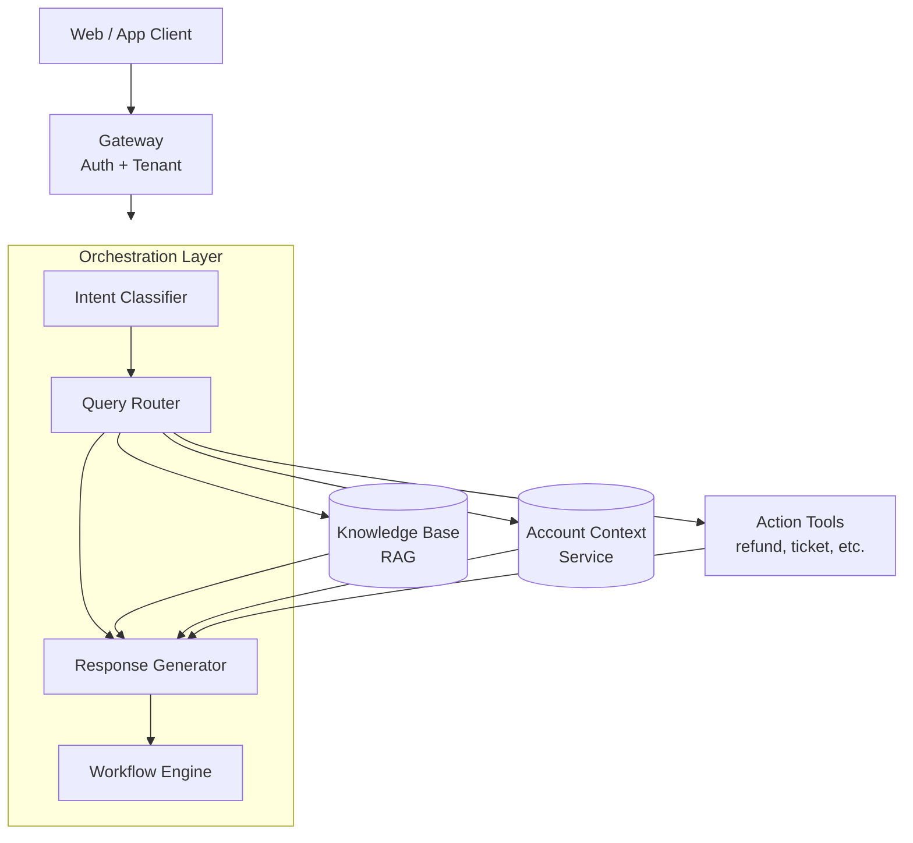
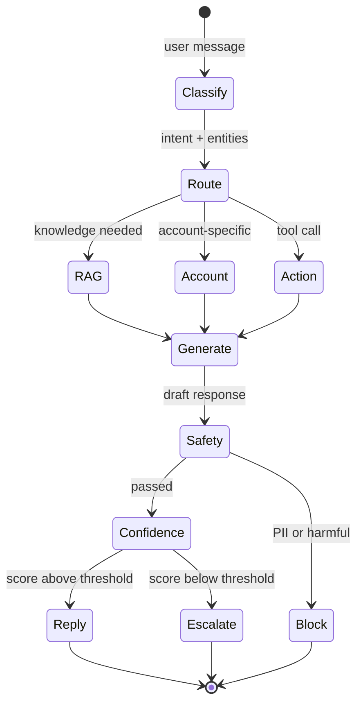
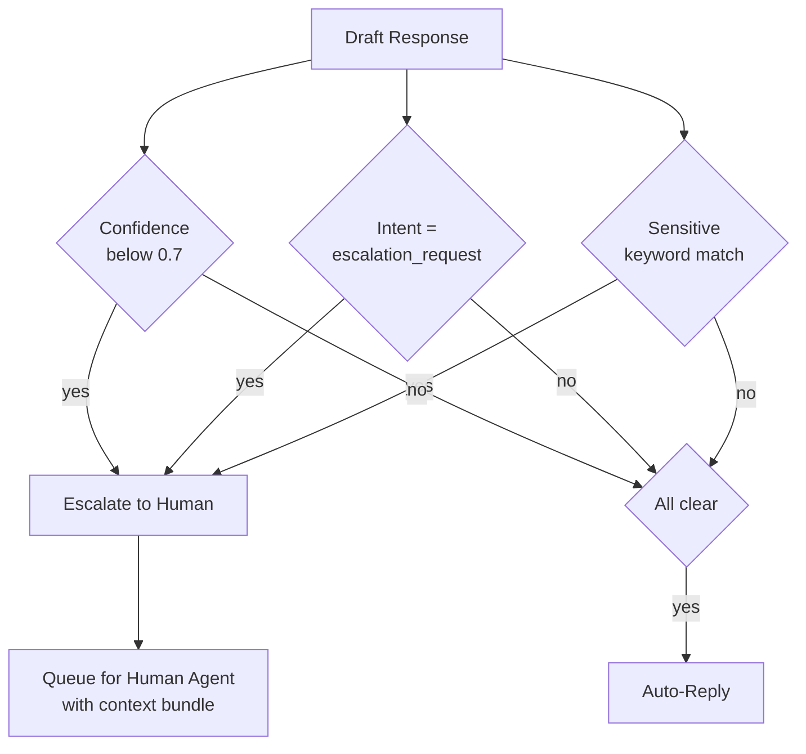

# 案例研究：Customer Support Conversational Agent（客户支持对话代理）

本案例研究介绍了为一家 B2B（企业对企业）SaaS（软件即服务）公司设计生产级客户支持代理的过程。

## 目录

- [问题陈述](#问题陈述)
- [需求分析](#需求分析)
- [架构设计](#架构设计)
- [组件深入解析](#组件深入解析)
- [可靠性模式](#可靠性模式)
- [评估与监控](#评估与监控)
- [成本分析](#成本分析)
- [经验总结](#经验总结)
- [面试讲解流程](#面试讲解流程)

---

## 问题陈述

**公司：** 拥有 50K 企业客户的 B2B（企业对企业）SaaS（软件即服务）平台

**当前状态：**
- 每月 500K 支持工单
- 平均响应时间：4 小时
- 客户满意度（CSAT，Customer Satisfaction）：72%
- 支持团队：100 名坐席

**目标：**
- 将常见查询的响应时间降至 < 5 分钟
- 将 CSAT 提升至 > 85%
- 无需人工介入处理 60% 的工单
- 维护升级工单的处理质量

---

## 需求分析

### 功能性需求

| 需求 | 说明 | 优先级 |
|-------------|-------------|----------|
| 查询理解 | 分类意图、抽取实体 | P0 |
| 知识检索 | 检索产品文档、常见问题、历史工单 | P0 |
| 账户上下文 | 访问用户订阅、历史 | P0 |
| 响应生成 | 自然、准确、有帮助的回复 | P0 |
| 对话记忆 | 多轮上下文 | P0 |
| 动作执行 | 创建工单、触发工作流 | P1 |
| 人工升级 | 必要时无缝交接 | P0 |
| 计费咨询 | 处理敏感财务数据 | P1 |

### 非功能性需求

| 需求 | 目标 | 理由 |
|-------------|--------|-----------|
| 延迟（TTFT） | < 1s | 符合用户对聊天的预期 |
| 延迟（完整） | < 5s | 维持参与度 |
| 可用性 | 99.9% | 业务关键 |
| 准确率 | > 95% | 客户信任 |
| 升级率 | < 40% | 成本效率 |
| CSAT | > 85% | 业务目标 |

### 安全需求

- 日志中不得包含 PII
- 租户隔离（客户只能看到自己的数据）
- 所有动作都要有审计追踪
- SOC 2 合规

---

## 架构设计

### 高层架构

```
┌─────────────────────────────────────────────────────────────────┐
│                      CUSTOMER SUPPORT AGENT                      │
├─────────────────────────────────────────────────────────────────┤
│                                                                  │
│  ┌─────────────┐     ┌─────────────┐     ┌─────────────┐        │
│  │   Web/App   │────▶│   Gateway   │────▶│    Auth     │        │
│  │   Client    │     │             │     │  + Tenant   │        │
│  └─────────────┘     └──────┬──────┘     └─────────────┘        │
│                             │                                    │
│                             ▼                                    │
│  ┌──────────────────────────────────────────────────────────┐   │
│  │                   ORCHESTRATION LAYER                     │   │
│  │  ┌────────────────────────────────────────────────────┐  │   │
│  │  │  Intent        Query          Response    Workflow │  │   │
│  │  │  Classifier → Router →        Generator → Engine   │  │   │
│  │  └────────────────────────────────────────────────────┘  │   │
│  └──────────────────────────────────────────────────────────┘   │
│                             │                                    │
│         ┌───────────────────┼───────────────────┐               │
│         ▼                   ▼                   ▼               │
│  ┌─────────────┐     ┌─────────────┐     ┌─────────────┐        │
│  │  Knowledge  │     │   Account   │     │   Action    │        │
│  │    Base     │     │   Context   │     │   Tools     │        │
│  │   (RAG)     │     │   Service   │     │             │        │
│  └─────────────┘     └─────────────┘     └─────────────┘        │
│                                                                  │
└─────────────────────────────────────────────────────────────────┘
```

以分层流程呈现。编排层会分发到三个并行的上下文来源，然后在响应生成器中将它们组装起来：



### 对话流程

```
User Message
    │
    ▼
┌─────────────────┐
│ Intent Classify │─── billing, technical, account, general, escalation
└────────┬────────┘
         │
         ▼
┌─────────────────┐
│ Query Routing   │─── Which knowledge sources? Which tools?
└────────┬────────┘
         │
    ┌────┴────┬────────────┐
    ▼         ▼            ▼
┌───────┐ ┌───────┐ ┌──────────┐
│  RAG  │ │Account│ │ Actions  │
│ Query │ │Context│ │ (if any) │
└───┬───┘ └───┬───┘ └────┬─────┘
    │         │          │
    └────┬────┴──────────┘
         │
         ▼
┌─────────────────┐
│    Generate     │
│    Response     │
└────────┬────────┘
         │
         ▼
┌─────────────────┐
│  Safety Check   │─── PII, harmful, off-topic
└────────┬────────┘
         │
         ▼
┌─────────────────┐
│  Confidence     │─── Low confidence? Escalate
│    Check        │
└────────┬────────┘
         │
         ▼
    Response / Escalation
```

一次对话轮次是一个状态机。对成本和信任最关键的两个关口是 *安全性*（离开系统前必须通过）和 *置信度*（决定是升级还是自动回复）：



---

## 组件深入解析

### 意图分类（Intent Classification，2025 年 12 月）

```python
class IntentClassifier:
    async def classify(self, message: str, history: list[dict]) -> dict:
        # Using GPT-5.5-mini for <100ms classification latency
        result = await client.chat.completions.create(
            model="gpt-5.2-mini",
            messages=[{"role": "user", "content": message}],
            response_format={"type": "json_object"}
        )
        return json.loads(result.choices[0].message.content)
```

### 知识库（Gemini 3 Flash RAG）

```python
class SupportKnowledgeBase:
    async def retrieve(self, query: str, context_window: int = 1_000_000) -> list[dict]:
        # Using Gemini 3 Flash for massive context retrieval
        # No more 'reranking' needed for many standard support tasks
        results = await self.sources.search(query, limit=50) 
        return results
```

### 响应生成（Claude Sonnet 4.6）

```python
class ResponseGenerator:
    async def generate(self, query: str, context: list[dict]) -> dict:
        # Claude Sonnet 4.6 for 'Hybrid Reasoning'
        # Toggle 'Thinking' mode for complex billing issues
        is_complex = self.detect_complexity(query)
        
        response = await self.anthropic.messages.create(
            model="claude-3-7-sonnet-20250219",
            thinking={"enabled": is_complex, "budget_tokens": 2048},
            messages=[{"role": "user", "content": f"Context: {context}\nQuery: {query}"}]
        )
        return {"response": response.content[0].text}
```

> [!NOTE]
> **生产经验：** 虽然 Gemini 3 Flash 非常适合高吞吐检索，但对于许多已经围绕其特定性格和拒绝模式花了数月时间微调 guardrails（安全护栏）的支持团队来说，**Claude 3.5 Sonnet** 仍然是最“稳定”的生成器。

---

## 可靠性模式

### 基于置信度的升级

```python
class EscalationHandler:
    def __init__(self, confidence_threshold: float = 0.7):
        self.threshold = confidence_threshold
    
    async def check_escalation(
        self,
        response: dict,
        intent: str,
        user_request: str
    ) -> dict:
        should_escalate = False
        reason = None
        
        # Low confidence
        if response["confidence"] < self.threshold:
            should_escalate = True
            reason = "low_confidence"
        
        # Explicit escalation request
        if intent == "escalation_request":
            should_escalate = True
            reason = "user_requested"
        
        # Sensitive topics
        if await self.is_sensitive(user_request):
            should_escalate = True
            reason = "sensitive_topic"
        
        if should_escalate:
            return await self.create_escalation(response, reason)
        
        return {"escalate": False, "response": response}
    
    async def is_sensitive(self, message: str) -> bool:
        sensitive_keywords = [
            "legal", "lawsuit", "lawyer",
            "refund", "cancel subscription",
            "competitor", "data breach"
        ]
        return any(kw in message.lower() for kw in sensitive_keywords)
```

升级决策结合了三个独立信号。任一信号触发都会转人工。把它可视化为决策树，可以让 OR 语义一目了然，也便于后续扩展第四个信号：



### 多轮记忆

```python
class ConversationMemory:
    def __init__(self, max_turns: int = 10):
        self.max_turns = max_turns
        self.redis = Redis()
    
    async def get_history(self, session_id: str) -> list[dict]:
        key = f"conversation:{session_id}"
        history = await self.redis.get(key)
        if history:
            return json.loads(history)
        return []
    
    async def add_turn(
        self,
        session_id: str,
        user_message: str,
        assistant_message: str
    ):
        history = await self.get_history(session_id)
        
        history.append({"role": "user", "content": user_message})
        history.append({"role": "assistant", "content": assistant_message})
        
        # Trim to max turns
        if len(history) > self.max_turns * 2:
            history = history[-(self.max_turns * 2):]
        
        await self.redis.setex(
            f"conversation:{session_id}",
            3600,  # 1 hour TTL
            json.dumps(history)
        )
```

---

## 评估与监控

### 质量指标

```python
class QualityMonitor:
    def __init__(self, sample_rate: float = 0.05):
        self.sample_rate = sample_rate
        self.judge = LLMJudge()
    
    async def evaluate(self, conversation: dict):
        if random.random() > self.sample_rate:
            return
        
        scores = await self.judge.evaluate(
            query=conversation["user_message"],
            response=conversation["assistant_message"],
            context=conversation["context"],
            criteria={
                "relevance": "Does the response address the user's question?",
                "accuracy": "Is the information correct based on the context?",
                "helpfulness": "Would this response help the user?",
                "tone": "Is the tone professional and empathetic?"
            }
        )
        
        # Record metrics
        for criterion, score in scores.items():
            metrics.record(f"quality_{criterion}", score)
```

### 仪表盘指标

| 指标 | 目标 | 实际 |
|--------|--------|--------|
| 延迟（TTFT） | < 1s | 0.8s |
| 延迟（完整） | < 5s | 3.2s |
| 准确率 | > 95% | 94.3% |
| 升级率 | < 40% | 38% |
| CSAT | > 85% | 87% |
| 解决率 | > 60% | 62% |

---

## 成本分析

### 每次对话成本拆解（2025 年 12 月）

| 组件 | 成本 | 说明 |
|-----------|------|-------|
| 意图分类 | $0.0001 | GPT-5.5-mini ($0.10/1M) |
| RAG 检索 | $0.0001 | Gemini 3 Flash ($0.05/1M) |
| Thinking mode | $0.0050 | Claude Sonnet 4.6 Thinking（平均 250 tokens） |
| 响应生成 | $0.0030 | Claude Sonnet 4.6 ($3/1M in) |
| 质量抽样 | $0.0001 | GPT-5.5 的 5% 抽样率 |
| **总计** | **~$0.0083** | **每次对话（较 2024 年下降 62%）** |

### 月度成本预测

| 项目 | 计算 | 成本 |
|------|-------------|------|
| 对话量 | 500K × $0.022 | $11,000 |
| 基础设施 | 固定 | $2,000 |
| 人工升级 | 190K × $5（人工成本） | $950,000 |
| **总计** | | $963,000 |
| **相较全人工的节省** | 500K × $5 - $963K | $1.5M/year |

---

## 经验总结

### 有效做法

1. **基于意图的路由（Intent-based routing）** 通过聚焦相关来源进行检索，降低了延迟
2. **基于置信度的升级（Confidence-based escalation）** 在降低人工负载的同时保持了质量
3. **账户上下文（Account context）** 让回复更个性化且更准确
4. **较低温度（0.3）** 提升了支持回复的一致性

### 初期未奏效的做法

1. **单模型处理所有任务** - 针对不同任务路由到不同模型后，质量得到了提升
2. **升级阈值过高** - 最初把置信度设为 0.9，导致升级过多
3. **完整对话历史** - 超出上下文限制，改为摘要化处理

### 建议

1. 从较高的升级率开始，随着置信度提升逐步下调
2. 按升级原因监控 CSAT，以识别薄弱环节
3. 在支持场景专用词汇上重新训练 embeddings（嵌入）
4. 建立反馈闭环：让坐席为升级会话打标签，作为训练数据

---

## 面试讲解流程

**面试官：** "Design an AI customer support system for a SaaS company."

**优质作答模式：**

1. **澄清需求**（2 分钟）
   - "What's the ticket volume? What channels? What's the current CSAT?"（工单量是多少？有哪些渠道？当前 CSAT 是多少？）

2. **明确约束**
   - "关键约束：准确性高于速度、无缝升级、租户隔离"

3. **高层架构**（3 分钟）
   - 画出流程：意图 → 路由 → RAG → 生成 → 安全性 → 回复/升级

4. **深入关键组件**（5 分钟）
   - "让我详细讲一下基于置信度的升级..."

5. **说明可靠性**（3 分钟）
   - "在可靠性方面，我会对计费查询使用 self-consistency（自一致性），并采用多供应商兜底"

6. **指标与监控**（2 分钟）
   - "关键指标：CSAT、解决率、升级率、准确率抽样"

7. **成本考虑**（1 分钟）
   - "在每月 500K 次对话的规模下，每次对话成本非常关键。模型路由有助于控制成本。"

---

## 参考资料

- Anthropic Customer Support Best Practices: https://docs.anthropic.com/claude/docs/customer-service
- LangChain Conversational Agents: https://python.langchain.com/docs/use_cases/chatbots

---

*Next: [Code Assistant Case Study](04-code-assistant.md)*
