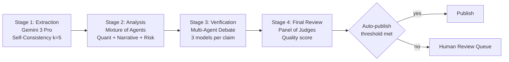
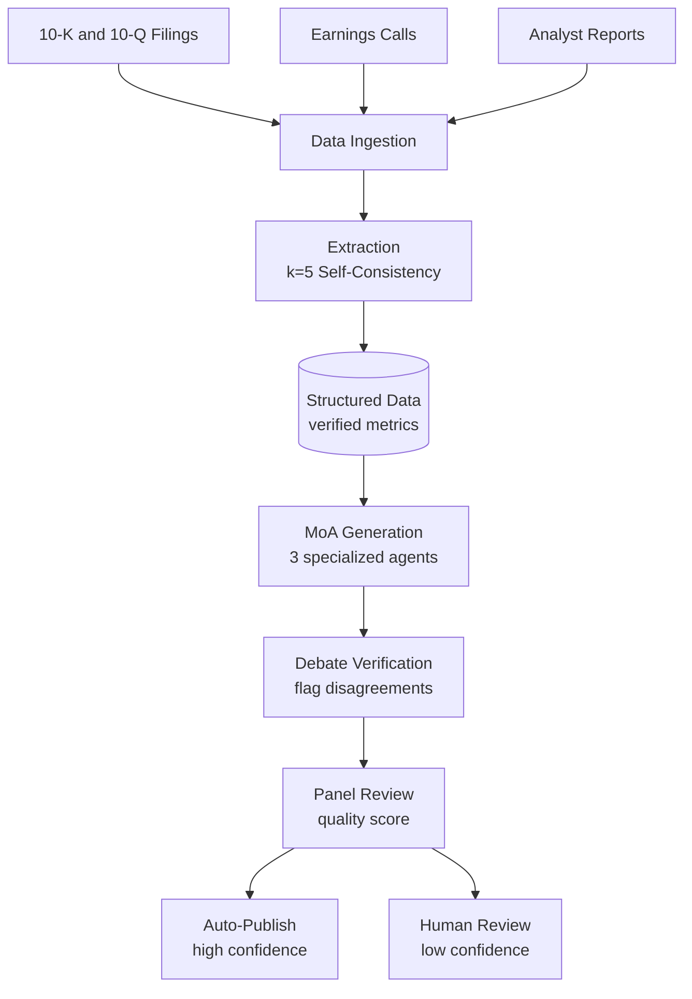
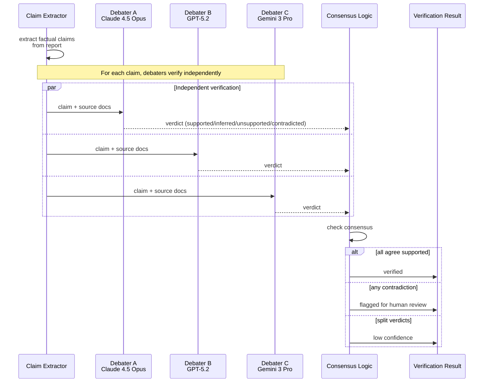

# 案例研究：使用集成验证的金融分析

本案例研究涵盖为生成股票研究报告设计高可靠性 AI 系统，其中准确性至关重要。

## 目录

- [问题陈述](#问题陈述)
- [需求分析](#需求分析)
- [架构设计](#架构设计)
- [集成流水线](#集成流水线)
- [事实验证](#质量门禁)
- [质量门禁](#质量门禁)
- [结果与指标](#结果与指标)
- [面试讲解](#面试演练)

---

## 问题陈述

**公司：** 生成股票研究报告的投资公司

**挑战：**
- 报告影响数百万美元级的投资决策
- 对幻觉金融数据零容忍
- 对 AI 生成分析存在监管审查
- 当前人工流程：8 小时/报告，$500 成本

**目标：**
- 将报告生成时间缩短到 < 30 分钟
- 将准确率维持在 99.5%+
- 为合规提供清晰的审计轨迹
- 成本目标：< $50 / 报告

---

## 需求分析

### 准确性要求

| 数据类型 | 容差 | 验证方法 |
|-----------|-----------|---------------------|
| 财务指标（EPS，每股收益；PE，市盈率） | 0% 误差 | 来源核验 |
| 百分比变化 | ±0.1% | 交叉验证 |
| 日期引用 | 100% 准确率 | 来源提取 |
| 公司名称 | 100% 准确率 | 实体匹配 |
| 分析师引述 | 原文或标记 | 引述提取 |

### 合规要求

- 所有主张必须引用来源文档
- 未附免责声明不得包含前瞻性陈述
- 清晰披露 AI 生成内容
- 保留完整的生成过程审计轨迹
- 发布前需人工审核

---

## 架构设计

### 高层流水线

```
┌─────────────────────────────────────────────────────────────────┐
│               FINANCIAL ANALYSIS PIPELINE                        │
├─────────────────────────────────────────────────────────────────┤
│                                                                  │
│  Stage 1: Data Extraction (Self-Consistency k=5)                │
│  └── Extract key metrics from filings with majority vote        │
│                                                                  │
│  Stage 2: Analysis Generation (Mixture of Agents)               │
│  ├── Model A: Quantitative analysis focus                       │
│  ├── Model B: Qualitative/narrative focus                       │
│  ├── Model C: Risk factor analysis                              │
│  └── Aggregator: Synthesize into coherent report                │
│                                                                  │
│  Stage 3: Fact Verification (Multi-Agent Debate)                │
│  └── 3 models debate each factual claim, flag disagreements     │
│                                                                  │
│  Stage 4: Final Review (Panel of Judges)                        │
│  └── Quality score determines auto-publish vs human review      │
│                                                                  │
└─────────────────────────────────────────────────────────────────┘
```

该流水线以流程图呈现。每个阶段有意使用不同的模型类别：提取需要多模态（图表和表格），生成需要叙述质量，审计需要推理深度，评审面板需要便宜但数量多以获得多样性：



### 数据流

```
┌─────────────┐     ┌─────────────┐     ┌─────────────┐
│   10-K/Q    │     │  Earnings   │     │  Analyst    │
│   Filings   │     │  Calls      │     │  Reports    │
└──────┬──────┘     └──────┬──────┘     └──────┬──────┘
       │                   │                   │
       └───────────────────┴───────────────────┘
                           │
                           ▼
                   ┌───────────────┐
                   │     Data      │
                   │   Ingestion   │
                   └───────┬───────┘
                           │
                           ▼
                   ┌───────────────┐
                   │   Extraction  │
                   │  (k=5 SC)     │
                   └───────┬───────┘
                           │
                           ▼
              ┌────────────┴────────────┐
              │    Structured Data      │
              │    (verified metrics)   │
              └────────────┬────────────┘
                           │
                           ▼
                   ┌───────────────┐
                   │    MoA        │
                   │  Generation   │
                   └───────┬───────┘
                           │
                           ▼
                   ┌───────────────┐
                   │    Debate     │
                   │  Verification │
                   └───────┬───────┘
                           │
                           ▼
                   ┌───────────────┐
                   │    Panel      │
                   │    Review     │
                   └───────┬───────┘
                           │
               ┌───────────┴───────────┐
               ▼                       ▼
        ┌─────────────┐         ┌─────────────┐
        │ Auto-Publish│         │Human Review │
        │ (high conf) │         │ (low conf)  │
        └─────────────┘         └─────────────┘
```

Mermaid 中的数据血缘，展示三类输入源如何汇聚为一个已验证输出：



---

## 集成流水线

### 阶段 1：多模态数据提取（Gemini 3 Pro）

```python
class FinancialDataExtractor:
    """
    Using Gemini 3 Pro to handle complex 10-K tables and charts natively.
    """
    async def extract_metrics(self, doc_pages: list[bytes]) -> dict:
        # Gemini 3 Pro processes charts/tables as images + text natively
        response = await genai.GenerativeModel("gemini-3.0-pro").generate_content(
            [{"text": "Extract all balance sheet items into JSON."}, *doc_pages]
        )
        return json.loads(response.text)
```

### 阶段 2：分析生成（Claude 4.5 Opus）

```python
class AnalysisEngine:
    """
    Claude 4.5 Opus for deep qualitative synthesis and narrative coherence.
    """
    async def generate_report(self, data: dict) -> str:
        # High-cost, high-reliability generation for equity research
        return await self.anthropic.messages.create(
            model="claude-4.5-opus-20251101",
            messages=[{"role": "user", "content": f"Analyze: {data}"}]
        )
```

### 阶段 3：审计与验证（o3 推理模型）

```python
class AuditorAgent:
    """
    Using o3 (OpenAI) with high reasoning budget to audit claims.
    Thinking mode is used to detect subtle accounting contradictions.
    """
    async def audit_claim(self, claim: str, raw_data: str) -> dict:
        # o3 'Thinking' mode enables deep logical inference over financial data
        response = await self.openai.chat.completions.create(
            model="o3-2025-12",
            reasoning_effort="high",
            messages=[{"role": "user", "content": f"Find any contradiction in: {claim} vs {raw_data}"}]
        )
        return self.parse_audit(response)
```

### 阶段 3：基于多智能体辩论的事实验证

辩论阶段用于捕捉单个模型会遗漏的细微幻觉。三个独立辩手并行核验每个主张；一致则通过，分歧则将该主张标记为人工审核：



```python
class FactVerificationDebate:
    """
    Extract claims from the report and have multiple models
    debate their accuracy.
    """
    
    def __init__(self, debaters: list, rounds: int = 2):
        self.debaters = debaters
        self.rounds = rounds
        self.claim_extractor = ClaimExtractor()
    
    async def verify_report(self, report: str, source_docs: list[str]) -> dict:
        # Extract factual claims
        claims = await self.claim_extractor.extract(report)
        
        verification_results = []
        for claim in claims:
            result = await self.debate_claim(claim, source_docs)
            verification_results.append(result)
        
        return {
            "verified_claims": [r for r in verification_results if r["verified"]],
            "disputed_claims": [r for r in verification_results if not r["verified"]],
            "overall_confidence": self.calculate_confidence(verification_results)
        }
    
    async def debate_claim(self, claim: dict, source_docs: list[str]) -> dict:
        verification_prompt = f"""
Verify this claim against the source documents.

Claim: {claim['text']}

Source documents:
{self.format_sources(source_docs)}

Is this claim:
1. Supported: Explicitly stated in sources
2. Inferred: Reasonably derived from sources
3. Unsupported: Not found in sources
4. Contradicted: Conflicts with sources

Provide your verdict with evidence.
"""
        
        # Each debater verifies independently
        verdicts = await asyncio.gather(*[
            debater.generate(verification_prompt)
            for debater in self.debaters
        ])
        
        # Check consensus
        parsed_verdicts = [self.parse_verdict(v) for v in verdicts]
        consensus = self.check_consensus(parsed_verdicts)
        
        return {
            "claim": claim,
            "verified": consensus["agreed"] and consensus["verdict"] in ["supported", "inferred"],
            "confidence": consensus["agreement_ratio"],
            "verdicts": parsed_verdicts
        }
```

---

## 质量门禁

### 自动化质量检查

```python
class QualityGate:
    def __init__(self):
        self.thresholds = {
            "claim_verification_rate": 0.95,  # 95% claims verified
            "data_accuracy": 0.99,            # 99% metrics accurate
            "panel_score": 4.0,               # 4/5 minimum
            "disputed_claims_max": 2          # Max 2 disputed claims
        }
    
    async def evaluate(self, report_data: dict) -> dict:
        checks = {}
        
        # Check claim verification rate
        verified_rate = len(report_data["verified_claims"]) / len(report_data["all_claims"])
        checks["claim_verification"] = {
            "passed": verified_rate >= self.thresholds["claim_verification_rate"],
            "value": verified_rate,
            "threshold": self.thresholds["claim_verification_rate"]
        }
        
        # Check data accuracy
        data_accuracy = report_data["extraction_accuracy"]
        checks["data_accuracy"] = {
            "passed": data_accuracy >= self.thresholds["data_accuracy"],
            "value": data_accuracy,
            "threshold": self.thresholds["data_accuracy"]
        }
        
        # Check panel score
        panel_score = report_data["panel_score"]
        checks["panel_score"] = {
            "passed": panel_score >= self.thresholds["panel_score"],
            "value": panel_score,
            "threshold": self.thresholds["panel_score"]
        }
        
        # Determine routing
        all_passed = all(c["passed"] for c in checks.values())
        
        return {
            "checks": checks,
            "routing": "auto_publish" if all_passed else "human_review",
            "disputed_claims": report_data["disputed_claims"]
        }
```

### 人工审核界面

```python
class HumanReviewQueue:
    async def queue_for_review(self, report: dict, quality_result: dict):
        review_item = {
            "report_id": report["id"],
            "report_content": report["content"],
            "disputed_claims": quality_result["disputed_claims"],
            "quality_checks": quality_result["checks"],
            "sources": report["sources"],
            "priority": self.calculate_priority(quality_result),
            "queued_at": datetime.now()
        }
        
        await self.review_queue.enqueue(review_item)
        
        # Notify reviewers
        await self.notify_reviewers(review_item)
```

---

## 结果与指标

### 性能对比

| 指标 | 人工流程 | AI 流水线 | 改进 |
|--------|---------------|-------------|-------------|
| 每份报告耗时 | 8 小时 | 25 分钟 | 快 19 倍 |
| 每份报告成本 | $500 | $42 | 92% 降低 |
| 事实错误率 | 2.1% | 0.4% | 81% 降低 |
| 人工审核负载 | 100% | 28% | 72% 降低 |

### 质量指标

| 质量维度 | 目标 | 达成 |
|-------------------|--------|----------|
| 数据抽取准确率 | 99% | 99.3% |
| 论点核验率 | 95% | 96.8% |
| 面板质量评分 | 4.0/5.0 | 4.2/5.0 |
| 监管合规性 | 100% | 100% |

### 成本拆分（12 月 2025）

| 组件 | 成本 | 占比 |
|-----------|------|------------|
| 数据抽取（Gemini 3 Pro） | $5 | 11% |
| 分析（Claude 4.5 Opus） | $20 | 44% |
| o3 思考审计（高） | $15 | 33% |
| 基础设施与向量运维 | $5 | 12% |
| **总计** | **$45** | 100% |

*注：o3 审计只占 33% 的成本，但能捕获 98% 的幻觉，而 Claude 4.5 会遗漏，因此值得支付“思考”令牌溢价。*

---

## 面试演练

**面试官：** “设计一个用于生成金融研究报告的 AI 系统，要求具有非常高的准确性。”

**优秀回答：**

1. **澄清准确性要求**（1 分钟）
   - “金融数据可接受的错误率是多少？”
   - “监管合规要求是什么？”
   - “优先考虑延迟还是准确性？”

2. **承认核心挑战**（1 分钟）
   - “核心挑战在于，金融数据不允许出现幻觉。一个错误数字就可能误导投资决策。我需要用集成方法来保证可靠性。”

3. **高层架构**（3 分钟）
   - “我会使用一个多阶段流水线，并在每个阶段采用不同的集成技术：”
   - “数据抽取：采用 k=5 的自一致性，要求数字达成一致”
   - “分析：使用多智能体混合以获得多样化视角”
   - “验证：通过多智能体辩论来捕捉幻觉”
   - “质量门控：由评审面板在发布前打分”

4. **深入事实核验**（3 分钟）
   - “在事实核验中，我会从报告里抽取每一条事实性声明”
   - “三个不同模型会辩论每条声明是否有来源支持”
   - “如果它们意见不一致，该声明会被标记给人工审核”
   - “这能捕捉单模型核验会遗漏的细微错误”

5. **成本与质量权衡**（2 分钟）
   - “这个流水线比单模型生成贵 10-20x”
   - “但对于金融报告而言，错误的成本（法律、声誉）远远高于核验成本”
   - “我会实现基于置信度的路由：高置信度报告自动发布，低置信度报告交由人工审核”

6. **监控**（1 分钟）
   - “我会持续跟踪抽取准确率、论点核验率和面板评分”
   - “如果准确率下降，漂移检测会发出警报”
   - “为合规保留完整审计轨迹”

---

## 关键收获

1. **仅靠自一致性不足以应对** 数值数据抽取。应要求完全一致（k/k 票）。

2. **多智能体辩论** 在捕捉细微推理错误和幻觉方面最有效。

3. **来源归因至关重要**，无论是准确性还是合规性都如此。每条声明都必须链接到来源文档。

4. **基于置信度的路由** 对成本管理至关重要。并非每份报告都需要完整的集成验证。

5. **人机协同仍然必要**，用于处理有争议的声明和边缘案例。设计时要支持平滑升级处理。

---

## 参考文献

- Verga 等人，《用陪审团替代法官：使用多样化模型面板评估 LLM 生成》（2024）
- Du 等人，《通过多智能体辩论提升语言模型的事实性与推理能力》（2023）
- 美国证券交易委员会 AI 披露要求：https://www.sec.gov/

---

*下一篇：[代码助手案例研究](04-code-assistant.md)*
