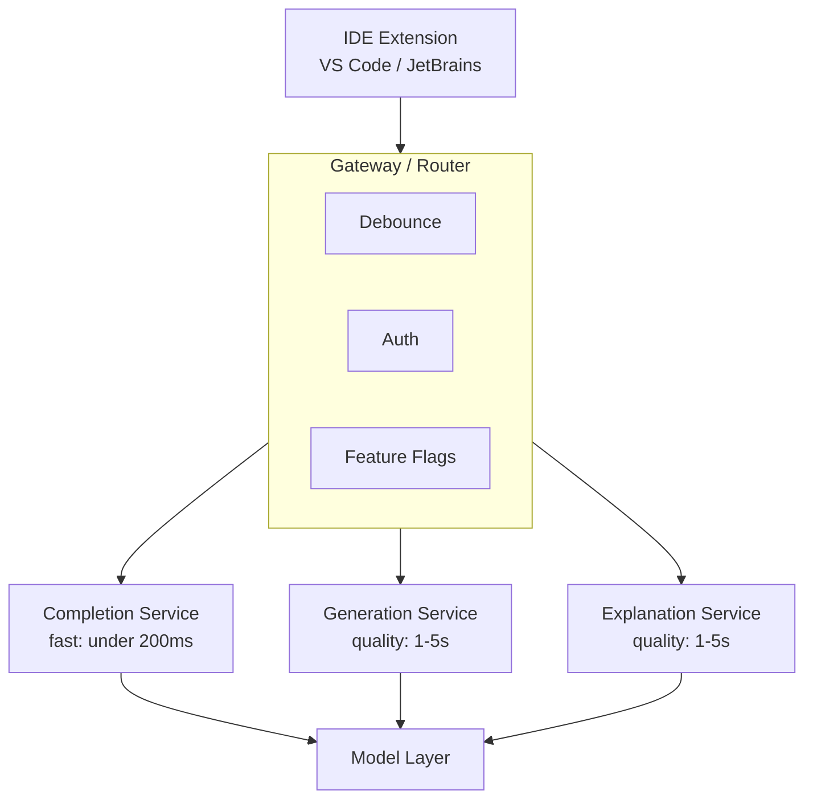
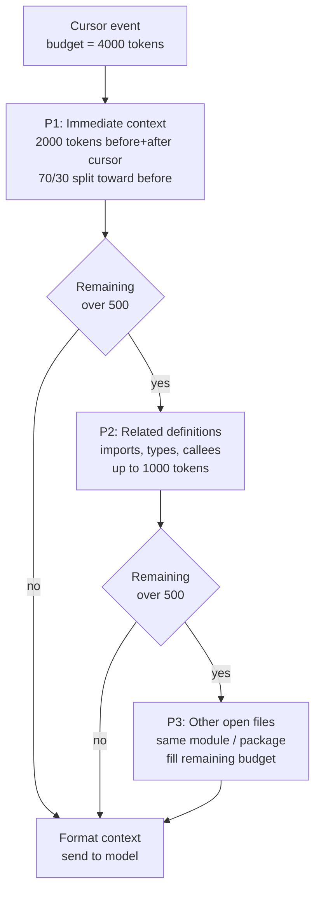
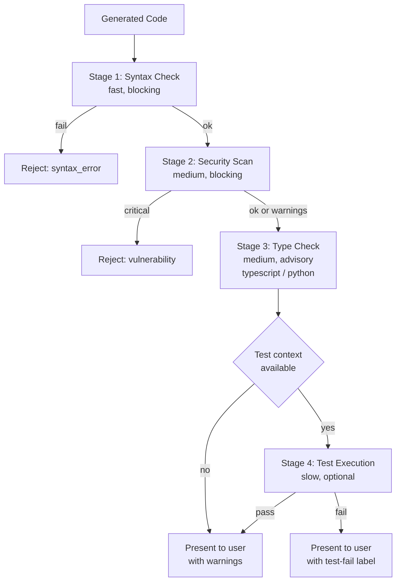

# 案例研究：AI 代码助手

本案例研究涵盖设计一个生产级代码助手，该助手可提供实时建议、代码生成和调试帮助。

## 目录

- [问题陈述](#问题陈述)
- [需求分析](#需求分析)
- [架构设计](#架构设计)
- [代码生成流水线](#代码生成流水线)
- [质量保障](#质量保障)
- [性能优化](#性能优化)
- [结果与指标](#结果与指标)
- [面试讲解](#面试演练)

---

## 问题陈述

**公司：** 正在构建 IDE 扩展的开发者工具公司

**目标：**
- 开发者输入时进行实时代码补全
- 根据自然语言生成多行代码
- 提供代码解释和调试辅助
- 支持 20+ 种编程语言

**约束：**
- 补全延迟 < 200ms（输入流）
- 生成延迟 < 3s（可接受的停顿）
- 安全：代码不离开客户基础设施（企业版选项）
- 成本：在规模化下可持续（数百万开发者）

---

## 需求分析

### 功能需求

| 功能 | 描述 | 延迟目标 |
|---------|-------------|----------------|
| 行内补全 | 补全当前行/代码块 | < 200ms |
| 多行生成 | 根据注释生成函数/类 | < 3s |
| 代码解释 | 解释选中的代码 | < 5s |
| 错误修复 | 针对错误建议修复方案 | < 2s |
| 重构 | 建议改进 | < 5s |
| 文档生成 | 生成文档字符串 | < 2s |

### 质量需求

| 维度 | 目标 | 测量方式 |
|-----------|--------|-------------|
| 接受率 | > 30% | 建议被接受 / 已展示 |
| 语法正确性 | > 99% | 成功编译/解析 |
| 安全性 | 0 个漏洞 | SAST 扫描通过率 |
| 相关性 | > 85% | 用户评分 |

---

## 架构设计

### 高层架构

```
┌─────────────────────────────────────────────────────────────────┐
│                    CODE ASSISTANT ARCHITECTURE                   │
├─────────────────────────────────────────────────────────────────┤
│                                                                  │
│  ┌─────────────┐                                                │
│  │     IDE     │                                                │
│  │  Extension  │                                                │
│  └──────┬──────┘                                                │
│         │                                                        │
│         ▼                                                        │
│  ┌─────────────────────────────────────────────────────────┐    │
│  │                    GATEWAY / ROUTER                      │    │
│  │  ┌──────────┐  ┌──────────┐  ┌──────────┐              │    │
│  │  │ Debounce │  │  Auth    │  │ Feature  │              │    │
│  │  │          │  │          │  │  Flags   │              │    │
│  │  └──────────┘  └──────────┘  └──────────┘              │    │
│  └─────────────────────────┬───────────────────────────────┘    │
│                            │                                     │
│         ┌──────────────────┼──────────────────┐                 │
│         ▼                  ▼                  ▼                 │
│  ┌─────────────┐    ┌─────────────┐    ┌─────────────┐         │
│  │  Completion │    │ Generation  │    │ Explanation │         │
│  │   Service   │    │  Service    │    │  Service    │         │
│  │  (fast)     │    │ (quality)   │    │ (quality)   │         │
│  └──────┬──────┘    └──────┬──────┘    └──────┬──────┘         │
│         │                  │                  │                  │
│         └──────────────────┼──────────────────┘                 │
│                            ▼                                     │
│                    ┌─────────────┐                              │
│                    │   Model     │                              │
│                    │   Layer     │                              │
│                    └─────────────┘                              │
│                                                                  │
└─────────────────────────────────────────────────────────────────┘
```

架构采用流程图展示。三个按延迟与质量划分的服务层（补全优先低于 200ms，生成和解释优先质量）共享同一模型层：



### 上下文组装

```python
class CodeContextAssembler:
    """
    Assemble context for code completion.
    Challenge: Balance context richness with latency.
    """
    
    def __init__(self, max_tokens: int = 4000):
        self.max_tokens = max_tokens
    
    def assemble(
        self,
        cursor_position: dict,
        file_content: str,
        open_files: list[dict],
        project_context: dict
    ) -> str:
        context_parts = []
        remaining_tokens = self.max_tokens
        
        # Priority 1: Immediate context (before and after cursor)
        immediate = self.get_immediate_context(
            file_content, cursor_position, tokens=2000
        )
        context_parts.append(immediate)
        remaining_tokens -= count_tokens(immediate)
        
        # Priority 2: Related imports and definitions
        if remaining_tokens > 500:
            related = self.get_related_definitions(
                file_content, cursor_position, tokens=min(1000, remaining_tokens)
            )
            context_parts.append(related)
            remaining_tokens -= count_tokens(related)
        
        # Priority 3: Other open files (same module/package)
        if remaining_tokens > 500:
            other_files = self.get_relevant_open_files(
                open_files, cursor_position, tokens=remaining_tokens
            )
            context_parts.append(other_files)
        
        return self.format_context(context_parts)
    
    def get_immediate_context(
        self,
        content: str,
        cursor: dict,
        tokens: int
    ) -> str:
        lines = content.split("\n")
        cursor_line = cursor["line"]
        
        # Get lines before cursor (more important)
        before_ratio = 0.7
        before_tokens = int(tokens * before_ratio)
        after_tokens = tokens - before_tokens
        
        # Expand outward from cursor
        before_lines = lines[:cursor_line]
        after_lines = lines[cursor_line:]
        
        # Truncate to fit
        before_text = self.truncate_to_tokens(
            "\n".join(before_lines), before_tokens, from_end=True
        )
        after_text = self.truncate_to_tokens(
            "\n".join(after_lines), after_tokens, from_end=False
        )
        
        return f"{before_text}\n<CURSOR>\n{after_text}"
```

上下文组装是一个按优先级分配预算的过程。模型只能看到未超出 4000 个 token 上限的内容，所以顺序很重要：先放当前代码（始终要保留），再放相关定义，最后在预算还有剩余时才放其他已打开文件：



---

## 代码生成流水线

### 补全服务（12 月 2025）

```python
class DeepCompletion:
    """
    Sub-150ms latency using o4-mini with speculative decoding.
    """
    def __init__(self):
        self.model = "o4-mini"  # Native code-optimized mini
        self.draft_model = "nano-code-1b" # Local on-device model
    
    async def complete(self, context: str) -> str:
        # Speculative decoding: 1B model drafts, o4-mini verifies
        return await self.openai.generate(
            model=self.model,
            draft_model=self.draft_model,
            prompt=context,
            max_tokens=64
        )
```

### 生成服务（“Claude Code” 时代）

```python
class AgenticGeneration:
    """
    Using Claude Sonnet 4.6 (Hybrid) for autonomous refactoring.
    """
    async def refactor_module(self, folder_path: str):
        # Claude Sonnet 4.6 with 'Thinking' enabled for architecture consistency
        agent = ClaudeCodeAgent(
            model="claude-3-7-sonnet",
            tools=["ls", "read_file", "write_file", "test_runner"]
        )
        
        # Agent explores codebase, understands dependencies, and applies fix
        return await agent.run(f"Refactor {folder_path} to use async/await.")
```

> [!TIP]
> **生产选择：** 虽然 Claude Opus 4.7 是个编程猛兽，但 **Claude Sonnet 4.6** 在 12 月 2025 的 IDE 生产场景中是首选，因为它具备 **混合推理**：开发者可以为疑难 bug 切换“Thinking（思考）”，为样板代码切换“Fast（快速）”。

---

## 质量保障

### 多阶段验证

验证器是一个失败即停的关卡。便宜的检查（语法）先执行并强制拦截；昂贵的检查（测试执行）最后执行，并且仅在上下文允许时运行。任何阻塞性失败都会短路其余步骤：



```python
class CodeVerifier:
    """
    Verify generated code before presenting to user.
    """
    
    async def verify(self, code: str, language: str, context: str) -> VerificationResult:
        results = {}
        
        # Stage 1: Syntax check (fast, blocking)
        syntax_ok = self.check_syntax(code, language)
        if not syntax_ok:
            return VerificationResult(passed=False, reason="syntax_error")
        
        # Stage 2: Security scan (medium, blocking)
        security = await self.security_scan(code, language)
        if security.has_critical:
            return VerificationResult(passed=False, reason="security_vulnerability")
        results["security"] = security
        
        # Stage 3: Type check if applicable (medium)
        if language in ["typescript", "python"]:
            type_result = await self.type_check(code, context, language)
            results["types"] = type_result
        
        # Stage 4: Test execution if available (slow, optional)
        if self.has_test_context(context):
            test_result = await self.run_tests(code, context)
            results["tests"] = test_result
        
        return VerificationResult(
            passed=True,
            details=results,
            warnings=security.warnings if security else []
        )
    
    def check_syntax(self, code: str, language: str) -> bool:
        parsers = {
            "python": self.parse_python,
            "javascript": self.parse_javascript,
            "typescript": self.parse_typescript,
            # ... other languages
        }
        
        parser = parsers.get(language)
        if not parser:
            return True  # Cannot verify, assume OK
        
        try:
            parser(code)
            return True
        except SyntaxError:
            return False
    
    async def security_scan(self, code: str, language: str) -> SecurityResult:
        # Run static analysis
        if language == "python":
            result = await self.run_bandit(code)
        elif language in ["javascript", "typescript"]:
            result = await self.run_eslint_security(code)
        else:
            result = await self.run_semgrep(code, language)
        
        return result
```

### 验收优化

```python
class AcceptanceOptimizer:
    """
    Learn from user acceptance patterns to improve suggestions.
    """
    
    def __init__(self):
        self.feedback_store = FeedbackStore()
    
    async def record_feedback(
        self,
        suggestion_id: str,
        accepted: bool,
        edited: bool,
        context_hash: str
    ):
        await self.feedback_store.record({
            "suggestion_id": suggestion_id,
            "accepted": accepted,
            "edited": edited,
            "context_hash": context_hash,
            "timestamp": datetime.now()
        })
    
    async def should_show_suggestion(
        self,
        suggestion: str,
        confidence: float,
        user_context: dict
    ) -> bool:
        # Historical acceptance rate for similar suggestions
        historical_rate = await self.get_historical_rate(
            user_context["user_id"],
            user_context["language"],
            confidence
        )
        
        # Threshold based on user preferences
        threshold = user_context.get("suggestion_threshold", 0.3)
        
        # Only show if likely to be accepted
        return (confidence * historical_rate) > threshold
```

---

## 性能优化

### 延迟优化

| 技术 | 影响 | 实现 |
|-----------|--------|----------------|
| 请求防抖 | -50ms | IDE 中 150ms 防抖 |
| 连接池 | -30ms | 持久化 HTTP/2 |
| 模型预热 | -100ms | 预加载模型 |
| 推测解码（Speculative decoding） | -40% | 草稿模型 + 验证 |
| 边缘缓存 | -80ms | 常见模式使用 CDN |

### 缓存策略

```python
class CompletionCache:
    """
    Multi-level cache for completions.
    """
    
    def __init__(self):
        self.local_cache = LRUCache(max_size=10000)  # In-memory
        self.redis_cache = Redis()  # Distributed
    
    def get_cache_key(self, context: str) -> str:
        # Hash context for cache key
        # Include language and cursor position
        return hashlib.sha256(context.encode()).hexdigest()[:16]
    
    async def get(self, context: str) -> str | None:
        key = self.get_cache_key(context)
        
        # Check local first
        local = self.local_cache.get(key)
        if local:
            return local
        
        # Check distributed
        remote = await self.redis_cache.get(f"completion:{key}")
        if remote:
            self.local_cache.set(key, remote)
            return remote
        
        return None
    
    async def set(self, context: str, completion: str):
        key = self.get_cache_key(context)
        
        # Set in both caches
        self.local_cache.set(key, completion)
        await self.redis_cache.setex(
            f"completion:{key}",
            3600,  # 1 hour TTL
            completion
        )
```

---

## 结果与指标

### 性能结果

| 指标 | 目标 | 达成 |
|--------|--------|----------|
| 完成延迟（p50） | < 200ms | 145ms |
| 完成延迟（p99） | < 500ms | 380ms |
| 生成延迟（p50） | < 3s | 2.1s |
| 语法正确性 | > 99% | 99.5% |
| 安全性（0 高严重级别） | 100% | 99.8% |
| 接受率 | > 30% | 34% |

### 成本分析（12 月 2025 日）

| 组件 | 每 1M 条建议成本 | 备注 |
|-----------|------------------------|-------|
| **补全（o4-mini）** | $0.20 | 针对高吞吐量进行了极致优化 |
| **代理式任务（Claude Sonnet 4.6）** | $45.00 | 假设 10k token + 思考 |
| **验证（本地）** | $0.00 | 已转移到设备端 Nano |
| **基础设施** | $15.00 | 托管 GPU 服务 |
| **总计（混合）** | **~$12.00** | **相较 2024 降低 90%** |

*混合成本假设 98% 次补全、2% 次高价值代理式重构。*

---

## 面试演练

**面试官：**“为 IDE 设计一个 AI 代码助手。”

**有力回答：**

1. **澄清需求**（1 分钟）
   - “补全和生成的目标延迟分别是多少？”
   - “是否需要企业部署和本地部署选项？”
   - “需要支持哪些语言？”

2. **识别关键挑战**（1 分钟）
   - “核心矛盾是延迟与质量。补全需要 < 200ms 才能保证输入流畅，而高质量代码又需要丰富上下文和验证。”

3. **双层架构**（3 分钟）
   - “我会将补全（快）和生成（质量）分开：”
   - “补全：更小的模型、最少上下文、推测解码”
   - “生成：前沿模型、best-of-N、语法与安全验证”

4. **上下文组装**（2 分钟）
   - “上下文至关重要。我会按以下优先级：当前代码 > 导入/定义 > 打开的文件”
   - “对于补全，我会将 token 上限设为 2K 以保证速度”
   - “对于生成，我可以使用 8K+ token 来获得更好的理解”

5. **质量保障**（2 分钟）
   - “每条建议都会经过：语法检查、安全扫描，必要时还会做类型检查”
   - “对于生成任务，我会使用 best-of-N，提供 8 个候选，过滤无效结果，然后打分并选择”
   - “这样可以在安全漏洞到达开发者之前将其拦截”

6. **延迟优化**（2 分钟）
   - “在 IDE 中做请求防抖、连接池、模型预热”
   - “使用推测解码实现 40% 的延迟降低”
   - “缓存常见模式（导入、样板代码）”

---

## 参考资料

- GitHub Copilot 架构：https://github.blog/
- Codestral：https://mistral.ai/news/codestral/
- CodeLlama：https://ai.meta.com/blog/code-llama/

---

*下一篇：[内容审核案例研究](05-content-moderation.md)*
