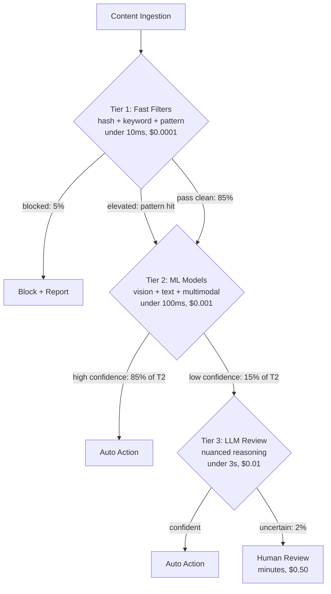
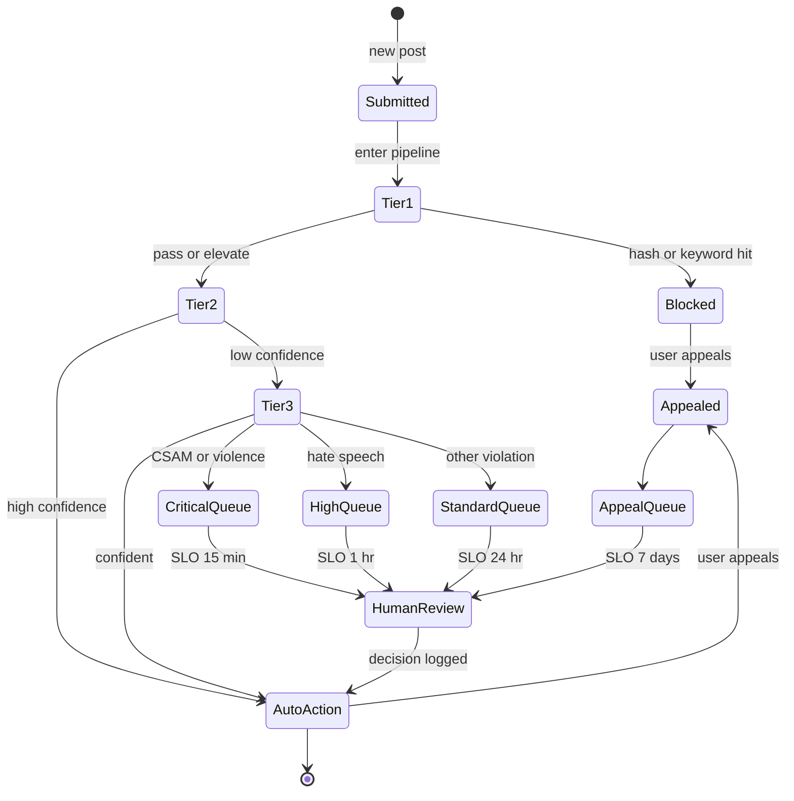

# 案例研究：大规模内容审核

本案例研究介绍为一个每天处理数百万条帖子的社交平台设计一套由 AI 驱动的内容审核系统。

## 目录

- [问题陈述](#问题陈述)
- [需求分析](#需求分析)
- [架构设计](#架构设计)
- [分类流水线](#分类流水线)
- [人类在环](#human-in-the-loop)
- [对抗鲁棒性](#对抗鲁棒性)
- [结果与指标](#结果与指标)
- [面试讲解](#面试演练)

---

## 问题陈述

**公司：** 具有 50M 日活跃用户的社交媒体平台

**当前状态：**
- 每天 10M 条帖子
- 500 名人工审核员
- 平均审核时间：4 小时
- 误报率：15%
- 触达用户的有害内容：2%

**目标：**
- 将有害内容曝光降至 < 0.1%
- 在 < 15 分钟内审核优先级内容
- 将误报率降至 < 5%
- 在不线性增加审核员的情况下扩展规模

---

## 需求分析

### 内容类别

| 类别 | 严重程度 | 处理方式 | 时延 |
|----------|----------|--------|---------|
| CSAM（儿童性虐待材料） | 严重 | 屏蔽 + 上报 | 立即 |
| 暴力/血腥 | 高 | 屏蔽 + 审核 | < 1 分钟 |
| 仇恨言论 | 高 | 屏蔽 + 审核 | < 5 分钟 |
| 骚扰 | 中 | 审核 + 警告 | < 15 分钟 |
| 垃圾信息 | 中 | 降低优先级 | < 1 小时 |
| 错误信息 | 中 | 标记 + 审核 | < 1 小时 |
| 成人内容 | 低 | 年龄门槛 | < 1 小时 |

### 准确率要求

| 指标 | 目标 | 原因 |
|--------|--------|-----------|
| 召回率（有害内容） | > 99% | 将伤害暴露降到最低 |
| 精确率 | > 95% | 将误报降到最低 |
| 时延（关键） | < 1 分钟 | 防止扩散 |
| 时延（标准） | < 15 分钟 | 平衡资源 |

---

## 架构设计

### 高层架构

```
┌─────────────────────────────────────────────────────────────────┐
│                  CONTENT MODERATION PIPELINE                     │
├─────────────────────────────────────────────────────────────────┤
│                                                                  │
│  ┌─────────────┐                                                │
│  │   Content   │                                                │
│  │   Ingestion │                                                │
│  └──────┬──────┘                                                │
│         │                                                        │
│         ▼                                                        │
│  ┌─────────────────────────────────────────────────────────┐    │
│  │                   TIER 1: FAST FILTERS                   │    │
│  │  ┌──────────┐  ┌──────────┐  ┌──────────┐              │    │
│  │  │  Hash    │  │ Keyword  │  │  Known   │              │    │
│  │  │ Matching │  │ Blocklist│  │ Patterns │              │    │
│  │  └──────────┘  └──────────┘  └──────────┘              │    │
│  └──────────────────────────┬──────────────────────────────┘    │
│                             │                                    │
│         ┌───────────────────┼───────────────────┐               │
│         │ Blocked           │ Pass              │ Elevated      │
│         ▼                   ▼                   ▼               │
│  ┌─────────────┐    ┌─────────────────────────────────────┐    │
│  │   Block +   │    │          TIER 2: ML MODELS          │    │
│  │   Report    │    │  ┌────────┐  ┌────────┐  ┌────────┐│    │
│  └─────────────┘    │  │ Vision │  │  Text  │  │ Multi- ││    │
│                     │  │ Model  │  │ Model  │  │ modal  ││    │
│                     │  └────────┘  └────────┘  └────────┘│    │
│                     └──────────────────┬──────────────────┘    │
│                                        │                        │
│         ┌──────────────────────────────┼──────────────────┐    │
│         │ High Confidence              │ Low Confidence   │    │
│         ▼                              ▼                   │    │
│  ┌─────────────┐              ┌─────────────────────────┐ │    │
│  │ Auto Action │              │    TIER 3: LLM REVIEW   │ │    │
│  └─────────────┘              │  (nuanced cases)        │ │    │
│                               └────────────┬────────────┘ │    │
│                                            │               │    │
│                        ┌───────────────────┼──────────────┐│    │
│                        │ Confident         │ Uncertain    ││    │
│                        ▼                   ▼              ││    │
│                 ┌─────────────┐    ┌─────────────┐       ││    │
│                 │ Auto Action │    │   Human     │       ││    │
│                 └─────────────┘    │   Review    │       ││    │
│                                    └─────────────┘       ││    │
│                                                          ││    │
└──────────────────────────────────────────────────────────┘│    │
```

分层流水线可视为一棵决策树。每一层只会升级它无法低成本判断的内容。第 1 层与第 4 层之间的单次决策成本比大约为 1:5000，因此把路由做对是单位经济性的主要杠杆：



### 处理层级

| 层级 | 方法 | 时延 | 成本 | 覆盖范围 |
|------|--------|---------|------|----------|
| 1 | 哈希/关键词 | < 10ms | $0.0001 | 5% 已阻止 |
| 2 | ML 分类器 | < 100ms | $0.001 | 85% 自动判定 |
| 3 | LLM 审核 | < 3s | $0.01 | 8% 细致判断 |
| 4 | 人工审核 | 分钟级 | $0.50 | 2% 已升级 |

---

## 分类流水线

### 第 1 层：快速过滤器

```python
class FastFilters:
    """
    Immediate blocking for known harmful content.
    No false positives for matches.
    """
    
    def __init__(self):
        self.hash_db = PhotoDNADatabase()  # CSAM detection
        self.keyword_filter = KeywordBlocklist()
        self.pattern_matcher = RegexPatterns()
    
    async def filter(self, content: Content) -> FilterResult:
        # CSAM hash matching (highest priority)
        if content.has_media:
            hash_match = await self.hash_db.check(content.media_hashes)
            if hash_match:
                return FilterResult(
                    action="block_report",
                    reason="csam_hash_match",
                    confidence=1.0,
                    tier=1
                )
        
        # Keyword blocklist
        if content.text:
            keyword_match = self.keyword_filter.check(content.text)
            if keyword_match and keyword_match.severity == "critical":
                return FilterResult(
                    action="block_review",
                    reason=f"keyword_{keyword_match.category}",
                    confidence=0.99,
                    tier=1
                )
        
        # Pattern matching (phone numbers in suspicious context, etc)
        pattern_match = self.pattern_matcher.check(content.text)
        if pattern_match:
            return FilterResult(
                action="elevate",
                reason=f"pattern_{pattern_match.type}",
                confidence=pattern_match.confidence,
                tier=1
            )
        
        return FilterResult(action="continue", tier=1)
```

### 第 2 层：ML 分类

```python
### Tier 2: Native Multimodal Classification (Gemini 3 Flash)

```python
class MultimodalSafety:
    """
    Dec 2025 Shift: No separate OCR/Vision models.
    Gemini 3 Flash handles interleaved text/images natively for <$0.10 / 1M posts.
    """
    async def classify(self, content: Content) -> dict:
        # Native multimodal understanding catches context (e.g., text on a protest sign)
        response = await genai.submit(
            model="gemini-3-flash",
            content=[content.text, content.image_bytes],
            schema=SafetySchema
        )
        return response
```

### 第 3 层：细致 LLM 审核（GPT-5.2-mini）

```python
class NuanceReviewer:
    """
    Using GPT-5.2-mini for nuanced context (sarcasm, regional slang).
    Reasoning capabilities of 2025-mini models exceed 2024-frontier models.
    """
    async def review(self, content: Content, context: dict) -> dict:
        result = await client.chat.completions.create(
            model="gpt-5.2-mini",
            messages=[
                {"role": "system", "content": "Analyze for regional hate speech slang."},
                {"role": "user", "content": content.text}
            ],
            response_format={"type": "json_object"}
        )
        return json.loads(result)
```
```

---

## Human-in-the-Loop

### Review Queue Management

Every piece of content traverses a lifecycle from submission to a terminal state. The lifecycle as a state machine makes SLOs concrete: each priority lane has a different target time-to-terminal, and an appeal can transition back to pending:



```python
class ReviewQueueManager:
    """
    Prioritize and route content to human moderators.
    """
    
    def __init__(self):
        self.queues = {
            "critical": PriorityQueue(),  # CSAM, violence - immediate
            "high": PriorityQueue(),      # Hate speech - < 15 min
            "standard": PriorityQueue(),  # Other violations - < 1 hour
            "appeals": PriorityQueue()    # User appeals
        }
    
    async def enqueue(self, content: Content, result: ReviewResult):
        priority = self.calculate_priority(content, result)
        
        item = ReviewItem(
            content_id=content.id,
            content=content,
            ai_analysis=result,
            priority=priority,
            enqueued_at=datetime.now()
        )
        
        queue_name = self.get_queue(result.severity)
        await self.queues[queue_name].put(item)
        
        # Alert if critical
        if queue_name == "critical":
            await self.alert_moderators(item)
    
    def calculate_priority(self, content: Content, result: ReviewResult) -> float:
        priority = 0.0
        
        # Severity weight
        severity_weights = {"critical": 100, "high": 50, "medium": 20, "low": 5}
        priority += severity_weights.get(result.severity, 0)
        
        # Reach weight (viral content prioritized)
        priority += min(content.reach_score * 10, 50)
        
        # Confidence inverse (less confident = higher priority)
        priority += (1 - result.confidence) * 30
        
        return priority
```

### 审核员界面

```python
class ModeratorDecision:
    async def submit(
        self,
        moderator_id: str,
        content_id: str,
        decision: str,
        reason: str,
        notes: str = None
    ):
        # Record decision
        await self.store_decision({
            "content_id": content_id,
            "moderator_id": moderator_id,
            "decision": decision,
            "reason": reason,
            "notes": notes,
            "ai_recommendation": await self.get_ai_result(content_id),
            "decided_at": datetime.now()
        })
        
        # Execute action
        await self.execute_action(content_id, decision)
        
        # Update ML models with feedback
        await self.feedback_loop.record(
            content_id=content_id,
            ai_prediction=await self.get_ai_result(content_id),
            human_decision=decision
        )
```

---

## 对抗鲁棒性

### 规避技术与防御

| 规避技术 | 防御 |
|-------------------|---------|
| 字符替换（h@te） | 归一化 + 同形异义字符映射（homoglyph mapping） |
| 图片文字（图像中的文本） | OCR 管道（光学字符识别） |
| 不可见字符 | Unicode 归一化 |
| 上下文操纵 | 多轮分析 |
| 编码内容 | 解码管道 |
| 对抗性图像 | 鲁棒视觉模型 |

### 防御管道

```python
class AdversarialDefense:
    def __init__(self):
        self.normalizer = TextNormalizer()
        self.ocr = OCRPipeline()
        self.decoder = ContentDecoder()
    
    def preprocess(self, content: Content) -> Content:
        processed = content.copy()
        
        # Normalize text
        if processed.text:
            processed.text = self.normalizer.normalize(processed.text)
            processed.text = self.decoder.decode_obfuscation(processed.text)
        
        # Extract text from images
        if processed.has_images:
            for image in processed.images:
                extracted_text = self.ocr.extract(image)
                if extracted_text:
                    processed.text = f"{processed.text}\n[IMAGE TEXT]: {extracted_text}"
        
        return processed
    
    def normalize(self, text: str) -> str:
        # Homoglyph normalization
        text = self.homoglyph_map(text)
        
        # Unicode normalization
        text = unicodedata.normalize("NFKC", text)
        
        # Remove zero-width characters
        text = re.sub(r"[\u200b-\u200f\u2028-\u202f]", "", text)
        
        # Leetspeak normalization
        text = self.leetspeak_decode(text)
        
        return text
```

---

## 结果与指标

### 性能对比

| 指标 | 之前 | 之后 | 改善 |
|--------|-------|-------|-------------|
| 有害内容暴露 | 2% | 0.08% | 降低 96% |
| 审核延迟（关键） | 4 小时 | 8 分钟 | 快 30 倍 |
| 假阳性率 | 15% | 4.2% | 降低 72% |
| 版主效率 | 50/天 | 200/天 | 提升 4 倍 |

### 成本分析（12 月 2025）

| 组件 | 每 10M 条帖子 | 备注 |
|-----------|---------------|-------|
| 第 1 层过滤器 | $0.10 | 可忽略不计 |
| 第 2 层多模态 | $0.50 | Gemini 3 Flash（$0.05/1M） |
| 第 3 层 LLM（GPT-5.2） | $0.20 | 针对 10% 流量进行细微差别检查 |
| 人工审核 | $15.00 | 仅聚焦于 1% 的流量 |
| **总计** | **$15.80** | **相比 2024 降低 40%** |

> [!TIP]
> **生产经验：** 将重型处理从“第 2 层视觉/OCR”迁移到 **原生多模态（Gemini 3 Flash）**，使管道复杂度降低了 70%，延迟降低了 400ms。

*人工审核仍然占据主要成本，但已聚焦于难例*

---

## 面试演练

**面试官：** “为一个社交媒体平台设计内容审核系统。”

**有力回答：**

1. **澄清规模与需求**（1 分钟）
   - “流量有多大？内容类型有哪些？可接受的假阳性率是多少？”
   - “是否有合规要求（CSAM 报告、GDPR）？”

2. **多层架构**（3 分钟）
   - “我会使用一个复杂度逐级提升的级联结构：”
   - “第 1 层：哈希匹配、关键词过滤器 - 即时、确定性强”
   - “第 2 层：ML 分类器 - 快速、专用”
   - “第 3 层：LLM 审核 - 细致、感知上下文”
   - “第 4 层：人工审核 - 最终裁决者”
   - “每一层处理上一层无法处理的内容”

3. **优先级是关键**（2 分钟）
   - “并非所有有害内容都同等严重。CSAM 和暴力需要立即处理。仇恨言论优先级高，但不必瞬时处理。垃圾信息可以稍后处理。”
   - “基于严重性、传播范围和置信度的优先队列”

4. **人机协同设计**（2 分钟）
   - “由人工处理低置信度决策和申诉”
   - “AI 自动处理 95%+，使人工审核在经济上可行”
   - “反馈闭环：人工决策改进 ML 模型”

5. **对抗鲁棒性**（2 分钟）
   - “用户会规避检测。防御措施包括：”
   - “针对混淆写法的文本归一化”
   - “针对图片中文字的 OCR”
   - “随着规避手段演变而持续更新模型”

6. **指标**（1 分钟）
   - “主要指标：有害内容暴露率（目标 < 0.1%）”
   - “次要指标：假阳性率（用户体验）”
   - “运营指标：审核延迟、版主吞吐量”

---

## 参考资料

- Meta 内容审核：https://transparency.fb.com/
- Google Perspective API：https://perspectiveapi.com/
- OpenAI 审核：https://platform.openai.com/docs/guides/moderation

---

*下一篇：[LLM 定价参考](../02-model-landscape/03-pricing-and-costs.md)*
