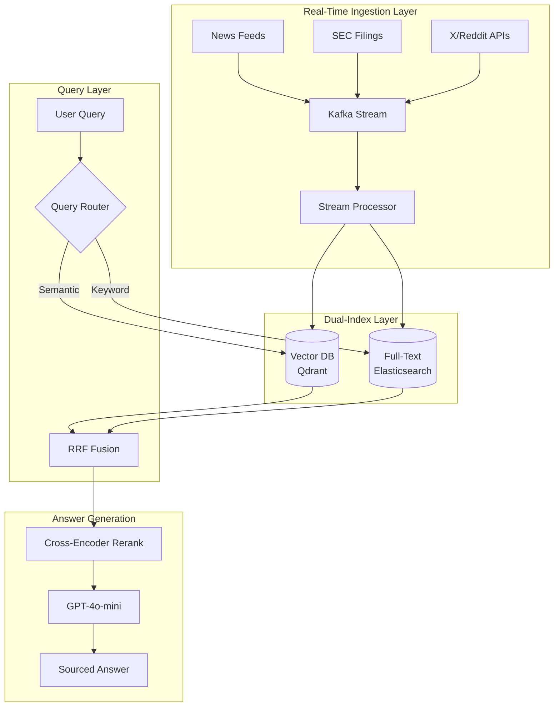

# 案例研究：实时 AI 搜索引擎

## 问题

一家金融科技初创公司需要构建一个**实时市场情报平台**，让分析师能够就实时市场数据、新闻和公司申报文件提出自然语言问题。

**面试中给定的约束：**
- 数据新鲜度：查询必须反映过去 5 分钟内的信息
- 规模：10,000 并发用户，50,000 次查询/小时
- 准确性：金融数据不能产生幻觉
- 延迟：p95 响应时间低于 3 秒

---

## 面试题

> "设计一个系统，让用户可以问‘过去一小时特斯拉周围的情绪如何？’，并在低于 3 秒内得到一个准确、有来源的答案。"

---

## 解决方案架构



---

## 关键设计决策

### 1. 为什么使用 Kafka 做摄取？

面试官想知道你是否理解**流式处理与批处理**的区别。

**回答：** Kafka 提供精确一次投递，并允许多个消费者。我们有一个消费者写入向量数据库，另一个写入 Elasticsearch。如果向量索引落后，全文索引仍然可以提供查询服务。这是为了提升弹性的**双写模式**。

### 2. 为什么采用混合搜索（向量 + 全文）？

**回答：** 金融查询会把语义（“特斯拉周围的情绪”）和关键词（“TSLA 10-K filing”）混在一起。纯向量搜索会漏掉精确的股票代码匹配。我们使用**倒数排名融合（RRF, Reciprocal Rank Fusion）**来合并结果。

### 3. 为什么使用 GPT-4o-mini 而不是 GPT-4o？

**回答：** 在 3 秒的 p95 延迟目标下、面对 50K 次查询/小时，我们需要快速生成。GPT-4o-mini 为我们提供了每秒 100+ 个 token，而 GPT-4o 只有 40 个 token/秒。重排序器负责准确性；LLM 只对已经验证过的内容进行综合。

---

## 如何处理新鲜度要求

这个问题最难的部分，是确保索引反映过去 5 分钟内的数据。

**方案：基于 TTL 的索引**

```python
# Each document gets a timestamp field
doc = {
    "content": "Tesla announces new factory...",
    "timestamp": datetime.now(UTC),
    "source": "Reuters",
    "ttl_hours": 24  # Auto-delete after 24 hours
}

# Query filters to last N minutes
def search_recent(query: str, minutes: int = 60):
    cutoff = datetime.now(UTC) - timedelta(minutes=minutes)
    return vector_db.search(
        query=query,
        filter={"timestamp": {"$gte": cutoff}}
    )
```

---

## 成本分析

| 组件 | 月成本（按 50K 次查询/小时计） |
|-----------|-----------------------------------|
| Kafka（MSK） | $2,500 |
| Qdrant（托管） | $1,800 |
| Elasticsearch | $2,000 |
| GPT-4o-mini（生成） | $3,500 |
| 交叉编码器重排序 | $800 |
| **总计** | **$10,600/月** |

---

## 面试追问

**问：你如何防止金融数据被幻觉化？**

答：三层保障：（1）LLM 只总结检索到的内容，从不凭空生成事实。（2）每个结论都必须引用一个源文档。（3）生成后校验器会检查响应中的任何数字是否在某个来源中逐字存在。

**问：如果 Kafka 在新闻高峰期落后了怎么办？**

答：我们会通过消费者滞后监控实现背压。如果滞后超过 2 分钟，就在摄取侧用采样来降载。实时查询走只包含最近一小时数据的“recent”索引；批处理任务再补全完整索引。

---

## 面试要点总结

1. **实时 AI 搜索需要流式基础设施**，而不是批处理 ETL
2. **混合搜索（语义 + 关键词）在结构化领域优于纯向量搜索**
3. **延迟预算决定模型选择**：用快速模型做综合，把昂贵模型留给推理
4. **新鲜度是一个过滤条件，而不是一个特性**：应在索引层实现，而不是在提示词层实现

---

*相关章节：[混合搜索](../06-retrieval-systems/05-hybrid-search.md)，[服务基础设施](../04-inference-optimization/06-serving-infrastructure.md)*
