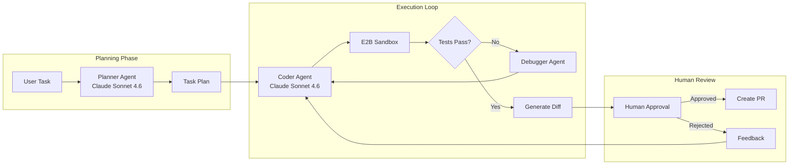
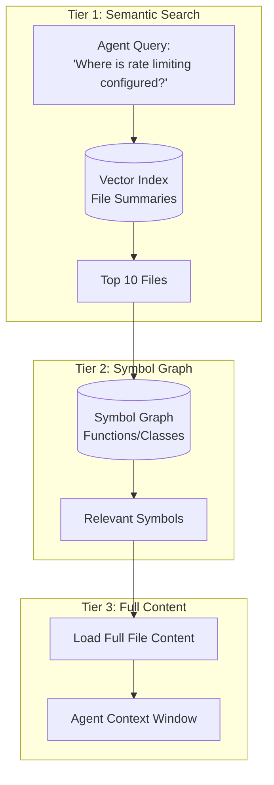

# 案例研究：自主编码智能体（Autonomous Coding Agent）

## 问题背景

一家开发者工具公司希望构建一个能够自主完成多文件任务的 **AI 编码助手（AI Coding Assistant）**：例如“给这个 Express API 添加认证”或“将该模块重构为依赖注入（Dependency Injection）”。

**面试中给出的约束：**
- 必须支持 1,000+ 文件的代码库
- 不得破坏既有功能（测试必须通过）
- 人类必须在提交前审批更改
- 预算：每次任务完成低于 $0.50

---

## 面试问题

> “设计一个编码智能体（Coding Agent），可以处理类似‘为所有 API 端点添加速率限制（Rate Limiting）’的任务，并产出可工作的、已测试的拉取请求（Pull Request）。”

---

## 解决方案架构



---

## 关键设计决策

### 1. 为什么要分离规划代理（Planner）和编码代理（Coder）？

**回答：** 规划任务需要对**整个代码库**进行推理（需要触及哪些文件、依赖关系是什么）。而编码任务需要**精确的语法生成**。通过分离，我们可以在规划时使用更深层的推理模式（Extended Thinking，延展推理），在编码时使用更快的生成模式。这也允许我们在执行前先进行一次人类审核，确认方案方向。

### 2. 为什么使用 E2B 沙箱而不是本地执行？

**回答：** 安全性。该智能体会生成并运行代码，本地执行会暴露主机系统。E2B 提供隔离容器，并在每次会话后重置。如果智能体生成了 `rm -rf /`，只会破坏沙箱环境。

### 3. 为什么两端都用 Claude Sonnet 4.6？

**回答：** Claude Opus 4.7 在 SWE-bench Pro 上达到了 64.3%，而 Claude Sonnet 4.6 大约提供其 90% 的质量，但价格仅约 40%，这对一个每个任务需要多轮运行的智能体来说是性价比最优解。我们只在调试循环中启用“Extended Thinking”（延展推理），而不在初始生成时开启，以控制成本。

---

## 代码库理解问题

该智能体无法一次性将 1,000 多个文件全部放入上下文窗口。我们通过**分层检索（Tiered Retrieval）**解决：



**实现方式：**
1. **建立文件摘要索引**（由较小模型在接入阶段生成）
2. **使用 tree-sitter 进行 AST 解析并构建符号图（Symbol Graph）**
3. **分阶段检索**：摘要 → 符号 → 全量内容

---

## 自我修正循环（Self-Correction Loop）

智能体会出错。可靠性的关键是**结构化自我修正**：

```python
async def execute_with_retry(task: str, max_attempts: int = 3):
    for attempt in range(max_attempts):
        # Generate code
        code_changes = await coder_agent.generate(task)
        
        # Apply to sandbox
        sandbox.apply_changes(code_changes)
        
        # Run tests
        test_result = await sandbox.run_tests()
        
        if test_result.passed:
            return code_changes
        
        # Feed failure back to agent
        task = f"""
        Previous attempt failed. Error:
        {test_result.error}
        
        Original task: {task}
        
        Fix the issue.
        """
    
    raise MaxRetriesExceeded()
```

---

## 成本拆解（Cost Breakdown）

| 阶段 | 模型 | 平均 Token | 成本 |
|-------|-------|--------------|------|
| 规划（Planning） | Claude Sonnet 4.6（Extended） | 8,000 in / 2,000 out | $0.06 |
| 文件检索（File Retrieval） | Embeddings | 50,000 | $0.01 |
| 编码（每次尝试） | Claude Sonnet 4.6 | 15,000 in / 3,000 out | $0.09 |
| 测试（平均 3 次运行） | - | - | $0.00 |
| **总计（平均 1.5 次尝试）** | | | **$0.21** |

低于预算 $0.21 / 任务。

---

## 面试追问

**Q: 如果任务需要跨 20+ 个文件修改，你如何处理？**

A：我们在规划阶段将其拆解为子任务。规划器输出带依赖关系的变更有向无环图（DAG）。执行器按拓扑顺序处理，并增量运行测试。如果第 5 步失败，我们只重跑第 5 步及之后的流程，而不是重跑整个任务。

**Q: 如果智能体陷入无限重试循环怎么办？**

A：三重防护： (1) 最大尝试次数上限（3 次）。(2) 若同一个测试以相同错误连续失败两次，则升级给人工。 (3) 任务总 token 预算（$0.50）触发终止。

**Q: 如何防止智能体引入安全漏洞？**

A：我们在沙箱中的测试套件里运行静态分析工具（Static Analysis）Semgrep。安全规则违规会被视为测试失败，并反馈给智能体进行修正。

---

## 面试要点

1. **将规划与执行分离**，便于里程碑审批与成本控制
2. **对所有生成代码进行沙箱化执行**以增强安全性（如 E2B、Docker）
3. **分层检索解决大规模代码库问题**：摘要 → 符号 → 内容
4. **自我修正循环必须设置硬限制**：尝试次数、token、时间

---

*相关章节：[工具使用与 MCP（Tool Use and MCP）](../07-agentic-systems/03-tool-use-and-mcp.md)、[错误处理（Error Handling）](../07-agentic-systems/07-error-handling-and-recovery.md)*
