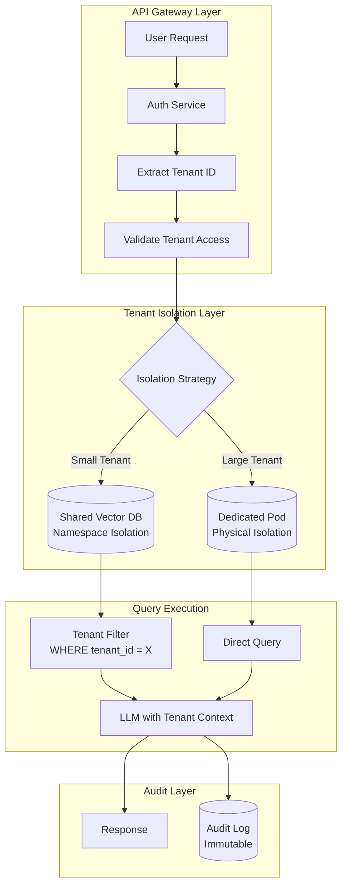
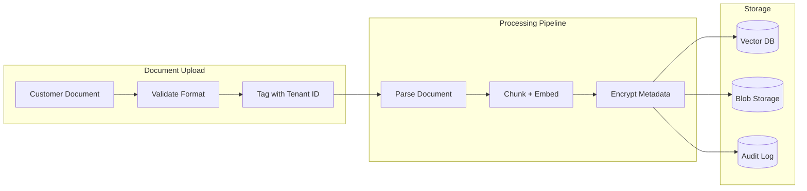

# 案例研究：多租户 AI SaaS 平台

## 问题

一家 B2B 初创公司正在构建一个**由 AI 驱动的文档分析平台**，每个客户上传自己的合同，AI 再针对这些合同回答问题。客户中包括竞争对手，彼此的数据绝不能互相可见。

**面试中给定的约束：**
- 500 家企业客户，每家有 10,000-100,000 份文档
- 绝对的数据隔离：客户 A 的数据不能泄漏给客户 B
- 共享基础设施，以提高成本效率
- 合规要求：SOC 2 II 型、GDPR
- 查询延迟低于 2 秒

---

## 面试题

> “设计一个多租户 RAG（检索增强生成）系统，让可口可乐和百事可乐都能成为客户，并且完全没有跨租户数据泄漏的风险。”

---

## 解决方案架构



---

## 关键设计决策

### 1. 混合隔离：命名空间 vs 物理隔离

**答案：** 纯物理隔离（每个租户一个数据库）成本太高。纯命名空间隔离（共享数据库加 tenant_id 过滤）如果过滤器出错，会有泄漏风险。我们采用一种**分层策略**：

| 层级 | 租户规模 | 隔离方式 | 原因 |
|------|-------------|------------------|-----|
| 标准 | <50K 份文档 | 共享 Qdrant 中的命名空间 | 成本效率高 |
| 高级 | 50K-500K 份文档 | 专属 Qdrant collection | 性能隔离 |
| 企业 | >500K 份文档 | 专属 Qdrant pod | 物理 + 合规 |

### 2. 数据隔离的纵深防御

**答案：** 我们从不信任单一层。我们的隔离栈如下：

1. **API 网关**：从 JWT 中验证 tenant_id，拒绝跨租户请求
2. **数据库层**：行级安全（RLS，Row-Level Security）在数据库层强制 tenant_id 过滤
3. **应用层**：ORM 包装器自动注入租户过滤条件
4. **LLM 层**：系统提示明确说明“你只为租户 X 回答”
5. **输出层**：生成后过滤器扫描任何不属于该租户的文档 ID

### 3. 为什么不为每个租户建一个向量数据库？

**答案：** 500 个租户 × 每个托管实例 $100/月 = 仅数据库就要 $50K/月。对 80% 的租户使用命名空间隔离后，成本降到 $8K/月。其余 20% 个需要专属基础设施的租户，则支付高级套餐价格。

---

## 数据摄取流水线



**关键点：** tenant_id 在**最早可能的时刻**（上传校验阶段）就被附加，并随文档贯穿每个阶段。它不是之后再推导或查找出来的。

---

## 如何处理合规要求

### SOC 2 II 型

| 控制项 | 实现方式 |
|---------|----------------|
| 访问日志 | 每次查询都记录 tenant_id、user_id、时间戳 |
| 静态加密 | 对象存储使用 AES-256，向量数据库使用数据库原生加密 |
| 传输加密 | 全部使用 TLS 1.3 |
| 访问审查 | 基于审计日志生成自动化季度报告 |

### GDPR 删除权

```python
async def delete_tenant_data(tenant_id: str):
    # 1. Delete from vector DB
    await vector_db.delete(filter={"tenant_id": tenant_id})
    
    # 2. Delete from blob storage
    await blob_storage.delete_prefix(f"tenants/{tenant_id}/")
    
    # 3. Anonymize audit logs (cannot delete for compliance)
    await audit_log.anonymize(tenant_id=tenant_id)
    
    # 4. Generate deletion certificate
    return generate_deletion_certificate(tenant_id)
```

---

## 成本分析（500 个租户）

| 组件 | 月成本 |
|-----------|--------------|
| 共享向量数据库（Qdrant Cloud） | $2,500 |
| 专属 Pod（20 个企业租户） | $4,000 |
| LLM 成本（池化，GPT-4o-mini） | $8,000 |
| 对象存储（S3） | $1,500 |
| 审计日志（CloudWatch） | $500 |
| **合计** | **$16,500/月** |
| **单租户平均** | **$33/月** |

---

## 面试追问

**问：如果你的 ORM 中有 bug，绕过了租户过滤怎么办？**

答：纵深防御。即使 ORM 失败，数据库仍会强制执行 RLS（Row-Level Security）。查询 `SELECT * FROM documents` 在内部会变成 `SELECT * FROM documents WHERE tenant_id = current_tenant()`。这一点是在 Postgres 层强制执行的，而不是在应用层。

**问：你如何处理想导出自己全部数据的租户？**

答：我们提供一个数据可携带性 API，流式导出所有文档及其 embedding（向量表示）和元数据。导出由管理员触发，记录在审计轨迹中，并交付到客户可控的 S3 bucket（而不是我们的基础设施）。

**问：如果 LLM 从训练数据中幻觉出与竞争对手机密信息匹配的内容怎么办？**

答：这是一个真实风险。我们的缓解方式包括：(1) 只使用基于检索的生成（没有检索到文档，LLM 不能回答）。(2) 过滤任何无法追溯到该租户上传文档的输出。(3) 提供“私有模型”层，只在该租户自己的数据上微调租户专属模型。

---

## 面试要点

1. **多租户是分层问题**：绝不要依赖单一隔离机制
2. **分层隔离平衡成本与安全**：并非所有租户都需要专属基础设施
3. **tenant ID 必须不可变且尽早确定**：在上传时打标，而不是在查询时
4. **合规是架构问题**：从第一天起就要为审计、删除和可携带性做好设计

---

*相关文章：[LLM 安全](../12-security-and-access/01-llm-security.md)，[访问控制与多租户隔离](../12-security-and-access/02-access-control.md)*
