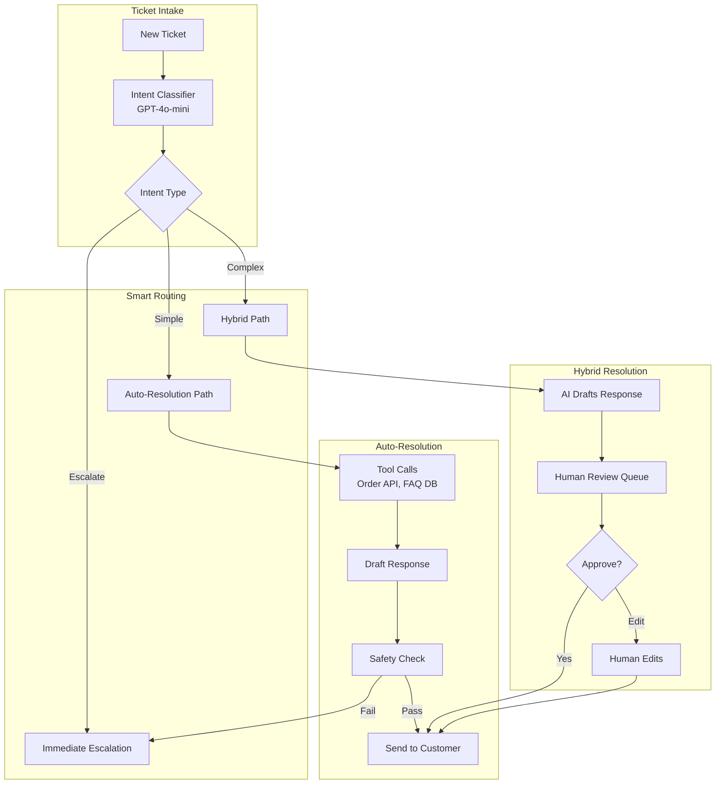
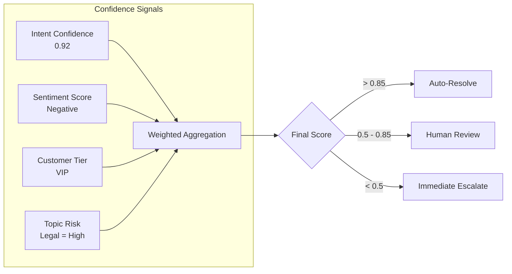
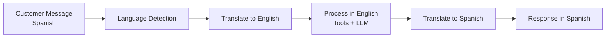

# 案例研究：AI 驱动的客户支持 (AI-Powered Customer Support)

## 问题

一家电子商务公司每月处理 **200 万张支持工单**。他们希望建立一个 AI 系统，能够在无需人工介入的情况下自动解决 60% 的工单，同时在复杂问题出现时无缝升级给人工。

**面试中给出的约束条件：**
- 24/7 跨 12 种语言运行
- 必须与现有的 Zendesk 和 Salesforce 集成
- 不能做出虚假承诺（退款、发货日期）
- 人工客服必须能够在对话中途接管
- 成本目标：每张已解决工单 $0.05

---

## 面试题

> “设计一个客户支持 AI，能够自动处理 ‘Where is my order?’，但在遇到 ‘I want to sue you for fraud’ 时知道何时升级给人工。”

---

## 方案架构



---

## 核心设计决策

### 1. 三层路由（Auto / Hybrid / Escalate）

**答案：** 并不是所有工单都相同。我们将其分类到三条路径：

| 路径 | 标准 | 示例 | 人工介入 |
|------|------|------|----------|
| **Auto** | 高置信度、低风险 | "Where is my order?" | 无 |
| **Hybrid** | 中等置信度或中等风险 | "I want a refund" | 审核 AI 草稿 |
| **Escalate** | 法务、威胁、VIP、低置信度 | "This is fraud" | 完全人工处理 |

### 2. 基于工具的解决方案（Tool-Based Resolution），而非纯生成（Pure Generation）

**答案：** AI 不会“知道”订单位置。它会调用 Order API 工具。这对准确性至关重要：

```python
@tool
def get_order_status(order_id: str) -> dict:
    """Retrieve real-time order status from OMS."""
    order = oms_client.get_order(order_id)
    return {
        "status": order.status,
        "shipped_date": order.shipped_at,
        "estimated_delivery": order.eta,
        "tracking_url": order.tracking_url
    }
```

LLM 负责编排工具，但从不编造数据。

### 3. 为什么要先做安全检查（Safety Check）？

**答案：** 即便是自动解决的工单，也要经过安全过滤：

1. **Promise Detection 承诺检测**：标记像“我保证”或“We will pay”之类的表述
2. **Sentiment Mismatch 情绪不匹配**：当客户情绪激烈时，捕捉 AI 回复过于友好或不匹配的语气
3. **PII Leak PII 泄露**：确保不出现内部备注或其他客户数据
4. **Competitor Mention 竞争对手提及**：标记 AI 若推荐竞争对手的情况

---

## 升级智能（Escalation Intelligence）

最难的是判断何时升级。我们使用多信号置信度评分：



**关键洞察：** 一个 VIP 客户即使问题简单，也会进入 Hybrid 路径，因为错误成本更高。

---

## 多语言支持

12 种语言，但不使用 12 个独立模型：



**为什么不使用原生多语言模型？**

成本。GPT-4o 对全部 12 种语言都表现良好。每种语言用专用模型需要 12 套部署。翻译会增加延迟，但能保持基础设施简单。

---

## 中途接管（Mid-Conversation Human Takeover）

当人工接管时，必须具备完整上下文：

```python
def handoff_to_human(conversation_id: str, agent_id: str):
    conversation = get_conversation(conversation_id)
    
    # Generate summary for human agent
    summary = llm.generate(f"""
    Summarize this conversation for a human agent:
    - Customer issue
    - What AI already tried
    - Why escalation happened
    
    Conversation:
    {conversation.messages}
    """)
    
    # Create handoff package
    return {
        "summary": summary,
        "customer_sentiment": conversation.sentiment,
        "attempted_solutions": conversation.tool_calls,
        "full_transcript": conversation.messages,
        "customer_tier": conversation.customer.tier
    }
```

---

## 成本分析

| Component 组件 | Cost per Ticket 每张工单成本 |
|-----------|-----------------|
| Intent classification (GPT-4o-mini) | $0.002 |
| Tool calls (Order API, FAQ search) | $0.001 |
| Response generation (GPT-4o-mini) | $0.008 |
| Safety check | $0.003 |
| Translation (if needed, 30% of tickets) | $0.004 |
| **Average total 平均总计** | **$0.018** |

在 60% 自动解决率下：**每张已解决工单成本 $0.03**（远低于 $0.05 的目标）

---

## 面试追问

**Q: 如果 AI 一直道歉却始终没有真正帮助怎么办？**

A: 我们跟踪“resolution effectiveness 解决效果”，而不仅是“response sent 已发送回复”。如果客户在 24 小时内就同一问题再次回复，则该工单标记为“unresolved 未解决”，并将该 AI 模式标记为待复盘。我们还会做每周分析：“哪些短语与客户后续追问相关？”

**Q: 如果客户坚持要找真人对话怎么办？**

A: 明确升级触发短语（“talk to a human”, “speak to manager”）会立即触发转接，不受置信度分数影响。我们不会与升级请求对抗。

**Q: 如果客户尝试越狱（jailbreak）支持 AI 怎么处理？**

A: 通过输入净化（input sanitization）加上严格的仅工具响应策略。AI 无法被提示输出系统提示，因为它不生成自由格式答案：它只调用工具并汇总工具输出。系统提示词（system prompt）也非常收窄：“You help with order issues for [Company]. You cannot discuss other topics.”

---

## 面试要点（Key Takeaways for Interviews）

1. **分层路由平衡自动化与风险**：不是每张工单都应自动解决
2. **工具化 grounding（Tool-based grounding）防止幻觉**：AI 检索事实，而不是凭空生成
3. **置信度是多维度的**：意图清晰度 + 情绪 + 客户等级 + 主题风险
4. **人工接管需要上下文**：要总结，不是只倾倒对话记录

---

*Related chapters: [Human-in-the-Loop Patterns](../07-agentic-systems/08-human-in-the-loop-patterns.md), [Guardrails Implementation](../13-reliability-and-safety/01-guardrails.md)*
