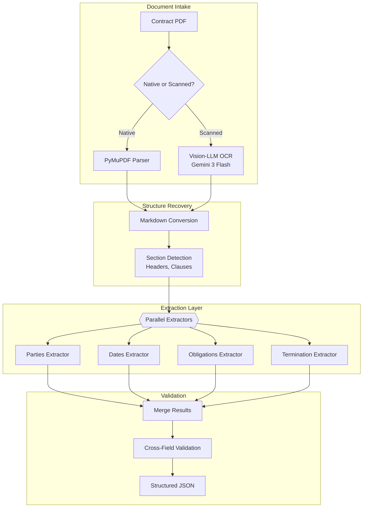
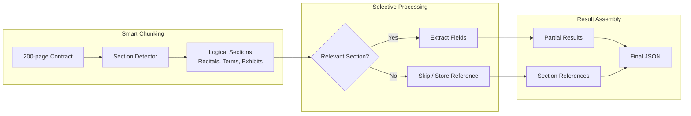

# 案例研究：Document Intelligence Pipeline（文档智能流水线）

## 问题

一家 legal tech 公司每月需要处理 **50,000 份合同**，提取关键条款（当事方、日期、义务、终止条款）并加载到可搜索数据库中。

**面试中给出的约束：**
- 文档长度为 2 到 200 页
- 混合扫描 PDF 与原生数字 PDF
- 多语言（English, German, French, Spanish）
- 提取准确率：关键字段 95%+
- 成本目标：每份文档低于 $0.50

---

## 面试问题

> "设计一条流水线，对一份 100 页合同 PDF 提取结构化数据，例如当事方、生效日期、终止条件和付款条款，输出为 JSON。"

---

## 解决方案架构



---

## 关键设计决策

### 1. 使用 Vision-LLM 做 OCR，而非传统 OCR

**回答：** 扫描合同通常包含印章、手写批注和复杂布局（表格、多栏）。传统 OCR（Tesseract）会产生乱码。Gemini 3 Flash 能“识别”布局并生成保留表格结构的干净 Markdown。成本更高，但准确率提升值得。

| 方法 | 100 页扫描合同 | 准确率 | 成本 |
|--------|---------------------------|----------|------|
| Tesseract | 噪声多、表格被破坏 | 60% | $0.02 |
| AWS Textract | 有所改善，但在布局上仍吃力 | 75% | $0.15 |
| Gemini 3 Flash | 干净 Markdown，表格完好 | 92% | $0.35 |

### 2. 并行抽取器 vs 单次抽取

**回答：** 一个 prompt 一次性提取所有字段，结果通常比专用抽取器更差。每个抽取器都使用聚焦的 prompt 和 schema：

```python
parties_schema = {
    "type": "object",
    "properties": {
        "party_a": {"type": "object", "properties": {
            "name": {"type": "string"},
            "role": {"type": "string"},
            "address": {"type": "string"}
        }},
        "party_b": {"type": "object", "properties": {...}}
    }
}

# Each extractor runs in parallel
async def extract_all(document: str):
    results = await asyncio.gather(
        extract_parties(document, parties_schema),
        extract_dates(document, dates_schema),
        extract_obligations(document, obligations_schema),
        extract_termination(document, termination_schema)
    )
    return merge_results(results)
```

### 3. 跨字段校验（Cross-Field Validation）

**回答：** 抽取错误常常会通过字段不一致暴露出来：
- 如果 `effective_date` 晚于 `termination_date`，则说明存在问题
- 如果 `party_a` 的名字在 `obligations` 中出现但拼写不同，应标记待复核
- 如果已提取 `payment_amount` 但 `payment_frequency` 为 null，则说明不完整

---

## 处理 200 页文档

上下文窗口挑战：



**关键洞察：** 不是所有 200 页都会包含可抽取字段。附件（Exhibits）作为引用存储，不进行处理。“Terms and Conditions”部分通常占文档的 80%，但包含大多数关键字段。

---

## 多语言处理

德语合同的结构与英语合同不同。我们维护语言特定的抽取器：

```python
EXTRACTORS = {
    "en": {
        "parties": EnglishPartiesExtractor(),
        "dates": StandardDatesExtractor(),
        "termination": EnglishTerminationExtractor()
    },
    "de": {
        "parties": GermanPartiesExtractor(),  # Handles "GmbH", "AG" patterns
        "dates": GermanDatesExtractor(),       # DD.MM.YYYY format
        "termination": GermanTerminationExtractor()  # "Kündigung" patterns
    }
}
```

---

## 成本拆解

| 阶段 | 每份 100 页文档成本 |
|-------|----------------------|
| OCR (Gemini 3 Flash, if scanned) | $0.18 |
| Section detection (GPT-4o-mini) | $0.03 |
| Field extraction (4 parallel, GPT-4o-mini) | $0.12 |
| Validation | $0.02 |
| **Total (scanned)** | **$0.35** |
| **Total (native PDF)** | **$0.17** |

Average (60% native, 40% scanned): **$0.24 per document**（低于 $0.50 目标）

---

## 面试追问

**Q: 如果抽取置信度（confidence）很低怎么办？**

A: 我们会为每个字段输出置信度分数。低于 0.8 的字段会被标记为人工复核。界面显示一个“review queue”（复核队列），人工只验证不确定字段，而不是整份文档。这样可将人工处理平均降到每份文档 30 秒。

**Q: 如何处理非标准布局的合同？**

A: 我们维护一个已知合同模板的“layout library”（布局库）。章节检测器先尝试匹配已知模板；如果没有匹配，再回退到启发式检测（例如查找编号章节、全大写标题等）。未知布局会被标记，并在人工复核后加入库中。

**Q: 如果关键条款定义在附件中，如何处理？**

A: 我们会检测交叉引用（例如 “as defined in Exhibit A”）并进行解析。主文档引用附件时，抽取 prompt 会包含相关附件内容。这可避免当答案位于附件中时返回 “null” 抽取。

---

## 面试要点

1. **Vision-LLM（多模态大模型）在复杂布局（tables, annotations，表格、批注）上优于传统 OCR**
2. **并行专用抽取器（parallel specialized extractors）在结构化抽取上优于 single-pass（单次抽取）**
3. **Cross-Field Validation（跨字段校验）可在入库前捕获抽取错误**
4. **并非所有页面都需要处理**：检测相关章节，跳过 exhibits（附件）

---

*Related chapters: [OCR and Layout](../10-document-processing/01-ocr-and-layout.md), [Structured Generation](../05-prompting-and-context/06-structured-generation.md)*
