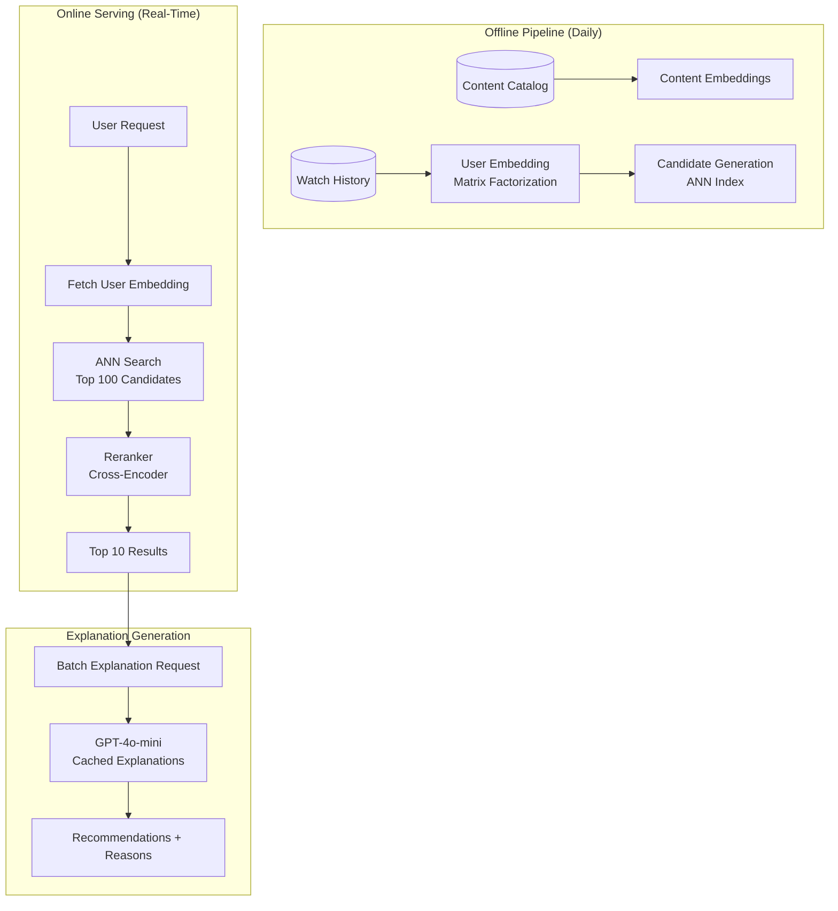
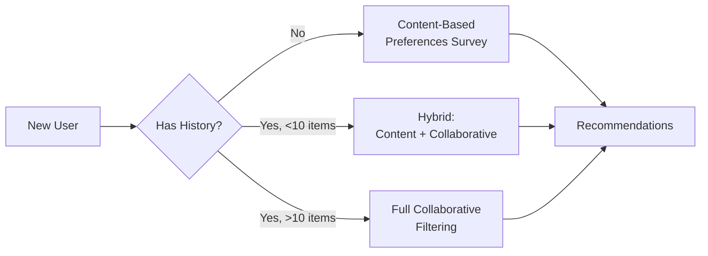

# 案例研究：AI 驱动的推荐引擎

## 问题

一个拥有 **50 million users** 的流媒体平台需要构建一个推荐系统，将协同过滤与 LLM（大语言模型）生成的解释结合起来：`"因为你喜欢《盗梦空间》，你可能会喜欢《信条》，因为它同样拥有令人费解的时间机制。"`。

**面试中给出的约束：**
- 实时推荐（p95 低于 200ms）
- 必须解释每条推荐的原因
- 处理新用户冷启动
- 隐私：不能泄露用户之间的观看历史
- 日活跃用户：5M users，每个用户查看 10+ recommendation sets（推荐集）

---

## 面试题

> “设计一个能够推荐电影并且用自然语言解释推荐原因的系统，要求能够规模化运行。”

---

## 解决方案架构



---

## 关键设计决策

### 1. 为什么不直接把 LLM 用于一切？

**答案：** 规模经济问题。对 50M users × 10 recommendation sets/day（每日日推荐集）调用 LLM，相当于每天 500M 次 LLM 调用。按每次 $0.001 计算，那就是每天 $500K。相反：

| 组件 | 作用 | 每用户/每天成本 |
|-----------|------|-------------------|
| 嵌入查找 | 获取预计算向量 | $0.00001 |
| ANN 检索 | 查找候选 | $0.0001 |
| Cross-encoder 重排 | 给前 100 个打分 | $0.001 |
| LLM 解释 | 自然语言解释 | $0.005 |
| **总计** | | **$0.006** |

LLM 只用于最终解释，而不参与排序本身。

### 2. 解释缓存

**答案：** 大多数解释都可以缓存。“因为你看过《盗梦空间》”这类原因会适用于成千上万的用户。我们在 `(content_pair, reason_type)`（内容对、原因类型）层面缓存解释：

```python
cache_key = f"{source_movie}:{target_movie}:{reason_type}"
# Example: "inception:tenet:time_mechanics"

explanation = cache.get(cache_key)
if not explanation:
    explanation = generate_explanation(source_movie, target_movie, reason_type)
    cache.set(cache_key, explanation, ttl=86400)
```

预热后缓存命中率可达到 85%+。

### 3. 冷启动处理

**答案：** 新用户没有协同过滤所需的历史记录。我们采用 **混合方法**：



---

## 个性化解释挑战

解释必须显得个性化，而不是泛泛而谈：

**差：** “《信条》是一部很受欢迎的惊悚片。”
**好：** “因为你喜欢《盗梦空间》那种颠覆认知的剧情，《信条》提供了来自同一位导演的类似时间操控谜题。”

我们通过在提示词中加入用户上下文来实现这一点：

```python
prompt = f"""
Generate a 1-sentence explanation for why this user would enjoy {target_movie}.

User context:
- Recently watched: {recent_movies}
- Preferred genres: {genres}
- Dislikes: {dislikes}

Source movie that triggered this recommendation: {source_movie}
Reason category: {reason_type}

Explanation:
"""
```

---

## 延迟预算

| 阶段 | 目标 | 实际 p95 |
|-------|--------|------------|
| 用户嵌入查找 | 5ms | 3ms |
| ANN 检索（前 100） | 20ms | 15ms |
| Cross-encoder 重排 | 50ms | 45ms |
| LLM 解释（命中缓存） | 10ms | 8ms |
| LLM 解释（未命中） | 500ms | 450ms |
| **总计（缓存命中）** | **85ms** | **71ms** |
| **总计（缓存未命中）** | **575ms** | **513ms** |

为了满足 200ms p95，我们确保解释的缓存命中率达到 95%+，并对新内容对异步生成解释。

---

## 面试追问

**问：如何防止 LLM 编造关于电影的事实？**

答：LLM 会接收每部电影的结构化事实表（导演、演员、主题、奖项）作为上下文。它只能使用这张表中的信息。我们还会在生成后增加校验器，检查输出主张是否与目录元数据一致。

**问：如果用户口味变化很快怎么办？**

答：我们使用 **按最近程度加权的嵌入更新**。最近观看的内容权重是较早内容的 3 倍。为了实时响应，我们维护一个“会话嵌入”，捕捉当前会话行为，并与历史嵌入进行融合。

**问：如何对推荐算法做 A/B 测试？**

答：我们通过 `user_id` 哈希来稳定地把用户分配到不同实验桶。每个桶可以使用不同的候选生成、排序或解释策略。我们按桶跟踪参与度指标（点击率、观看时长、跳过率）。

---

## 面试要点

1. **LLM 用于解释，不用于排序**：用传统机器学习（ML，机器学习）保证规模，用 LLM 做个性化
2. **积极缓存**：内容对的解释可在不同用户之间复用
3. **冷启动是一个连续谱**：新用户 → 基于内容；有少量历史 → 混合；完整历史 → 协同过滤
4. **延迟预算要求设定缓存命中率目标**：围绕你的延迟 SLA 设计缓存

---

*相关章节：[语义缓存](../08-memory-and-state/05-semantic-caching.md)，[成本优化](../04-inference-optimization/07-cost-optimization-playbook.md)*
