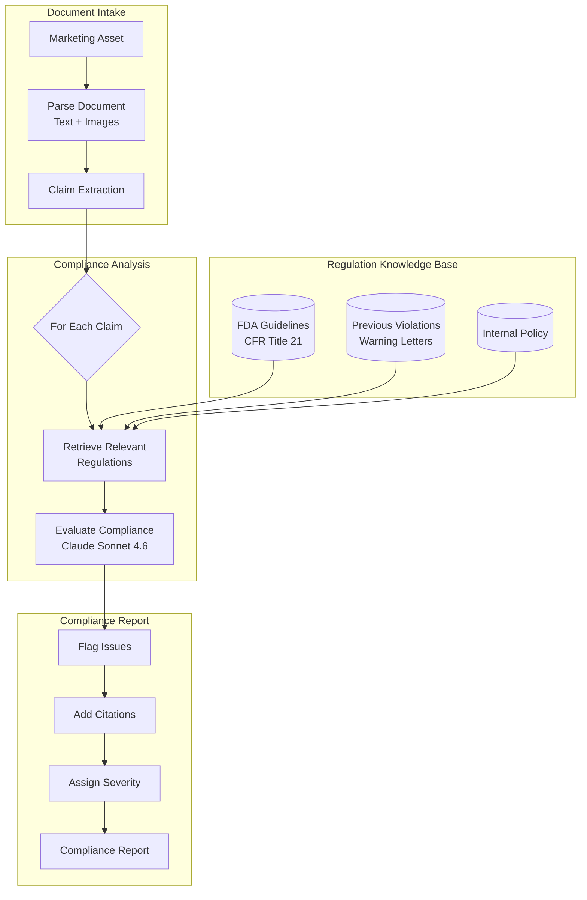
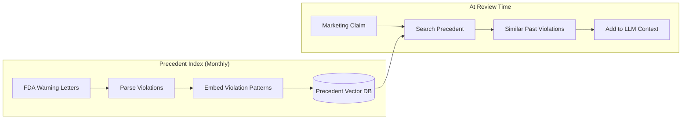
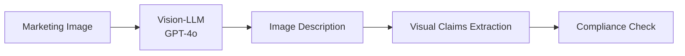

# 案例研究：法规合规自动化

## 问题

一家制药公司必须确保所有营销材料符合 **FDA 法规**。目前，每个资产的法务审查需要 2 周。他们希望用 AI 预审材料并标记问题，将法务审查缩短到 2 天。

**面试中给出的约束：**
- 必须引用具体的法规条款，而不是只说“这看起来不对”
- 不能接受假阴性（漏报违规）
- 假阳性（过度标记）应低于 20%
- 每月 500 个营销资产
- 需要审计追踪以供监管检查

---

## 面试题

> “设计一个系统，用于审查制药营销材料并识别带有引用依据的具体法规违规。”

---

## 解决方案架构



---

## 关键设计决策

### 1. 先做主张提取，再做合规检查

**回答：** 营销材料信息密度很高。把整份文档直接拿去和法规逐条比对效率很低。我们先提取单个 **主张**：

```python
claims = extract_claims(document)
# Example output:
# [
#   {"text": "Reduces symptoms by 80%", "type": "efficacy", "location": "page 2, para 3"},
#   {"text": "No side effects reported", "type": "safety", "location": "page 3, header"},
#   {"text": "Recommended by doctors", "type": "endorsement", "location": "page 1, image"}
# ]
```

然后再将每个主张独立与相关法规进行检查。

### 2. 为什么法规用 RAG（检索增强生成）而不是微调？

**回答：** 法规会变化。FDA 每个月都会更新指南文档。微调在每次更新后都需要重新训练。RAG 让我们可以：
- 在发布新指南时立即更新法规索引
- 跟踪每次审查使用的是哪个版本的法规（审计追踪）
- 向法务审查人员展示精确的原文出处

### 3. 保守的标记策略

**回答：** 假阴性（漏掉违规）代价极高；假阳性（额外审查）只会增加时间成本。我们使用一个 **阈值层级**：

| 置信度 | 操作 |
|--------|------|
| >90% 违规 | 标记为高严重级别 |
| 70-90% 潜在风险 | 标记为中等，附上疑点引用 |
| 50-70% 不明确 | 标记为低，注明歧义 |
| <50% 大概率合规 | 不标记，但记录审计日志 |

我们绝不会在不记录推理过程的情况下直接输出“合规”。

---

## 前例数据库

法规往往存在歧义。历史上的 FDA 警告信可以明确规则是如何被执行的：



**这很重要的原因：** 像“临床证明”这样的主张，单看法规可能似乎没问题。但如果我们找到 5 封警告信，证明 FDA 曾因企业在没有具体试验数据的情况下使用“临床证明”而提出引证，那就是一个危险信号。

---

## 审计追踪要求

每一个决策都必须可追溯：

```python
compliance_decision = {
    "claim_id": "claim_003",
    "claim_text": "No side effects reported",
    "decision": "VIOLATION",
    "severity": "HIGH",
    "regulation_cited": "21 CFR 202.1(e)(5)",
    "regulation_text": "Advertisements shall not contain claims that...",
    "precedent_cited": "Warning Letter 2023-FDA-04521",
    "reasoning": "Claim implies absolute safety, which contradicts...",
    "model_used": "claude-3-7-sonnet-20251022",
    "timestamp": "2025-12-21T10:30:00Z",
    "reviewer_id": null,  # Filled when human reviews
    "final_decision": null  # Filled after legal review
}
```

---

## 处理图片和视频

制药营销包含视觉主张（开心的患者、前后对比图）：



**示例：** 一张患者跑步的图片暗示药效。如果药物用于关节炎，我们就要检查临床试验是否支持“活动能力改善”这样的主张。

---

## 成本分析

| 阶段 | 每个资产成本 |
|-----|-------------|
| 文档解析 | $0.05 |
| 主张提取 | $0.15 |
| 法规检索 | $0.02 |
| 合规评估（每个主张，平均 12 个主张） | $1.80 |
| 图片分析（平均 5 张图片） | $0.75 |
| 报告生成 | $0.10 |
| **总计** | **$2.87** |

对于每月 500 个资产：**$1,435/月**（对比等量法务工时的 $50K+/月）

---

## 面试追问

**问：如何处理需要人为判断的法规？**

答：我们不替代人类，而是做分流。系统会带着置信分数标记问题。低置信度标记交给资深法律顾问。高置信度且明确的项目跳过详细审查。这样可以通过把人的注意力集中在边缘案例上，把 2 周的审查缩短到 2 天。

**问：如果 FDA 在月中更新了一条法规怎么办？**

答：我们有一个“法规监控”服务，持续监测 FDA RSS 订阅源和《联邦公报》更新。一旦检测到相关更新，就会重新索引，并标记任何可能受到变更影响的近期审查。

**问：你如何在审计时向监管方解释 AI 的推理过程？**

答：每个决策都包含完整的推理链：提取出的主张、检索到的法规、引用的前例，以及模型的评估结果。我们可以向监管方展示决策是如何做出的，并为所有组件提供版本号。

---

## 面试要点总结

1. **先做主张提取**：把复杂文档拆成可审查单元
2. **前例数据库优于纯法规文本**：规则的执行方式同样重要
3. **高风险领域采用保守阈值**：优化召回率，而不是精确率
4. **审计追踪就是架构的一部分**：从第一天起就按可解释性设计

---

*相关章节：[RAG 基础](../06-retrieval-systems/01-rag-fundamentals.md), [护栏实现](../13-reliability-and-safety/01-guardrails.md)*
