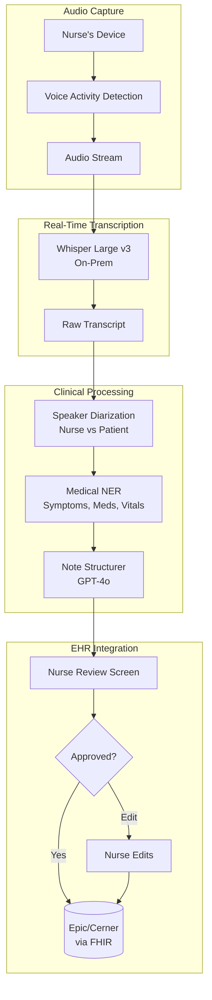
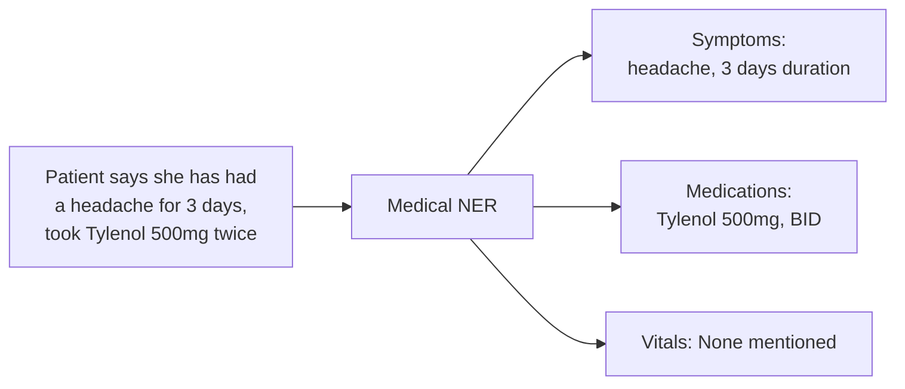

# 案例研究：医疗领域的语音 AI 助手

## 问题

一家医院网络希望构建一个**基于语音的 AI 助手（voice-based AI assistant）**，帮助护士记录患者就诊过程。护士自然口述，AI 实时生成结构化临床记录（structured clinical note）。

**面试中给出的约束条件：**
- HIPAA 合规（PHI 处理）
- 可在嘈杂的医院环境中工作
- 实时转录（延迟低于 500ms）
- 必须正确使用医学术语（medical terminology）
- 与现有 EHR（Electronic Health Record，电子病历系统）集成（Epic/Cerner）

---

## 面试问题

> “设计一个护士在患者就诊时可以直接对话的语音助手，它能在 EHR 中生成结构化临床记录。”

---

## 方案架构



---

## 关键设计决策

### 1. HIPAA 场景下的本地部署 ASR（On-Premise ASR）

**回答：** PHI 不能在未加密且未签署 BAA（Business Associate Agreement，商业伙伴协议）的情况下离开医院网络。我们将 Whisper Large v3 部署在本地 GPU 服务器上，而不是使用云端 API：

| 方案 | 延迟 | HIPAA | 成本 |
|--------|---------|-------|------|
| 云端 ASR（OpenAI） | 200ms | 需要 BAA，数据会离开网络 | $0.006/分钟 |
| 本地 Whisper（On-prem） | 150ms | 完全可控，无数据外流 | $0.002/分钟（GPU 摊销后） |

本地部署在延迟和合规性上都更优。

### 2. 说话人分离（Speaker Diarization）：谁说了什么

**回答：** 记录必须区分“患者诉头痛（Patient reports headache）”与“护士观察到患者在皱眉（Nurse observes patient grimacing）”。我们使用：

```python
# Pyannote for speaker diarization
diarization = pipeline("audio.wav")
# Output: [(0.0, 1.5, "SPEAKER_0"), (1.5, 4.2, "SPEAKER_1"), ...]

# Map speakers based on voice profile
roles = identify_roles(diarization, known_nurse_voiceprint)
# Output: {"SPEAKER_0": "nurse", "SPEAKER_1": "patient"}
```

护士设备在初始化时采集其声纹，用于角色识别（role identification）。

### 3. 用于结构化抽取的医学 NER（Medical NER）

**回答：** 我们需要结构化数据，而不仅仅是自然语言文本。医学命名实体识别提取：



我们使用微调后的 BioBERT 模型来做 NER，而不是 LLM，因为 NER 需要快速且确定性（deterministic）的输出。

---

## 处理嘈杂环境

医院环境很吵。我们采用多种策略：

1. 护士设备上的**定向麦克风（Directional microphones）**，聚焦近距离发言
2. **抗噪 ASR 模型（Noise-robust ASR models）**（Whisper 在噪声数据上训练过）
3. **置信度阈值（Confidence thresholds）**：若 ASR 置信度 < 0.7，则标记为护士复核，而不是猜测
4. **关键词检测（Keyword spotting）**：医学术语使用自定义发音模型（custom pronunciation models）

---

## 结构化记录格式

LLM 生成 SOAP 格式记录：

```python
note_prompt = f"""
Generate a clinical SOAP note from this encounter transcript.

Transcript:
{transcript_with_speakers}

Extracted entities:
- Symptoms: {symptoms}
- Medications: {medications}
- Vitals: {vitals}

Output format:
S (Subjective): Patient's reported symptoms
O (Objective): Nurse's observations and measurements
A (Assessment): Clinical impression
P (Plan): Next steps, orders
"""
```

---

## EHR 集成（FHIR）

输出必须对 EHR 可机器读取（machine-readable）：

```json
{
  "resourceType": "DocumentReference",
  "status": "current",
  "type": {
    "coding": [{"system": "http://loinc.org", "code": "34117-2", "display": "History and physical note"}]
  },
  "subject": {"reference": "Patient/12345"},
  "author": [{"reference": "Practitioner/nurse789"}],
  "content": [{
    "attachment": {
      "contentType": "text/plain",
      "data": "base64-encoded-soap-note"
    }
  }],
  "context": {
    "encounter": {"reference": "Encounter/visit456"}
  }
}
```

---

## 延迟预算

| 阶段 | 目标 | 实测 |
|-------|--------|--------|
| 音频采集到 VAD | 50ms | 30ms |
| ASR 转录 | 200ms | 150ms |
| 说话人分离 | 100ms | 80ms |
| NER 抽取 | 50ms | 40ms |
| LLM 结构化 | 500ms | 450ms |
| **端到端总计（end-to-end）** | **900ms** | **750ms** |

为了获得实时感，我们会在 NER 和 LLM 处理完整句子的同时，流式输出部分转录文本（partial transcripts）。

---

## 面试追问

**Q：你如何处理医学缩写和行话（jargon）？**

A：我们维护一份自定义词汇表，将缩写（PRN、BID、SOB）映射到完整术语。该词汇表会注入 ASR 模型（提升识别率）和 LLM 提示词（LLM prompt，确保笔记中的正确展开）。

**Q：如果护士在句子中途改口怎么办？**

A：我们检测纠正模式（“actually, I mean...”, “no wait, it's...”），并仅使用更正后的版本。LLM 被指示在存在冲突时优先采用后续表述。

**Q：你如何保证 AI 不会漏掉关键内容？**

A：我们有“完整性校验（completeness check）”，验证记录是否包含所有已抽取实体。如果 NER 识别到“胸痛（chest pain）”但 SOAP 记录未提及，就会提示护士复核。我们还会运行“安全关键”检测（safety critical detector），对“自杀意念（suicidal ideation）”“虐待”或其他强制报告触发项进行升级提示。

---

## 面试中的关键收获

1. **医疗场景优先本地化（On-prem for healthcare）**：HIPAA 通常要求本地处理
2. **说话人分离至关重要**：临床上“是谁说的”具有决策意义
3. **混合抽取（Hybrid extraction）**：快速 NER 负责结构化，LLM 负责文本生成
4. **始终保留人工审核（human review）**：尤其是在临床文档场景

---

*相关章节：[Model Taxonomy](../02-model-landscape/01-model-taxonomy.md)，[Reliability Patterns](../13-reliability-and-safety/03-reliability-patterns.md)*
