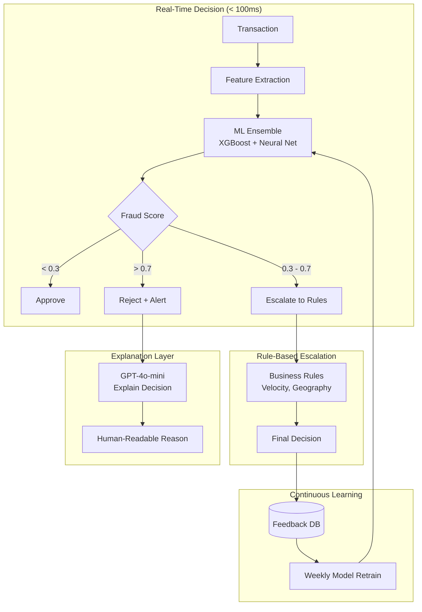
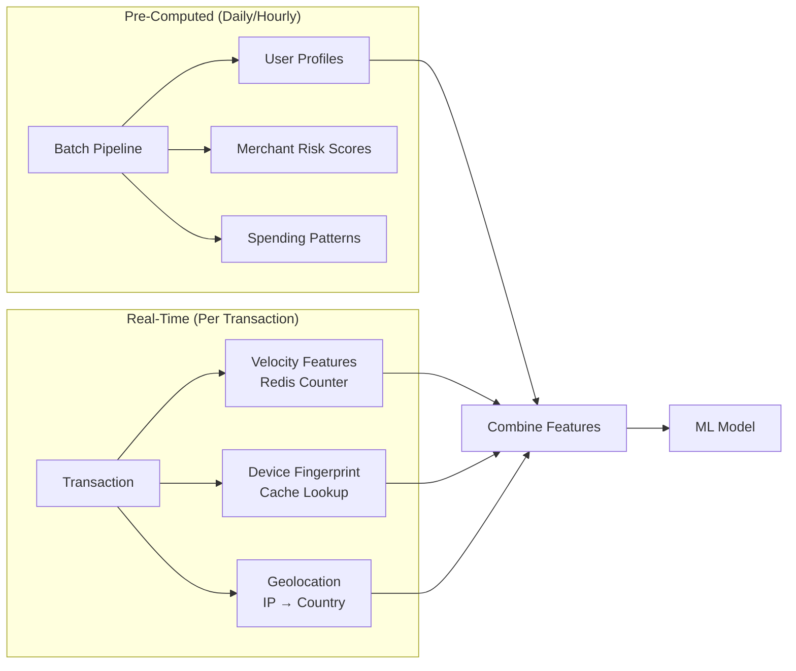
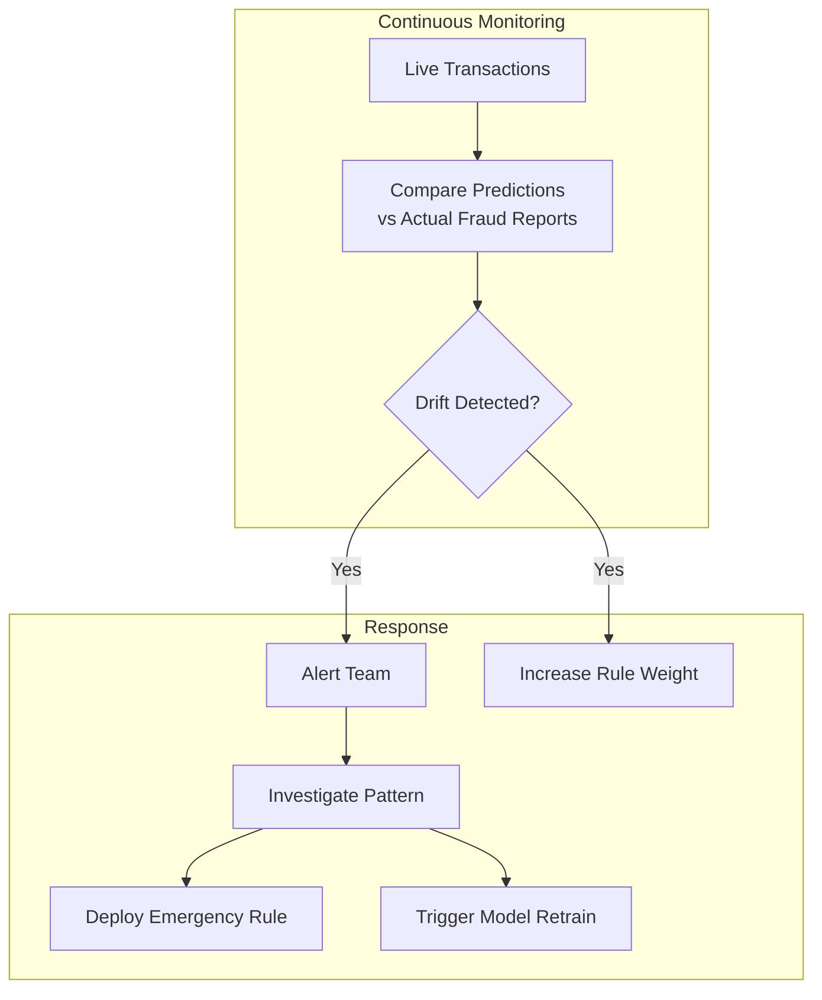

# 案例研究：实时欺诈检测

## 问题

某支付处理器每天处理 **10 million transactions per day**。他们需要实时检测欺诈交易，在交易完成前将其阻止，同时尽量减少让合法客户感到挫败的误报。

**面试中给出的约束：**
- 决策延迟：低于 100ms
- 误报率：低于 0.1%（1 in 1,000）
- 必须解释为什么某笔交易被标记
- 法规要求 7-year audit trail（审计轨迹）
- 欺诈模式持续演变

---

## 面试题

> “设计一个系统，在 100ms 内决定是否批准、拒绝或升级审查一笔信用卡交易，并且能够解释该决定。”

---

## 解决方案架构



---

## 关键设计决策

### 1. 为什么用 ML + 规则，而不是只用 ML？

**答案：** 纯 ML 模型是黑箱。监管机构要求对争议提供可解释的决定。我们用 ML 做评分，再用透明规则做最终决定：

| 层 | 角色 | 速度 | 可解释性 |
|-------|------|-------|----------------|
| ML 集成 | 捕捉复杂模式 | 10ms | 低 |
| 业务规则 | 编码已知欺诈类型 | 5ms | 高 |
| 组合方案 | 两者兼得 | 15ms | 中高 |

规则示例：“如果在 5+ 个不同国家、1 小时内发生交易，就拦截” 这类规则可以向监管机构解释。

### 2. 为什么采用三向决策：批准 / 升级 / 拒绝？

**答案：** 二元的批准/拒绝过于粗暴。“灰区”（0.3-0.7 分数）会进入基于规则的升级审查，或由人工复核高价值交易：

```python
def decide(transaction, fraud_score):
    if fraud_score < 0.3:
        return "APPROVE", None
    elif fraud_score > 0.7:
        reason = explain_rejection(transaction, fraud_score)
        return "REJECT", reason
    else:
        # Gray zone: apply business rules
        if check_velocity_rules(transaction):
            return "REJECT", "Velocity limit exceeded"
        if check_geography_rules(transaction):
            return "ESCALATE", "Unusual location"
        return "APPROVE", None
```

### 3. 为什么用 LLM 做解释，而不是 SHAP/LIME？

**答案：** SHAP 值会告诉你“特征 X 对分数的贡献是 0.3”。客户和监管机构想要的是“这笔交易被标记，是因为它来自一个你从未访问过的国家的新设备，而且金额是你平时消费的 10 倍。”

我们将特征重要性作为输入，生成自然语言解释：

```python
prompt = f"""
Explain why this transaction was flagged as potentially fraudulent.

Transaction details:
- Amount: ${amount}
- Merchant: {merchant}
- Location: {location}
- Device: {device}

Top contributing factors:
1. {factors[0]['feature']}: {factors[0]['contribution']}
2. {factors[1]['feature']}: {factors[1]['contribution']}
3. {factors[2]['feature']}: {factors[2]['contribution']}

Write a 2-sentence explanation for the cardholder.
"""
```

---

## 面向速度的特征工程

100ms 预算意味着特征必须预先计算：



**关键洞察：** 用户画像（平均消费、常见商户、家庭地理位置）在离线计算。实时部分只增加交易特有的特征。

---

## 处理不断演变的欺诈模式

欺诈者会适应。上个月的模型会漏掉这个月的攻击。



**紧急规则**可以在几分钟内部署（只是一次配置更新）。模型重训练需要几天，但能捕捉更细微的模式。

---

## 面试追问

**问：你如何处理模型延迟峰值？**

答：我们有一个**降级栈**。如果 ML 模型在 50ms 内没有响应，就只回退到基于规则的评分。规则覆盖最常见的欺诈模式。如果所有系统都很慢，对于低于 $10 的交易，我们还有“默认批准”。

**问：如何应对协同欺诈攻击？**

答：我们维护全局频率计数器（不仅仅是按用户）。如果我们看到不同卡片在 1 分钟内向同一个冷门商户发起 100 笔交易，即使单笔交易看起来都很干净，也会触发商户级封锁。

**问：你如何平衡反欺诈与客户体验？**

答：我们跟踪“冒犯率”：被拦截的合法客户比例。每个产品团队都有一个冒犯预算。如果欺诈模型的冒犯率超过预算，我们会自动放宽阈值并通知团队。与其让忠诚客户生气，不如多接受一点欺诈。

---

## 面试中的要点总结

1. **用 ML 评分，用规则解释**：在受监管领域，两者结合
2. **三向决策减少误报**：灰区获得额外审查
3. **尽可能预先计算一切**：实时预算只用于组合
4. **持续重训练是必要的**：欺诈模式每周都在演变

---

*相关章节：[评估与可观测性](../14-evaluation-and-observability/), [可靠性模式](../13-reliability-and-safety/03-reliability-patterns.md)*
