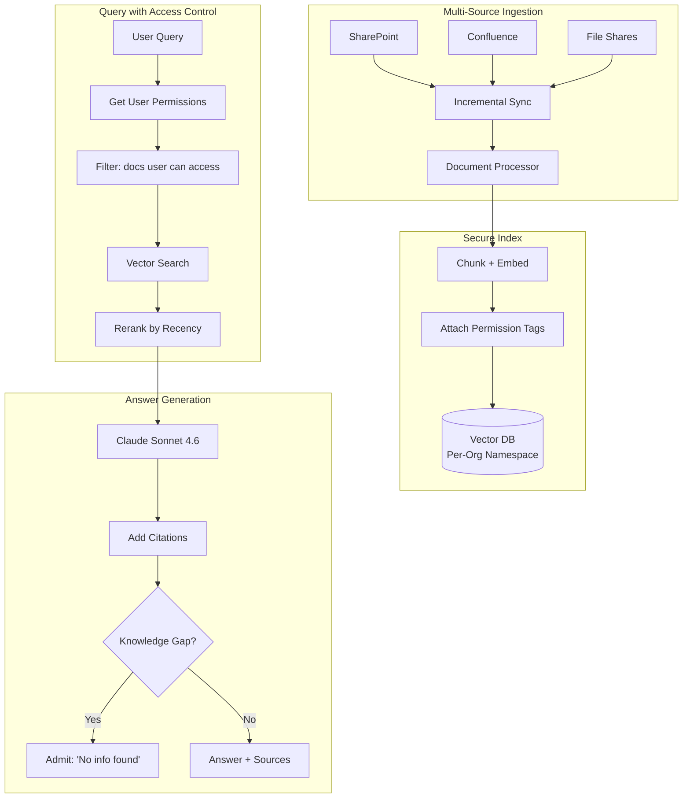
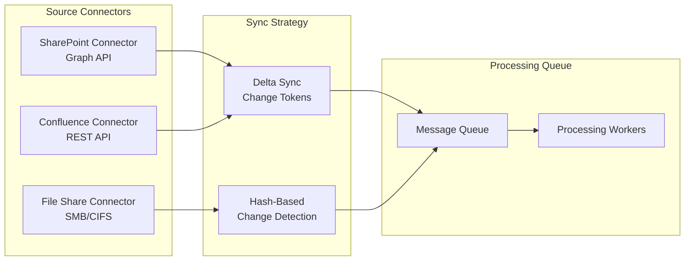

# 案例研究：企业知识管理（Enterprise Knowledge Management）

## 问题（The Problem）

一家拥有 **10,000 名员工** 的咨询公司在 SharePoint、Confluence 和文件共享中分散保存了数十年的项目报告、方法论文档和专家经验。他们希望构建一个 AI 系统，让咨询师可以提问“我们是如何为汽车客户进行供应链优化的？”并从内部知识中综合给出答案。

**面试中给定的约束条件：**
- 15 个数据源中的 2,000,000 份文档
- 访问控制：associate（助理）无法查看 partner（合伙人）级别内容
- 每条结论都必须附带来源引用
- 过期数据处理：旧方法论不应覆盖新方法论
- 必须识别知识缺口，不能幻觉生成

---

## 面试问题（The Interview Question）

> “设计一个内部知识助手，让初级咨询师可以提问，并且只能基于其有权查看的文档获取答案。”

---

## 方案架构（Solution Architecture）



---

## 关键设计决策（Key Design Decisions）

### 1. 权限感知检索（Permission-Aware Retrieval）

**回答：** 每个分块（chunk）都携带来自源系统的权限元数据（metadata）：

```python
chunk = {
    "content": "Our approach to automotive supply chain...",
    "source": "sharepoint://projects/acme-motors/final-report.docx",
    "permissions": {
        "read_groups": ["partners", "managers", "automotive-team"],
        "classification": "confidential"
    },
    "last_modified": "2024-03-15",
    "author": "jane.doe@firm.com"
}
```

查询时，我们在检索前进行过滤（filter）：

```python
def search(query: str, user: User):
    user_groups = get_user_groups(user.id)
    
    return vector_db.search(
        query=query,
        filter={
            "permissions.read_groups": {"$in": user_groups}
        }
    )
```

### 2. 按时效加权排序（Recency-Weighted Ranking）

**回答：** 2024 年的方法论文档在同一主题上应高于 2019 年文档。我们使用一个**衰减函数（decay function）**：

```python
def recency_boost(doc_date):
    age_days = (today - doc_date).days
    # Half-life of 365 days
    return 0.5 ** (age_days / 365)

final_score = semantic_score * 0.7 + recency_boost(doc.date) * 0.3
```

这可防止过时做法淹没当前指引。

### 3. 知识缺口检测（Knowledge Gap Detection）

**回答：** 我们必须区分“未找到信息”和“我在编造内容”：

```python
def generate_answer(query: str, retrieved_docs: list):
    if len(retrieved_docs) == 0 or max_relevance_score < 0.5:
        return {
            "answer": "I could not find relevant information in our knowledge base for this query.",
            "confidence": "low",
            "suggestion": "Try contacting the Automotive Practice lead directly."
        }
    
    # Generate from retrieved content
    answer = llm.generate(query, context=retrieved_docs)
    return {"answer": answer, "confidence": "high", "sources": [d.source for d in retrieved_docs]}
```

---

## 多源同步（Multi-Source Synchronization）



**关键洞见：** SharePoint 和 Confluence 支持变更令牌（change tokens，delta sync）。文件共享需要哈希比对。两者都进入统一处理队列。

---

## 处理冲突信息（Handling Conflicting Information）

不同文档可能给出冲突指引。我们将其明确呈现：

```python
def detect_conflicts(retrieved_docs):
    # Group by topic
    topics = cluster_by_topic(retrieved_docs)
    
    for topic, docs in topics.items():
        if has_contradictions(docs):
            return {
                "warning": "Found conflicting guidance",
                "perspectives": [
                    {"source": d.source, "date": d.date, "view": summarize(d)}
                    for d in docs
                ],
                "recommendation": "Defer to most recent document or consult practice lead."
            }
```

---

## 成本分析（Cost Analysis）

| 组件（Component） | 月成本（Monthly Cost） |
|-------------------|------------------------|
| Embedding（2M 文档 × 更新） | $500 |
| 向量数据库（Pinecone Enterprise） | $2,000 |
| LLM 生成（50K 查询） | $3,000 |
| 同步基础设施（connectors） | $500 |
| **总计** | **$6,000/月** |

ROI：咨询师平均每周节省信息检索 2 小时。按 10,000 名咨询师 × $100/小时 × 2 小时 × 4 周 = 每月 $8M 的生产率提升。系统回本（pays for itself）约为 1,300 倍。

---

## 面试追问（Interview Follow-Up Questions）

**问：如何处理混合权限文档？**

答：我们按章节级别分块，并让每个章节继承其祖先中最严格的权限。一个“内部”文档中的“保密（confidential）”章节里的段落会被标记为“保密”。

**问：实时协作文档（Google Docs、live Confluence 页面）如何处理？**

答：我们有独立的“实时文档”（live document）管道，采用更高频率的同步（每 5 分钟一次，而静态文件为每天一次）。这些文档在搜索结果中会被标记为“草稿”（draft），直到定稿。

**问：如何防止系统成为越权数据的泄露通道（leaky abstraction）？**

答：我们从不在 LLM 上下文中包含未授权内容，即使只是为了说“我不能向你显示这个”。系统表现得就像未授权文档不存在。这可防止推断攻击（inference attacks），例如用户通过“你有关于 X 的信息吗？”来探测保密项目是否存在。

---

## 面试关键要点（Key Takeaways for Interviews）

1. **权限必须在检索阶段而非生成阶段执行（at retrieval, not generation）**：在 LLM 看到内容前进行过滤
2. **时效加权可避免过时知识（Recency weighting）**：旧文档会按相关性衰减
3. **承认知识缺口而非幻觉输出**：使用置信度阈值和兜底提示（fallback messaging）
4. **多源同步较复杂**：不同 API 需要不同策略

---

*相关章节：[RAG 基础（RAG Fundamentals）](../06-retrieval-systems/01-rag-fundamentals.md), [多租户隔离（Multi-Tenant Isolation）](../12-security-and-access/02-access-control.md)*
