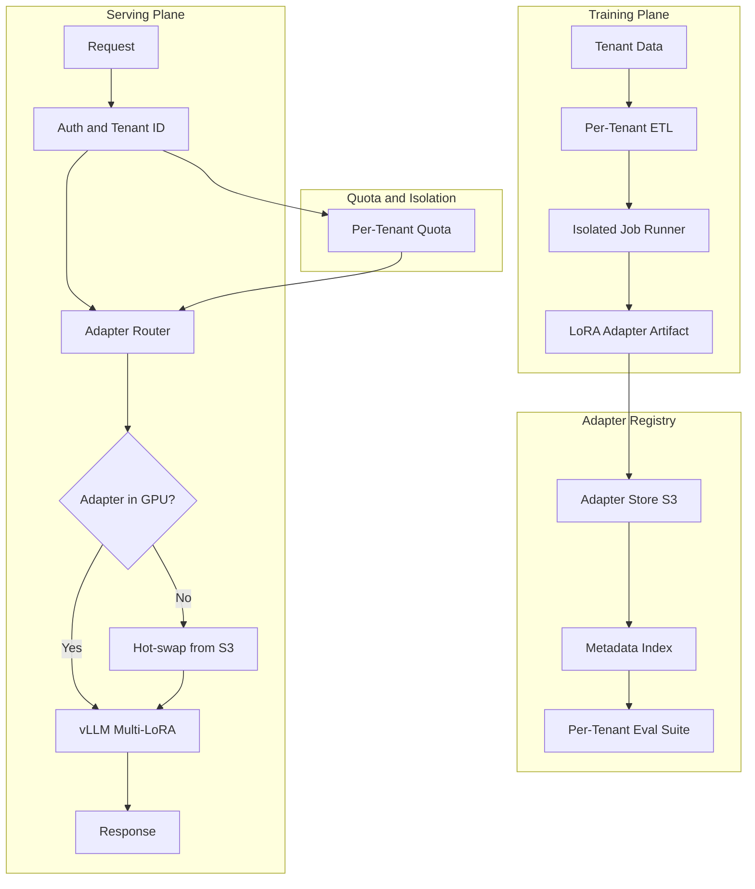
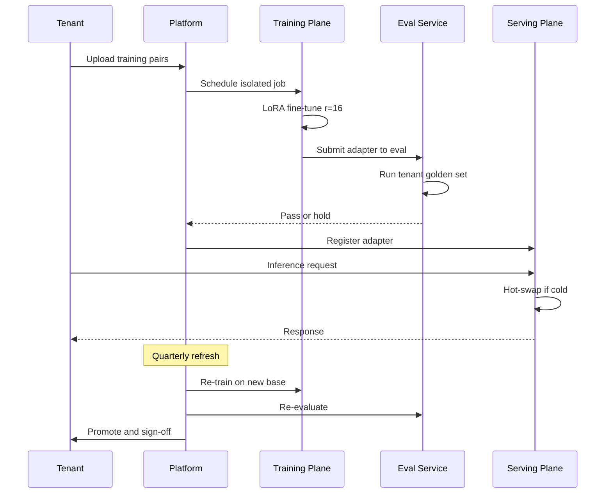

# 案例研究：多租户微调平台

一家垂直 AI 供应商基于单个基础模型加上每个租户各自的 LoRA 适配器，为 280 个客户提供服务，并实现了租户隔离训练、按租户进行评测即产品需求文档（eval-as-PRD），以及缓解“噪声邻居”问题的机制，使 p99 延迟保持在 1.2 秒以内。

## 业务问题

一家法律科技领域的垂直 SaaS 供应商在运营一款合同分析产品。它的每个 280 家企业客户都希望模型能尊重他们的模板、判例语料库以及偏好的起草风格。现成提示词工程不够用：客户会拿通用模型做盲测 A/B 测试，一旦输出偏离内部风格就会拒绝产品。为每个租户单独维护一个微调模型也不可行：在 70B 参数规模下，每个模型磁盘占用 140 GB，而且每次推理都需要独占一张 H100，经济模型直接崩掉。

来自 5 月 2026 现实世界的约束：

- 280 个付费租户，且每年翻倍
- 每个租户有 1,000 到 250,000 对历史合同样本（输入加偏好的编辑结果）
- 租户要求提供评测报告，证明模型在他们自己的测试集上表现合适
- 单次请求延迟预算：p99 低于 1.2 秒
- 不同租户适用不同合规制度：SOC 2、ISO 27001、HIPAA、FedRAMP Moderate

团队选择在共享基础模型上为每个租户部署 LoRA 适配器。LoRA（低秩适配，LoRA，[Hu 等，2021](https://arxiv.org/abs/2106.09685)）和 QLoRA（量化 LoRA，[Dettmers 等，2023](https://arxiv.org/abs/2305.14314)）都已成熟；vLLM 的多 LoRA 服务能力（[文档](https://docs.vllm.ai/en/latest/models/lora.html)）以及 SGLang 的适配器切换机制，让许多适配器可以在 GPU 显存中共享一个基础模型。Anyscale 和 Together AI 都已发布过围绕这种模式的生产案例研究（[Anyscale 2024 博客](https://www.anyscale.com/blog/fine-tuning-llms-lora-or-full-parameter-an-in-depth-analysis)，[Together AI 多 LoRA 推理](https://www.together.ai/blog/multi-lora-inference)）。

## 架构

### 组件

| 层 | 技术 | 目的 |
|-------|------|---------|
| 基础模型 | Llama 4 70B int8 | 所有租户共享 |
| 适配器 | 注意力层上的 LoRA r=16，每个租户约 120 MB | 按租户适配 |
| 训练 | 8x H100 节点上的 DeepSpeed ZeRO-3 | 租户隔离作业 |
| 服务 | 带 PagedAttention 和多 LoRA 的 vLLM 0.7+ | 一个基础模型，多个适配器 |
| 适配器存储 | 使用每租户 KMS 密钥的 S3 | 静态加密 |
| 评测存储 | 每租户黄金集，每次重训都运行 | 按租户进行评测即产品需求文档 |

### 训练时的数据流

1. 客户通过带专属 IAM 角色的每租户 S3 存储桶上传训练配对；KMS 密钥按租户划分。
2. ETL 作业运行在仅限该租户的 Kubernetes 命名空间中；节点选择器确保它不会与其他租户的作业共调度。
3. 训练通常在 8x H100 容器上运行 4 到 10 小时；r=16 的 LoRA 可放入每张 H100 的 80 GB 中，为激活内存留出空间。
4. 评测会自动针对该租户的黄金集运行；如果指标相对阈值退化，产物会被留在预发布环境。
5. 适配器产物（针对一个 r=16 注意力适配器、基座为 70B 的模型，大小约 120 MB）会上传到注册中心，元数据索引也会更新。

### 服务时的数据流

1. 请求携带租户 JWT 到达网关。
2. 路由器解析该租户对应的适配器版本。
3. 如果适配器已在 GPU 显存中热驻留（每节点 200 个适配器的 LRU 缓存），则直接推理。
4. 如果是冷启动，则会在 200 到 600 毫秒内从 S3 热切换加载适配器。我们通过基于租户流量模式的预热来掩盖这段延迟。
5. vLLM 使用已应用适配器处理请求；PagedAttention 通过将 KV 缓存限定为请求级而非适配器级，确保租户间安全共享。

## 关键设计决策

### 1. 选择 r=16 的 LoRA，而不是全量微调

对每个租户做完整的 70B 微调大约需要 $4,500 的算力成本，生成 140 GB 的产物，并且会占住一张 H100。r=16 的 LoRA 对每个租户每次重训的成本为 $80 到 $400，生成 120 MB 的产物，并且可以共享 GPU。我们内部合同分析评测上的准确率差距是 1.6 个点，基于 100 分制的综合评分。我们接受这个差距，因为成本差异是 50 倍，而运维故事（热切换、临时产物）要简单得多。上面链接的 Anyscale 博文也做了类似比较，并得出了相同结论。

### 2. 适配器切换预算与“噪声邻居”问题

vLLM 的多 LoRA 支持会把适配器保留在 GPU 显存中，但每个适配器要占用几百 MB。对于一张运行 70B 基座 int8 版本（约 40 GB）的 80 GB H100，我们大约有 30 GB 可用于适配器和 KV 缓存。这样大约可同时驻留 200 个适配器。我们采用 LRU 策略，并结合感知流量的预热和尾部租户固定驻留：30 个对延迟 SLA 要求严格的租户会被固定，不会被驱逐；其余租户轮换。适配器冷启动的租户需要承担 200 到 600 毫秒的尾部惩罚。我们会在租户 SLA 中明确写入这一冷启动预算。

噪声邻居故障模式：某个租户突然暴增到平时 10 倍流量，把其他适配器都挤出缓存。缓解措施：在网关层对每个租户做令牌桶限流，并对最近 60 秒内曾服务过流量的任何适配器提供动态驱逐保护。

### 3. 以每租户评测套件作为门禁

我们把租户的黄金集视为产品需求文档。训练流水线在每次重训后都会用新适配器跑这份数据集；如果综合指标退化超过 2 个点，产物就会被搁置，并向租户的 CSM 发送 Slack 提醒。这就是 Hamel Husain 写过的“评测即 PRD”模式（[如何构建领域特定评测](https://hamel.dev/blog/posts/evals/)），我们把它扩展成了按租户执行。每个租户的黄金集都会在入驻期间与他们的法务团队共同整理出来（一次 60 到 90 分钟的工作坊），并按季度刷新。

### 4. 通过 Kubernetes 命名空间加网络策略实现训练期隔离

多租户本质上是一个纵深防御问题。训练作业运行在每租户独立的命名空间中；网络策略禁止访问除该租户 S3 前缀和中心指标服务之外的任何目标；节点选择器防止共调度。我们还为桶加密和模型产物加密分别给每个租户使用独立的 KMS 密钥。即使某个产物解密密钥泄露，也只会暴露一个租户，而不会波及全部。

### 5. 服务期隔离：共享 GPU 可以，KV 缓存不可以

基础模型是共享的。适配器是按租户划分的。KV 缓存是按请求划分的。PagedAttention（[vLLM 论文](https://arxiv.org/abs/2309.06180)）确保 KV 块按请求隔离，所以即便租户 A 和租户 B 在同一批次推理中共享一张 GPU，他们的注意力计算和 KV 状态也不会混在一起。我们用红队提示词审计过：在 50K 组对抗样本中没有发现跨租户泄露。

### 6. 模型生命周期与基础模型刷新

基础模型每 6 到 9 个月升级一次。升级发生时，所有适配器都必须基于新基础模型重新训练。我们会自动使用每个租户存储的训练数据执行重训；运行他们的评测套件；在推进之前要求租户签字确认。整个基础模型刷新周期大约需要 3 周，涉及 280 个租户和 4 台专用训练节点；我们会公开共享排期。评测失败的适配器会被标记为人工复核，旧的基础模型+适配器组合会继续在线直到问题解决。

### 7. 为什么偏偏选 r=16

草率阅读 LoRA 论文会让人以为 r=4 或 r=8 是标准选择。我们在自己的领域做了参数扫描：r=4 对拥有 50K+ 条训练配对的租户会欠拟合；r=8 可以接受；r=16 已经捕获了从 r=32 继续增大所带来收益中的 95 百分比。r=32 会把产物大小和训练成本翻倍，但指标提升不到 1 个点。于是我们在注意力层（Q、K、V、O）统一采用 r=16，并跳过 MLP 层。这也是 [Anyscale 博文](https://www.anyscale.com/blog/fine-tuning-llms-lora-or-full-parameter-an-in-depth-analysis) 对类似工作负载推荐的配置。

### 8. 冷启动工程

从 S3 热切换在冷启动时需要 200 到 600 毫秒。我们通过感知流量的预热来掩盖这点：一个 sidecar 进程读取过去 60 分钟的租户流量，并在整点边界预加载最热门的 50 个冷适配器。按尾部延迟衡量，预热命中率为 78%；剩余的冷未命中通常是新租户或从空闲状态回来的租户，这两类被惩罚是可以接受的。

## 租户生命周期序列

## 失败模式与缓解措施

### F1：重训后适配器质量回退

重训产出的新模型在租户黄金集上的表现比上一版本更差。缓解措施：评测门禁会阻止推进；旧适配器保持在线；团队和租户都会收到告警。我们为每个租户保留最近 3 个适配器版本以便回滚。回滚中位时间：6 分钟。

### F2：训练时跨租户数据泄漏

ETL 流水线中的一个 bug 读到了错误租户的 S3 存储桶。缓解措施：IAM 角色按租户限定；训练作业启动时会假设租户角色，并且对其他桶没有任何凭据。一个回归测试会验证以租户 A 角色运行的作业无法列出租户 B 的存储桶；它在每次 CI 构建中运行。

### F3：流量突增导致适配器缓存抖动

一次行业展会让 30 个租户同时激增，驱逐了大多数其他适配器。p99 延迟从 1.1 秒飙升到 4.8 秒。缓解措施：网关对每个租户限流；缓存为高优先级租户保留固定槽位；我们保留 20% 的缓存容量作为预留。当已知活动排上日程时，我们会在低峰期预热。

### F4：错误训练数据污染适配器

某个租户不小心上传了包含客户 PII 的合同，或者上传的是错误司法辖区的合同。适配器会过拟合这些错误模式。缓解措施：训练前先运行自动化 PII 检测器；评测套件会捕捉特定司法辖区案例上的漂移；租户可以在仪表板里抽样检查训练集，然后再启动重训。

### F5：基础模型升级破坏旧适配器

新的基础模型使用了不同的分词器或层命名，适配器的矩阵形状不再适配。缓解措施：每次基础模型升级都视为强制重训。我们绝不会把一个适配器加载到它未训练过的基础模型上。服务平面里有一个保护措施，会拒绝加载基础版本不匹配的适配器。

### F6：训练平面成本失控

一个配置错误的作业卡在训练步骤里，消耗了 80 个 H100 小时却没有产出检查点。缓解措施：每租户月度训练预算；每个作业的超时上限（24 小时硬限制）；如果检测到损失函数超过 2 小时没有明显下降，就会向 SRE 告警。我们在过去 6 个月里已经中止了 14 个这样的作业。

### F7：训练中途的 GPU 节点故障

训练中途，其中一块 8 H100 出现硬件故障，作业崩溃。缓解措施：每 30 分钟进行一次 DeepSpeed 检查点；在新节点上自动恢复；我们维护一个小型热备用节点池。平均恢复时间：18 分钟。作业级重试预算：在触发人工告警前允许 3 次尝试。

### F8：适配器签名密钥轮换破坏旧客户端

我们对 adapter manifest（适配器清单）进行签名以检测篡改。在未协调的情况下轮换签名密钥，会破坏 serving plane（推理服务平面）的验证步骤。缓解措施：在轮换窗口内双签名；客户端在 7 天内接受旧密钥或新密钥；只有当所有客户端都已用新密钥完成验证后，我们才退役旧密钥。

### F9：共享评测基础设施导致租户交叉污染

eval runner（评测运行器）意外把评测结果写入了错误租户的指标桶。缓解措施：为评测结果发布使用按租户划分的凭据；在写入时进行 tenant-id（租户 ID）检查，验证目标是否与正在运行的作业租户一致；若不匹配，则拒绝写入并告警。

### F10：适配器版本膨胀

经过 3 年和 280 个租户后，注册表中已有超过 10,000 个 adapter 版本。存储很便宜，但元数据服务会被拖慢。缓解措施：采用分层存储，旧版本在 90 天后自动归档到冷存储；元数据服务每个租户只索引当前版本加上前 3 个版本；冷归档检索在回滚场景下提供 1 分钟的 SLA。

### F11：服务加载时适配器校验和不匹配

在 S3 热切换期间发生网络抖动，损坏了适配器字节；vLLM 仍然加载了它，但推理结果变成了乱码。缓解措施：每个适配器在元数据中都带有 SHA-256 校验和；serving plane 在加载时验证校验和，并拒绝提供不匹配的适配器服务；告警会呼叫 SRE，且加载会重试。

## 运营考量

### 监控与 SLO

| SLO | 目标 | 我们测量什么 |
|-----|------|--------------|
| 服务 p99 延迟 | 在 1.2 秒以内，且为 warm（热态） | 任意时刻处于热缓存的租户占 95 百分比 |
| 冷启动 p99 | 额外开销低于 1.0 秒 | adapter 从 S3 的加载时间 |
| 训练作业成功率 | 高于 98 百分比 | 能推进到 adapter promotion（适配器晋升）的作业 |
| 评测门禁通过率 | 高于 90 百分比 | 通过租户 golden set（黄金集）的适配器 |
| 跨租户审计发现 | 0 | 自动化季度红队审计 |

### 成本模型

按我们当前的混合流量，单租户经济模型如下：

- 训练：每次重训成本 $80 到 $400；按季度刷新
- 服务：共享 GPU；每百万输入 token 成本 $0.18，每百万输出 token 成本 $0.36（与 Llama 4 的供应商等效成本接近）
- 适配器存储：每个租户每月 $0.04，大小为 120 MB
- 评测：每次重训 $5
- 单租户总计：每季度 $80 到 $800，取决于流量

在 280 个租户下，月度算力成本约为 $180K，对应总收入 $720K，这与 75 百分比的毛利率规划一致。

### 值班手册

- 多租户范围的 p99 激增：检查适配器缓存命中率；如果较低，限制突发型租户并预热热门集合。
- 单租户回归告警：检查评测差值；如果确认为真实问题，回滚到上一个适配器；通知 CSM。
- 训练队列积压：扩容训练节点（我们保留 2 个 standby（待命）节点）；若问题持续，通知平台团队做容量规划。
- 训练作业卡住：检查 checkpoint（检查点）时间戳；如果 2 小时内没有进展，杀掉并从最近检查点恢复；loss-curve anomaly（损失曲线异常）可能意味着数据有问题。
- 租户接入瓶颈：评测 workshop（工作坊）是最长的瓶颈；我们会提前 3 周安排，并保留一批预制的 golden-set（黄金集）模板。

### 接入仪式

新租户接入需要 4 到 6 周：1 周用于法务和 DPA 审查，1 周用于评测集 workshop，2 周用于首次训练，1 周用于金丝雀发布。我们会在 runbook（运行手册）中记录每个租户的接入流程，且由 CSM 负责日程。评测 workshop 是杠杆最高的一小时：客户领域专家就在这里把自己的判断编码进我们的测试集。

### 租户退场

退场是一个干净的操作：我们删除该租户的训练数据，将所有 adapter 版本退役到 90 天的冷归档（以防争议），在 90 天后撤销其 KMS 密钥，并提供删除证书。整个流水线是自动化的；由 CSM 签字确认。

### 合规姿态

我们拥有 SOC 2 Type II 认证，并通过 ISO 27001 认证。客户审计包包括：按租户划分的数据驻留证明、带有 KMS key ID 的静态加密证据、训练作业日志以及评测报告。我们每月从平台自动生成该审计包。

## 优秀面试候选人会覆盖什么

- 他们会直接提到 vLLM 的 multi-LoRA（多 LoRA）服务和 PagedAttention，并解释为什么 KV cache（键值缓存）隔离是共享 GPU 多租户的关键。
- 他们会区分每个租户的 eval-as-PRD（把评测当作产品需求文档）与单一全局评测；前者对于 vertical AI（垂直 AI）是必须的。
- 他们会用具体数字来量化 LoRA 与全量微调（full FT, full fine-tuning，全参数微调）的取舍，包括成本比、准确率差距和产物大小。
- 他们会指出 noisy-neighbor problem（噪声邻居问题），并至少给出三种缓解措施（限流、绑核、保护性驱逐）。
- 他们会讲清楚基础模型刷新仪式；这就是区分已交付平台和原型的、最不性感但最真实的运维现实。
- 他们会明确回答 rank selection（秩选择）问题，即为什么用 r=16 而不是 r=4 或 r=32，并用经验数据而不是经验传闻来说明。

## 参考文献

- Hu 等，[LoRA: 大型语言模型的低秩适配](https://arxiv.org/abs/2106.09685)
- Dettmers 等，[QLoRA: 量化 LLM 的高效微调](https://arxiv.org/abs/2305.14314)
- [vLLM 多 LoRA 服务文档](https://docs.vllm.ai/en/latest/models/lora.html)
- Kwon 等，[使用 PagedAttention 为 LLM 服务进行高效内存管理](https://arxiv.org/abs/2309.06180)
- Anyscale，[微调 LLM：LoRA 还是全参数](https://www.anyscale.com/blog/fine-tuning-llms-lora-or-full-parameter-an-in-depth-analysis)
- Together AI，[规模化多 LoRA 推理](https://www.together.ai/blog/multi-lora-inference)
- Hamel Husain，[如何构建领域特定评测](https://hamel.dev/blog/posts/evals/)
- Eugene Yan，[Evals：为 LLM 应用而构建](https://eugeneyan.com/writing/evals/)
- Microsoft，[DeepSpeed ZeRO-3](https://www.deepspeed.ai/training/)
- [SGLang 适配器切换](https://github.com/sgl-project/sglang)
- [Kubernetes 多租户工作组模式](https://github.com/kubernetes-sigs/multi-tenancy)

相关章节：[LoRA 与微调](../03-training-and-adaptation/03-lora-qlora-peft.md)，[多租户隔离](../12-security-and-access/02-access-control.md)，[推理优化](../04-inference-optimization/01-inference-fundamentals.md)。
