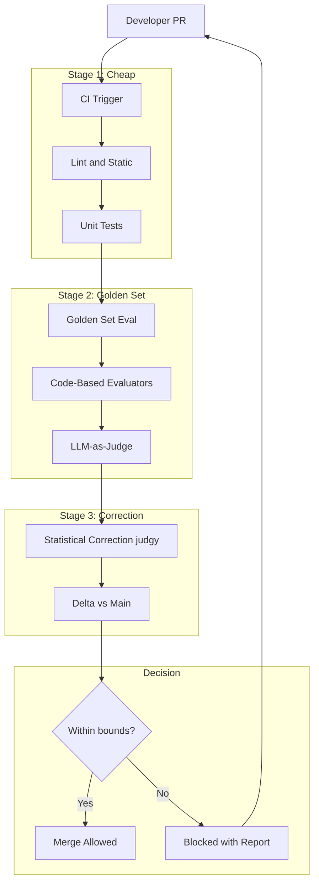
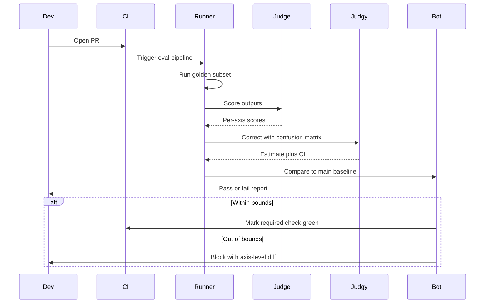

# 案例研究：AI 产品的评估门禁（eval-gated）CI/CD

一个 28 人的 AI 产品团队将合并后回归排查（post-merge regression hunts）替换为评估门禁（eval-gated）CI：每个 PR 在出现合并按钮前都会运行黄金集（golden set）、LLM-as-a-judge（大模型裁决）与统计修正，并基于故障模式分类（failure-mode taxonomy）做判定。

## 业务问题

一家 AI-first SaaS 公司基于 RAG 流水线加上 agent loop（智能体循环）交付了面向客户的问答机器人。六个月前，团队发布了一个“较小”的提示词（prompt）改动，导致某类合同问题的答案质量下降，客户发现后流失了一笔 400 万美元的续约。事后复盘发现三点：该改动未在该合同类型测试集上评估；点检中使用的 LLM-as-a-judge 指标漂移了 11 分且未被发现；需要 2 天回滚的修复花了 9 天完成，因为没有可安全回退的基线。

来自 2026 年 5 月的约束条件：

- 4 个团队共 28 名工程师；每周约 50 个 PR 触及 AI surface
- 监管行业客户不接受其领域查询出现回归
- 每个 PR 的评估预算：模型支出低于 40 美元；全量运行预算：低于 1200 美元
- PR 到合并的 p95 目标（含评估）：低于 90 分钟
- 每季度对评估方法进行审计签字

2026 年 5 月的现实是，评估门禁（eval-gated）CI 不再是“nice-to-have”。Hamel Husain 的 [eval 博客系列](https://hamel.dev/blog/posts/evals/)、Eugene Yan 的文章（[evals](https://eugeneyan.com/writing/evals/)）以及用于统计修正的 [judgy 库](https://github.com/ai-evaluation/judgy) 已基本收敛成一套作法。Phoenix、Langfuse、Braintrust 和 Galileo 都支持 CI 集成。问题不再是“要不要做”，而是“如何在不把周期时间翻倍的情况下落地”。

## 架构

### 组件

| 层 | 技术栈 | 用途 |
|-------|------|---------|
| Golden sets | 仓库内 YAML，每个 surface 1200 到 4000 条用例 | 稳定的测试基线 |
| 代码评估器 | Pytest + 自定义断言 | 低成本、确定性检查 |
| LLM judges | Claude Sonnet 4.7 用于裁决 | 主观质量评估 |
| Statistical correction | [judgy](https://github.com/ai-evaluation/judgy) | 将裁决分数转换为带置信区间（CI）的估计值 |
| Pipeline | GitHub Actions + 自定义 runner | CI 编排 |
| Trace store | Langfuse | PR 级可观测性 |
| Annotation | Argilla 自托管 | 用于裁决校准的人类重标注 |

### 数据流

1. PR 打开；GitHub Actions 触发；阶段 1（lint、单元测试、类型检查）在 2 分钟内完成。
2. 阶段 2 启动 Golden set 评估，默认对完整集合抽取代表性子集（10% 到 25%），对受保护分支或带 `full-eval` 标签时执行 100%。
3. 每条 Golden set 用例在新构建上运行，产出结果，并由 (a) 代码评估器进行确定性评分（JSON schema、正则、事实查验）与 (b) LLM judge 对质量维度打分。
4. 阶段 3 使用 `judgy` 对裁决分数进行统计修正（train/dev/test 划分应用于裁决提示词）。
5. 将修正后的估计值（含置信区间）与 `main` 的上一次通过基线比对；若 CI 下界在容忍范围内则合并，否则阻塞并附详细报告。

## 关键设计决策

### 1. Golden-set 构建与轮换

每个 Golden set 由三类来源构建：最近 90 天的生产 trace 样本（按故障模式分层抽样）、由独立红队 LLM 生成的合成对抗样本，以及客户支持工单中的精选边界用例。我们每季度轮换 10% 到 15% 的用例；从不删除用例（用例归档到一个冻结的“历史回归（historical regressions）”集合，仅夜间运行）。这可避免 eval 集合随产品漂移而过拟合。

规模设置：每个 surface 至少 1200 条用例；低于这个规模时，修正后分数的置信区间（CI）太宽，无法在 95% 置信度下检测到 2 分回归。Eugene Yan 提供了该规模计算推导，我们基于自身指标重新推导过一次。

### 2. 裁决模型的 train/dev/test 划分

LLM 裁决模型本身也是一个有提示词参数和 few-shot 示例的模型。我们把裁决提示词视为一个模型来做 train/dev/test 纪律：60% 的人工标注用例用于调优裁决提示词，20% 用于选择最佳提示词变体，20% 作为 hold-out 集，仅在重大裁决提示词变更前咨询。这个模式是 [judgy 方法论](https://github.com/ai-evaluation/judgy) 与 Hamel 的 eval 文章的核心。

重校准节奏：每 30 天，50 条新用例由 2 位人工重标注（Cohen's kappa 要求高于 0.7）；若 dev 集上的裁决准确率低于 80%，则重新调优。

### 3. 用 judgy 做统计校正

在我们领域，主观类别上的原始 LLM-as-a-judge 准确率约在 75% 到 88% 之间。原始裁决分数存在偏差。`judgy` 使用 hold-out 集上的混淆矩阵（confusion matrix）计算真实通过率的修正估计，并返回置信区间。我们以 CI 下界是否落在容忍区间内作为门禁条件。这意味着我们不会因裁决噪声本身就阻塞 PR，也不会因为裁决器漏检而通过真正回归。

计算方式：若裁决器在 hold-out 集上的精确率（precision）为 85%，召回率（recall）为 92%，新构建的裁决报告通过率为 89%，修正后估计约为 87%，95% 置信区间约为 83% 到 91%。当 CI 下界与 `main` 相差不超过 2 分时允许合并。([Reference: judgy README math](https://github.com/ai-evaluation/judgy#statistical-correction))

### 4. 故障模式分类作为断言面

我们不把“质量”压缩成单一数字。我们按失败模式分类（hallucination、retrieval-miss、format violation、refusal、persona break、citation error）逐轴评分。该分类来自 6 个月内 800 条生产故障的错误分析（error analysis），使用 [Hamel 的 open-coding + axial-coding 流水线](https://hamel.dev/blog/posts/field-guide/)。按轴评分让我们即使总体质量上升，也能在幻觉回归（hallucination）上直接阻断。

### 5. 单 PR 评估预算

完整评估集一次运行成本约 80 到 200 美元，视模型支出而定。按每周 50 个 PR 计算，朴素成本为每周 4000 到 10000 美元。我们对此进行限制：

- 默认 PR 运行 Golden set 的 10% 到 25%，按失败模式分层抽样（保证各故障模式都有代表）
- `full-eval` 标签触发 100% 运行
- 主分支 `main` 每晚定时任务执行 100% 运行，捕获潜在漏网行为
- 新裁决提示词变更会触发在冻结历史集合上 100% 运行

这将每个 PR 的成本限制在 40 美元以下，每周总成本低于 1200 美元。

### 6. 裁决提示词漂移检测

即便完成校准，裁决提示词仍会漂移：底层模型更新、few-shot 示例不再代表现状、提示词词汇对模型逐渐失效。我们通过以下方式监控漂移：

- 每月重跑 hold-out 集并与上月比对准确率增量（accuracy delta）
- 跟踪裁决者一致性（我们并行运行两个裁决提示词；随时间发散表明某一侧漂移）
- git 版本化裁决提示词；回滚为一次提交（1-commit）操作

当漂移超过 3 分或 kappa 低于 0.65 时，提交维护工单。

### 7. 缓存评估流水线

典型的 Golden set 用例会产出一个输出后再被裁决。该输出在给定提示词和模型版本下是确定性的。我们以（prompt-hash, model-version）为键缓存到（output, judge-score），使同类评估重跑几乎免费。仅改动编排代码（非 prompt）时，PR 的缓存命中率约为 70%，该类变更的成本下降约 3 倍。

### 8. PR 级可观测指标

每个 PR 的评估报告包含：按轴通过率对比主干、该轴新增失败样例、该轴新增通过样例、裁决校正后的置信区间边界（judge-correction CI bounds）、总成本，以及 trace store 链接，工程师可重放任一失败样例。报告在运行完成后 3 分钟内以 GitHub 评论形式发布。

## CI 流水线序列

## 失效模式与缓解

### F1: 裁决提示词漂移未被发现

模型升级后裁决器逐渐低估幻觉。缓解：每月 hold-out 重放；裁决者一致性跟踪；为受保护分支提供“冻结裁决器（freeze judge）”模式，即使新模型可用也固定裁决模型版本。此前将我们击垮的漂移事件正是如此发生；现在可在一个周期内发现。

### F2: 评估集过拟合

少量用例被反复调试，提示词被隐式调到这些案例上。缓解：季度轮换；保留对工程师报告隐藏输入的对抗用例（仅展示结果）；独立红队团队负责 hold-out 集。

### F3: 单个 PR 只跑到评估某一角落，遗漏回归

分层抽样：我们确保每个 PR 的 10% 样本至少包含 12 个故障模式中的每个 1 个用例。主干 `main` 的全量夜间运行仍然保留。单 PR 覆盖是有界的，但不是零覆盖。

### F4: 意外全量运行导致成本失控

每个 PR 都带 `full-eval` 标签会使成本翻倍。缓解：该标签需要 CODEOWNERS 审批；自动提醒会通知打标签人。我们还设置每月评估支出硬上限为 5000 美元，并拒绝启动会超出上限的任务。

### F5: 阻塞率过高导致开发者选择性忽略

若 35% 的 PR 被阻塞，开发者会停止阅读报告并寻找绕过方式。缓解：我们将门禁容忍度调整到使阻塞率保持在 5% 到 12%；把阻塞率视为 SLI，若其上升立即排查原因（通常裁决器对新故障模式过于严格）。目标是暴露真实回归，而非当作形式化闸门。

### F6: Holdout 集泄漏到训练或提示词中

某个 hold-out 案例被当作 few-shot 示例使用。缓解：hold-out 集保存在独立仓库并有独立访问列表；工程师无权读取，仅评估 runner 拥有 deploy key。hold-out 漏检报告中只显示哈希，不暴露原始用例。

### F7: 裁决模型退役

供应商宣布裁决模型停服。缓解：至少并行校准两套裁决模型；当退役发生时，我们有 60 天窗口切换，并保持 kappa 阈值。裁决提示词历史和校准数据使切换变为常规流程。

### F8: 评估 runner 队列饱和

发布窗口时 PR 激增导致评估队列深度达到 30 分钟。缓解：配置专用可自动扩缩的 eval-runner GPU 池；受保护分支设置优先队列；若队列深度超过 20，自动将非受保护 PR 降级为 5% 抽样以更快清空积压。

## 运维考量

### 监控

| SLO | 目标 |
|-----|--------|
| PR 到合并 p95 | 低于 90 分钟 |
| 每 PR 评估成本 p95 | 低于 40 美元 |
| 阻塞率（false negatives + true regressions） | 5 到 12% |
| 裁决者互评 kappa（inter-rater kappa） | 高于 0.7 |
| Holdout 集重放准确率月环比 delta | 低于 3 分 |
| 上线后生产回归逃逸（post-deploy） | 每季度低于 1 次 |

### 成本模型

在每周 50 个 PR 条件下：

- 默认采样：每 PR 25 美元；每周 1250 美元
- 全量评估（约每周 8 次）：每次 100 美元；每周 800 美元
- 夜间定时任务：每次 200 美元；每周 1400 美元
- 裁决重校准：每月 50 美元
- 合计：约每月 14K 美元

这在防止一个回归后即可回本。我们对丢失的 400 万美元续约进行的事后估算表明，即使每年只避免一次，也有明显收益。

### 值班手册（On-call playbook）

- 阻塞率上升：检查最近是否有裁决提示词或 Golden set 的变更，并对比各轴分数与基线
- 评估成本上升：检查采样率配置；限速 `full-eval` 标签使用
- 裁决漂移告警：触发校准周期；若漂移严重则切到备用模型
- Holdout 泄漏（哈希碰撞）：立即隔离并重新生成受影响用例
- 评估 runner 故障：PR 会显示“eval pending”状态；runner 不可用期间绝不自动合并；SRE 在 15 分钟内响应

### 季度复盘

每季度 AI 团队复盘：故障模式分类（分类仍与真实生产错误一致吗？）、Golden set 轮换（哪 10% 到 15% 已过时？）、裁决器校准历史（漂移是否在加速？）、阻塞率趋势（门禁是否变成了形式化闸门？）。复盘结果输入下季度 eval 路线图。我们使用 [Hamel field-guide](https://hamel.dev/blog/posts/field-guide/) 的流程：对最近 50 条失败案例做 open-coding，再进行轴向编码（axial coding）更新分类体系。

### 审计包

评估流水线会产出季度审计包：方法文档（git 版本化）、Golden set 汇总（按故障模式计数）、裁决校准结果（Cohen's kappa 走势）、阻塞率直方图，以及带决策依据的失败 PR 样本。该包自动生成，并由工程总监签名确认。

### 为什么不使用单一综合质量分数

诱惑在于将全部轴压成一个数值并以此门禁。我们没有这样做。综合分数会掩盖回归：幻觉回归可被格式合规性提升所掩盖。我们按轴评分，使每个轴拥有独立置信区间和独立阻断。代价是更多报告噪音；收益是关键维度不会被静默回归。

## 强候选人应覆盖的内容

- 他们区分代码评估器（廉价、确定性）与 LLM-as-a-judge（昂贵、主观），并在不同阶段使用两者
- 他们明确提到统计修正（statistical correction）；理解原始裁决分数是有偏估计，置信区间才是门禁的正确抽象
- 他们通过错误分析定义故障模式分类，并按轴门禁，而非单一综合分
- 他们为裁决器本身定义 train/dev/test 纪律，并包括 kappa 阈值用于重校准
- 他们显式约束评估成本；他们知道全量运行对每个 PR 成本过高，分层采样才是关键杠杆
- 他们有裁决提示词漂移方案：持续监控、版本控制提示词、具备回滚方案
- 他们用哈希和独立访问列表保护 hold-out 集，防止泄漏

## 参考资料

- Hamel Husain, [Your AI product needs evals](https://hamel.dev/blog/posts/evals/)
- Hamel Husain, [A field guide to rapidly improving AI products](https://hamel.dev/blog/posts/field-guide/)
- Eugene Yan, [Evals: Constructed for LLM apps](https://eugeneyan.com/writing/evals/)
- Eugene Yan, [LLM-as-judge](https://eugeneyan.com/writing/llm-evaluators/)
- [judgy library](https://github.com/ai-evaluation/judgy)
- [Phoenix evals](https://docs.arize.com/phoenix/evaluation/concepts-evals)
- [Langfuse evaluations](https://langfuse.com/docs/scores/overview)
- [Braintrust](https://www.braintrust.dev/docs)
- [Galileo evaluate](https://www.rungalileo.io/blog/llm-evaluation)
- Zheng et al., [Judging LLM-as-a-Judge](https://arxiv.org/abs/2306.05685)
- [Argilla annotation platform](https://docs.argilla.io/)
- [pytest-html report integration](https://pytest-html.readthedocs.io/)

相关章节：[Evaluation and Observability](../14-evaluation-and-observability/01-llm-evaluation.md)、[Reliability and Safety](../13-reliability-and-safety/01-guardrails.md)、[AI Evals Comprehensive Guide](../ai_evals_comprehensive_study_guide.md)
