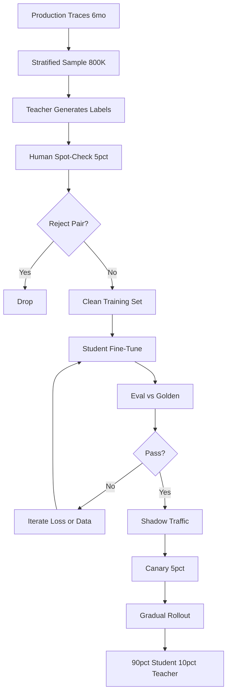

# 案例研究：面向客户的蒸馏（Customer-Specific Distillation）流水线

一个 Series-B AI 产品通过在 6 个月的生产轨迹（production traces）上蒸馏一个 7B 学生模型（student model），将 frontier model 的月度支出从 50K 美元降到 4 到 6K 美元，回本周期为 3 个月，重蒸馏（re-distillation）周期为 4 到 6 个月。

## 业务问题

一个规模化 AI 产品（每月约 800 万次用户请求）运行在 frontier model 上。到 2026 年初，成本线已突破每月 50K 美元，季度环比增长 18%，财务要求给出方案。团队有一个明确判断：大约 90% 的生产流量落在少量重复出现的任务模式中（意图分类、结构化抽取、文档摘要、三类分流）。对这些任务而言，frontier model 过于昂贵；一个在 frontier 输出上微调的小得多的模型，可以用远低得多的成本提供服务。

2026 年 5 月的现实约束如下：

- 每月 50K 美元的 frontier-model 支出，且仍在增长
- 延迟预算：高流量任务的 p95 低于 350 ms
- 质量门槛：客户 golden set 上的回归低于 2%
- 合规：客户数据不能离开特定云区域
- 人力：1 名 ML 工程师，加兼职平台支持

蒸馏模式已经成熟：DistilBERT（[Sanh et al., 2019](https://arxiv.org/abs/1910.01108)）、TinyBERT、Alpaca-style instruction distillation（[Taori et al., 2023](https://github.com/tatsu-lab/stanford_alpaca)）以及较新的 chain-of-thought distillation（[Hsieh et al., 2023](https://arxiv.org/abs/2305.02301)）都表明，7 到 13B 的 student 可以在聚焦任务上恢复 teacher 性能的 92% 到 98%。Frontier-lab 的 FDE 团队（Anthropic Field Engineering、OpenAI Solutions）已经在公开会议中讲过这套预算模型；下文数字与这些团队向客户说明的口径一致。

## 架构

```mermaid
flowchart LR
    subgraph Collect["Trace Collection"]
        PROD[Production Traffic] --> TRACES[Trace Store]
        TRACES --> SAMPLER[Stratified Sampler]
        SAMPLER --> CURATE[Curation Queue]
    end

    subgraph Label["Labeling"]
        CURATE --> TEACHER[Teacher Frontier Model]
        TEACHER --> LABELS[Distillation Pairs]
        LABELS --> HUMAN[Human Spot-Check]
        HUMAN --> CLEAN[Clean Pairs]
    end

    subgraph Train["Distillation"]
        CLEAN --> FT[Student Fine-Tune 8x H100]
        FT --> EVAL[Eval Suite]
        EVAL --> CANARY[Canary Cohort]
    end

    subgraph Serve["Serving"]
        CANARY --> SHADOW[Shadow Traffic]
        SHADOW --> ROLLOUT[Gradual Rollout]
        ROLLOUT --> STUDENT[Student Model Serving]
    end
```

### 组件

| Layer | Tech | Purpose |
|-------|------|---------|
| Teacher | Frontier model (Claude Opus 4.7 or equivalent) | 标签来源 |
| Student | Llama 4 7B int4 or Qwen 3.6 7B | 生产服务 |
| Trace store | S3 plus Langfuse | 采样与回放 |
| Trainer | DeepSpeed plus FSDP on 8x H100 | 一周训练运行 |
| Eval | Per-task golden set, on-call paged on regression | 质量门禁 |
| Serving | vLLM with FP8 | 350 ms p95 |

### 数据流

1. 6 个月的生产追踪数据积累在 Langfuse 和 S3 中。
2. 采样器按任务类别进行分层采样，并通过重平衡确保稀有类别得到代表。
3. 教师模型（frontier model）为每个样本生成目标输出；如果任务受益于推理蒸馏，则通常还会带上 chain-of-thought 推理轨迹。
4. 5% 的人工抽检由领域专家完成，用于发现教师错误；我们进行拒绝采样，只保留人类评审与教师一致的样本对。
5. 学生模型在 8x H100 上微调约 1 周（约 22K 美元计算成本），产出一个 7B 模型。
6. 模型通过按任务评测后，在生产环境中以 shadow 方式运行 2 周，然后逐步上线：5%、20%、50%、90%，历时 3 周，并通过实时质量指标驱动自动回滚。

## 关键设计决策

### 1. 只用真实生产追踪蒸馏，不用合成数据

常见诱惑是用 LLM 生成合成 prompt，再交给教师标注。我们试过；它会产出在合成 prompt 上表现优异、但在真实流量上退化 4 到 7 个点的模型。生产追踪数据捕捉了分布偏移、异常情况和长尾案例，这些才是关键。我们收集 6 个月追踪数据，按任务类别分层采样，并使用真实 prompt 作为蒸馏来源。这与 frontier labs 的 FDE 团队所建议的实践一致。

### 2. 结合人工抽检做 reject-sample

教师错误会传递给学生。若对每个教师输出都直接训练，教师 92% 的 precision 会让学生的 precision 下降到 90%。我们对随机样本中的教师标签做 5% 人工抽检，并拒绝人类不同意的样本对。这能捕捉大约 4% 的标签，并把最终学生的质量在综合指标上提升 2 到 4 个点。成本：每次重蒸馏约 1,800 美元的人力标注，外加计算成本。

### 3. 在值得的地方做 chain-of-thought 蒸馏

对于推理密集型任务（本例中的 triage 类别），我们采用 Hsieh et al. 的 [distillation with rationales](https://arxiv.org/abs/2305.02301) 方法：教师同时输出答案和 reasoning trace；学生也被训练同时输出两者。这样学生能够获得仅靠输入-输出对无法学到的结构化思考。我们不会把它用于分类或抽取任务，因为没有收益，而且会增加延迟。

### 4. 用人工标注构建 eval set

我们的 eval set 与训练集分开构建。它包含 1,800 个覆盖高流量任务类别的案例，由 3 位领域专家通过多数表决标注。我们每季度重新标注 200 个案例，以跟踪分布漂移。eval set 是 canary rollout 的门禁信号；综合指标回归 2 个点会阻止生产部署。我们在训练数据采样期间不会查看 eval set 示例。

### 5. Canary rollout 和 shadow traffic

即使 eval 通过，生产环境仍然有 eval set 覆盖不到的长尾行为。我们的 rollout 如下：

- 第 1 周：仅 shadow traffic，不影响用户。我们对 100% 的流量比对学生和教师输出，并用 delta classifier 标记分歧供人工复核。
- 第 2 周：5% 实时流量。若出现以下任一情况则自动回滚：(a) p95 延迟超过 500 ms，(b) 实时用户 thumbs-up 率下降超过 1 个点，(c) 某个领域特定 guardrail 触发率更高。
- 第 3 周：20%。同样的 guardrail。
- 第 4 周：50%。
- 第 5 周：90%。10% 永久路由到教师，以便持续采集追踪数据并进行重蒸馏。

这种保守推进在过去一年里抓到了两次 eval set 没发现的回归。

### 6. 重蒸馏节奏

世界在变化。新产品特性会改变任务分布；用户会学会新的行为；教师本身也会随着新模型发布而改进。我们每 4 到 6 个月重蒸馏一次。流水线有一部分是自动化的：追踪采样、教师标注和训练都已脚本化；人工抽检和评测复核仍然需要人来做。每次重蒸馏的成本约 26K 美元全包（22K 计算、1,800 标注，再加其他开销），耗时 4 到 6 周。

### 7. 什么时候蒸馏不适合

蒸馏并不总是正确选择。反对信号包括：

- 流量量级较低（每月低于 200K 请求）。回本不会实现。
- 任务高度多变。若每个请求都独一无二，学生就学不到有用分布。
- 教师本身不稳定或快速演进。针对移动目标反复重蒸馏是在浪费精力。
- 质量门槛极严（要求超过 99% fidelity）。蒸馏损失是真实存在的；若无法容忍，就继续用教师。

我们用一个快速筛选启发式：至少 60% 的流量落在 5 个或更少的任务模式里，且这些任务的月支出超过 20K 美元。若两者都不满足，就不做蒸馏。

### 8. 量化选择

我们把 7B 学生以 int4 提供服务（通过 vLLM 的 GPTQ，KV cache 采用 FP8）。与 FP16 相比，int4 将内存占用大约降低 4 倍，并在 H100 上将吞吐提升约 2.3 倍。我们测得综合指标下降 0.4 个点，远在可接受范围内。我们也考虑过 int8（精度损失更小、速度提升更小）和 FP8（生态成熟度更弱）；按每请求成本来看，int4 胜出。

### 9. 训练数据隐私考虑

生产追踪天然包含用户 PII。训练前我们会做 redaction：一个微调过的 NER 模型会标记 PII spans，并把它们替换为类别 token（`[EMAIL]`、`[PERSON_NAME]`）。这样学生学到的是结构模式，而不是具体身份。该 redaction 模型在标注样本上评估，precision 超过 98%，recall 超过 95%。

## 成本与回本

| Line item | Amount |
|-----------|--------|
| Trace collection (6 months) | 已作为 observability spend 的一部分付过 |
| Teacher labeling (about 800K pairs) | 一次性 42K 美元 |
| Human spot-check | 一次性 8K 美元 |
| Compute (8x H100 for 1 week, plus retries) | 一次性 32K 美元 |
| Eval set curation | 一次性 14K 美元 |
| Platform engineering (overhead) | 一次性 24K 美元 |
| **Total upfront** | **120K 美元** |

| Monthly run-rate | Before | After |
|------------------|--------|-------|
| Frontier model (10 percent of traffic, plus re-distillation harness) | $50K | $5K |
| Student model serving (vLLM on dedicated H100s) | $0 | $1,200 |
| **Monthly total** | **$50K** | **$6.2K** |

每月节省：大约 44K 美元。回本：120K / 44K，约 2.7 个月。财务上我们把它表述为“3 个月回本”。

平均每 5 个月一次的重蒸馏成本为 26K 美元，我们把它摊销到同一条节省项里。年净节省：约 470K 美元。

## 蒸馏流水线

## 失败模式与缓解

### F1: 教师升级导致学生过时

frontier-model 厂商发布新一代后，教师质量跃升，而我们的学生相对于用户对市场上其他产品的预期已经落后。缓解：我们每月做一次教师 vs 学生的 comparative eval；当差距超过 4 个点时，就加速重蒸馏日程。对更强教师重新蒸馏很直接；流水线相同。

### F2: 训练与服务之间发生分布偏移

一个新产品特性会在一夜之间改变用户行为（通知活动带来异常查询，新的定价层改变用户类型）。学生的训练分布不再匹配生产。缓解：上线在线漂移监控；当输入 embedding 分布变化超过阈值时，如果漂移是结构性的，就触发应急重蒸馏；如果只是暂时性的，就把受影响切片路由给教师。

### F3: 教师幻觉被写入学生

教师偶尔会 hallucinate；拒绝采样能捕捉大多数，但不是全部。学生会因此更自信地 hallucinate，因为这种模式已经进入训练分布。缓解：在 eval set 上做 faithfulness 检查；若幻觉率相对基线增加，就对训练数据做重新清理。

### F4: 因过度回退到教师而导致成本回升

随着工程师为各种边缘情况增加回退，10% 的教师 fallback 会逐渐上升。缓解：对教师支出设置预算告警；按季度审计 fallback 路由；每条 fallback 规则都需要理由和失效期限。

### F5: Canary rollout 漏掉长尾回归

eval set 和 shadow traffic 都看起来没问题，但 5% 实时流量暴露了影响某个特定客户 segment 的回归。缓解：对线上流量按 segment 做质量监控并支持每个 segment 的 auto-rollback；按客户层级、语言和任务类别做 segmentation-watch。

### F6: 合规违规：训练数据驻留

客户合同要求数据驻留在特定区域，而我们的默认训练算力在另一个区域。缓解：保留区域本地训练能力；每个客户的训练数据都绑定到该客户所在区域；我们不会把原始追踪数据复制到区域外。编排器会拒绝启动任何会违反驻留要求的任务。

### F7: 对稀有任务发生灾难性遗忘

学生会忘掉训练里只见过两次的类别。缓解：分层采样保证稀有类别的最小覆盖；eval 套件显式包含稀有类别案例；canary rollout 单独监控每个类别的质量。

### F8: 教师与学生之间的成本追踪失效

有些查询在 shadow 阶段会同时路由到学生和教师；如果不显式标记，成本核算就会重复计算。缓解：对每次调用都打成本标签（shadow、primary、fallback），并用每日对账报告发现标记错误的流量。

## 运营考量

### 监控

| SLO | Target |
|-----|--------|
| Student p95 latency | under 350 ms |
| Quality delta vs teacher (corrected) | within 2 points |
| Teacher fallback rate | 10 percent target, alert at over 15 percent |
| Cost per 1K requests | under 30 percent of pre-distillation |
| Re-distillation cadence | every 4 to 6 months |

### 成本模型

月度稳态：6.2K 美元服务成本，加上摊销后的重蒸馏成本（每月 5.2K 美元）。与仅用教师模型每月 50K 美元相比，完全摊销后每月可节省约 38K 美元。年化：净节省约 456K 美元。

### 值班手册

- 质量回归告警：先用人工 eval-set 回放确认；若确有问题，则把受影响 segment 路由到教师，直到下一轮训练周期；同时创建优先级工单。
- 成本超支：检查 fallback 路由；若流量模式发生变化，就安排重蒸馏；必要时限流。
- 延迟尖峰：检查 GPU 利用率；若是 noisy neighbor，则隔离学生节点。
- 漂移告警：检查输入 embedding 直方图；若漂移幅度大且持续，就触发应急重蒸馏。
- Eval-set 泄漏：如果发现某个留出评测案例进入了训练数据，立即退役该案例并执行去重；在本季度内刷新 eval set。

### 对比评测节奏

每月运行一次 comparative eval：抽取 500 个案例，由学生与教师分别作答，再由 LLM-as-judge 加上 50 个案例的人类抽检打分。输出为 AI 团队负责的一个仪表盘卡片。差距扩大是需要重蒸馏的早期预警信号。

### 重蒸馏流程

当安排一次重蒸馏时，我们遵循 4 周流程：第 1 周采样新追踪并由当前教师标注；第 2 周训练和评测；第 3 周 shadow traffic；第 4 周渐进上线。完整流程都有 checklist；ML 工程师独立执行，渐进上线阶段由平台支持。

### 面向客户的沟通

当我们把某个客户的流量迁移到蒸馏后的学生模型时，我们会告知他们。对客户的说法是：“Your high-volume queries are now served by a model we fine-tuned on your traffic, optimized for latency and cost. Eval evidence in your quarterly report shows quality is within 2 points of the frontier baseline.” 大多数客户只要质量保持住就不在意；少数客户（金融服务、医疗）需要明确 signoff，在他们选择 opt in 之前，我们会把这些查询继续路由到教师。

## 强候选人会覆盖的内容

- 他们会把预算算清楚并前置讨论：前期成本、回本周期、持续重蒸馏成本。
- 他们会点名蒸馏论文（DistilBERT、Alpaca、distillation with rationales），并使用 “student”“teacher”“rejection sampling” 这些术语。
- 他们会解释为什么生产追踪优于合成数据，以及为什么教师标签上的人工抽检很重要。
- 他们会用具体百分比和自动回滚门槛讲清 canary rollout，并指出 shadow-only traffic 会漏掉哪些回归类型。
- 他们会说明蒸馏不适用的场景，证明自己确实做过，而不只是读过。
- 他们会处理教师升级场景：当 frontier 变强，student 与教师的差距扩大，重蒸馏就是修复方式。
- 他们会把隐私工作（训练数据中的 PII redaction）作为流水线的一部分，而不是事后补充。

## References（参考资料）

- Sanh 等人, [DistilBERT（BERT 的蒸馏版本）](https://arxiv.org/abs/1910.01108)
- Hinton 等人, [Distilling the Knowledge in a Neural Network（蒸馏神经网络中的知识）](https://arxiv.org/abs/1503.02531)
- Taori 等人, [Stanford Alpaca: 一个指令跟随（instruction-following）的 LLaMA 模型](https://github.com/tatsu-lab/stanford_alpaca)
- Hsieh 等人, [Distilling Step-by-Step（逐步蒸馏）](https://arxiv.org/abs/2305.02301)
- Jiao 等人, [TinyBERT: 用于自然语言理解的 BERT 蒸馏](https://arxiv.org/abs/1909.10351)
- Anthropic, [关于蒸馏模式](https://www.anthropic.com/research)
- OpenAI, [平台中的蒸馏](https://platform.openai.com/docs/guides/distillation)
- [vLLM FP8 推理](https://docs.vllm.ai/en/latest/quantization/fp8.html)
- [Langfuse 跟踪采样](https://langfuse.com/docs/observability/sampling)
- Hamel Husain, [快速改进 AI 产品的实战指南](https://hamel.dev/blog/posts/field-guide/)
- [用于训练的 DeepSpeed](https://www.deepspeed.ai/training/)
- [Together AI 蒸馏案例研究](https://www.together.ai/blog/distillation)

相关章节: [Fine-Tuning and Distillation（微调与蒸馏）](../03-training-and-adaptation/05-knowledge-distillation.md), [Inference Optimization（推理优化）](../04-inference-optimization/01-inference-fundamentals.md), [Cost Management（成本管理）](../04-inference-optimization/07-cost-optimization-playbook.md).
