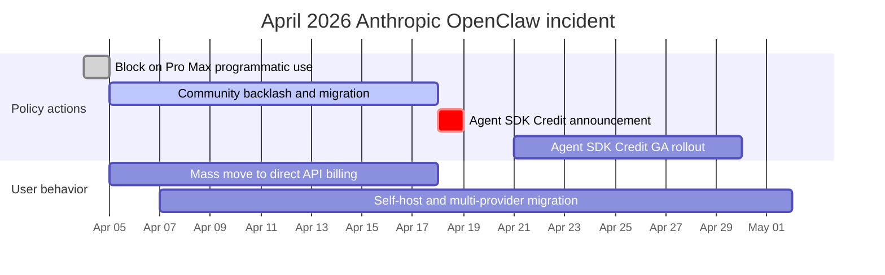

# OpenClaw 深度解析：开源个人 AI 智能体

OpenClaw 是一个**开源、自托管的个人 AI 智能体**，它以消息平台作为主要接口，通过 LLM（大语言模型）执行任务。你可以通过 WhatsApp、Telegram、Slack、Discord 或 Signal 与它对话，它会回复你，并运行 shell 命令、控制浏览器、管理日历、处理电子邮件，以及编排多步骤工作流。

## 目录

- [什么是 OpenClaw](#什么是-openclaw)
- [历史：从 Clawdbot 到 Moltbot 再到 OpenClaw](#历史)
- [架构深度解析](#架构)
- [AgentSkills 系统](#agentskills-系统)
- [LLM 提供商配置](#example-response-format)
- [消息平台集成](#response-format)
- [安全模型](#安全模型)
- [部署模式](#部署模式)
- [性能优化与扩展](#安全模型)
- [真实世界用例](#部署模式)
- [局限性以及何时不该使用 OpenClaw](#性能优化与扩展)
- [与替代方案对比](#真实世界用例)
- [入门：快速设置指南](#入门)
- [系统设计面试视角](#四月-2026-anthropic-封禁与回滚事件)
- [参考资料](#参考资料)

---

## 什么是 OpenClaw

OpenClaw 是：

- **一个个人 AI 智能体**：不是聊天机器人，而是一个能代表你行动的自主智能体
- **自托管**：运行在你的机器、VPS 或 Raspberry Pi 上，由你控制自己的数据
- **消息原生**：存在于你已经使用的聊天应用中（WhatsApp、Telegram、Slack、Discord、Signal、iMessage，以及 20+ 个其他平台）
- **LLM 无关**：可与 Claude、GPT-4、Gemini、DeepSeek 或本地模型配合使用
- **可通过 Skill（技能）扩展**：内置 100+ 个预配置技能，并提供简单格式用于编写自定义技能
- **开源**：采用 MIT 许可证，截至 2026 年初拥有 250K+ GitHub 星标

```
# The simplest way to start
git clone https://github.com/openclaw/openclaw.git
cd openclaw
docker compose up -d

# Or via npm
npm install -g openclaw
openclaw start
```

**与聊天机器人的关键区别：**
- ChatGPT/Claude.ai：你输入内容，它用文本回复
- OpenClaw：你输入内容，它会**做事**，例如运行命令、编辑文件、发送电子邮件、控制智能家居设备、管理你的日历

---

## 历史

### 命名时间线

| 日期 | 名称 | 事件 |
|------|------|-------|
| 2025 年 11 月 | **Clawdbot** | Peter Steinberger 发布第一个原型，大约用一小时构建完成 |
| 2026 年 1 月 | 2,000 星标 | 早期采用者发现该项目 |
| 2026 年 1 月 27 日 | **Moltbot** | 因 Anthropic 商标投诉而改名（保留龙虾主题） |
| 2026 年 1 月 30 日 | **OpenClaw** | 再次改名，Steinberger 觉得“Moltbot”说起来别扭 |
| 2026 年 2 月 | 145,000+ 星标 | 爆发式增长，超过许多成熟开源项目 |
| 2026 年 2 月 14 日 | -- | Steinberger 加入 OpenAI，理由是需要获得扩展所需的资源 |
| 2026 年 3 月 | 250,000+ 星标 | 在 GitHub 上超过 React；成为有史以来增长最快的开源项目之一 |

### 创建者

Peter Steinberger 是一名奥地利软件工程师，在 13 年间打造了 PSPDFKit，一个被全球开发者使用的 PDF 工具包，随后于 2024 年出售了公司。他将自己描述为“vibe coder（氛围式编码者）”，并有一句著名说法：他会发布自己没有读过的代码。这体现了新的 AI 优先开发哲学：人类提供意图，AI 提供实现。

### 它为何爆红

OpenClaw 击中了痛点，因为它解决了一个真实问题：LLM 很强大，但没有状态。每次对话都从零开始。OpenClaw 赋予 LLM **持久性**（跨会话记忆）、**能动性**（不仅能说，还能行动）和**触达能力**（与你已经使用的应用集成）。它自托管且开源，这意味着任何人都可以运行它，而无需把自己的数据托付给第三方服务。

---

## 架构

### 高层概览

```
                         OPENCLAW ARCHITECTURE
 ============================================================

  Messaging Platforms              OpenClaw Gateway           LLM Providers
 ┌──────────────┐              ┌─────────────────────┐     ┌──────────────┐
 │  WhatsApp    │──┐           │                     │     │  Anthropic   │
 │  (Baileys)   │  │           │   GATEWAY            │     │  (Claude)    │
 ├──────────────┤  │  Channel  │   ┌──────────────┐  │     ├──────────────┤
 │  Telegram    │──┼──Adapters─┼──>│  Router      │  │     │  OpenAI      │
 │  (grammY)    │  │           │   │  (sessions,  │  │     │  (GPT-4)     │
 ├──────────────┤  │           │   │   bindings)  │  │     ├──────────────┤
 │  Slack       │──┤           │   └──────┬───────┘  │     │  Google      │
 │  (Bolt)      │  │           │          │          │     │  (Gemini)    │
 ├──────────────┤  │           │   ┌──────▼───────┐  │     ├──────────────┤
 │  Discord     │──┤           │   │ Agent Runtime│──┼────>│  DeepSeek    │
 │  (discord.js)│  │           │   │ (AI loop,    │  │     ├──────────────┤
 ├──────────────┤  │           │   │  tool calls, │  │     │  Local/      │
 │  Signal      │──┤           │   │  memory)     │  │     │  Ollama      │
 │  (signal-cli)│  │           │   └──────┬───────┘  │     └──────────────┘
 ├──────────────┤  │           │          │          │
 │  iMessage    │──┤           │   ┌──────▼───────┐  │     Tools & Skills
 │  (BlueBubbles│  │           │   │  Tool Layer  │  │     ┌──────────────┐
 ├──────────────┤  │           │   │  (skills,    │──┼────>│  Shell exec  │
 │  Teams       │──┘           │   │   browser,   │  │     │  Browser     │
 │  IRC, Matrix │              │   │   files,     │  │     │  File I/O    │
 │  20+ more... │              │   │   cron)      │  │     │  Calendar    │
 └──────────────┘              │   └──────────────┘  │     │  Email       │
                               │                     │     │  100+ more   │
                               │   ┌──────────────┐  │     └──────────────┘
                               │   │  Memory &    │  │
                               │   │  State       │  │     Storage
                               │   │  (sessions,  │──┼────>┌──────────────┐
                               │   │   workspace) │  │     │  ~/.openclaw/│
                               │   └──────────────┘  │     │  (state,     │
                               └─────────────────────┘     │   memory,    │
                                                           │   config)    │
                                localhost:18789             └──────────────┘
```

### 核心组件

**1. Gateway（网关）**

Gateway 是一个长期运行的 WebSocket 服务器（默认：`localhost:18789`），作为会话、路由和通道连接的单一事实来源。它负责：

- 通过通道适配器接受来自所有消息平台的连接
- 将消息路由到正确的智能体
- 会话管理和状态持久化
- 身份认证和访问控制
- 热重载配置变更

**2. Channel Adapters（通道适配器）**

当任意平台收到消息时，通道适配器会将其规范化为标准内部格式。每个适配器都封装一个平台特定库：

| 平台 | 适配器库 | 协议 |
|----------|----------------|----------|
| WhatsApp | Baileys | WebSocket（非官方） |
| Telegram | grammY | Bot API |
| Slack | Bolt | Events API |
| Discord | discord.js | Gateway API |
| Signal | signal-cli | D-Bus |
| iMessage | BlueBubbles | REST API |
| IRC | irc-framework | IRC 协议 |
| Matrix | matrix-js-sdk | Matrix 协议 |
| Microsoft Teams | Bot Framework | REST API |

**3. Agent Runtime（智能体运行时）**

Agent Runtime 是 AI 循环。对于每条传入消息，它会：

1. 从会话历史、工作区记忆和相关技能中组装上下文
2. 将组装好的提示发送给配置的 LLM
3. 从模型接收工具调用
4. 针对系统能力执行工具调用
5. 将结果返回给模型以进入下一轮迭代
6. 持久化更新后的状态（记忆、文件、会话历史）

**4. Multi-Agent Routing（多智能体路由）**

OpenClaw 支持在一个 Gateway 进程中运行多个智能体。每个智能体都有自己的工作区、agentDir、会话和工具配置。传入消息通过绑定路由到智能体：

```json
{
  "agents": {
    "list": [
      {
        "name": "work-assistant",
        "agentDir": "./agents/work",
        "channels": ["slack-work"]
      },
      {
        "name": "home-assistant",
        "agentDir": "./agents/home",
        "channels": ["whatsapp-personal", "telegram"]
      },
      {
        "name": "devops-bot",
        "agentDir": "./agents/devops",
        "channels": ["discord-infra"]
      }
    ]
  }
}
```

这意味着你可以在 Slack 上拥有一个工作助手，在 WhatsApp 上拥有一个个人助手，在 Discord 上拥有一个 DevOps 机器人，并且它们全部运行在同一个 Gateway 中，同时拥有完全隔离的记忆和权限。

---

## AgentSkills 系统

### Skill（技能）的工作方式

Skill（技能）是 OpenClaw 获得基础对话之外能力的机制。每个 Skill 都是一个目录，其中包含一个 `SKILL.md` 文件，文件内有 YAML frontmatter（元数据）和 Markdown 指令（行为）。

```
~/.openclaw/skills/
  weather/
    SKILL.md           # Required: metadata + instructions
    scripts/
      fetch_weather.py # Optional: executable scripts
    references/
      api_docs.md      # Optional: supplementary docs

  email-manager/
    SKILL.md
    scripts/
      process_inbox.py
```

### SKILL.md 格式

```yaml
---
name: weather-lookup
description: >
  Fetch current weather and forecasts for any location.
  Responds to queries about temperature, rain, and conditions.
triggers:
  - weather
  - temperature
  - forecast
  - "is it going to rain"
tools:
  - web_search
  - bash
---

# Weather Lookup Skill

When the user asks about weather:

1. Use the web_search tool to find current conditions
2. Extract temperature, humidity, wind, and forecast
3. Present in a concise, readable format
4. Include both metric and imperial units

## Example Response Format

"Currently 72F (22C) and partly cloudy in San Francisco.
Forecast: Clear skies through Thursday, rain expected Friday."
```

### Skill 解析顺序

Skill 可以位于多个位置。当发生名称冲突时，最本地的副本优先：

```
Priority (highest first):
  1. <workspace>/skills/        # Project-specific skills
  2. ~/.openclaw/skills/        # User-global skills
  3. <installed-packages>/      # npm-installed skills
  4. <bundled>/skills/          # Ships with OpenClaw
```

### 选择性注入

OpenClaw **不会**把每个 Skill 都注入到每个 prompt（提示词）中。runtime（运行时）会根据 Skill 描述和触发关键词，只选择性注入与当前轮次相关的 Skill。这可以防止 prompt 膨胀，并保持较高的模型性能。

### 创建自定义 Skill

```bash
# Create the skill directory
mkdir -p ~/.openclaw/skills/deploy-checker
cd ~/.openclaw/skills/deploy-checker

# Create the SKILL.md
cat > SKILL.md << 'EOF'
---
name: deploy-checker
description: >
  Monitor deployment status across staging and production.
  Checks health endpoints, recent commits, and CI status.
triggers:
  - deploy
  - deployment
  - "is staging up"
  - "prod status"
tools:
  - bash
  - web_search
---

# Deploy Checker

When asked about deployment status:

1. Run `curl -s https://staging.myapp.com/health` to check staging
2. Run `curl -s https://myapp.com/health` to check production
3. Check recent git log: `git log --oneline -5`
4. Report status in a clear format

## Response Format

Staging: [UP/DOWN] - version X.Y.Z - deployed 2h ago
Production: [UP/DOWN] - version X.Y.Z - deployed 1d ago
Last 3 commits: ...
EOF
```

### 社区 Skill 生态系统

OpenClaw 的 Skill 生态系统增长迅速，社区维护的集合中包含数千个 Skill，覆盖 DevOps（开发运维）、home automation（家庭自动化）、content creation（内容创作）、data analysis（数据分析）等类别。然而，这种开放性也带来了风险——安装前务必审查第三方 Skill，因为早期目录中曾出现过恶意脚本事件。

---

## LLM（大语言模型）Provider（提供商）配置

### 配置文件

OpenClaw 从 `~/.openclaw/openclaw.json` 读取配置（JSON5 格式——允许注释和尾随逗号）。Gateway（网关）会监视该文件，并通过 hot reload（热重载）自动应用变更。

```json5
{
  // Model provider configuration
  "models": {
    "providers": {
      "anthropic": {
        "baseUrl": "https://api.anthropic.com",
        "apiKey": "${ANTHROPIC_API_KEY}",  // env var substitution
        "models": {
          "claude-sonnet-4": {
            "maxTokens": 8192
          }
        }
      },
      "openai": {
        "baseUrl": "https://api.openai.com/v1",
        "apiKey": "${OPENAI_API_KEY}",
        "models": {
          "gpt-4o": {
            "maxTokens": 4096
          }
        }
      },
      "custom-deepseek": {
        "api": "openai",  // OpenAI-compatible API
        "baseUrl": "https://api.deepseek.com/v1",
        "apiKey": "${DEEPSEEK_API_KEY}",
        "models": {
          "deepseek-chat": {
            "maxTokens": 4096
          }
        }
      },
      "local-ollama": {
        "api": "openai",
        "baseUrl": "http://localhost:11434/v1",
        "apiKey": "ollama",  // Ollama accepts any key
        "models": {
          "llama3.1:70b": {
            "maxTokens": 2048
          }
        }
      }
    }
  },

  // Default agent model
  "agents": {
    "defaults": {
      "model": "anthropic/claude-sonnet-4"
    }
  }
}
```

### Provider 选择策略

| Provider | 最适合 | 取舍 |
|----------|----------|------------|
| Anthropic (Claude) | 复杂推理、编码任务、长上下文 | 成本更高，质量最佳 |
| OpenAI (GPT-4o) | 通用用途、快速响应 | 速度与质量平衡良好 |
| Google (Gemini) | 注重预算的测试、慷慨的免费层级 | 推理质量较低 |
| DeepSeek | 最便宜的前沿级选项（V4 Flash 每 1M 为 $0.14/$0.28，V4 Pro 在 22 年 5 月永久 2026 折扣后为 $0.435/$0.87）；1M 上下文；最适合高容量、缓存友好的工作负载 | 可用性不稳定；开放权重也可自托管 |
| Local (Ollama) | 对隐私要求极高、离线使用 | 需要强大的硬件，质量较低 |

### OpenClaw 内部的模型路由

你可以为不同的 agent（智能体）配置不同模型，从而优化成本：

```json5
{
  "agents": {
    "defaults": {
      "model": "openai/gpt-4o-mini"  // Cheap default
    },
    "list": [
      {
        "name": "coding-agent",
        "model": "anthropic/claude-sonnet-4"  // Premium for code
      },
      {
        "name": "reminder-bot",
        "model": "google/gemini-2.0-flash"  // Cheap for simple tasks
      }
    ]
  }
}
```

---

## 消息平台集成

OpenClaw 通过其 channel adapter（通道适配器）架构支持 20+ 个消息平台：

### 支持的平台

| 平台 | Library（库） | 状态 | 备注 |
|----------|---------|--------|-------|
| WhatsApp | Baileys | 稳定 | 非官方 API；需要个人账号 |
| Telegram | grammY | 稳定 | 官方 Bot API；最可靠的通道 |
| Slack | Bolt | 稳定 | 需要安装 Workspace（工作区）应用 |
| Discord | discord.js | 稳定 | 需要 Bot token（机器人令牌） |
| Signal | signal-cli | 稳定 | 需要已关联设备 |
| iMessage | BlueBubbles | 稳定 | 仅限 macOS；需要 BlueBubbles server（服务器） |
| Google Chat | Chat API | 稳定 | 需要 Workspace 管理员批准 |
| Microsoft Teams | Bot Framework | Beta | 2026 年第二季度完整发布 |
| IRC | irc-framework | 稳定 | 支持经典协议 |
| Matrix | matrix-js-sdk | 稳定 | Federated（联邦式），适合自托管 |
| Mattermost | API | 稳定 | 自托管 Slack 替代方案 |
| LINE | Messaging API | 稳定 | 在日本/东南亚流行 |
| Feishu (Lark) | Open API | 稳定 | 在中国流行 |
| Twitch | TMI.js | 稳定 | 仅聊天 |
| WeChat | -- | Beta | 需要自定义桥接 |
| Nostr | -- | Beta | 去中心化协议 |
| WebChat | Built-in | 稳定 | 基于浏览器的后备方案 |

### 跨渠道统一上下文

一个关键的架构决策：网关（Gateway）在所有渠道之间维护**一套统一的记忆系统**。如果你在 WhatsApp 上告诉你的代理（agent）某件事，当你从 Slack 发消息时它也会记得。这意味着无论你使用哪个应用联系 AI 代理，它都拥有一致的上下文。

```
          WhatsApp ──┐
          Telegram ──┤     ┌─────────────────────┐
          Slack    ──┼────>│  Shared Memory Pool  │
          Discord  ──┤     │  (per-agent, cross-  │
          Signal   ──┘     │   channel sessions)  │
                           └─────────────────────┘
```

---

## 安全模型

### 安全理念

OpenClaw 的安全模型假设一种“个人助理”威胁模型：一个受信任的操作者，可能有多个代理。优先级如下：

1. **身份优先**：谁可以与机器人对话？
2. **范围其次**：机器人被允许在哪里执行操作？
3. **模型最后**：假设模型可能被操纵，因此限制影响范围

### 权限层级

```
 Layer 1: Channel Authentication
 ─────────────────────────────────
 Who can message the bot?
 Configured per-channel with allowlists.

 Layer 2: Agent Tool Allow/Deny
 ─────────────────────────────────
 Which tools can this agent use?
 Configured per-agent in agents.list[].tools.

 Layer 3: Sandbox Tool Policy
 ─────────────────────────────────
 Separate from agent permissions.
 Even if agent allows a tool, sandbox may block it.

 Layer 4: Elevated Access
 ─────────────────────────────────
 Some tools require host-level access.
 Gated per-channel and per-user with allowFrom lists.
```

### 沙箱隔离

对于非主会话（子代理、定时任务、隔离任务），OpenClaw 支持 Docker 沙箱隔离：

```yaml
# docker-compose.sandbox.yml
services:
  openclaw-sandbox:
    image: openclaw/sandbox:latest
    network_mode: "none"        # No network access
    read_only: true             # Read-only root filesystem
    volumes:
      - ./workspace:/workspace  # Restricted workspace only
    security_opt:
      - no-new-privileges:true
```

使用 `network: "none"` 时，处于沙箱中的子代理无法发起出站请求，无法外泄数据，也无法访问外部服务，即使它正在运行恶意代码也是如此。

### 关键安全警告

**默认信任 localhost**：默认情况下，OpenClaw 会信任来自 localhost 的连接且不进行身份验证。如果网关位于配置不当的反向代理之后，而该代理将所有请求转发到 localhost，外部攻击者将获得完整访问权限。远程部署时务必配置身份验证。

**技能供应链**：社区技能目录曾发生过恶意包事件。安装第三方技能前务必进行审查。固定技能版本。对不受信任的技能使用沙箱。

### 加固检查清单

```
[x] Set state directory permissions to 700
[x] Configure channel allowlists (do not leave open)
[x] Enable sandbox for sub-agents and cron jobs
[x] Use environment variables for API keys, never hardcode
[x] Put Gateway behind authenticated reverse proxy for remote access
[x] Review all third-party skills before installation
[x] Set up monitoring for unusual tool invocations
[x] Restrict elevated tool access to specific users
[x] Run Gateway as non-root user
[x] Enable TLS for WebSocket connections
```

---

## 部署模式

### 选项 1：本地开发（最快开始）

```bash
# Clone and run
git clone https://github.com/openclaw/openclaw.git
cd openclaw
cp .env.example .env
# Edit .env: add ANTHROPIC_API_KEY or OPENAI_API_KEY

npm install
npm start
```

**要求**：Node.js 20+、512MB RAM、任意操作系统。

### 选项 2：Docker（生产环境推荐）

```yaml
# docker-compose.yml
version: "3.8"
services:
  openclaw:
    image: openclaw/openclaw:latest
    container_name: openclaw-gateway
    restart: unless-stopped
    ports:
      - "18789:18789"
    volumes:
      - ./state:/app/state         # Persistent state
      - ./openclaw.json:/app/openclaw.json  # Configuration
    environment:
      - ANTHROPIC_API_KEY=${ANTHROPIC_API_KEY}
      - OPENAI_API_KEY=${OPENAI_API_KEY}
    mem_limit: 2g
    logging:
      driver: json-file
      options:
        max-size: "10m"
        max-file: "3"
```

```bash
docker compose up -d
docker logs -f openclaw-gateway  # Watch logs
```

### 选项 3：云 VPS（始终在线）

OpenClaw 很轻量，任何具备 512MB RAM 和 1 个 CPU 核心的机器都足够。每月 $4-6 的 VPS 即可运行。

**快速部署选项：**
- **DigitalOcean**：内置安全加固的 1-Click 应用
- **Railway**：来自 GitHub README 的一键部署按钮（约 5 分钟）
- **Contabo**：面向 VPS 套餐的免费 1-click OpenClaw 附加组件
- **AWS Lightsail**：每月 $3.50 的实例即可流畅运行
- **Raspberry Pi**：在配备 4GB RAM 的 Pi 4 上运行良好

### 生产架构

```
                    PRODUCTION DEPLOYMENT
 ====================================================

  Internet
     │
     ▼
 ┌───────────────┐
 │  Cloudflare   │     SSL termination
 │  (CDN/WAF)    │     DDoS protection
 └───────┬───────┘
         │
         ▼
 ┌───────────────┐
 │  Nginx        │     Reverse proxy
 │  (with auth)  │     Rate limiting
 └───────┬───────┘     WebSocket upgrade
         │
         ▼
 ┌───────────────────────────────────────┐
 │  Docker                              │
 │  ┌─────────────────────────────────┐ │
 │  │  openclaw-gateway               │ │
 │  │  (main process)                 │ │
 │  └────────────┬────────────────────┘ │
 │               │                      │
 │  ┌────────────▼────────────────────┐ │
 │  │  openclaw-sandbox               │ │
 │  │  (isolated sub-agents)          │ │
 │  │  network: none                  │ │
 │  └─────────────────────────────────┘ │
 │                                      │
 │  Volume: ./state (700 permissions)   │
 └──────────────────────────────────────┘
         │
         ▼
    LLM APIs
    (Anthropic, OpenAI, etc.)
```

### 用于远程访问的 Nginx 配置

```nginx
# /etc/nginx/sites-available/openclaw
server {
    listen 443 ssl http2;
    server_name openclaw.yourdomain.com;

    ssl_certificate /etc/letsencrypt/live/openclaw.yourdomain.com/fullchain.pem;
    ssl_certificate_key /etc/letsencrypt/live/openclaw.yourdomain.com/privkey.pem;

    location / {
        proxy_pass http://127.0.0.1:18789;
        proxy_http_version 1.1;
        proxy_set_header Upgrade $http_upgrade;
        proxy_set_header Connection "upgrade";
        proxy_set_header Host $host;
        proxy_set_header X-Real-IP $remote_addr;

        # Basic auth for web interface
        auth_basic "OpenClaw";
        auth_basic_user_file /etc/nginx/.htpasswd;
    }
}
```

---

## 性能优化与扩展

### 内存指南

| 部署 | 推荐 RAM | 理由 |
|------------|----------------|-----------|
| 个人，轻度使用 | 512MB - 1GB | 少量技能，短对话 |
| 个人，日常使用 | 4GB | 中等数量技能，浏览器自动化 |
| 团队或高频使用 | 8GB | 多个代理，并发会话 |
| 生产标准 | 16GB | 完整技能套件，重度自动化 |

### 上下文窗口管理

LLM（大型语言模型）的注意力会随着上下文长度呈二次方增长。当上下文从 50K 个 token（词元）增加到 100K 个 token 时，模型需要完成四倍的工作量。实用优化：

- **限制上下文窗口**：100K 个 token 足以应对大多数任务
- **开启新对话**：长历史会累积数百条消息；定期重启
- **禁用未使用的技能**：每个已加载技能都会占用上下文预算

### 技能优化

```
 DO: Enable only skills you actively use
 DO: Write concise SKILL.md descriptions
 DO: Use specific trigger keywords

 DON'T: Enable everything "just in case"
 DON'T: Write verbose skill instructions
 DON'T: Load 50+ skills simultaneously
```

每个启用的技能都会增加智能体在每一轮中必须评估的上下文。如果你在过去一周没有使用某个技能，请禁用它。

### 延迟降低

1. **禁用冗长思考**：`thinkingDefault` 设置控制内部推理。对于实时交互，跳过思维链可将处理时间大约减半
2. **使用更快的模型**：将简单任务（提醒、查询）路由到更小的模型
3. **就近部署提供商**：使用靠近你的服务器的 LLM 提供商和区域
4. **使用 Docker 监控**：`docker stats openclaw-gateway` 用于实时资源使用情况

---

## 真实世界用例

### 1. 开发工作流编排器

一个名为“Patch”的监督智能体通过 Telegram 协调 5-20 个并行 Claude Code 实例。开发者从手机发送高层指令，监督智能体会启动编码智能体、分配任务、审查输出、运行测试并合并代码。

```
Developer (phone)
     │
     ▼ Telegram message: "Fix auth bug and add rate limiting"
┌─────────────┐
│  Patch      │ (OpenClaw supervisor agent)
│  Agent      │
└──────┬──────┘
       │ Spawns parallel workers
       ├──> Claude Code instance 1: Fix auth bug
       ├──> Claude Code instance 2: Add rate limiting
       └──> Claude Code instance 3: Update tests
              │
              ▼
       Results merged, tests pass
       PR created automatically
```

### 2. 大规模邮件分诊

一名开发者使用 himalaya CLI 集成，让 OpenClaw 访问一个包含 15,000 封邮件的邮箱账户。该智能体处理积压邮件：取消订阅垃圾邮件、按紧急程度分类，并起草回复供审阅。

### 3. 家庭自动化中枢

一个名为“Claudette”的智能体通过 Home Assistant 控制整栋房屋，使用 ha-mcp 技能访问所有 Home Assistant 实体。它控制 Philips Hue 灯、Elgato 设备，并根据天气预报调整锅炉设置，所有操作都通过 WhatsApp 命令完成。

### 4. 内容生产流水线

使用基于 Discord 的并行工作者实现多智能体内容工作流：
- 智能体 1：调研并拟定大纲
- 智能体 2：撰写草稿
- 智能体 3：生成缩略图和社交媒体素材
- 监督者：审阅、编辑并发布

### 5. CI/CD 监控

一个常驻智能体监视 GitHub Actions、GitLab CI 或 Jenkins，并在构建失败、测试出错或部署完成时通过 Telegram 发出提醒。它还可以自动分诊故障并创建 issue。

### 6. 自动化客户引导

当新客户签约时，智能体会启动完整工作流：创建项目文件夹、发送欢迎邮件、安排启动会议，并将后续提醒添加到任务列表。

---

## 限制以及何时不应使用 OpenClaw

### 已知限制

**过度自主**：OpenClaw 的自主性可能成为负担。你让它做一件事，它可能会陷入推理循环、反复调用工具，或在执行中途重新解释你的目标。结果需要人工审查。

**配置复杂性**：良好运行 OpenClaw 涉及管理环境、权限、工具连接器和执行沙箱。许多用户反馈，配置系统花费的时间比使用系统还多。

**记忆脆弱性**：会话内聊天历史是临时的，在 Gateway 重启后会丢失。工作区文件只会保留明确保存过的内容。如果某次对话从未保存到记忆文件，之后就没有任何可检索内容。

**资源消耗**：加载大量技能时，容器可能使用 2GB 以上内存。长对话历史会进一步加剧这一点。

**非官方 API**：WhatsApp 集成使用 Baileys（非官方）。这可能会因 WhatsApp 更新而失效，也可能违反服务条款。其他非官方适配器也存在类似风险。

### 何时不应使用 OpenClaw

| 场景 | 为什么不适合 | 更好的替代方案 |
|----------|---------|-------------------|
| 多租户 SaaS | 并非为对抗性多用户隔离而设计 | 具备适当租户边界的自定义智能体框架 |
| 高风险自动化 | 执行路径不可预测，难以审计 | 确定性工作流引擎（Temporal、Prefect） |
| 实时系统 | LLM 延迟（每轮 1-5 秒）太慢 | 事件驱动架构 |
| 受监管行业 | 没有合规认证，审计追踪也很基础 | 具备 SOC2/HIPAA 的企业 AI 平台 |
| 超过 10 人的团队 | 单操作者信任模型无法扩展 | 具备适当 RBAC 的共享智能体平台 |
| 模糊的真实世界任务 | 最适合错误成本较低且范围严格限定的环境 | 人类操作员 |

---

## 四月 2026 Anthropic 封禁与回滚事件

OpenClaw 依赖 Claude Pro 和 Claude Max 订阅来驱动智能体工作。在 2026 年四月之前，这一直被视为一种成本控制特性：用户可以将 OpenClaw 接入自己现有的个人 Claude 计划，而不是支付 API 费率。4 年 2026 月，Anthropic 更改了政策。一项新的执行条款阻止第三方智能体框架作为 Pro 和 Max 订阅的程序化中介。在数小时内，指向 Pro 和 Max 账户的 OpenClaw 实例开始返回错误。大约 135,000 个活跃 OpenClaw 部署受到影响，其中相当一部分用户转向直接 API 计费，费率达到他们此前有效成本的 5 倍或更高。社区不满在 Hacker News 和 X 上持续发酵了近两周。

Anthropic 在四月中旬通过一款名为 Agent SDK Credit 的新产品回滚了该政策。这是一种计量额度，捆绑在 Pro 和 Max 计划中（Max 额度更高），明确授权通过 Anthropic Agent SDK 进行程序化智能体使用。与 Agent SDK 集成的框架（包括 OpenClaw）现在可以再次驱动个人订阅，但需处于透明配额内，并且只能通过 Agent SDK 路径。直接抓取 Claude.ai 网页会话仍然被禁止。

### 事件时间线



### 从架构上看意味着什么

这起事件不是安全事件。它是一次产品政策事件，并带来了安全性和可靠性后果。由此得出三点教训：

**提供商政策是你架构的一部分。** 从可用性的角度看，供应商“可接受使用”执行规则中的一行条款，在功能上等同于一次持续到该政策失效为止的服务中断。如果你的 Agent（智能体）平台经济性依赖某个特定提供商套餐，那么该提供商的政策团队就在你的关键路径上。要把他们的服务条款视为运行时依赖，而不是法律文书。

**多提供商抽象是运维卫生，而不是优化。** 那些同时配置了 Anthropic 和 OpenAI 提供商，并为每个 Agent 设置模型路由规则的 OpenClaw 用户，在封锁期间仍能以降级质量继续工作。那些在每个 Agent 定义中硬编码单一提供商的用户则完全无法运行。抽象层构建成本很低，而它覆盖的故障模式是真实存在的。

**对于个人数据 Agent，自托管兜底很重要。** 相当一部分 OpenClaw 部署在两周内把默认 Agent 切换到了本地 Ollama 模型（Llama 3.3 70B 是最常见选择），接受较低质量以换取有保障的可用性。这里的教训不是本地模型可以与前沿模型竞争；而是即使质量降级，拥有一条可工作的备用路径也是严肃部署的一部分。

### 供应商风险检查清单

- 每个 Agent 定义都通过提供商抽象层路由；没有 Agent 硬编码单一提供商模型名称。
- 配置中为每个 Agent 包含有文档说明的备用提供商，并配有经过测试的切换脚本。
- 对于个人数据或营收关键型 Agent，至少有一条备用路径使用可自托管模型（Ollama、vLLM，或租户隔离的云提供商）。
- 部署运行手册将提供商服务条款和可接受使用政策视为受监控文档，并订阅提供商安全公告和政策更新邮件列表。
- Agent 配置中的成本预算基于现实的最坏情况（直接 API 费率），而不是乐观情况。
- 每周一次的金丝雀测试通过抽象层调用每个提供商，并对 4xx 变化发出告警，以便在政策变化影响生产流量之前暴露出来。

**来源：**
- [Axios：Anthropic 封锁 OpenClaw 第三方 Agent](https://www.axios.com/2026/04/06/anthropic-openclaw-subscription-openai)
- [VentureBeat：OpenClaw 在 Agent SDK 积分条件下恢复使用](https://venturebeat.com/technology/anthropic-reinstates-openclaw-and-third-party-agent-usage-on-claude-subscriptions-with-a-catch)

---

## 与替代方案对比

| 功能 | OpenClaw | Hermes Agent | Claude Code | Open Interpreter |
|---------|----------|-------------|-------------|-----------------|
| **主要界面** | 消息应用 | 消息应用 | 终端/CLI | 终端/CLI |
| **架构** | 网关 + 渠道适配器 | 学习循环 + 技能记忆 | Agentic CLI（智能体式命令行界面） | 简单 REPL（交互式读取-求值-输出循环） |
| **LLM（大语言模型）支持** | 任意（Claude、GPT、Gemini、本地） | 任意 | 仅 Claude | 任意 |
| **消息平台** | 20+（WhatsApp、Telegram、Slack 等） | 6（Telegram、Discord、Slack、WhatsApp、Signal、电子邮件） | 无（仅终端） | 无（仅终端） |
| **记忆** | 每个助手跨会话 | 多级（会话、持久化、技能） | 仅会话（CLAUDE.md 用于上下文） | 仅会话 |
| **技能/插件** | 100+ 内置，社区生态 | 自学习技能系统 | MCP（模型上下文协议）工具 | 有限插件 |
| **自托管** | 是（必需） | 是（必需） | 否（Anthropic 托管） | 是 |
| **GitHub 星标** | 250K+ | 22K+ | N/A（闭源） | 55K+ |
| **最适合** | 多渠道个人 AI 助手 | 能随时间学习的个人 Agent | 软件开发 | 快速本地自动化 |
| **最薄弱** | 可预测性、企业使用 | 平台覆盖范围 | 非编码任务 | 复杂工作流 |

### 选择合适的工具

```
Need multi-channel messaging?          --> OpenClaw
Need an agent that learns from usage?  --> Hermes Agent
Need autonomous coding specifically?   --> Claude Code
Need quick one-off local automation?   --> Open Interpreter
Need enterprise-grade reliability?     --> Custom solution or commercial platform
```

---

## 入门

### 最小设置（5 分钟）

```bash
# 1. Clone the repository
git clone https://github.com/openclaw/openclaw.git
cd openclaw

# 2. Copy and edit environment file
cp .env.example .env
# Add your LLM API key:
# ANTHROPIC_API_KEY=sk-ant-...
# or OPENAI_API_KEY=sk-...

# 3. Start with Docker
docker compose up -d

# 4. Check logs
docker logs -f openclaw-gateway
```

### 连接你的第一个渠道（Telegram）

Telegram 是最容易设置的渠道：

```json5
// ~/.openclaw/openclaw.json
{
  "channels": {
    "telegram": {
      "enabled": true,
      "token": "${TELEGRAM_BOT_TOKEN}",  // From @BotFather
      "allowedUsers": ["your_telegram_id"]
    }
  },
  "models": {
    "providers": {
      "anthropic": {
        "apiKey": "${ANTHROPIC_API_KEY}"
      }
    }
  },
  "agents": {
    "defaults": {
      "model": "anthropic/claude-sonnet-4"
    }
  }
}
```

### 安装你的第一个技能

```bash
# Install a community skill
cd ~/.openclaw/skills
git clone https://github.com/example/weather-skill.git weather

# Or create your own (see AgentSkills section above)
mkdir my-skill && cat > my-skill/SKILL.md << 'EOF'
---
name: my-first-skill
description: A simple greeting skill
---
When the user says hello, respond warmly and offer to help.
EOF
```

### 验证一切正常工作

```bash
# Check Gateway health
curl http://localhost:18789/health

# Check logs for errors
docker logs openclaw-gateway --tail 50

# Send a test message via Telegram to your bot
# It should respond within 2-5 seconds
```

---

## 系统设计面试角度

### 题目：“设计一个像 OpenClaw 这样的个人 AI 助手平台”

这是一个很好的系统设计问题，因为它涵盖消息系统、Agent 编排、安全性、多租户和实时通信。

### 需求收集

**功能性：**
- 用户通过消息平台交互（WhatsApp、Slack、Telegram）
- Agent 可以执行任务：运行命令、管理文件、发送电子邮件、控制设备
- 记忆可跨会话和渠道持久保存
- 支持每个用户拥有多个相互隔离的 Agent
- 可扩展的技能/插件系统

**非功能性：**
- 低延迟（包括 LLM 推理在内，响应时间 < 5s）
- 可自托管（用户控制自己的数据）
- 安全（沙箱化执行、权限控制）
- 可靠（为常驻助手提供 24/7 正常运行时间）

### 高层设计

```
                     SYSTEM DESIGN

 ┌──────────────────────────────────────────────────────┐
 │                   API Gateway                         │
 │  ┌────────────┐  ┌────────────┐  ┌────────────┐     │
 │  │ WhatsApp   │  │ Telegram   │  │ Slack      │     │
 │  │ Webhook    │  │ Webhook    │  │ Events API │     │
 │  └─────┬──────┘  └─────┬──────┘  └─────┬──────┘     │
 │        └───────────────┼───────────────┘             │
 │                        ▼                              │
 │              ┌─────────────────┐                     │
 │              │ Message Router  │                     │
 │              │ (user lookup,   │                     │
 │              │  agent binding) │                     │
 │              └────────┬────────┘                     │
 └───────────────────────┼──────────────────────────────┘
                         │
          ┌──────────────▼──────────────┐
          │       Agent Orchestrator     │
          │  ┌───────────────────────┐  │
          │  │ Context Assembler     │  │
          │  │ (memory + skills +    │  │
          │  │  session history)     │  │
          │  └───────────┬───────────┘  │
          │              ▼              │
          │  ┌───────────────────────┐  │
          │  │ LLM Router           │  │
          │  │ (model selection,    │  │
          │  │  fallback, caching)  │  │
          │  └───────────┬───────────┘  │
          │              ▼              │
          │  ┌───────────────────────┐  │
          │  │ Tool Executor        │  │
          │  │ (sandboxed, gated,   │  │
          │  │  audited)            │  │
          │  └───────────────────────┘  │
          └─────────────────────────────┘
                         │
          ┌──────────────▼──────────────┐
          │       Storage Layer          │
          │  ┌──────┐ ┌──────┐ ┌─────┐ │
          │  │Memory│ │State │ │Audit│ │
          │  │Store │ │Store │ │ Log │ │
          │  └──────┘ └──────┘ └─────┘ │
          └─────────────────────────────┘
```

### 关键设计决策

**1. 为什么采用单一 Gateway（网关）进程，而不是微服务？**

OpenClaw 作为单一进程运行，因为个人助理这一使用场景不需要水平扩展。一个用户意味着一个 Gateway（网关）。这消除了分布式系统复杂性（服务发现、服务间认证、最终一致性），并让部署保持足够简单，可以运行在 Raspberry Pi 上。

**2. 为什么采用频道适配器，而不是统一消息 API？**

每个消息平台都有独特约束（消息大小限制、媒体支持、输入状态提示、已读回执）。为每个平台提供一个轻量适配器，可以在规范化核心消息格式的同时保留平台特定功能。这是四人帮（Gang of Four）的适配器模式（Adapter Pattern）。

**3. 如何处理工具执行安全？**

采用纵深防御方法：（a）Agent（智能体）级工具白名单定义一个 Agent 理论上可以使用哪些工具。（b）Sandbox（沙箱）级策略单独限制哪些工具实际可以执行。（c）提升权限需要按用户、按频道授权。（d）对子 Agent 使用 Docker 隔离，确保即使恶意提示诱导模型，影响范围也被限制住。

**4. 如何在没有向量数据库的情况下管理记忆？**

OpenClaw 使用简单的基于文件的记忆系统（状态目录中的 Markdown 文件），而不是向量数据库。对于单用户 Agent，对几百个记忆文件进行全文搜索已经足够快。这避免了运行和维护向量数据库的运维负担。

**5. 如何处理多频道会话连续性？**

所有频道都通过同一个 Router（路由器）转发，Router 会将平台特定的用户 ID 映射到统一的内部用户身份。记忆存储以 Agent（而不是频道）为键，因此在对话中途从 WhatsApp 切换到 Slack 仍然可以保持上下文。这在概念上类似于 CRM（客户关系管理）如何把电子邮件、电话和聊天关联到同一条客户记录。

### 扩展性讨论

| 规模 | 架构 | 备注 |
|-------|-------------|-------|
| 1 位用户 | VPS 上的单一进程 | OpenClaw 的默认设计 |
| 10 位用户 | 多个 Gateway 实例，每位用户一个 | 每位用户自行托管自己的实例 |
| 1,000 位用户 | 托管式多租户平台 | 需要完整重新设计：适当隔离、共享基础设施、计费 |
| 100K+ 位用户 | 带 Agent 池的分布式系统 | 需要水平扩展、基于队列的分发、共享技能注册表 |

从“个人助理”到“多租户平台”的架构跨越非常大。OpenClaw 有意不跨越这条边界，这既是优势（简单），也是限制（如果不进行重大架构重构，就无法扩展成 SaaS 产品）。

### 面试官可能追问的问题

**问：你会如何为长期记忆添加向量数据库？**
添加 RAG（检索增强生成）流水线：当 Agent 保存记忆时，对其进行嵌入，并存储到向量数据库（Qdrant、Weaviate）中。每一轮对话时，检索 top-K 个相关记忆并注入上下文。这用存储复杂性换取更好的长期回忆能力，同时避免上下文窗口膨胀。

**问：你会如何让它支持多租户？**
在容器层面隔离：每个租户都有自己的 Gateway 容器，并配备独立的存储卷、网络命名空间和 API 密钥配置。使用 Kubernetes，并为每个租户配置独立命名空间。在前面添加一个路由层，将租户域名映射到容器。

**问：你会如何处理速率限制以控制 LLM（大语言模型）成本？**
三个层级：（a）在 Gateway 进行按用户的消息速率限制，（b）在编排器中跟踪按 Agent 的 token 预算，（c）模型路由，将简单查询发送到更便宜的模型。当用户接近预算时提醒用户，并允许配置每日/月度上限。

---

## 参考资料

- OpenClaw 官方文档 -- https://docs.openclaw.ai
- OpenClaw GitHub 仓库 -- https://github.com/openclaw/openclaw
- OpenClaw 维基百科 -- https://en.wikipedia.org/wiki/OpenClaw
- OpenClaw 技能文档 -- https://docs.openclaw.ai/tools/skills
- OpenClaw 安全架构 -- https://docs.openclaw.ai/gateway/security
- OpenClaw 配置参考 -- https://docs.openclaw.ai/gateway/configuration
- OpenClaw 多 Agent 路由 -- https://docs.openclaw.ai/concepts/multi-agent
- Milvus 博客：OpenClaw 完整指南 -- https://milvus.io/blog/openclaw-formerly-clawdbot-moltbot-explained-a-complete-guide-to-the-autonomous-ai-agent.md
- DigitalOcean：什么是 OpenClaw -- https://www.digitalocean.com/resources/articles/what-is-openclaw
- awesome-openclaw-agents（社区技能）-- https://github.com/mergisi/awesome-openclaw-agents

---

*下一篇：参见 [Claude Code 深入解析](../09-frameworks-and-tools/09-claude-code.md)，以对比 Anthropic 面向编码的 Agent 方法。*
