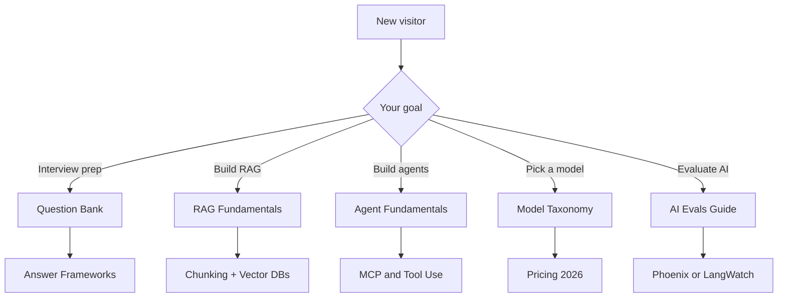
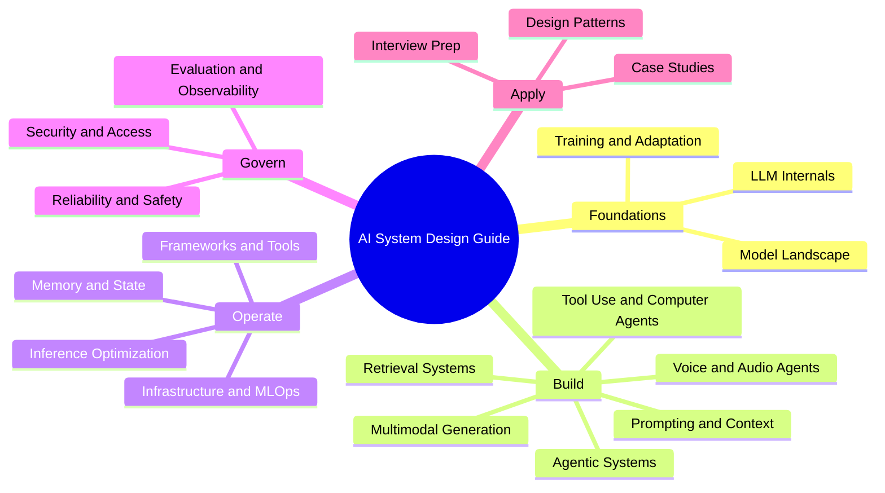

> [!IMPORTANT]
> 本仓库是由 ChiHoc 维护的非官方简体中文镜像；英文上游是正文事实与版权归属的唯一来源。下方保留的作者、社交账号与原阅读站信息均属于英文上游项目。

# 🧠 AI System Design Guide（AI 系统设计指南）
### The Complete Interview & Production Reference（完整面试与生产参考）

<p align="center">
  <a href="https://www.aidaddy.tech"></a>
</p>
<p align="center">
  <sub>🌐 在 <b><a href="https://www.aidaddy.tech">aidaddy.tech</a></b> 可进行即时搜索、章节联动跳转，并获得更清爽的阅读体验。⭐ 点赞仓库以支持本项目。</sub>
</p>

<p align="center">
  <a href="https://github.com/ombharatiya"></a>
  <a href="https://x.com/ombharatiya"></a>
  <a href="https://linkedin.com/in/ombharatiya"></a>
</p>

<p align="center">
  <b>如果这份指南对你有帮助，请关注 <a href="https://github.com/ombharatiya">@ombharatiya</a> 的 GitHub、<a href="https://x.com/ombharatiya">X</a> 和 <a href="https://linkedin.com/in/ombharatiya">LinkedIn</a>，以便在新章节、模型更新和面试题发布时收到通知。</b>
</p>

<p align="center">
  <a href="https://github.com/ombharatiya/ai-system-design-guide/commits/main"></a>
  <a href="LICENSE"></a>
  <a href="#-contributing"></a>
  <a href="https://github.com/ombharatiya/ai-system-design-guide/stargazers"></a>
  <a href="https://github.com/ombharatiya/ai-system-design-guide/graphs/contributors"></a>
  <a href="https://github.com/ombharatiya/ai-system-design-guide/issues"></a>
</p>

> **生产级 AI 系统的持续更新参考。** 持续迭代，面向面试的深度内容。

这是一份实用且持续更新的指南，覆盖 AI system design（AI 系统设计）、RAG architectures（RAG 检索增强生成架构）、LLM engineering（LLM 工程）、agentic AI（智能体化 AI）、MCP 和 A2A protocols（A2A 协议），以及 AI engineering interview preparation（AI 工程面试准备）。内容包括生产模式、模型选型、评估方法，以及来自 staff-level interviews（Staff 级别面试）的真实案例。

**首次阅读？** 可直接跳转到 [116-question Interview Bank](00-interview-prep/01-question-bank.md)、[RAG Fundamentals chapter](06-retrieval-systems/01-rag-fundamentals.md)，或选择 [适合生产环境的 LLM](02-model-landscape/01-model-taxonomy.md)。

---

## 📚 快速导航

| I want to... | Start here |
|--------------|------------|
| **Prepare for interviews** | [Question Bank](00-interview-prep/01-question-bank.md) → [Answer Frameworks](00-interview-prep/02-answer-frameworks.md) |
| **Learn AI systems fast** | [LLM Internals](01-foundations/01-llm-internals.md) → [RAG Fundamentals](06-retrieval-systems/01-rag-fundamentals.md) |
| **Build production RAG** | [Chunking](06-retrieval-systems/02-chunking-strategies.md) → [Vector DBs](06-retrieval-systems/04-vector-databases.md) → [Reranking](06-retrieval-systems/06-reranking-strategies.md) → [Production RAG](06-retrieval-systems/14-production-rag-at-scale.md) |
| **Advanced retrieval** | [Contextual Retrieval](06-retrieval-systems/10-contextual-retrieval.md) → [ColBERT](06-retrieval-systems/11-late-interaction-colbert.md) → [Multi-modal RAG](06-retrieval-systems/12-multimodal-rag.md) |
| **Design multi-tenant AI** | [Access Control](12-security-and-access/02-access-control.md) → [Case Study](16-case-studies/08-multi-tenant-saas.md) |
| **Build agents** | [Agent Fundamentals](07-agentic-systems/01-agent-fundamentals.md) → [MCP & A2A](07-agentic-systems/03-tool-use-and-mcp.md) → [LangGraph](09-frameworks-and-tools/02-langgraph-orchestration.md) |
| **Run self-driving agent loops** | [Loop Engineering](07-agentic-systems/12-loop-engineering.md) (the four loop levels, termination, budgets, verification, loopmaxxing) |
| **Tool-use & computer agents** | [Landscape](17-tool-use-and-computer-agents/01-tool-use-landscape.md) → [OpenClaw](17-tool-use-and-computer-agents/03-openclaw-deep-dive.md) → [Safety](17-tool-use-and-computer-agents/07-safety-and-governance.md) |
| **Autonomous coding agents** | [Claude Code](09-frameworks-and-tools/09-claude-code.md) → [OpenCoder Landscape](09-frameworks-and-tools/10-opencoderguide.md) |
| **Survive framework version churn** | [Navigating Framework Churn](09-frameworks-and-tools/12-navigating-framework-churn.md) (stale tutorials, version pinning, what to actually learn) |
| **Pick the right model (2026)** | [Model Taxonomy](02-model-landscape/01-model-taxonomy.md) → [Pricing](02-model-landscape/03-pricing-and-costs.md) |
| **Evaluate AI in production** | [AI Evals Guide (Phoenix/Langfuse)](ai_evals_comprehensive_study_guide.md) → [AI Evals Guide (LangWatch/Langfuse)](ai_evals_complete_guide_langwatch_langfuse.md) |
| **Read benchmarks the right way** | [Benchmarks & Leaderboards](14-evaluation-and-observability/03-benchmarks-and-leaderboards.md) (saturation, contamination, harness variance) |
| **Track frontier research (2026)** | [Research Radar](RESEARCH-RADAR.md) (trending papers and what to learn next) |
| **Build a voice agent** | [Real-Time Voice Agents](18-voice-and-audio-agents/01-realtime-voice-agents.md) (cascade vs speech-to-speech, latency budgets, the stack) |
| **Route across models / add a gateway** | [AI Gateways and Model Routing](11-infrastructure-and-mlops/03-ai-gateways-and-model-routing.md) (fallback, rate limits, LiteLLM) |
| **Control AI cost** | [FinOps and Token Economics](11-infrastructure-and-mlops/04-finops-and-token-economics.md) (caching, batch, attribution, unit economics) |
| **Meet AI regulations** | [AI Governance and Compliance](13-reliability-and-safety/04-ai-governance-and-compliance.md) (EU AI Act, NIST RMF, what to implement) |
| **Generate images, video, audio** | [Multimodal Generation](19-multimodal-generation/01-multimodal-generation.md) (pipelines, provenance, evaluation) |
| **Train a reasoning model** | [RLVR and GRPO](03-training-and-adaptation/08-rlvr-and-reasoning-models.md) (how o-series and R1 are trained) |
| **Run models locally** | [On-Device and Edge Deployment](04-inference-optimization/09-on-device-and-edge-deployment.md) (Ollama vs vLLM, quantization, hardware) |
| **Make agents crash-proof** | [Durable Execution](07-agentic-systems/11-durable-execution.md) (replay, exactly-once, Temporal) |
| **Engineer the data layer** | [Data Engineering for AI](06-retrieval-systems/15-data-engineering-for-ai.md) (ingestion, dedup, PII, decontamination) |
| **Find the best courses to learn AI** | [Recommended Courses & Learning Paths](COURSES.md) |
| **Transition from my current role to AI** | [Role Transition Guide](TRANSITION_GUIDE.md) |
| **Understand the 2026 AI job market** | [Job Market Trends - June 2026](00-interview-prep/06-job-market-trends-2026.md) |
| **Get a quick answer to a common question** | [FAQ](00-interview-prep/07-faq.md) (RAG, agents, models, eval, inference, memory, security) |
| **Look up a term** | [Glossary](GLOSSARY.md) (every term defined) |

### 选择路径



---

## 🎯 为什么需要本指南

**传统书籍在出版前就已经过时。** 这是一个活文档：当新模型发布、当模式演进时，它会随之更新。

| This Guide | Printed Books |
|------------|---------------|
| June 2026 models (Claude Fable 5, Claude Opus 4.8, GPT-5.6, GPT-5.5, Gemini 3.1 Pro, DeepSeek V4 Pro, Llama 4, Kimi K2.7, Qwen 3.7, GLM-5.2, Mistral Medium 3.5, Gemma 4, DiffusionGemma) | Stuck on GPT-4 |
| MCP 2.0, A2A v1.0, OpenClaw, Computer Use, Agentic RAG, ColBERT, latent reasoning, MoE serving | Does not exist |
| Real pricing with June 2026 verification dates | Already wrong |
| Staff-level interview Q&A (116 questions through June 2026) + Job Market Trends | Generic questions |

**快速模型选择（2026 年 6 月）：** Claude Fable 5 适合追求能力上限（$10/$50 per 1M），Claude Opus 4.8 适合工具使用和长时程 agentic coding（智能体式编码），GPT-5.5 适合通用生产场景，Gemini 3.1 Pro 适合多模态，DeepSeek V4 Flash（$0.14/$0.28 per 1M）或 V4 Pro（$0.435/$0.87）适合低成本的前沿级输出，Llama 4 适合自托管。完整拆解见 [Model Taxonomy](02-model-landscape/01-model-taxonomy.md)。

---

## 🎯 What This Guide Is (and Is Not)

**This guide IS:**
- A staff-level reference for designing production AI systems (RAG, agents, MCP, eval pipelines, multi-tenant isolation).
- 一本用于设计生产级 AI 系统的 staff-level 参考（RAG、智能体、MCP、评估流水线、多租户隔离）。
- An interview-prep companion with 116 real questions, answer frameworks with a worked mock transcript, and nine whiteboard exercises through June 2026.
- 一份面试准备伴侣材料，包含 116 道真实题、带完整示例的答题框架，以及截至 2026 年 6 月的 9 道白板练习。
- A living document tracking new model releases, protocol changes, and emerging patterns as they ship.
- 一本跟踪新模型发布、协议变化和新兴模式并随之更新的活文档。
- Opinionated about tradeoffs: latency vs cost, accuracy vs faithfulness, single-agent vs multi-agent.
- 对取舍有明确观点：延迟 vs 成本、准确性 vs 忠实性、单智能体 vs 多智能体。
- Free, MIT-licensed, and open to PRs from practitioners.
- 免费、MIT 许可，并欢迎实践者提交 PR。

**This guide IS NOT:**
- A tutorial on Python, PyTorch, or basic ML fundamentals (start with a course; see [COURSES.md](COURSES.md)).
- Python、PyTorch 或机器学习基础的教程（请先从课程开始；见 [COURSES.md](COURSES.md)）。
- A vendor-neutral hedge; it names specific models, prices, and frameworks because real systems require real choices.
- 不做供应商中立回避；它会直接点名具体模型、价格和框架，因为真实系统必须做真实选择。
- A replacement for hands-on building; read it alongside a project, not instead of one.
- 不能替代动手构建；应当结合项目阅读，而不是取而代之。
- A research paper digest; it cites papers when they change practice, not for completeness.
- 不是论文摘要合集；它只在论文会改变实践时引用，而不是追求完整覆盖。

---

## 📖 Guide Structure

```
├── 00-interview-prep/           # Questions (116), frameworks, exercises, job-market trends (June 2026)
├── 01-foundations/              # Transformers, attention, embeddings
├── 02-model-landscape/          # Claude Fable 5, Claude Opus 4.8, GPT-5.5, Gemini 3.1, DeepSeek V4, Llama 4, Kimi K2.6, Qwen 3.6
├── 03-training-and-adaptation/  # Fine-tuning, LoRA, DPO, distillation, RLVR/GRPO
├── 04-inference-optimization/   # KV cache, PagedAttention, vLLM, diffusion LLMs, on-device
├── 05-prompting-and-context/    # Prompt engineering, CoT, Extended Thinking, DSPy, prompt injection
├── 06-retrieval-systems/        # RAG, chunking, GraphRAG, Agentic RAG, ColBERT, Contextual Retrieval, data engineering
├── 07-agentic-systems/          # MCP 2.0, A2A protocol, multi-agent, computer-use, durable execution, loop engineering
├── 08-memory-and-state/         # L1-L3 memory tiers, Mem0, caching
├── 09-frameworks-and-tools/     # LangGraph, DSPy, LlamaIndex, Claude Code, OpenCoder, framework churn
├── 10-document-processing/      # Vision-LLM OCR, multimodal parsing
├── 11-infrastructure-and-mlops/ # GPU clusters, LLMOps, AI gateways, FinOps and cost
├── 12-security-and-access/      # RBAC, ABAC, multi-tenant isolation
├── 13-reliability-and-safety/   # Guardrails, red-teaming, AI governance and compliance
├── 14-evaluation-and-observability/ # RAGAS, LangSmith, benchmarks & leaderboards, drift detection
├── 15-ai-design-patterns/       # Pattern catalog, anti-patterns
├── 16-case-studies/             # Real-world architectures with diagrams
├── 17-tool-use-and-computer-agents/ # OpenClaw, Computer Use, tool agents, safety
├── 18-voice-and-audio-agents/   # Real-time voice agents: VAD, turn-taking, speech-to-speech
├── 19-multimodal-generation/    # Image/video/audio generation: pipelines, provenance, evaluation
├── GLOSSARY.md                  # Every term defined
│
├── ai_evals_comprehensive_study_guide.md      # 🔬 Deep-dive: AI Evals (Phoenix + Langfuse)
└── ai_evals_complete_guide_langwatch_langfuse.md  # 🔬 Deep-dive: AI Evals (LangWatch + Langfuse)
└── COURSES.md                   # 🎓 Recommended courses & learning paths
└── TRANSITION_GUIDE.md          # 🔄 Transition from Backend/QA/PM/EM to AI roles
└── RESEARCH-RADAR.md            # 🛰️ Frontier research radar: trending papers and what to learn next
```

### Chapters by AI System Lifecycle Stage



---

## 🔥 精选案例研究

真实面试题场景，包含完整解法与图示：

| Case Study | Problem | Key Patterns |
|------------|---------|--------------|
| [Real-Time Search](16-case-studies/06-real-time-search.md) | 5-minute data freshness at scale | Streaming + Hybrid Search |
| [Coding Agent](16-case-studies/07-autonomous-coding-agent.md) | Autonomous multi-file changes | Sandboxing + Self-Correction |
| [Multi-Tenant SaaS](16-case-studies/08-multi-tenant-saas.md) | Coca-Cola and Pepsi on same infra | Defense-in-Depth Isolation |
| [Customer Support](16-case-studies/09-customer-support-automation.md) | 60% auto-resolution rate | Tiered Routing + Escalation |
| [Document Intelligence](16-case-studies/10-document-intelligence.md) | 50K contracts/month extraction | Vision-LLM + Parallel Extractors |
| [Recommendation Engine](16-case-studies/11-recommendation-engine.md) | Personalized explanations at 50M users | ML Ranking + LLM Explanations |
| [Compliance Automation](16-case-studies/12-compliance-automation.md) | FDA regulation pre-screening | Claim Extraction + Precedent DB |
| [Voice Healthcare](16-case-studies/13-voice-ai-healthcare.md) | Real-time clinical note generation | On-Prem ASR + HIPAA |
| [Fraud Detection](16-case-studies/14-fraud-detection.md) | 100ms decision with explainability | ML + Rules Hybrid |
| [Knowledge Management](16-case-studies/15-knowledge-management.md) | 2M docs with access control | Permission-Aware RAG |
| [Computer-Use Agent](16-case-studies/16-computer-use-agent-production.md) | Expense-report automation across 3 legacy UIs | Firecracker VMs + Action Gate + IPI Defense |
| [Multi-Tenant Fine-Tuning](16-case-studies/17-multi-tenant-fine-tuning-platform.md) | 280 tenants on shared base + per-tenant LoRA | LoRA Hot-Swap + Eval-as-PRD per Tenant |
| [Eval-Gated CI/CD](16-case-studies/18-eval-gated-cicd.md) | Block PRs that regress AI quality | Golden Sets + LLM Judges + Statistical Correction |
| [Customer Distillation](16-case-studies/19-customer-distillation-pipeline.md) | Cut $50K/mo frontier spend to $6K with 3-mo payback | Trace-Based Distillation + Canary Rollout |
| [MCP Knowledge Agent](16-case-studies/20-mcp-knowledge-agent.md) | Cross-system answers from Snowflake/Confluence/Jira/Slack | MCP + OAuth Resource Server + Capability Gating |

---

## 🔬 Bonus Deep-Dive Guides

两本配套指南（每本 3000+ 行）覆盖 AI 评估的端到端流程，面向工程师、PM 和 QA：

| Guide | Platforms Covered | What's Inside |
|-------|------------------|---------------|
| [AI Evals: Comprehensive Study Guide](ai_evals_comprehensive_study_guide.md) | Arize Phoenix + Langfuse | LLM-as-a-Judge, RAG eval, multi-turn eval, production safety, statistical correction with `judgy`, 30-day learning path |
| [AI Evals: LangWatch + Langfuse Guide](ai_evals_complete_guide_langwatch_langfuse.md) | LangWatch + Langfuse | Same syllabus with LangWatch's 40+ built-in evaluators, side-by-side platform comparisons, platform choice guidance |

**两本指南共同覆盖的主题：**
- Tracing and observability setup (Phoenix, LangWatch, Langfuse)
- Error analysis: open coding → axial coding → failure mode taxonomy
- Building LLM judges with Train/Dev/Test split and ground truth calibration
- Code-based evaluators (regex, JSON schema, format validators)
- RAG-specific evals: faithfulness, context recall, answer relevance
- Multi-step pipeline evaluation and multi-turn conversation eval
- Production guardrails, safety monitoring, real-time drift detection
- Statistical correction with `judgy` library
- Human annotation best practices and inter-rater reliability
- Cost/latency optimization for eval pipelines at scale

## 🎓 面向面试准备（Interview Prep）

AI 工程（AI engineering）与系统设计（system design）面试常会问这样的问题：

> "Design a multi-tenant RAG system where competitors cannot see each other's data."

> "Your agent takes 15 steps for a 3-step task. How do you debug it?"

本指南提供 **具体模式**、**真实取舍** 和 **生产故障模式**：这正是高级别面试官所期望的深度。

➡️ 从 [Interview Prep](00-interview-prep/) 开始

---

## ❓ 常见问题（Frequently Asked Questions）

### 什么是 AI system design（AI 系统设计）？

AI system design（AI 系统设计）是围绕 LLM（Large Language Models，大型语言模型）、检索（retrieval）、Agent（智能体）和评估（evaluation）构建生产级系统的学科。它涵盖模型选择、RAG（Retrieval-Augmented Generation，检索增强生成）流水线、Agent 编排、memory（记忆）、observability（可观测性）和 safety（安全性）。参见 [LLM Internals](01-foundations/01-llm-internals.md) 和 [AI Design Patterns](15-ai-design-patterns/) 以建立基础认知。

### 我该如何准备 AI engineering（AI 工程）面试？

从 [Question Bank](00-interview-prep/01-question-bank.md) 开始（截至 2026 年 6 月共有 116 道题），然后结合 [Answer Frameworks](00-interview-prep/02-answer-frameworks.md) 和 [Whiteboard Exercises](00-interview-prep/04-whiteboard-exercises.md) 进行练习。大多数高级别面试会考察 RAG 设计、Agent 调试、multi-tenant isolation（多租户隔离）以及 cost/latency tradeoffs（成本/延迟取舍），这些都收录在 [Case Studies](16-case-studies/) 中。

### 什么是 RAG（Retrieval-Augmented Generation，检索增强生成）？

RAG 是一种模式：LLM 会在生成答案之前，从外部知识源（如 vector DB、search index、graph）检索相关上下文，从而减少 hallucinations（幻觉）并让回答基于你的数据。完整流程见 [RAG Fundamentals](06-retrieval-systems/01-rag-fundamentals.md)，规模化实践见 [Production RAG at Scale](06-retrieval-systems/14-production-rag-at-scale.md)。

### 什么是 AI agents（AI 智能体），它们与 chatbots（聊天机器人）有何不同？

AI agents（AI 智能体）是由 LLM 驱动的系统，能够规划、调用工具，并通过多步执行来完成目标；而 chatbots（聊天机器人）通常是单轮响应。智能体会引入循环、记忆、错误恢复，以及通过 MCP（Model Context Protocol，模型上下文协议）等协议进行工具使用。可从 [Agent Fundamentals](07-agentic-systems/01-agent-fundamentals.md) 开始。

### 什么是 MCP（Model Context Protocol，模型上下文协议），它与 A2A 有何区别？

MCP 是一种开放协议，使 LLM 能以标准化方式发现并调用外部工具和数据源。A2A（Agent-to-Agent，智能体到智能体）是用于智能体之间通信的互补协议。两者解决的是不同层面：MCP 是工具边界，A2A 是智能体边界。详见 [Tool Use and MCP](07-agentic-systems/03-tool-use-and-mcp.md)。

### 生产环境中该用哪个 LLM：Claude、GPT、Gemini，还是开源模型？

这取决于 latency budget（延迟预算）、context length（上下文长度）、每百万 token 成本、tool-use quality（工具使用质量）和 data residency（数据驻留）。[Model Taxonomy](02-model-landscape/01-model-taxonomy.md) 和 [Pricing](02-model-landscape/03-pricing-and-costs.md) 章节对 Claude Opus 4.8、GPT-5.5、Gemini 3.1 Pro、DeepSeek V4、Llama 4 等模型截至 2026 年 6 月的情况进行了对比。

### 如何在生产环境中评估 LLM 或 RAG 系统？

将离线评估（offline evals，包含 LLM-as-a-judge 以及 ground-truth calibration，真值校准）、在线指标（faithfulness、context recall、answer relevance）和持续 tracing（追踪）结合起来。配套深度解析 [AI Evals: Phoenix + Langfuse](ai_evals_comprehensive_study_guide.md) 与 [AI Evals: LangWatch + Langfuse](ai_evals_complete_guide_langwatch_langfuse.md) 会完整讲解这一流程。

### 如何安全地构建多租户 RAG 系统？

采用 defense-in-depth（纵深防御）：按租户建立独立索引或命名空间、在查询时进行访问检查，以及在 prompt layer（提示层）加入防护。 [Access Control](12-security-and-access/02-access-control.md) 章节和 [Multi-Tenant SaaS Case Study](16-case-studies/08-multi-tenant-saas.md) 覆盖了在面试和生产中都经得住考验的模式。

### 什么是 agentic RAG？

Agentic RAG（智能体式 RAG）把检索与一个智能体循环结合起来，让系统可以决定搜索什么、何时重新查询、何时升级处理，而不是只执行一次固定的 retrieve-then-generate（先检索后生成）流程。架构与取舍见 [Agentic RAG](06-retrieval-systems/08-agentic-rag.md)。

### 这份指南免费吗？我可以贡献吗？

是的，MIT 许可且免费。欢迎提交 PR；见 [Contributing Guide](CONTRIBUTING.md)。如果你有 production failure modes（生产故障模式）、新的模型基准，或者想补充面试题，请提交 PR。

### 这份指南多久更新一次？

持续更新。新的模型发布、协议变化（MCP、A2A）和新兴模式会在发布后持续补充。近期新增内容包括 [Tool-Use and Computer Agents](17-tool-use-and-computer-agents/01-tool-use-landscape.md) 和 [June 2026 Job Market Trends](00-interview-prep/06-job-market-trends-2026.md)。

### 如果我从后端、QA、PM 或 EM 转向 AI，可以使用这份指南吗？

可以。 [Role Transition Guide](TRANSITION_GUIDE.md) 会把现有技能映射到 AI engineering（AI 工程）、MLE（Machine Learning Engineer，机器学习工程师）和 AI architect（AI 架构师）方向，并按角色提供阅读路径。可搭配 [COURSES.md](COURSES.md) 获取精选学习资源。

---

## 🔄 活文档（Living Book）

本指南会持续追踪：
- 新模型发布和真实世界性能
- 新兴模式（MCP、Agentic RAG、Flow Engineering）
- 更新的定价和速率限制
- 弃用项和最佳实践变更

**⭐ Star and Watch** 这个仓库，以便在更新推送时收到通知。

---

## 🤝 贡献

发现信息过期了？有生产经验想分享？欢迎提交 PR。  
见 [Contributing Guide](CONTRIBUTING.md)。

---

## 👋 保持联系（Stay Connected）

如果这份指南对你有帮助，支持它最直接的方式，是关注新章节和更新最先发布的渠道：

- **Website:** [aidaddy.tech](https://www.aidaddy.tech) - 阅读完整指南，支持搜索、清晰导航和移动端友好布局。
- **GitHub:** [@ombharatiya](https://github.com/ombharatiya) - 关注仓库，给项目点星，并留意新版本发布。
- **X / Twitter:** [@ombharatiya](https://x.com/ombharatiya) - 关于模型发布、MCP、智能体和面试的简短观点。
- **LinkedIn:** [ombharatiya](https://linkedin.com/in/ombharatiya) - 更深入的文章和高级 AI 岗位面试准备建议。

<p align="center">
  <a href="https://github.com/ombharatiya"></a>
  <a href="https://x.com/ombharatiya"></a>
  <a href="https://linkedin.com/in/ombharatiya"></a>
</p>

---

## 📄 许可证（License）

MIT License。见 [LICENSE](LICENSE)。

---

<p align="center">
  <b>Built and maintained by <a href="https://github.com/ombharatiya">Om Bharatiya</a> · <a href="https://github.com/ombharatiya">GitHub</a> · <a href="https://x.com/ombharatiya">Twitter</a> · <a href="https://linkedin.com/in/ombharatiya">LinkedIn</a></b>
</p>
