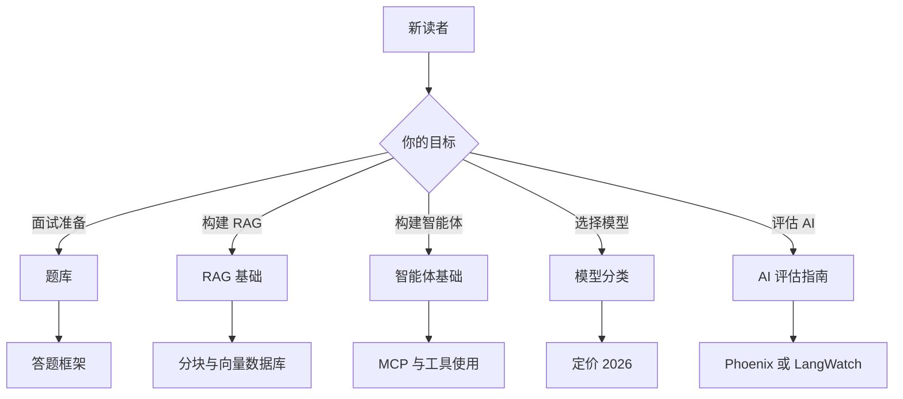
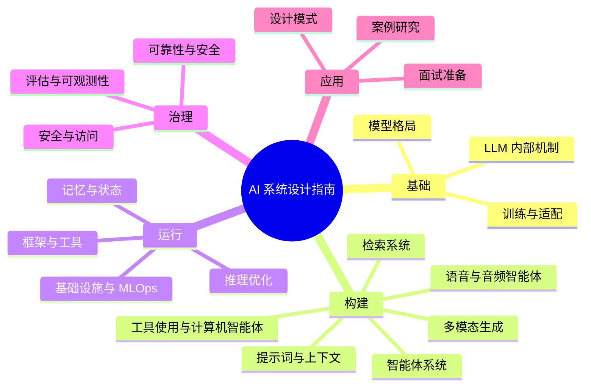

> [!IMPORTANT]
> 本仓库是由 ChiHoc 维护的非官方简体中文镜像；英文上游是正文事实与版权归属的唯一来源。下方保留的作者、社交账号与原阅读站信息均属于英文上游项目。

# 🧠 AI System Design Guide（AI 系统设计指南）
### The Complete Interview & Production Reference（完整面试与生产参考）

<p align="center">
  <a href="https://www.aidaddy.tech"></a>
</p>
<p align="center">
  <sub>🌐 在 <b><a href="https://www.aidaddy.tech">aidaddy.tech</a></b> 可进行即时搜索、章节联动跳转，并获得更清爽的阅读体验。⭐ 点赞仓库以支持本项目。</sub>
</p>

<p align="center">
  <a href="https://github.com/ombharatiya"></a>
  <a href="https://x.com/ombharatiya"></a>
  <a href="https://linkedin.com/in/ombharatiya"></a>
</p>

<p align="center">
  <b>如果这份指南对你有帮助，请关注 <a href="https://github.com/ombharatiya">@ombharatiya</a> 的 GitHub、<a href="https://x.com/ombharatiya">X</a> 和 <a href="https://linkedin.com/in/ombharatiya">LinkedIn</a>，以便在新章节、模型更新和面试题发布时收到通知。</b>
</p>

<p align="center">
  <a href="https://github.com/ombharatiya/ai-system-design-guide/commits/main"></a>
  <a href="LICENSE"></a>
  <a href="#-contributing"></a>
  <a href="https://github.com/ombharatiya/ai-system-design-guide/stargazers"></a>
  <a href="https://github.com/ombharatiya/ai-system-design-guide/graphs/contributors"></a>
  <a href="https://github.com/ombharatiya/ai-system-design-guide/issues"></a>
</p>

> **生产级 AI 系统的持续更新参考。** 持续迭代，面向面试的深度内容。

这是一份实用且持续更新的指南，覆盖 AI system design（AI 系统设计）、RAG architectures（RAG 检索增强生成架构）、LLM engineering（LLM 工程）、agentic AI（智能体化 AI）、MCP 和 A2A protocols（A2A 协议），以及 AI engineering interview preparation（AI 工程面试准备）。内容包括生产模式、模型选型、评估方法，以及来自 staff-level interviews（Staff 级别面试）的真实案例。

**首次阅读？** 可直接跳转到 [128 道面试题库](00-interview-prep/01-question-bank.md)、[RAG 基础章节](06-retrieval-systems/01-rag-fundamentals.md)，或选择 [适合生产环境的 LLM](02-model-landscape/01-model-taxonomy.md)。

---

## 📚 快速导航

| 我想要…… | 从这里开始 |
|--------------|------------|
| **准备面试** | [题库](00-interview-prep/01-question-bank.md) → [答题框架](00-interview-prep/02-answer-frameworks.md) |
| **快速学习 AI 系统** | [LLM 内部机制](01-foundations/01-llm-internals.md) → [RAG 基础](06-retrieval-systems/01-rag-fundamentals.md) |
| **构建生产级 RAG** | [分块](06-retrieval-systems/02-chunking-strategies.md) → [向量数据库](06-retrieval-systems/04-vector-databases.md) → [重排序](06-retrieval-systems/06-reranking-strategies.md) → [生产级 RAG](06-retrieval-systems/14-production-rag-at-scale.md) |
| **进阶检索** | [上下文检索](06-retrieval-systems/10-contextual-retrieval.md) → [ColBERT](06-retrieval-systems/11-late-interaction-colbert.md) → [多模态 RAG](06-retrieval-systems/12-multimodal-rag.md) |
| **设计多租户 AI** | [访问控制](12-security-and-access/02-access-control.md) → [案例研究](16-case-studies/08-multi-tenant-saas.md) |
| **构建智能体** | [智能体基础](07-agentic-systems/01-agent-fundamentals.md) → [MCP & A2A](07-agentic-systems/03-tool-use-and-mcp.md) → [LangGraph](09-frameworks-and-tools/02-langgraph-orchestration.md) |
| **运行自主智能体循环** | [循环工程](07-agentic-systems/12-loop-engineering.md) (四层循环、终止、预算、验证、循环极限化) |
| **工具使用与计算机智能体** | [全景](17-tool-use-and-computer-agents/01-tool-use-landscape.md) → [OpenClaw](17-tool-use-and-computer-agents/03-openclaw-deep-dive.md) → [安全](17-tool-use-and-computer-agents/07-safety-and-governance.md) |
| **自主编码智能体** | [Claude Code](09-frameworks-and-tools/09-claude-code.md) → [OpenCoder 全景](09-frameworks-and-tools/10-opencoderguide.md) |
| **应对框架版本更迭** | [应对框架更迭](09-frameworks-and-tools/12-navigating-framework-churn.md) (过时教程、版本固定、真正应该学习的内容) |
| **选择合适模型（2026）** | [模型分类](02-model-landscape/01-model-taxonomy.md) → [定价](02-model-landscape/03-pricing-and-costs.md) |
| **在生产环境评估 AI** | [AI 评估指南（Phoenix/Langfuse）](ai_evals_comprehensive_study_guide.md) → [AI 评估指南（LangWatch/Langfuse）](ai_evals_complete_guide_langwatch_langfuse.md) |
| **正确解读基准测试** | [基准与排行榜](14-evaluation-and-observability/03-benchmarks-and-leaderboards.md) (饱和、污染、评测框架差异) |
| **跟踪前沿研究（2026）** | [研究雷达](RESEARCH-RADAR.md) (热门论文与下一步学习方向) |
| **构建语音智能体** | [实时语音智能体](18-voice-and-audio-agents/01-realtime-voice-agents.md) (级联与语音到语音、延迟预算、技术栈) |
| **跨模型路由或添加网关** | [AI 网关与模型路由](11-infrastructure-and-mlops/03-ai-gateways-and-model-routing.md) (降级、速率限制、LiteLLM) |
| **控制 AI 成本** | [FinOps 与 token 经济学](11-infrastructure-and-mlops/04-finops-and-token-economics.md) (缓存、批处理、归因、单位经济性) |
| **满足 AI 法规要求** | [AI 治理与合规](13-reliability-and-safety/04-ai-governance-and-compliance.md) (欧盟 AI 法案、NIST RMF、需要实施的内容) |
| **生成图像、视频和音频** | [多模态生成](19-multimodal-generation/01-multimodal-generation.md) (流水线、溯源、评估) |
| **训练推理模型** | [RLVR 与 GRPO](03-training-and-adaptation/08-rlvr-and-reasoning-models.md) (o 系列与 R1 的训练方式) |
| **在本地运行模型** | [端侧与边缘部署](04-inference-optimization/09-on-device-and-edge-deployment.md) (Ollama 与 vLLM、量化、硬件) |
| **使智能体能够从崩溃中恢复** | [持久执行](07-agentic-systems/11-durable-execution.md) (重放、恰好一次、Temporal) |
| **构建数据层** | [AI 数据工程](06-retrieval-systems/15-data-engineering-for-ai.md) (摄取、去重、个人身份信息、去污染) |
| **寻找优质 AI 学习课程** | [推荐课程与学习路径](COURSES.md) |
| **从当前岗位转型到 AI** | [岗位转型指南](TRANSITION_GUIDE.md) |
| **了解 2026 年 AI 就业市场** | [就业市场趋势](00-interview-prep/06-job-market-trends-2026.md) |
| **快速解答常见问题** | [FAQ](00-interview-prep/07-faq.md) (RAG、智能体、模型、评估、推理、记忆、安全) |
| **查找术语** | [词汇表](GLOSSARY.md) (逐项解释术语) |

### 选择路径


```mermaid
flowchart TD
    A[新读者] --> B{你的目标}
    B -->|面试准备| C[题库]
    B -->|构建 RAG| D[RAG 基础]
    B -->|构建智能体| E[智能体基础]
    B -->|选择模型| F[模型分类]
    B -->|评估 AI| G[AI 评估指南]
    C --> H[答题框架]
    D --> I[分块与向量数据库]
    E --> J[MCP 与工具使用]
    F --> K[定价 2026]
    G --> L[Phoenix 或 LangWatch]
```

---

## 🎯 为什么需要本指南

**传统书籍在出版前就已经过时。** 这是一个活文档：当新模型发布、当模式演进时，它会随之更新。

| 本指南 | 纸质书籍 |
|------------|---------------|
| 2026 年 8 月模型 (Claude Opus 5, Sonnet 5, Fable 5, GPT-5.6 Sol/Terra/Luna, GPT-5.6-Cyber, Gemini 3.7 Flash, Grok 4.6, DeepSeek V4, Kimi K3, Qwen3.8, GLM-5.3, Muse Glimmer, Inkling) | 仍停留在 GPT-4 |
| MCP 2.0, A2A v1.0, OpenClaw, 计算机使用、智能体式 RAG、ColBERT、潜在推理、MoE 推理服务 | 尚未涵盖 |
| 附 2026 年 8 月核验日期的实际定价 | 已经过时 |
| Staff 级面试问答（截至 2026 年 8 月的 128 道题）与就业市场趋势 | 泛泛的问题 |

**快速模型选择（2026 年 8 月）：** Claude Fable 5 适合追求能力上限（$10/$50 per 1M），Claude Opus 5 以 $5/$25 适合长时程智能体式编码，Claude Sonnet 5 是生产默认档（$2/$10，现已成为永久价格），GPT-5.6 Terra 以 $2/$12 适合通用生产、Luna 以 $0.20/$1.20 适合高量层，Gemini 3.7 Flash 年底前半价，价格为 $0.75/$3.75，Kimi K3 或 Muse Glimmer 适合开放权重。请注意，DeepSeek V4 从 8 月 16 日起不再是理所当然的低成本答案：价格将上涨至 3 至 12 倍，并改用高峰与非高峰时段计费。完整拆解见 [模型分类](02-model-landscape/01-model-taxonomy.md)。

---

## 🎯 本指南的定位与边界

**本指南是：**
- 一本用于设计生产级 AI 系统的 staff 级参考（RAG、智能体、MCP、评估流水线、多租户隔离）。
- 一份面试准备配套材料，包含 128 道真实题、带完整模拟面试逐字稿的答题框架，以及截至 2026 年 8 月的九道白板练习。
- 一本跟踪新模型发布、协议变化和新兴模式并随之更新的活文档。
- 对取舍有明确观点：延迟与成本、准确性与忠实性、单智能体与多智能体。
- 免费、采用 MIT 许可，并欢迎实践者提交 PR。

**本指南不是：**
- Python、PyTorch 或机器学习基础教程（请先从课程开始；见 [COURSES.md](COURSES.md)）。
- 回避具体选择的供应商中立材料；它会点名具体模型、价格和框架，因为真实系统必须做真实选择。
- 动手构建的替代品；应当结合项目阅读，而不是取代项目实践。
- 论文摘要合集；只在论文会改变实践时引用，而不追求完整覆盖。

---

## 📖 指南结构

```
├── 00-interview-prep/           # Questions (128), frameworks, exercises, job-market trends (August 2026)
├── 01-foundations/              # Transformers, attention, embeddings
├── 02-model-landscape/          # Claude Opus 5, Sonnet 5, Fable 5, GPT-5.6, Gemini 3.x, DeepSeek V4, Kimi K3, Inkling, Llama 4
├── 03-training-and-adaptation/  # Fine-tuning, LoRA, DPO, distillation, RLVR/GRPO
├── 04-inference-optimization/   # KV cache, PagedAttention, vLLM, diffusion LLMs, on-device
├── 05-prompting-and-context/    # Prompt engineering, CoT, Extended Thinking, DSPy, prompt injection
├── 06-retrieval-systems/        # RAG, chunking, GraphRAG, Agentic RAG, ColBERT, Contextual Retrieval, data engineering
├── 07-agentic-systems/          # MCP 2.0, A2A protocol, multi-agent, computer-use, durable execution, loop engineering
├── 08-memory-and-state/         # L1-L3 memory tiers, Mem0, caching
├── 09-frameworks-and-tools/     # LangGraph, DSPy, LlamaIndex, Claude Code, OpenCoder, framework churn
├── 10-document-processing/      # Vision-LLM OCR, multimodal parsing
├── 11-infrastructure-and-mlops/ # GPU clusters, LLMOps, AI gateways, FinOps and cost
├── 12-security-and-access/      # RBAC, ABAC, multi-tenant isolation
├── 13-reliability-and-safety/   # Guardrails, red-teaming, AI governance and compliance
├── 14-evaluation-and-observability/ # RAGAS, LangSmith, benchmarks & leaderboards, drift detection
├── 15-ai-design-patterns/       # Pattern catalog, anti-patterns
├── 16-case-studies/             # Real-world architectures with diagrams
├── 17-tool-use-and-computer-agents/ # OpenClaw, Computer Use, tool agents, safety
├── 18-voice-and-audio-agents/   # Real-time voice agents: VAD, turn-taking, speech-to-speech
├── 19-multimodal-generation/    # Image/video/audio generation: pipelines, provenance, evaluation
├── GLOSSARY.md                  # Every term defined
│
├── ai_evals_comprehensive_study_guide.md      # 🔬 Deep-dive: AI Evals (Phoenix + Langfuse)
└── ai_evals_complete_guide_langwatch_langfuse.md  # 🔬 Deep-dive: AI Evals (LangWatch + Langfuse)
└── COURSES.md                   # 🎓 Recommended courses & learning paths
└── TRANSITION_GUIDE.md          # 🔄 Transition from Backend/QA/PM/EM to AI roles
└── RESEARCH-RADAR.md            # 🛰️ Frontier research radar: trending papers and what to learn next
```

### 按 AI 系统生命周期阶段组织的章节


```mermaid
mindmap
  root((AI 系统设计指南))
    基础
      LLM 内部机制
      模型格局
      训练与适配
    构建
      提示词与上下文
      检索系统
      智能体系统
      工具使用与计算机智能体
      语音与音频智能体
      多模态生成
    运行
      推理优化
      记忆与状态
      框架与工具
      基础设施与 MLOps
    治理
      安全与访问
      可靠性与安全
      评估与可观测性
    应用
      设计模式
      案例研究
      面试准备
```

---

## 🔥 精选案例研究

真实面试题场景，包含完整解法与图示：

| 案例研究 | 问题 | 关键模式 |
|------------|---------|--------------|
| [实时搜索](16-case-studies/06-real-time-search.md) | 大规模场景下 5 分钟的数据新鲜度 | 流式处理与混合检索 |
| [编码智能体](16-case-studies/07-autonomous-coding-agent.md) | 自主修改多个文件 | 沙箱隔离与自我纠正 |
| [多租户 SaaS](16-case-studies/08-multi-tenant-saas.md) | 可口可乐与百事共享基础设施 | 纵深防御隔离 |
| [客户支持](16-case-studies/09-customer-support-automation.md) | 60% 自动解决率 | 分层路由与升级处理 |
| [文档智能](16-case-studies/10-document-intelligence.md) | 每月从 50K 份合同提取信息 | 视觉 LLM 与并行提取器 |
| [推荐引擎](16-case-studies/11-recommendation-engine.md) | 为 50M 用户提供个性化解释 | ML 排序与 LLM 解释 |
| [合规自动化](16-case-studies/12-compliance-automation.md) | FDA 法规预审 | 主张提取与先例数据库 |
| [语音医疗](16-case-studies/13-voice-ai-healthcare.md) | 实时生成临床记录 | 本地部署 ASR 与 HIPAA |
| [欺诈检测](16-case-studies/14-fraud-detection.md) | 可解释的 100ms 决策 | ML 与规则混合 |
| [知识管理](16-case-studies/15-knowledge-management.md) | 带访问控制的 2M 份文档 | 权限感知 RAG |
| [计算机使用智能体](16-case-studies/16-computer-use-agent-production.md) | 跨 3 个遗留 UI 自动处理费用报表 | Firecracker 虚拟机、动作门控与 IPI 防御 |
| [多租户微调](16-case-studies/17-multi-tenant-fine-tuning-platform.md) | 280 个租户共享基础模型，每个租户独立使用 LoRA | LoRA 热切换与各租户的评估即 PRD |
| [评估门控 CI/CD](16-case-studies/18-eval-gated-cicd.md) | 阻止使 AI 质量退化的 PR | 黄金集、LLM 评判者与统计校正 |
| [客户模型蒸馏](16-case-studies/19-customer-distillation-pipeline.md) | 将每月前沿模型支出从 $50K 降至 $6K，3 个月回本 | 基于轨迹的蒸馏与金丝雀发布 |
| [MCP 知识智能体](16-case-studies/20-mcp-knowledge-agent.md) | 从 Snowflake/Confluence/Jira/Slack 获取跨系统答案 | MCP、OAuth 资源服务器与能力门控 |

---

## 🔬 配套深度指南

两本配套指南（每本 3000+ 行）覆盖 AI 评估的端到端流程，面向工程师、PM 和 QA：

| 指南 | 覆盖平台 | 内容 |
|-------|------------------|---------------|
| [AI 评估：综合学习指南](ai_evals_comprehensive_study_guide.md) | Arize Phoenix + Langfuse | LLM 作为评判者、RAG 评估、多轮评估、生产安全、使用 `judgy` 进行统计校正、30 天学习路径 |
| [AI 评估：LangWatch 与 Langfuse 指南](ai_evals_complete_guide_langwatch_langfuse.md) | LangWatch + Langfuse | 同一教学大纲，结合 LangWatch 的 40+ 内置评估器、平台并排比较和选型指导 |

**两本指南共同覆盖的主题：**
- 追踪与可观测性配置（Phoenix、LangWatch、Langfuse）
- 错误分析：开放编码 → 主轴编码 → 失败模式分类
- 划分训练/开发/测试集并用真实标注校准 LLM 评判者
- 基于代码的评估器（正则表达式、JSON schema、格式校验器）
- RAG 专项评估：忠实性、上下文召回率、答案相关性
- 多步流水线评估与多轮对话评估
- 生产护栏、安全监控、实时漂移检测
- 使用 `judgy` 库进行统计校正
- 人工标注最佳实践与标注者间可靠性
- 大规模评估流水线的成本与延迟优化

## 🎓 面向面试准备（Interview Prep）

AI 工程（AI engineering）与系统设计（system design）面试常会问这样的问题：

> "设计一个多租户 RAG 系统，使竞争对手无法看到彼此的数据。"

> "你的智能体花了 15 步完成一个只需 3 步的任务。你会如何调试？"

本指南提供 **具体模式**、**真实取舍** 和 **生产故障模式**：这正是高级别面试官所期望的深度。

➡️ 从 [Interview Prep](00-interview-prep/) 开始

---

## ❓ 常见问题（Frequently Asked Questions）

### 什么是 AI system design（AI 系统设计）？

AI system design（AI 系统设计）是围绕 LLM（Large Language Models，大型语言模型）、检索（retrieval）、Agent（智能体）和评估（evaluation）构建生产级系统的学科。它涵盖模型选择、RAG（Retrieval-Augmented Generation，检索增强生成）流水线、Agent 编排、memory（记忆）、observability（可观测性）和 safety（安全性）。参见 [LLM 内部机制](01-foundations/01-llm-internals.md) 和 [AI Design Patterns](15-ai-design-patterns/) 以建立基础认知。

### 我该如何准备 AI engineering（AI 工程）面试？

从 [题库](00-interview-prep/01-question-bank.md) 开始（截至 2026 年 8 月共有 128 道题），然后结合 [答题框架](00-interview-prep/02-answer-frameworks.md) 和 [白板练习](00-interview-prep/04-whiteboard-exercises.md) 进行练习。大多数高级别面试会考察 RAG 设计、Agent 调试、multi-tenant isolation（多租户隔离）以及 cost/latency tradeoffs（成本/延迟取舍），这些都收录在 [案例研究](16-case-studies/) 中。

### 什么是 RAG（Retrieval-Augmented Generation，检索增强生成）？

RAG 是一种模式：LLM 会在生成答案之前，从外部知识源（如 vector DB、search index、graph）检索相关上下文，从而减少 hallucinations（幻觉）并让回答基于你的数据。完整流程见 [RAG 基础](06-retrieval-systems/01-rag-fundamentals.md)，规模化实践见 [生产级 RAG at Scale](06-retrieval-systems/14-production-rag-at-scale.md)。

### 什么是 AI agents（AI 智能体），它们与 chatbots（聊天机器人）有何不同？

AI agents（AI 智能体）是由 LLM 驱动的系统，能够规划、调用工具，并通过多步执行来完成目标；而 chatbots（聊天机器人）通常是单轮响应。智能体会引入循环、记忆、错误恢复，以及通过 MCP（Model Context Protocol，模型上下文协议）等协议进行工具使用。可从 [智能体基础](07-agentic-systems/01-agent-fundamentals.md) 开始。

### 什么是 MCP（Model Context Protocol，模型上下文协议），它与 A2A 有何区别？

MCP 是一种开放协议，使 LLM 能以标准化方式发现并调用外部工具和数据源。A2A（Agent-to-Agent，智能体到智能体）是用于智能体之间通信的互补协议。两者解决的是不同层面：MCP 是工具边界，A2A 是智能体边界。详见 [Tool Use and MCP](07-agentic-systems/03-tool-use-and-mcp.md)。

### 生产环境中该用哪个 LLM：Claude、GPT、Gemini，还是开源模型？

这取决于 latency budget（延迟预算）、context length（上下文长度）、每百万 token 成本、tool-use quality（工具使用质量）和 data residency（数据驻留）。[模型分类](02-model-landscape/01-model-taxonomy.md) 和 [定价](02-model-landscape/03-pricing-and-costs.md) 章节对 Claude Opus 5、Claude Sonnet 5、GPT-5.6、Gemini 3.7 Flash、Grok 4.6、DeepSeek V4 等模型截至 2026 年 8 月的情况进行了对比。

### 如何在生产环境中评估 LLM 或 RAG 系统？

将离线评估（offline evals，包含 LLM-as-a-judge 以及 ground-truth calibration，真值校准）、在线指标（faithfulness、context recall、answer relevance）和持续 tracing（追踪）结合起来。配套深度解析 [AI Evals: Phoenix + Langfuse](ai_evals_comprehensive_study_guide.md) 与 [AI Evals: LangWatch + Langfuse](ai_evals_complete_guide_langwatch_langfuse.md) 会完整讲解这一流程。

### 如何安全地构建多租户 RAG 系统？

采用 defense-in-depth（纵深防御）：按租户建立独立索引或命名空间、在查询时进行访问检查，以及在 prompt layer（提示层）加入防护。 [访问控制](12-security-and-access/02-access-control.md) 章节和 [多租户 SaaS 案例研究](16-case-studies/08-multi-tenant-saas.md) 覆盖了在面试和生产中都经得住考验的模式。

### 什么是 agentic RAG？

Agentic RAG（智能体式 RAG）把检索与一个智能体循环结合起来，让系统可以决定搜索什么、何时重新查询、何时升级处理，而不是只执行一次固定的 retrieve-then-generate（先检索后生成）流程。架构与取舍见 [Agentic RAG](06-retrieval-systems/08-agentic-rag.md)。

### 这份指南免费吗？我可以贡献吗？

是的，MIT 许可且免费。欢迎提交 PR；见 [贡献指南](CONTRIBUTING.md)。如果你有 production failure modes（生产故障模式）、新的模型基准，或者想补充面试题，请提交 PR。

### 这份指南多久更新一次？

持续更新。新的模型发布、协议变化（MCP、A2A）和新兴模式会在发布后持续补充。近期新增内容包括 [工具使用与计算机智能体](17-tool-use-and-computer-agents/01-tool-use-landscape.md) 和 [2026 年 8 月就业市场趋势](00-interview-prep/06-job-market-trends-2026.md)。

### 如果我从后端、QA、PM 或 EM 转向 AI，可以使用这份指南吗？

可以。 [岗位转型指南](TRANSITION_GUIDE.md) 会把现有技能映射到 AI engineering（AI 工程）、MLE（Machine Learning Engineer，机器学习工程师）和 AI architect（AI 架构师）方向，并按角色提供阅读路径。可搭配 [COURSES.md](COURSES.md) 获取精选学习资源。

---

## 🔄 活文档（Living Book）

本指南会持续追踪：
- 新模型发布和真实世界性能
- 新兴模式（MCP、Agentic RAG、Flow Engineering）
- 更新的定价和速率限制
- 弃用项和最佳实践变更

**⭐ 点星并关注** 这个仓库，以便在更新推送时收到通知。

---

## 🤝 贡献

发现信息过期了？有生产经验想分享？欢迎提交 PR。  
见 [贡献指南](CONTRIBUTING.md)。

---

## 👋 保持联系（Stay Connected）

如果这份指南对你有帮助，支持它最直接的方式，是关注新章节和更新最先发布的渠道：

- **网站：** [aidaddy.tech](https://www.aidaddy.tech) - 阅读完整指南，支持搜索、清晰导航和移动端友好布局。
- **GitHub:** [@ombharatiya](https://github.com/ombharatiya) - 关注仓库，给项目点星，并留意新版本发布。
- **X / Twitter:** [@ombharatiya](https://x.com/ombharatiya) - 关于模型发布、MCP、智能体和面试的简短观点。
- **LinkedIn:** [ombharatiya](https://linkedin.com/in/ombharatiya) - 更深入的文章和高级 AI 岗位面试准备建议。

<p align="center">
  <a href="https://github.com/ombharatiya"></a>
  <a href="https://x.com/ombharatiya"></a>
  <a href="https://linkedin.com/in/ombharatiya"></a>
</p>

---

## 📄 许可证（License）

MIT License。见 [LICENSE](LICENSE)。

---

<p align="center">
  <b>构建与维护： <a href="https://github.com/ombharatiya">Om Bharatiya</a> · <a href="https://github.com/ombharatiya">GitHub</a> · <a href="https://x.com/ombharatiya">Twitter</a> · <a href="https://linkedin.com/in/ombharatiya">LinkedIn</a></b>
</p>
